# 1.4.1建立您的資產和動態媒體範本

>[!IMPORTANT]
>
>若要完成此練習，您需要具有啟用AEM Assets Dynamic Media之有效AEM Assets CS Author環境的存取權。
>
>如果您沒有這類環境，請前往[Adobe Experience Manager Cloud Service和Edge Delivery Services](./../../../modules/asset-mgmt/module2.1/aemcs.md){target="_blank"}。 按照這裡的指示操作，您將可以存取這樣的環境。

>[!IMPORTANT]
>
>如果您先前已使用AEM Assets CS環境設定AEM CS計畫，可能是您的AEM CS沙箱已休眠。 鑑於讓這樣的沙箱解除休眠需要10-15分鐘，最好現在開始解除休眠過程，這樣以後就不必等待了。

## 1.4.1.1建立您的Dynamic Media公司

移至[https://my.cloudmanager.adobe.com](https://my.cloudmanager.adobe.com){target="_blank"}。 您應該選取的組織是`--aepImsOrgName--`。

向下捲動至&#x200B;**Dynamic Media公司**。 按一下&#x200B;**+**&#x200B;圖示以建立新的Dynamic Media公司。

輸入下列資訊：

- **公司名稱**： `--aepUserLdap---CitiSignal`。
- **公司地區**：選取最接近您的地區。
- **公司管理員電子郵件**：輸入您的管理員電子郵件。

按一下&#x200B;**建立**。

您應該會看到此訊息。

您現在應該會收到類似以下內容的電子郵件，其中包含您的臨時密碼。 若要變更您的密碼，或是在未收到電子郵件時擷取密碼，您應該安裝&#x200B;**Adobe Dynamic Media Classic案頭應用程式**。 您可以在這裡找到安裝指示： [https://experienceleague.adobe.com/zh-hant/docs/dynamic-media-classic/using/intro/dynamic-media-classic-desktop-app](https://experienceleague.adobe.com/zh-hant/docs/dynamic-media-classic/using/intro/dynamic-media-classic-desktop-app)。

請依照這裡的指示，在應用程式安裝到您的系統後，再返回這裡。

開啟&#x200B;**Adobe Dynamic Media Classic案頭應用程式**。 如果您知道密碼，請在此處輸入密碼，然後按照說明在首次登入時進行變更。

如果您不知道密碼，請按一下&#x200B;**忘記密碼**&#x200B;連結，然後依照指示重設密碼，然後返回此處登入。

成功登入後，您應該會看到類似以下畫面。

## 1.4.1.2在AEM中設定Dynamic Media

移至[https://my.cloudmanager.adobe.com](https://my.cloudmanager.adobe.com){target="_blank"}。 您應該選取的組織是`--aepImsOrgName--`。

按一下以開啟您的Cloud Manager程式，程式應該稱為`--aepUserLdap-- - CitiSignal AEM+ACCS`。

按一下您的環境。

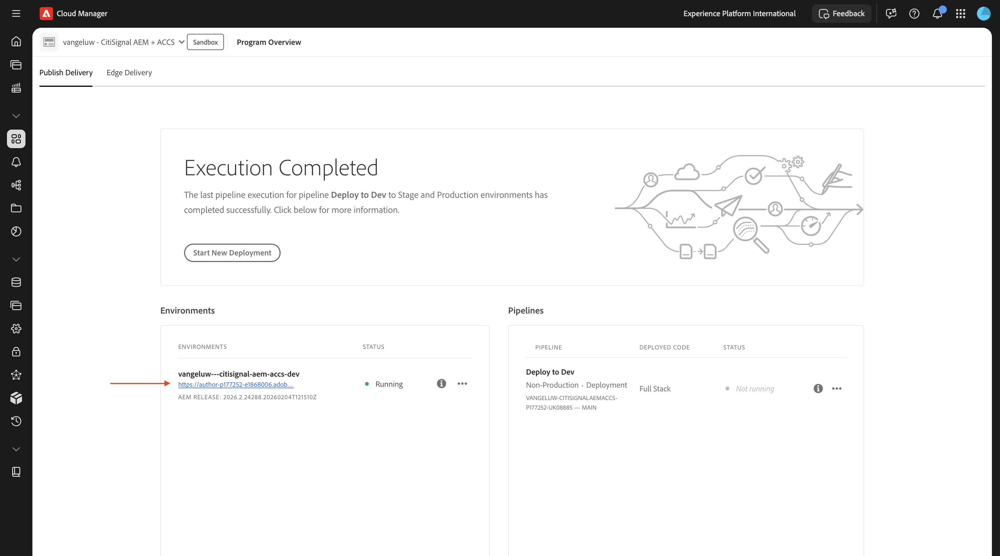

按一下環境的URL。

移至&#x200B;**工具**、**雲端服務**，然後移至&#x200B;**Dynamic Media設定**。

選取「**全域**」（不要勾選核取方塊），然後按一下「**建立**」。

輸入下列資訊：

- **標題**：使用此標題： `--aepUserLdap-- - CitiSignal`。
- **電子郵件**：輸入您的電子郵件地址。
- **密碼**：輸入您的Dynamic Media帳戶密碼
- **地區**：選取您在建立Dynamic Media公司時選擇的地區，在此範例中為&#x200B;**歐洲**。

按一下&#x200B;**連線至Dynamic Media**。

您應該會看到此訊息。 設定下列專案：

- 選取&#x200B;**公司**： `--aepUserLdap-- - CitiSignal`。
- 將&#x200B;**發佈Assets**&#x200B;設定為&#x200B;**立即**。
- 核取核取方塊以&#x200B;**同步處理所有內容**。

按一下&#x200B;**儲存**。

您的Dynamic Media設定現已完成。 按一下&#x200B;**「確定」**。

## 1.4.1.3匯出您的資產

下載此檔案[citisignal-fiber-max-is-coming.psd](./assets/citisignal-fiber-max-is-coming.psd){target="_blank"}，並使用Adobe Photoshop開啟。

您應該會看到此訊息。 CitiSignal正計畫於紐約、巴黎及迪拜等3個城市推出Fiber Max。

藉由顯示或隱藏特定圖層，您可以檢視設計人員建立的影像。

以下是從Photoshop PSD範本匯出影像檔案的指示。 您也可以在[citisignal-dm-email-assets.zip](./assets/citisignal-dm-email-assets.zip){target="_blank"}下載完成的影像，並將檔案解壓縮至您的案頭。

這是紐約的版本。

這是迪拜的版本。

這是巴黎的版本。

CitiSignal可能會將許多其他城市推出Fiber Max，因此未來可能會在此檔案中建立新圖層。 目前，焦點集中在已提及的3個城市。

為了將這些變數與AEM Assets Dynamic Media搭配使用，每個城市的圖層應該個別匯出為影像，而不需要背景檔案，並且應該針對背景圖層進行另一次匯出，而不需要包含任何城市。

您現在應該只隱藏並顯示其中一個圖層。 第一個要顯示的圖層是&#x200B;**Paris**&#x200B;圖層，其他所有圖層應隱藏。

若要匯出該圖層，請移至&#x200B;**檔案** > **匯出** > **匯出為……**。

您應該會看到此訊息。 選取檔案型別&#x200B;**PNG**，確定已啟用&#x200B;**透明度**，然後按一下&#x200B;**匯出**。

將檔案名稱變更為`citisignal-fiber-max-is-coming-paris.png`並按一下&#x200B;**匯出**。

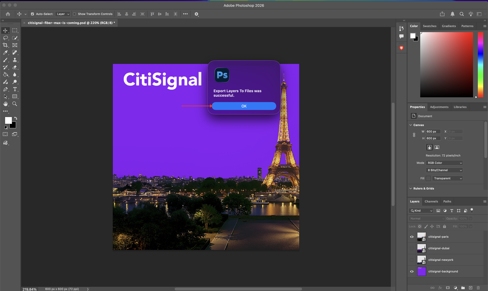

下一個要顯示的圖層是&#x200B;**Dubai**&#x200B;圖層，其他所有圖層應隱藏。

若要匯出該圖層，請移至&#x200B;**檔案** > **匯出** > **匯出為……**。

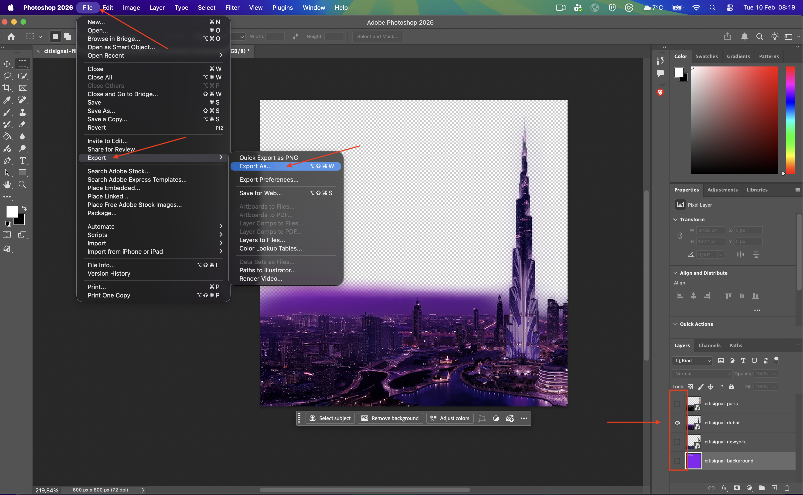

您應該會看到此訊息。 選取檔案型別&#x200B;**PNG**，確定已啟用&#x200B;**透明度**，然後按一下&#x200B;**匯出**。

將檔案名稱變更為`citisignal-fiber-max-is-coming-dubai.png`並按一下&#x200B;**匯出**。

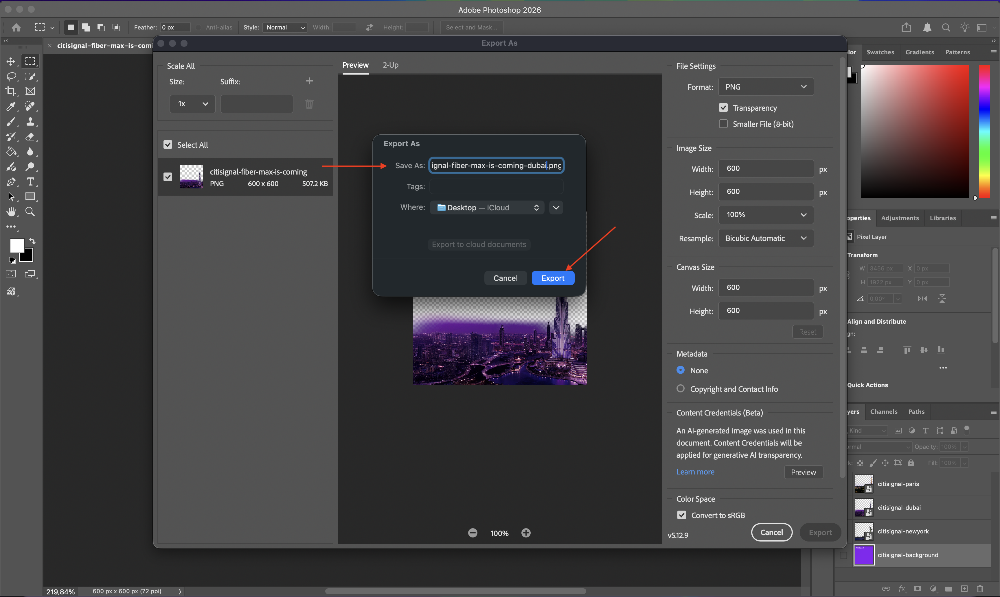

下一個要顯示的圖層是&#x200B;**New York**&#x200B;圖層，其他所有圖層應隱藏。

若要匯出該圖層，請移至&#x200B;**檔案** > **匯出** > **匯出為……**。

您應該會看到此訊息。 選取檔案型別&#x200B;**PNG**，確定已啟用&#x200B;**透明度**，然後按一下&#x200B;**匯出**。

將檔案名稱變更為`citisignal-fiber-max-is-coming-newyork.png`並按一下&#x200B;**匯出**。

下一個要顯示的圖層是&#x200B;**背景**&#x200B;圖層，其他所有圖層應隱藏。

若要匯出該圖層，請移至&#x200B;**檔案** > **匯出** > **匯出為……**。

您應該會看到此訊息。 選取檔案型別&#x200B;**PNG**，確定已啟用&#x200B;**透明度**，然後按一下&#x200B;**匯出**。

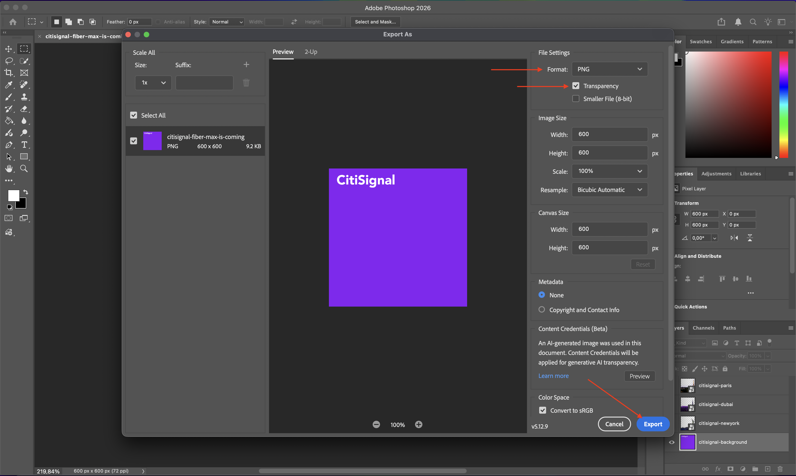

將檔案名稱變更為`citisignal-fiber-max-is-coming-background`並按一下&#x200B;**匯出**。

之後，您應該會在您選取的匯出位置中取得這些檔案。

## 1.4.1.4將您的資產上傳到AEM Assets CS

移至[https://experience.adobe.com/](https://experience.adobe.com/){target="_blank"}。 移至&#x200B;**Experience Manager Assets**。

選取您的存放庫，名稱應為`--aepUserLdap-- - CitiSignal AEM + ACCS`。

移至&#x200B;**Assets**，然後按一下&#x200B;**建立資料夾**。

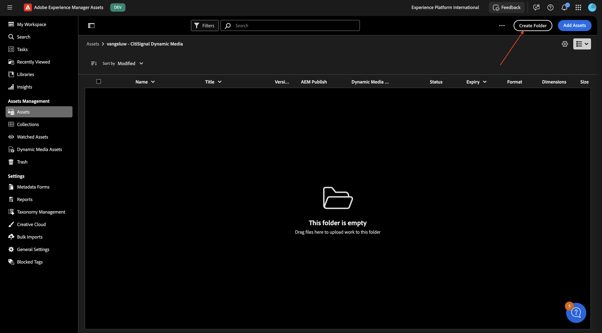

對於資料夾，請使用名稱： `--aepUserLdap-- - CitiSignal Dynamic Media`。 按一下&#x200B;**建立**。

按兩下以開啟您剛建立的資料夾。

按一下&#x200B;**新增Assets**。

按一下&#x200B;**瀏覽**，然後選取&#x200B;**瀏覽檔案**。

選取您在上一步中匯出的4個PNG檔案。

按一下&#x200B;**上傳**。

您的影像現在可在AEM Assets CS中使用。

等待幾分鐘，然後開啟&#x200B;**Adobe Dynamic Media Classic案頭應用程式**，您現在應該也會看到上傳的影像可在Dynamic Media中使用。

## 1.4.1.5設定Dynamic Media範本

在左側功能表中，前往&#x200B;**Dynamic Media Assets**。 按一下以開啟您的資料夾`--aepUserLdap-- - CitiSignal Dynamic Media`。 然後，按一下&#x200B;**建立範本**。

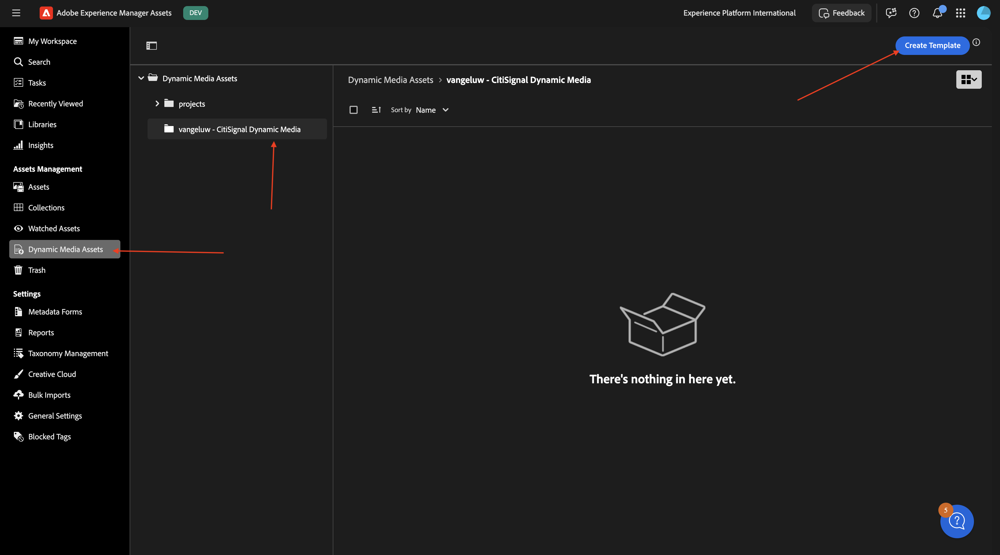

輸入下列資訊：

- **範本名稱**： `--aepUserLdap-- - CitiSignal Fiber Max Launch Email Assets`
- **畫布寬度**： `600px`
- **畫布高度**： `600px`

按一下&#x200B;**建立**。

您應該會看到此訊息。 按一下&#x200B;**新增影像**&#x200B;圖示。

將檔案&#x200B;**citisignal-fiber-max-is-coming_citisignal-background.png**&#x200B;拖曳到畫布上，讓它符合畫布。

接著，將檔案&#x200B;**citisignal-fiber-max-is-coming_citisignal-newyork.png**&#x200B;拖曳至畫布上，使其符合畫布。

接著，將檔案&#x200B;**citisignal-fiber-max-is-coming_citisignal-dubai.png**&#x200B;拖曳至畫布上，讓它符合畫布。

接著，將檔案&#x200B;**citisignal-fiber-max-is-coming_citisignal-paris.png**&#x200B;拖曳至畫布上，使其符合畫布。

您現在可以將範本中的全部3個變數同時視為不同的圖層。 您可以按一下&#x200B;**圖層**&#x200B;圖示來顯示/隱藏特定圖層，您會看到所有圖層目前都可見。

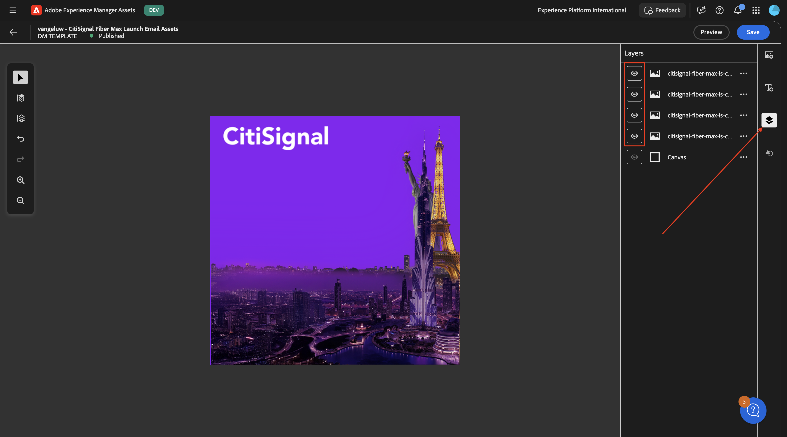

藉由隱藏一些圖層，您可以控制影像的外觀。 在此範例中，只有&#x200B;**Paris**&#x200B;的圖層與背景圖層可見。

接下來，您需要新增文字圖層。 按一下&#x200B;**文字圖層**&#x200B;圖示。

您應該會看到此訊息。

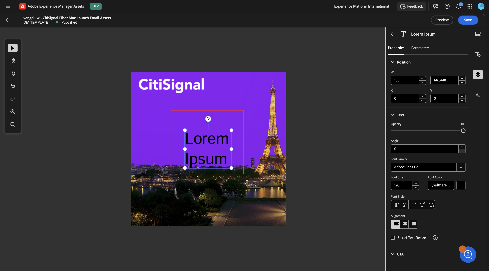

以下提供範例，您可以視需要隨意調整文字欄位。 別忘了啟用&#x200B;**智慧型文字調整大小**&#x200B;選項，以便在稍後階段插入的真實文字看起來會比較好。

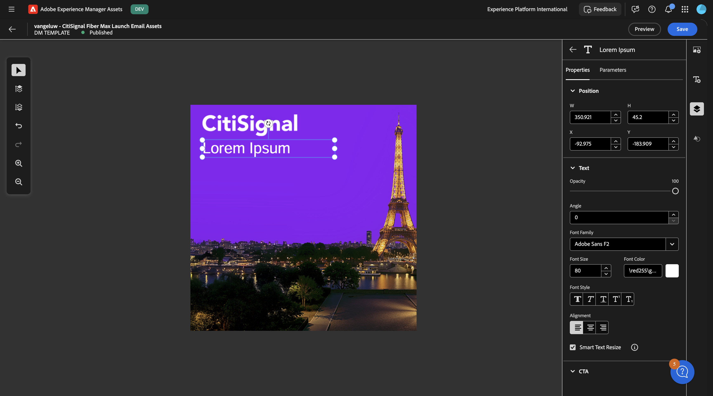

新增第二個文字圖層，使其看起來像這樣。 別忘了啟用&#x200B;**智慧型文字調整大小**&#x200B;選項，以便在稍後階段插入的真實文字看起來會比較好。

選取第一個文字圖層。 按一下3個點&#x200B;**...**，然後選取&#x200B;**編輯**。

您應該會看到此訊息。 向下捲動。

按一下&#x200B;**切換器**&#x200B;圖示，以啟用欄位&#x200B;**文字**。 將&#x200B;**引數名稱**&#x200B;變更為`title`。

選取第二個文字圖層。 按一下3個點&#x200B;**...**，然後選取&#x200B;**編輯**。

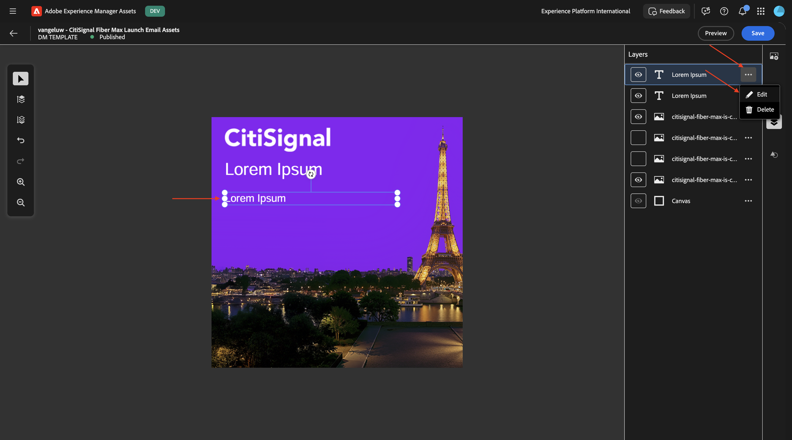

您應該會看到此訊息。 向下捲動。

按一下&#x200B;**切換器**&#x200B;圖示，以啟用欄位&#x200B;**文字**。 將&#x200B;**引數名稱**&#x200B;變更為`body`。

選取&#x200B;**Paris**&#x200B;的圖層。 按一下3個點&#x200B;**...**，然後按一下&#x200B;**編輯**。

移至&#x200B;**引數**。 啟用欄位&#x200B;**隱藏**&#x200B;並輸入&#x200B;**引數名稱**： `city_paris`。 按一下&#x200B;**儲存**。

選取&#x200B;**Dubai**&#x200B;的圖層。 按一下3個點&#x200B;**...**，然後按一下&#x200B;**編輯**。

移至&#x200B;**引數**。 啟用欄位&#x200B;**隱藏**&#x200B;並輸入&#x200B;**引數名稱**： `city_dubai`。 按一下&#x200B;**儲存**。

選取&#x200B;**New York**&#x200B;的圖層。 按一下3個點&#x200B;**...**，然後按一下&#x200B;**編輯**。

移至&#x200B;**引數**。 啟用欄位&#x200B;**隱藏**&#x200B;並輸入&#x200B;**引數名稱**： `city_ny`。 按一下&#x200B;**儲存**。

按一下&#x200B;**預覽**。

啟用&#x200B;**包含所有引數**&#x200B;的切換器，並變更熒幕擷圖中所指示的某些輸入變數。 您應該會根據提供的輸入，以動態方式看到影像變更。 對於欄位&#x200B;**city_paris**、**city_dubai**&#x200B;和&#x200B;**city_ny**，值0表示此影像將不會隱藏，而值1表示此影像將會隱藏。

變更部分變數後，您現在可以看到另一個影像顯示。

變更更多變數後，您現在可以看到另一個影像顯示。

為了將此範本與Adobe Journey Optimizer搭配使用，以及符合此使用案例的需求，您應該新增另一個圖層，該圖層將用來根據Adobe Experience Platform中即時客戶設定檔一部分的欄位，動態變更需要顯示的檔案路徑。

在dataprep期間，已在Adobe Experience Platform結構描述中建立欄位，以儲存客戶最接近的&#x200B;**轉出城市**。 欄位路徑為`--aepTenantId--.individualCharacteristics.fiber_rollout.closest_rollout_city`。

>[!NOTE]
>
>Adobe Experience Platform結構下方的熒幕擷圖僅供參考。 您不需要導覽至AEP即可自行視覺化此專案。

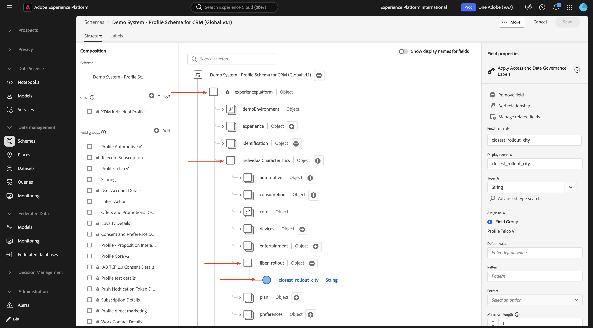

在下一個練習中，您將使用該欄位來動態選取應向哪個客戶顯示的影像。

若要這樣做，您應該新增影像圖層。

首先，讓我們隱藏包含轉出城市影像的其他圖層。

接著，移至&#x200B;**影像**&#x200B;並選取一個城市的隨機影像，將其新增至畫布，並確定它適合整個畫布。 您選擇哪個城市影像並不重要，因為路徑將在下一個練習中由AJO動態變更。

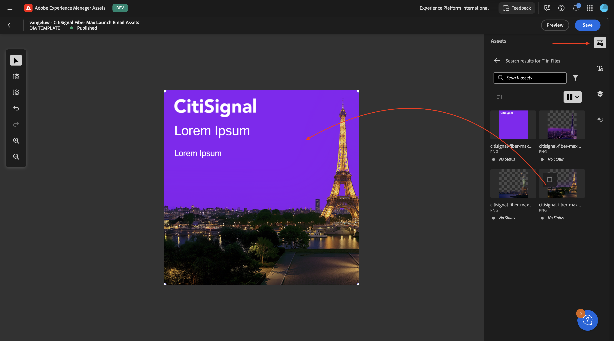

移至&#x200B;**引數**。

按一下&#x200B;**切換器**&#x200B;圖示，以啟用&#x200B;**隱藏**&#x200B;欄位。 將&#x200B;**引數名稱**&#x200B;變更為`dynamic_city_hide`。

按一下&#x200B;**切換器**&#x200B;圖示，以啟用&#x200B;**隱藏**&#x200B;欄位。 將&#x200B;**引數名稱**&#x200B;變更為`dynamic_city_image`。

按一下&#x200B;**儲存**。

按一下&#x200B;**預覽**。

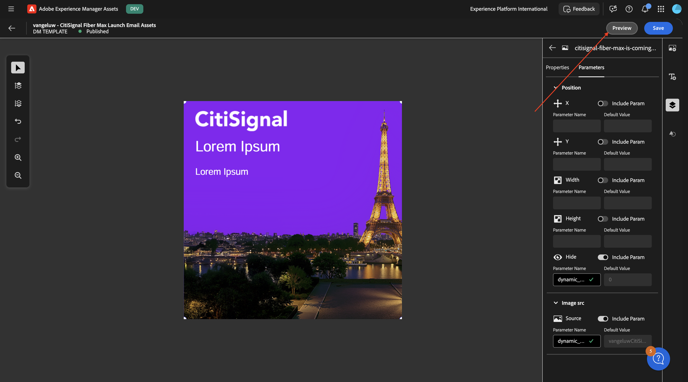

您應該會看到此訊息。 啟用切換器圖示以&#x200B;**包含所有引數**。 變更熒幕擷圖中所指示的某些輸入變數。 您應該會根據提供的輸入，以動態方式看到影像變更。 靜態欄位&#x200B;**city_paris**、**city_dubai**&#x200B;和&#x200B;**city_ny**&#x200B;應設為1，表示這些影像將會隱藏。

欄位&#x200B;**dynamic_city_hide**&#x200B;應設為0，表示它將會顯示。

欄位&#x200B;**dynamic_city_image**&#x200B;現在擁有巴黎影像的URL，如下所示： `vangeluwCitiSignalDM/citisignal-fiber-max-is-coming_citisignal-paris-1`。

在URL中選取&#x200B;**paris**&#x200B;這個字。

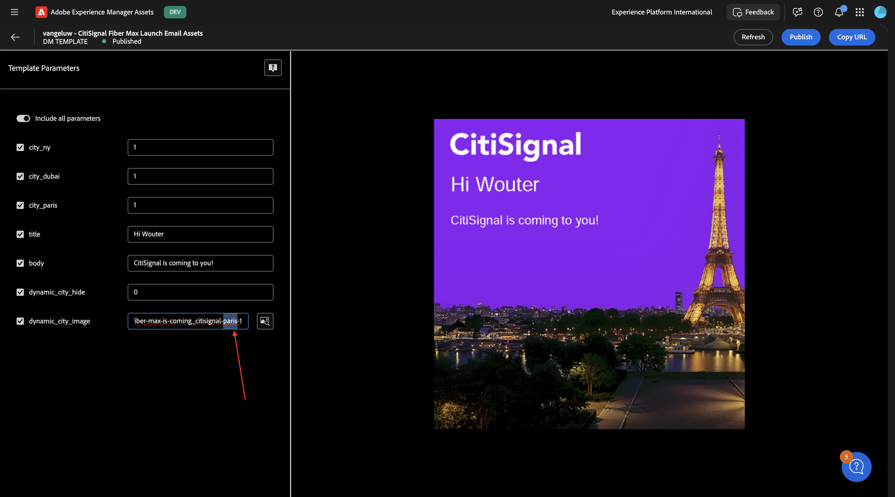

將&#x200B;**paris**&#x200B;變更為`newyork`，然後按一下UI中的其他位置以檢視紐約市影像的影像變更。

選取&#x200B;**newyork**&#x200B;這個字，並將其變更為`dubai`，然後按一下UI中的其他位置，檢視迪拜市影像的影像變更。

最後，按一下&#x200B;**發佈**。

您應該會看到此訊息。 按一下&#x200B;**是**。

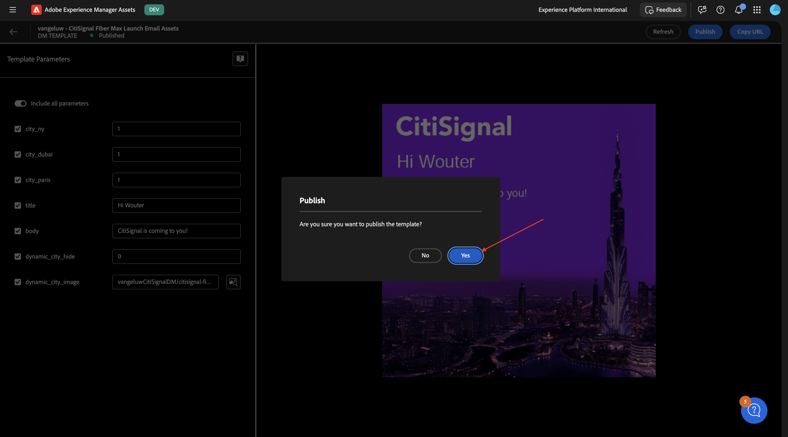

您的Dynamic Media範本現已設定並成功發佈。 在下一個練習中，您會將該範本與Adobe Journey Optimizer中的電子郵件行銷活動搭配使用。

## 後續步驟

下一步： [將您的Dynamic Media範本與Adobe Journey Optimizer](./ex2.md){target="_blank"}搭配使用

返回[Adobe Experience Manager Assets &amp; Dynamic Media](./aemassetsdm.md){target="_blank"}

[返回所有模組](./../../../overview.md){target="_blank"}
