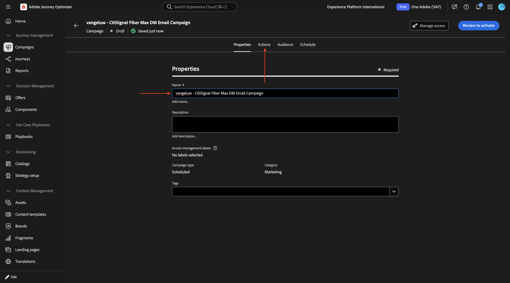
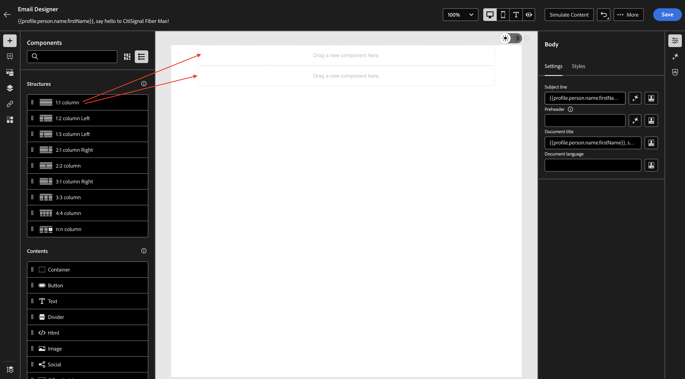
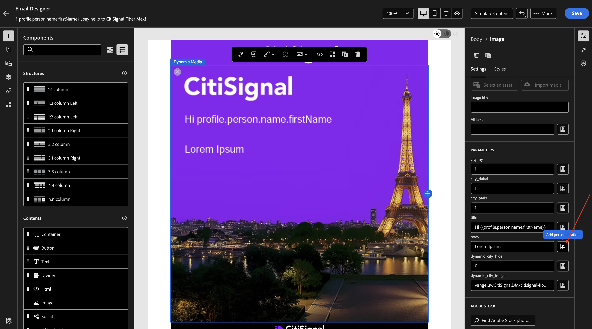

# 1.4.2搭配Adobe Journey Optimizer使用您的動態媒體範本

## 1.4.2.1在Adobe Journey Optimizer中建立您的行銷活動

前往[Adobe Experience Cloud](https://experience.adobe.com)登入Adobe Journey Optimizer。 按一下&#x200B;**Journey Optimizer**。


您將被重新導向到Journey Optimizer中的&#x200B;**首頁**&#x200B;檢視。 首先，確定您使用正確的沙箱。 要使用的沙箱稱為`--aepSandboxName--`。 然後您就會進入沙箱&#x200B;**的**&#x200B;首頁`--aepSandboxName--`檢視。


您現在將建立行銷活動。 上一個練習的事件型歷程仰賴傳入體驗事件或對象進入或退出，以觸發1個特定客戶的歷程，而行銷活動則以唯一內容（例如電子報、一次性促銷活動或一般資訊）鎖定整個對象，或定期傳送類似內容（例如例項生日行銷活動和提醒）。

在功能表中，前往&#x200B;**行銷活動**&#x200B;並按一下&#x200B;**建立行銷活動**。


選取&#x200B;**排程 — 行銷**&#x200B;並按一下&#x200B;**建立**。


在行銷活動建立畫面上，設定下列專案：

- **名稱**： `--aepUserLdap-- - CitiSignal Fiber Max DM Email Campaign`。

按一下&#x200B;**動作**。



按一下&#x200B;**+新增動作**，然後選取&#x200B;**電子郵件**。


接著，選取現有的&#x200B;**電子郵件組態**，然後按一下&#x200B;**編輯內容**。


您將會看到此訊息。 對於&#x200B;**主旨列**，請使用以下專案：

```
{{profile.person.name.firstName}}, say hello to CitiSignal Fiber Max!
```

接著，按一下&#x200B;**編輯內容**。


選取&#x200B;**從頭開始設計**。


您應該會看到此訊息。


將2x **1:1資料行**&#x200B;新增至畫布。



移至&#x200B;**Fragments**，將&#x200B;**header**&#x200B;片段拖曳至第一個1:1欄，然後將&#x200B;**頁尾**&#x200B;片段拖曳至第二個1:1欄。


在2個片段之間新增新的1:1欄，然後將&#x200B;**影像**&#x200B;新增到該1:1欄。 然後，按一下&#x200B;**瀏覽**。


導覽至您儲存Dynamic Media範本的資料夾。 選取您的Dynamic Media範本，然後按一下&#x200B;**選取**。


您應該會看到此訊息。 您也可以。 請注意&#x200B;**PARAMETERS**&#x200B;可讓您變更動態媒體範本的引數。


## 1.4.2.2個人化Dynamic Media範本

如上一個練習所述，AJO現在需要動態決定哪些值應該成為Dynamic Media範本的一部分。

如同在上一個練習的&#x200B;**預覽**&#x200B;步驟中，**city_paris**、**city_dubai**&#x200B;和&#x200B;**city_ny**&#x200B;欄位應設為1，表示這些影像將會隱藏。

針對欄位&#x200B;**title**，按一下個人化圖示。


取代預設文字如下： `Hi {{profile.person.name.firstName}}`。 按一下&#x200B;**儲存**。


針對欄位&#x200B;**body**，按一下個人化圖示。



取代預設文字如下： `CitiSignal is coming to {{profile.homeAddress.city}}!`。 按一下&#x200B;**儲存**。


確定欄位&#x200B;**`dynamic_city_hide`**&#x200B;已設為0。 按一下欄位&#x200B;**`dynamic_city_image`**&#x200B;的個人化圖示。


取代預設文字如下： `--aepUserLdap--CitiSignalDM/citisignal-fiber-max-is-coming_citisignal-{{profile._experienceplatform.individualCharacteristics.fiber_rollout.closest_rollout_city}}-1`。 按一下&#x200B;**儲存**。


您應該會看到此訊息。 由於動態變數在電子郵件編輯器的內容中無法使用，影像不再在此處呈現。

按一下&#x200B;**儲存**。


最常測試您的組態，按一下&#x200B;**模擬內容**，然後選取&#x200B;**模擬內容**。


您應該會看到類似這樣的內容。 如果您沒有可用的測試設定檔，您可以移至&#x200B;**管理測試設定檔**&#x200B;來新增它們。

一旦您有可用的測試設定檔包含測試此使用案例所需的資料後，您就可以從一個設定檔切換到另一個設定檔，以動態檢視變更發生。

以下是連結至轉出城市（紐約）的個人檔案。


以下是連結至轉出城市巴黎的設定檔。


以下是與Dubai轉出城市相關的設定檔。

按一下 **關閉**。


您現在已經完成此練習。 不需要發佈您的電子郵件行銷活動。

## 後續步驟

返回[Adobe Experience Manager Assets &amp; Dynamic Media](./aemassetsdm.md){target="_blank"}

[返回所有模組](./../../../overview.md){target="_blank"}