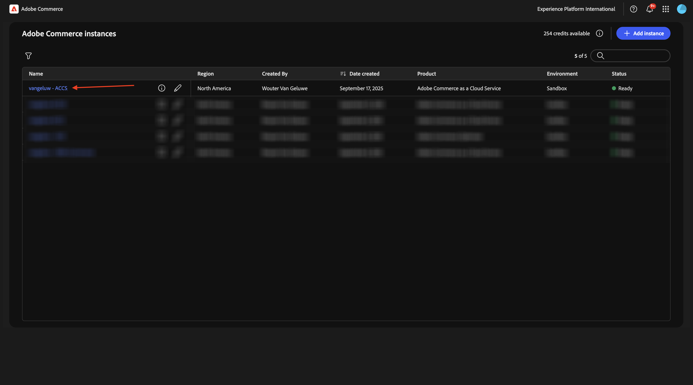
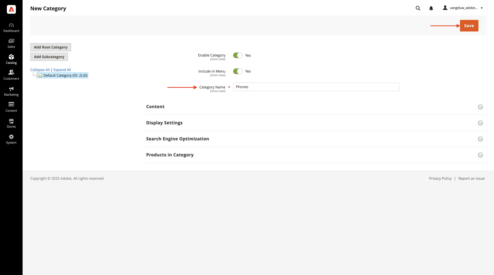
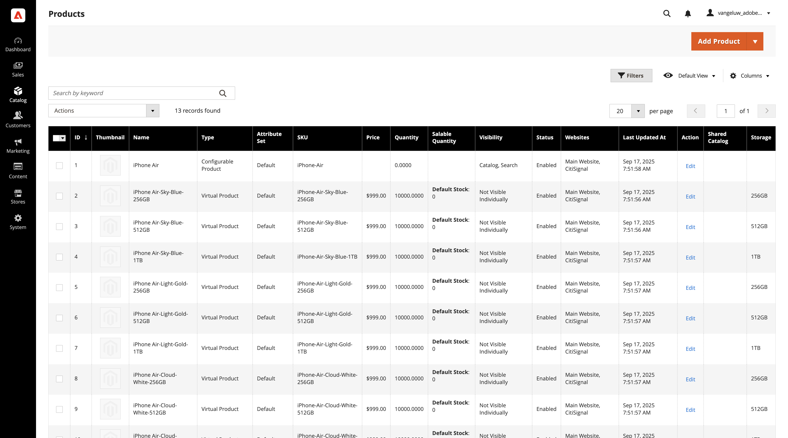

# 1.5.1 Adobe Commerce as a Cloud Service快速入門

移至[https://experience.adobe.com/](https://experience.adobe.com/){target="_blank"}。 確定您處於正確的環境，應該命名為`--aepImsOrgName--`。 按一下&#x200B;**Commerce**。

## 1.5.1.1建立您的ACCS執行個體

您應該會看到此訊息。 按一下&#x200B;**+新增執行個體**。

填寫欄位，如下所示：

- **執行個體名稱**： `--aepUserLdap-- - ACCS`
- **環境**： `Sandbox`
- **地區**： `North America`

按一下&#x200B;**新增執行個體**。

正在建立您目前的執行個體。 這可能需要5到10分鐘。

執行個體準備就緒後，按一下您的執行個體以開啟它。

## 1.5.1.2設定您的CitiSignal存放區

您應該會看到此訊息。 按一下&#x200B;**使用Adobe ID**&#x200B;登入，然後登入。

登入後，您應該會看到此首頁。 第一步是在Commerce中設定CitiSignal商店。 按一下&#x200B;**商店**。

按一下&#x200B;**所有商店**。

按一下&#x200B;**建立網站**。

填寫欄位，如下所示：

- **名稱**： `CitiSignal`
- **代碼**： `citisignal`

按一下&#x200B;**儲存網站**。

然後您應該會回到這裡。 按一下&#x200B;**建立存放區**。

填寫欄位，如下所示：

- **網站**： `CitiSignal`
- **名稱**： `CitiSignal`
- **代碼**： `citisignal`
- **根類別**： `Default Category`

按一下&#x200B;**儲存存放區**。

然後您應該會回到這裡。 按一下&#x200B;**建立存放區檢視**。

填寫欄位，如下所示：

- **存放區**： `CitiSignal`
- **名稱**： `CitiSignal`
- **代碼**： `citisignal`
- **狀態**： `Enabled`

按一下&#x200B;**儲存存放區檢視**。

之後，您應該會看到此訊息。 按一下&#x200B;**「確定」**。

然後您應該會回到這裡。 按一下&#x200B;**CitiSignal**&#x200B;網站以開啟。

核取核取方塊以將此網站設為預設網站。

按一下&#x200B;**儲存網站**。

然後您應該會回到這裡。

## 1.5.1.3設定類別和產品

移至&#x200B;**目錄**，然後選取&#x200B;**類別**。

選取&#x200B;**預設類別**，然後按一下&#x200B;**新增子類別**。

輸入名稱`Phones`，然後按一下&#x200B;**儲存**。

選取&#x200B;**預設類別**，然後再次按一下&#x200B;**新增子類別**。

輸入名稱`Watches`，然後按一下&#x200B;**儲存**。

之後，您應該會建立2個類別。

接著，移至&#x200B;**目錄**，然後選取&#x200B;**產品**。

您應該會看到此訊息。 按一下&#x200B;**新增產品**。

設定您的產品，如下所示：

- **產品名稱**： `iPhone Air`
- **SKU**： `iPhone-Air`
- **價格**： `999`
- **數量**： `10000`
- **類別**：選取`Phones`

按一下&#x200B;**儲存**。

向下捲動至&#x200B;**組態**&#x200B;並按一下&#x200B;**建立組態**。

您應該會看到此訊息。 按一下&#x200B;**建立新屬性**。

將&#x200B;**預設標籤**&#x200B;設定為`Storage`，然後按一下&#x200B;**管理選項**&#x200B;下的&#x200B;**新增選項**。

在全部3個資料行中使用名稱`256GB`設定第一個選項，然後再次按一下&#x200B;**新增選項**。

在全部3個資料行中使用名稱`512GB`設定第二個選項，然後再次按一下&#x200B;**新增選項**。

在全部3個資料行中使用名稱`1TB`設定第三個選項。

向下捲動至&#x200B;**店面內容**。 將下列選項設定為&#x200B;**是**：

- **用於搜尋**
- **允許Storefront上的HTML標籤**
- **顯示在店面的目錄頁面上**
- **用於產品清單**

向上捲動並按一下&#x200B;**儲存屬性**。

您應該會看到此訊息。 選取&#x200B;**色彩**&#x200B;和&#x200B;**儲存**&#x200B;的兩個屬性，然後按一下&#x200B;**下一步**。

您應該會看到此訊息。 您現在需要新增可用的色彩選項。 若要這麼做，請按一下&#x200B;**建立新值**。

輸入值`Sky-Blue`並按一下&#x200B;**建立新值**。

輸入值`Light-Gold`並按一下&#x200B;**建立新值**。

輸入值`Cloud-White`並按一下&#x200B;**建立新值**。

輸入值`Space-Black`。 按一下&#x200B;**全選**

選取&#x200B;**儲存體**&#x200B;下的全部3個選項，然後按一下&#x200B;**下一步**。

保留預設設定，然後按一下&#x200B;**下一步**。

您應該會看到此訊息。 按一下&#x200B;**產生產品**。

將每個產品的&#x200B;**數量**&#x200B;設定為`10000`。 按一下&#x200B;**儲存**。

向下捲動至網站中的&#x200B;**產品**，並勾選&#x200B;**CitiSignal**&#x200B;的核取方塊。

按一下&#x200B;**儲存**。

按一下「**確認**」。

您應該會看到此訊息。 按一下&#x200B;**上一步**。

您現在在產品目錄中看到產品&#x200B;**iPhone Air**&#x200B;及其變數。

下一步：[將ACCS連線至AEM Sites CS/EDS店面](./ex2.md){target="_blank"}

返回[Adobe Commerce as a Cloud Service](./accs.md){target="_blank"}

[返回所有模組](./../../../overview.md){target="_blank"}
