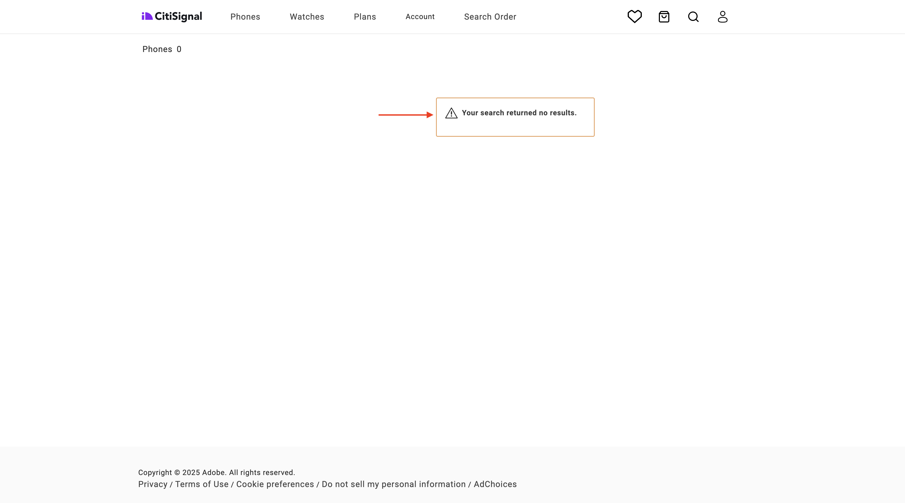
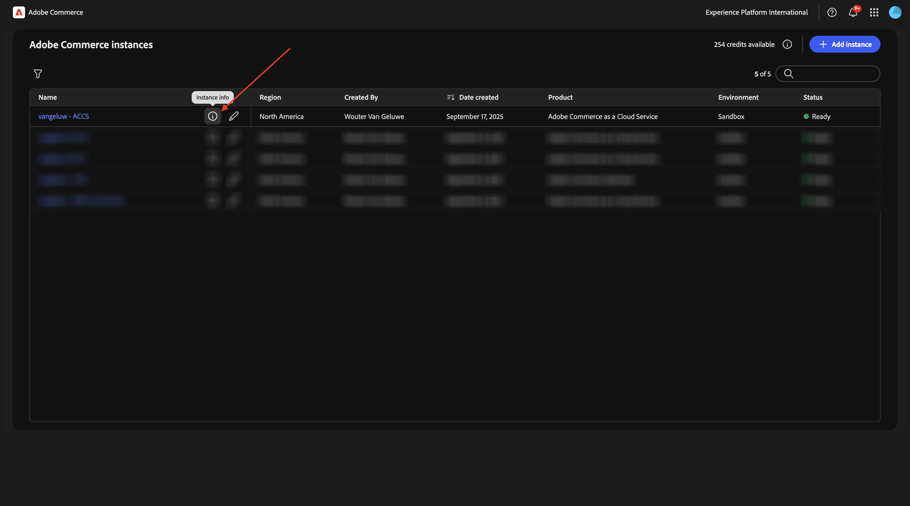
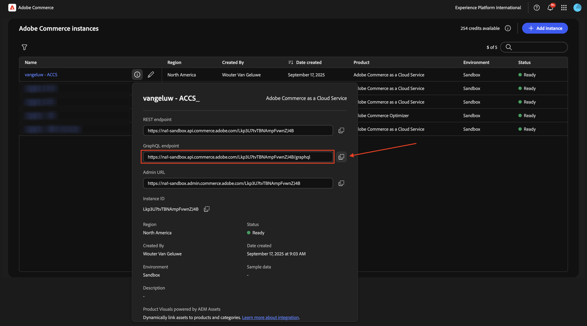

# 1.5.2將ACCS連線至AEM Sites CS/EDS店面

>[!IMPORTANT]
>
>為了完成此練習，您需要存取運作中的AEM Sites和Assets CS搭配EDS環境。
>
>如果您還沒有這樣的環境，請前往練習[Adobe Experience Manager Cloud Service和Edge Delivery Services](./../../../modules/asset-mgmt/module2.1/aemcs.md){target="_blank"}。 按照這裡的指示操作，您將可以存取這樣的環境。

>[!IMPORTANT]
>
>如果您先前已使用AEM Sites和AEM CS環境設定Assets CS計畫，可能是您的AEM CS沙箱已休眠。 鑑於讓這樣的沙箱解除休眠需要10-15分鐘，最好現在開始解除休眠過程，這樣以後就不必等待了。

在本練習中，您會將AEM Sites CS/EDS店面連結至ACCS後端。 目前，當您開啟AEM Sites CS/EDS店面並前往&#x200B;**Phone**&#x200B;產品清單頁面時，您尚未看到任何產品。

在本練習結束時，您應該會看到在上一個練習中設定的產品出現在您AEM Sites CS/EDS店面的&#x200B;**電話**&#x200B;產品清單頁面上。

移至[https://experience.adobe.com/](https://experience.adobe.com/){target="_blank"}。 確定您處於正確的環境，應該命名為`--aepImsOrgName--`。 按一下&#x200B;**Commerce**。

按一下您的ACCS執行個體旁的&#x200B;**資訊**&#x200B;圖示，應該命名為`--aepUserLdap-- - ACCS`。

您應該會看到此訊息。 複製&#x200B;**GraphQL端點**。

移至[https://da.live/app/adobe-commerce/storefront-tools/tools/config-generator/config-generator](https://da.live/app/adobe-commerce/storefront-tools/tools/config-generator/config-generator)。 您現在需要產生config.json檔案，將您的AEM Sites CS Storefront連結至ACCS後端。

在&#x200B;**設定產生器**&#x200B;頁面上，貼上您複製的&#x200B;**GraphQL端點** URL。

按一下&#x200B;**產生**。

複製完整產生的JSON裝載。

前往設定AEM Sites CS/EDS環境時建立的GitHub存放庫。 該存放庫是在練習[1.1.2中建立的，用來設定您的AEM CS環境](./../../../modules/asset-mgmt/module2.1/ex3.md){target="_blank"}，名稱應該是&#x200B;**citisignal-aem-accs**。

在根目錄中，向下捲動並按一下以開啟檔案&#x200B;**config.json**。

按一下&#x200B;**編輯**&#x200B;圖示。

移除所有目前的文字，並貼上您在&#x200B;**設定產生器**&#x200B;頁面上複製的JSON裝載加以取代。

按一下&#x200B;**提交變更……**。

按一下&#x200B;**提交變更**。

**config.json**&#x200B;檔案現在已更新。 您應該會在幾分鐘內在網站上看到您的變更。 驗證變更是否成功擷取的方法是移至&#x200B;**電話**&#x200B;產品頁面。 您現在應該會看到&#x200B;**iPhone Air**&#x200B;出現在頁面上。

雖然產品現在已成功顯示，但目前還沒有可供產品使用的影像。 在下個練習中，您將設定與AEM Assets CS的產品影像連結。

下一步： [將ACCS連線至AEM Assets CS](./ex3.md){target="_blank"}

返回[Adobe Commerce as a Cloud Service](./accs.md){target="_blank"}

[返回所有模組](./../../../overview.md){target="_blank"}
