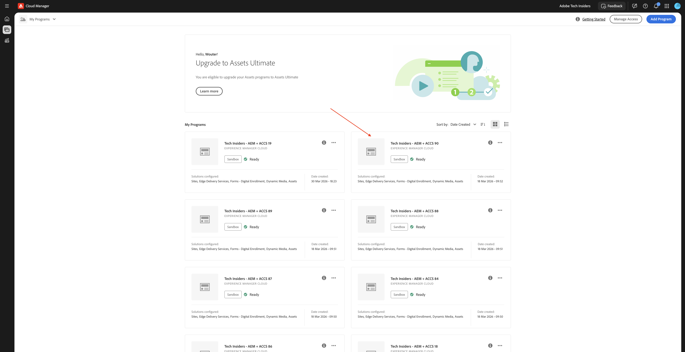

# 1.5.3將ACCS連線至AEM Assets CS

>[!IMPORTANT]
>
>為了完成此練習，您需要存取運作中的AEM Sites和Assets CS搭配EDS環境。
>
>如果您還沒有這樣的環境，請前往練習[Adobe Experience Manager Cloud Service和Edge Delivery Services](./../../../modules/asset-mgmt/module2.1/aemcs.md){target="_blank"}。 按照這裡的指示操作，您將可以存取這樣的環境。

>[!IMPORTANT]
>
>如果您先前已使用AEM Sites和AEM CS環境設定Assets CS計畫，可能是您的AEM CS沙箱已休眠。 鑑於讓這樣的沙箱解除休眠需要10-15分鐘，最好現在開始解除休眠過程，這樣以後就不必等待了。




## 1.5.3.4更新config.json

在第6 `"ac-environment-id":XXX`行下方新增下列程式碼片段：

```json
 "commerce-assets-enabled": "true",
```


下一步： [摘要與優點](./summary.md){target="_blank"}

返回[Adobe Commerce as a Cloud Service](./accs.md){target="_blank"}

[返回所有模組](./../../../overview.md){target="_blank"}
