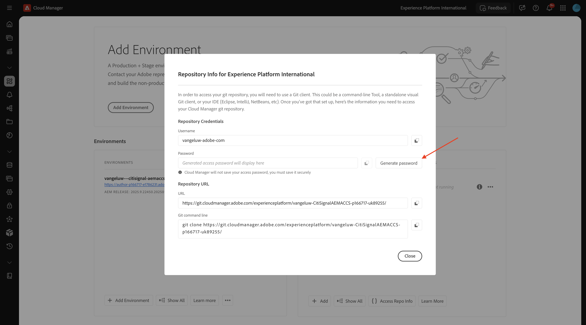
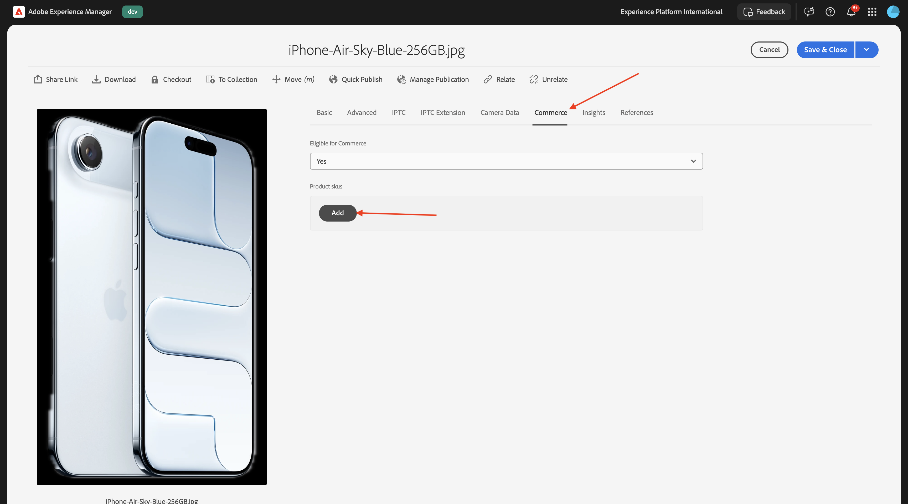

# 1.5.3將ACCS連線至AEM Assets CS

>[!IMPORTANT]
>
>為了完成此練習，您需要存取運作中的AEM Sites和Assets CS搭配EDS環境。
>
>如果您還沒有這樣的環境，請前往練習[Adobe Experience Manager Cloud Service和Edge Delivery Services](./../../../modules/asset-mgmt/module2.1/aemcs.md){target="_blank"}。 按照這裡的指示操作，您將可以存取這樣的環境。

>[!IMPORTANT]
>
>如果您先前已使用AEM Sites和AEM CS環境設定Assets CS計畫，可能是您的AEM CS沙箱已休眠。 鑑於讓這樣的沙箱解除休眠需要10-15分鐘，最好現在開始解除休眠過程，這樣以後就不必等待了。

完成先前的練習後，您可能會看到ACCS將產品傳回至您的網站，但產品尚未顯示影像。 在本練習結束時，您應該也會看到傳回的影像。


## 1.5.3.1更新管道設定

移至[https://my.cloudmanager.adobe.com](https://my.cloudmanager.adobe.com){target="_blank"}。 您應該選取的組織是`--aepImsOrgName--`。

按一下以開啟您的Cloud Manager程式，程式應該稱為`--aepUserLdap-- - CitiSignal AEM+ACCS`。


向下捲動一點，然後在&#x200B;**管道**&#x200B;索引標籤上按一下&#x200B;**存取存放庫資訊**。


您應該會看到此訊息。 按一下&#x200B;**產生密碼**。



再按一下&#x200B;**產生密碼**。


之後，您應該會有可用的密碼。 接著，按一下&#x200B;**Git命令列**&#x200B;欄位旁的&#x200B;**複製**&#x200B;圖示。


在電腦上選擇的位置建立新目錄，並將其命名為&#x200B;**AEM管道GitHub**。


在資料夾上按一下滑鼠右鍵，然後選取&#x200B;**資料夾**&#x200B;的新終端機。


您應該會看到此訊息。


在「終端機」視窗中貼上您之前複製的&#x200B;**Git命令列**&#x200B;命令。


您必須輸入使用者名稱。 從Cloud Manager的程式管道&#x200B;**存取存放庫資訊**&#x200B;複製使用者名稱，然後按下&#x200B;**Enter**。


接下來，您必須輸入密碼。 從Cloud Manager的程式管道&#x200B;**Access存放庫資訊**&#x200B;複製密碼並按&#x200B;**Enter**。


這可能需要一分鐘。 完成後，您將擁有連結至計畫管道的Git存放庫的本機副本。


您會在&#x200B;**AEM管道GitHub**&#x200B;目錄中看到新目錄。 開啟該目錄。


選取該目錄中的所有檔案，並刪除所有檔案。


確定目錄是空的。


移至[https://github.com/ankumalh/assets-commerce](https://github.com/ankumalh/assets-commerce)。

接著，將檔案&#x200B;**assets-commerce-main.zip**&#x200B;複製到您的案頭並解壓縮。 開啟資料夾&#x200B;**assets-commerce-main**。


將所有檔案從目錄&#x200B;**assets-commerce-main**&#x200B;複製到您程式的Pipeline Repository目錄的空白目錄。


接下來，開啟&#x200B;**Microsoft Visual Studio Code**，並在&#x200B;**Microsoft Visual Studio Code**&#x200B;中開啟包含您程式之管道存放庫的資料夾。


前往左側功能表中的&#x200B;**搜尋**&#x200B;並搜尋`<my-app>`。 您需要以`<my-app>`取代所有出現的`--aepUserLdap--citisignalaemaccs`。

按一下&#x200B;**全部取代**&#x200B;圖示。


按一下&#x200B;**取代**。


新檔案現在已準備好上傳回Git存放庫，該存放庫已連結至您的計畫的管道存放庫。 若要這麼做，請開啟資料夾&#x200B;**AEM Pipeline GitHub**，然後以滑鼠右鍵按一下包含新檔案的資料夾。 選取&#x200B;**資料夾**&#x200B;的新終端機。


您應該會看到此訊息。 貼上命令`git add .`並按&#x200B;**Enter**。


您應該會看到此訊息。 貼上命令`git commit -m "add assets integration"`並按&#x200B;**Enter**。


您應該會看到此訊息。 貼上命令`git push origin main`並按&#x200B;**Enter**。


您應該會看到此訊息。 您的變更現在已部署到您計畫的管道Git存放庫。


返回Cloud Manager並按一下&#x200B;**關閉**。


在變更管道的Git存放庫後，您需要再次執行&#x200B;**部署至開發**&#x200B;管道。 按一下3個點&#x200B;**...**，然後選取&#x200B;**執行**。


按一下&#x200B;**執行**。 執行管道部署可能需要10到15分鐘。 繼續之前，您需要等到管道部署成功完成。


## 1.5.3.2啟用ACCS中的AEM Assets整合

返回ACCS執行個體。 在左側功能表中，移至&#x200B;**存放區**，然後選取&#x200B;**組態**。


在功能表中向下捲動至&#x200B;**ADOBE SERVICES**，然後開啟&#x200B;**AEM Assets整合**。 您應該會看到此訊息。


填寫下列變數：

- **AEM Assets方案ID**：您可以從AEM CS作者URL取得方案ID。 在此範例中，計畫識別碼為`166717`。


- **AEM Assets環境ID**：您可以從AEM CS作者URL取得環境ID。 在此範例中，環境識別碼為`1786231`。


- **資產選擇器IMS使用者端ID**：設定為`1`
- **同步處理已啟用**：設定為`Yes`
- **視覺效果擁有者**：設定為`AEM Assets`
- **資產比對規則**： `Match by product SKU`
- **依產品SKU屬性名稱比對**： `commerce:skus`

按一下&#x200B;**儲存設定**。


您應該會看到此訊息。


## 1.5.3.3更新config.json

前往設定AEM Sites CS/EDS環境時建立的GitHub存放庫。 該存放庫是在練習[1.1.2中建立的，用來設定您的AEM CS環境](./../../../modules/asset-mgmt/module2.1/ex3.md){target="_blank"}，名稱應該是&#x200B;**citisignal-aem-accs**。

在根目錄中，向下捲動並按一下以開啟檔案&#x200B;**config.json**。 按一下&#x200B;**編輯**&#x200B;圖示以變更檔案。


在第5 `"commerce-endpoint": "https://na1-sandbox.api.commerce.adobe.com/XXX/graphql",`行下方新增下列程式碼片段：

```json
 "commerce-assets-enabled": "true",
```

按一下&#x200B;**認可變更……**。


按一下&#x200B;**認可變更**。


您的變更現在已儲存，很快就會發佈。 可能需要幾分鐘時間，變更才會顯示在店面上。


## 1.5.3.4驗證AEM Assets CS中的Commerce欄位

登入您的AEM CS Author環境並移至&#x200B;**Assets**。


移至&#x200B;**檔案**。


開啟&#x200B;**CitiSignal**&#x200B;資料夾。


將游標暫留在任何資產上，然後按一下&#x200B;**資訊**&#x200B;圖示。


您現在應該會看到包含2個新中繼資料屬性的&#x200B;**Commerce**&#x200B;標籤。


您的AEM Assets CS環境現在支援Commerce整合。 您現在可以開始上傳產品影像。

## 1.5.3.4上傳產品Assets並連結至產品

[在此下載產品影像](./images/Product_Images.zip)。 下載後，將檔案匯出至您的案頭。


按一下&#x200B;**建立**，然後選取&#x200B;**資料夾**。


輸入欄位&#x200B;**Title**&#x200B;和&#x200B;**Name**&#x200B;的值&#x200B;**Product_Images**。 按一下&#x200B;**建立**。


按一下以開啟您剛建立的資料夾。


按一下&#x200B;**建立**，然後選取&#x200B;**檔案**。


瀏覽至案頭上的&#x200B;**Product_Images**&#x200B;資料夾，選取所有檔案，然後按一下[開啟]。**&#x200B;**


按一下&#x200B;**上傳**。


您的影像將可在您的資料夾中使用。 將滑鼠停留在產品&#x200B;**iPhone-Air-Light-Gold.png**&#x200B;上，然後按一下&#x200B;**屬性**&#x200B;圖示。


向下捲動並將欄位&#x200B;**檢閱狀態**&#x200B;設定為&#x200B;**已核准**。 AEM Assets CS - ACCS整合僅適用於已核准的影像。


向上捲動，移至&#x200B;**Commerce**&#x200B;標籤，然後按一下&#x200B;**產品SKU**&#x200B;下的&#x200B;**新增**。



為此產品新增下列SKU：

| 索引鍵 | 價值 | 使用方式 |
|:-------------:| :---------------:| :---------------:| 
| `iPhone-Air-Light-Gold` | `1` | `thumbnail, image, swatch_image, small_image` |
| `iPhone-Air-Light-Gold-256GB` | `1` | `thumbnail, image, swatch_image, small_image` |
| `iPhone-Air-Light-Gold-512GB` | `1` | `thumbnail, image, swatch_image, small_image` |
| `iPhone-Air-Light-Gold-1TB` | `1` | `thumbnail, image, swatch_image, small_image` |

然後您應該擁有此專案。 按一下&#x200B;**儲存並關閉**。


將滑鼠停留在產品&#x200B;**iPhone-Air-Space-Black.png**&#x200B;上，然後按一下&#x200B;**屬性**&#x200B;圖示。


向下捲動並將欄位&#x200B;**檢閱狀態**&#x200B;設定為&#x200B;**已核准**。 AEM Assets CS - ACCS整合僅適用於已核准的影像。


向上捲動，移至&#x200B;**Commerce**&#x200B;標籤，然後按一下&#x200B;**產品SKU**&#x200B;下的&#x200B;**新增**。


為此產品新增下列SKU：

| 索引鍵 | 價值 | 使用方式 |
|:-------------:| :---------------:| :---------------:| 
| `iPhone-Air-Space-Black` | `1` | `thumbnail, image, swatch_image, small_image` |
| `iPhone-Air-Space-Black-256GB` | `1` | `thumbnail, image, swatch_image, small_image` |
| `iPhone-Air-Space-Black-512GB` | `1` | `thumbnail, image, swatch_image, small_image` |
| `iPhone-Air-Space-Black-1TB` | `1` | `thumbnail, image, swatch_image, small_image` |
| `iPhone-Air` | `1` | `thumbnail, image, swatch_image, small_image` |

然後您應該擁有此專案。 按一下&#x200B;**儲存並關閉**。


將滑鼠停留在產品&#x200B;**iPhone-Air-Sky-Blue.png**&#x200B;上，然後按一下&#x200B;**屬性**&#x200B;圖示。


向下捲動並將欄位&#x200B;**檢閱狀態**&#x200B;設定為&#x200B;**已核准**。 AEM Assets CS - ACCS整合僅適用於已核准的影像。


向上捲動，移至&#x200B;**Commerce**&#x200B;標籤，然後按一下&#x200B;**產品SKU**&#x200B;下的&#x200B;**新增**。


為此產品新增下列SKU：

| 索引鍵 | 價值 | 使用方式 |
|:-------------:| :---------------:| :---------------:| 
| `iPhone-Air-Sky-Blue` | `1` | `thumbnail, image, swatch_image, small_image` |
| `iPhone-Air-Sky-Blue-256GB` | `1` | `thumbnail, image, swatch_image, small_image` |
| `iPhone-Air-Sky-Blue-512GB` | `1` | `thumbnail, image, swatch_image, small_image` |
| `iPhone-Air-Sky-Blue-1TB` | `1` | `thumbnail, image, swatch_image, small_image` |

然後您應該擁有此專案。 按一下&#x200B;**儲存並關閉**。


將滑鼠停留在產品&#x200B;**iPhone-Air-Cloud-White.png**&#x200B;上，然後按一下&#x200B;**屬性**&#x200B;圖示。


向下捲動並將欄位&#x200B;**檢閱狀態**&#x200B;設定為&#x200B;**已核准**。 AEM Assets CS - ACCS整合僅適用於已核准的影像。


向上捲動，移至&#x200B;**Commerce**&#x200B;標籤，然後按一下&#x200B;**產品SKU**&#x200B;下的&#x200B;**新增**。


為此產品新增下列SKU：

| 索引鍵 | 價值 | 使用方式 |
|:-------------:| :---------------:| :---------------:| 
| `iPhone-Air-Cloud-White` | `1` | `thumbnail, image, swatch_image, small_image` |
| `iPhone-Air-Cloud-White-256GB` | `1` | `thumbnail, image, swatch_image, small_image` |
| `iPhone-Air-Cloud-White-512GB` | `1` | `thumbnail, image, swatch_image, small_image` |
| `iPhone-Air-Cloud-White-1TB` | `1` | `thumbnail, image, swatch_image, small_image` |

然後您應該擁有此專案。 按一下&#x200B;**儲存並關閉**。


現在，每個&#x200B;**iPhone Air**&#x200B;影像都應該有&#x200B;**豎起的綠色縮圖**，表示資產已核准。


## 1.5.3.5驗證AEM Sites CS/EDS店面上的產品影像

>[!NOTE]
>
>成功部署您上述變更前，最多可能需要15分鐘的時間。 如果影像尚未顯示，請等待15分鐘，然後再試一次。

若要驗證整合是否有效，您需要開啟CitiSignal網站。

若要存取您的網站，請在將XXX取代為GitHub使用者帳戶（在此範例中為`main--citisignal-aem-accs--XXX.aem.page`）之後，前往`main--citisignal-aem-accs--XXX.aem.live`和/或`woutervangeluwe`。

所以在此範例中，完整URL會變成：
`https://main--citisignal-aem-accs--woutervangeluwe.aem.page`和/或`https://main--citisignal-aem-accs--woutervangeluwe.aem.live`。

您應該會看到此訊息。 移至&#x200B;**電話**。


接著您應該會看到顯示&#x200B;**iPhone Air**&#x200B;的產品影像。 按一下&#x200B;**iPhone Air**。


您應該會看到此訊息。 變更色彩和儲存選項，您會看到影像會根據您所做的選擇動態變更。


以下是將色彩變更為&#x200B;**Light-Gold**&#x200B;以及將儲存大小變更為&#x200B;**256GB**&#x200B;的範例。


下一步： [摘要與優點](./summary.md){target="_blank"}

返回[Adobe Commerce as a Cloud Service](./accs.md){target="_blank"}

[返回所有模組](./../../../overview.md){target="_blank"}
