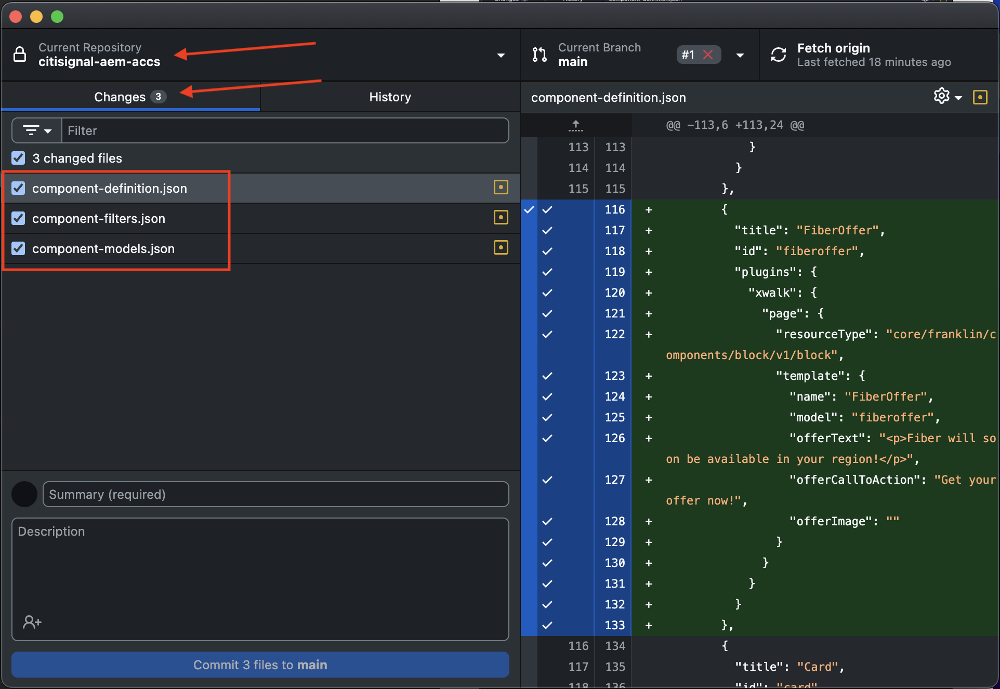
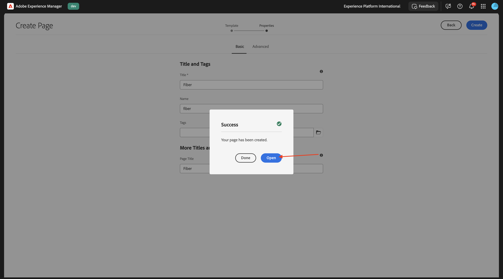
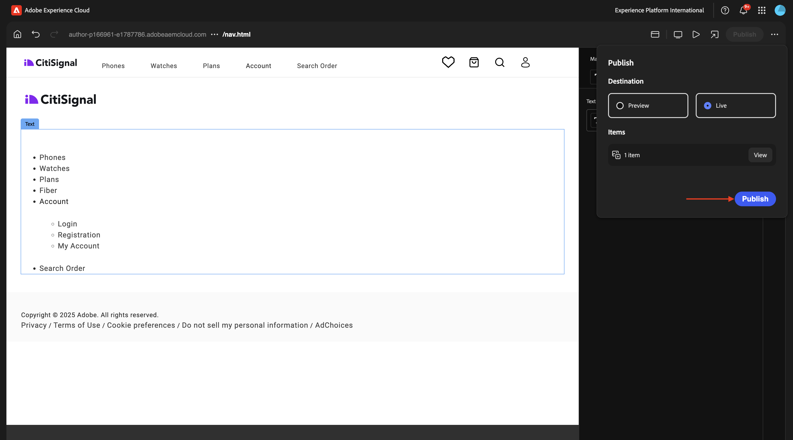

# 1.1.3開發基本自訂區塊

## 1.1.3.1設定您的本機開發環境

移至[https://desktop.github.com/download/](https://desktop.github.com/download/){target="_blank"}，下載並安裝&#x200B;**Github案頭版**。


安裝Github Desktop後，請前往您在上一個練習建立的GitHub存放庫。 按一下&#x200B;**&lt;>程式碼**，然後按一下&#x200B;**使用GitHub Desktop開啟**。


接著，系統就會在GitHub Desktop中開啟您的GitHub存放庫。 請隨時變更&#x200B;**本機路徑**。 按一下&#x200B;**複製**。


現在將建立本機資料夾。


開啟Visual Studio Code。 移至&#x200B;**檔案** > **開啟資料夾**。


選取您的GitHub設定用於&#x200B;**citisignal-aem-accs**&#x200B;的資料夾。


您現在會在Visual Studio Code中看到該資料夾已開啟，您已準備好建立新區塊。


## 1.1.3.2建立基本自訂區塊

Adobe建議您分三階段來開發區塊：

- 建立區塊的定義和模型，檢閱區塊，並將其帶入生產環境。
- 使用新區塊建立內容。
- 實作新區塊的裝飾和樣式。

### component-definition.json

在Visual Studio Code中，開啟檔案&#x200B;**component-definition.json**。


向下捲動，直到您看到&#x200B;**區塊**&#x200B;為止。 將游標設定在元件&#x200B;**卡片**&#x200B;的右方括弧下


貼上此程式碼，並在程式碼區塊後面輸入逗號&#x200B;**，**：

```json
{
  "title": "FiberOffer",
  "id": "fiberoffer",
  "plugins": {
    "xwalk": {
      "page": {
        "resourceType": "core/franklin/components/block/v1/block",
        "template": {
          "name": "FiberOffer",
          "model": "fiberoffer",
          "offerText": "<p>Fiber will soon be available in your region!</p>",
          "offerCallToAction": "Get your offer now!",
          "offerImage": ""
        }
      }
    }
  }
}
```

儲存您的變更。


### component-models.json

在Visual Studio Code中，開啟檔案&#x200B;**component-models.json**。


向下捲動，直到您看到最後一個專案為止。 將游標設定在最後一個元件的右方括弧旁。


輸入逗號&#x200B;**，**，然後推入，並在下一行貼上此代碼：

```json
{
  "id": "fiberoffer",
  "fields": [
     {
       "component": "richtext",
       "name": "offerText",
       "value": "",
       "label": "Offer Text",
       "valueType": "string"
     },
     {
       "component": "richtext",
       "valueType": "string",
       "name": "offerCallToAction",
       "label": "Offer CTA",
       "value": ""
     },
     {
       "component": "reference",
       "valueType": "string",
       "name": "offerImage",
       "label": "Offer Image",
        "multi": false
     }
   ]
}
```

儲存您的變更。


### component-filters.json

在Visual Studio Code中，開啟檔案&#x200B;**component-filters.json**。


在&#x200B;**區段**&#x200B;下方，輸入逗號`,`，並將元件`"fiberoffer"`的識別碼貼到目前最後一行之後。

儲存您的變更。


## 1.1.3.3認可您的變更

您現在已在專案中進行數項變更，這些變更需要提交回GitHub存放庫。 若要這麼做，請開啟&#x200B;**GitHub Desktop**。

您應該會在&#x200B;**變更**&#x200B;下看到剛才編輯的3個檔案。 檢閱您的變更。



輸入您的PR名稱，`Fiber Offer custom block`。 按一下&#x200B;**認可至主要**。


您應該會看到此訊息。 按一下&#x200B;**推播來源**。


幾秒鐘後，您的變更已推送至您的GitHub存放庫。


在瀏覽器中，前往您的GitHub帳戶，並前往您為CitiSignal建立的存放庫。 接著，您應該會看到類似這樣的畫面，表示已收到您的變更。


## 1.1.3.4將您的區塊新增至頁面

現在您的基本報價區塊已定義並認可至CitiSignal專案，您可以將&#x200B;**fiberoffer**&#x200B;區塊新增至現有頁面。

移至[https://my.cloudmanager.adobe.com](https://my.cloudmanager.adobe.com){target="_blank"}。 按一下您的&#x200B;**程式**&#x200B;以開啟。


接著，按一下&#x200B;**環境**&#x200B;標籤上的3個點&#x200B;**...**，然後按一下&#x200B;**檢視詳細資料**。


然後您會看到環境詳細資料。 按一下&#x200B;**作者**&#x200B;環境的URL。

>[!NOTE]
>
>您的環境可能已休眠。 如果是這種情況，您需要先解除環境休眠。 您可以在下面的影片中找到如何解除休眠的指示。

>[!VIDEO](https://video.tv.adobe.com/v/3478141?quality=12&learn=on)


之後，您應該會看到您的AEM作者環境。 移至&#x200B;**網站**。


移至&#x200B;**花旗訊號**。 按一下&#x200B;**建立**&#x200B;並選取&#x200B;**頁面**。


選取&#x200B;**頁面**&#x200B;並按一下&#x200B;**下一步**。


輸入下列值：

- 標題： **Fiber**
- 名稱： **fiber**
- 頁面標題： **Fiber**

按一下&#x200B;**建立**。


選取&#x200B;**開啟**。



您應該會看到此訊息。


按一下空白區域以選取&#x200B;**section**&#x200B;元件。 然後，按一下右側功能表中的加號&#x200B;**+**&#x200B;圖示。


之後，您應該會在可用區塊清單中看到自訂區塊。 按一下以選取它。


接著，您會看到諸如&#x200B;**選件文字**、**選件CTA**&#x200B;和&#x200B;**選件影像**&#x200B;等欄位已新增至編輯器中。 按一下&#x200B;**選件影像**&#x200B;欄位上的&#x200B;**+新增**&#x200B;以選取影像。


您應該會看到此訊息。 按一下以開啟資料夾&#x200B;**citisignal**。


選取影像&#x200B;**product-enrichment-1.png**。 按一下&#x200B;**選取**。


然後您應該擁有此專案。 按一下&#x200B;**發佈**。


再按一下&#x200B;**發佈**。


您的新頁面現已發佈。

## 1.1.3.5將您的新頁面新增至導覽功能表

在您的AEM Sites總覽中，移至&#x200B;**CitiSignal**&#x200B;並勾選檔案&#x200B;**Header/nav**&#x200B;的核取方塊。 按一下&#x200B;**編輯**。


在預覽畫面中選取&#x200B;**文字**&#x200B;欄位，然後按一下畫面右側的&#x200B;**文字**&#x200B;欄位以進行編輯。


新增功能表選項至含有文字`Fiber`的導覽功能表。 選取文字&#x200B;**Fiber**&#x200B;並按一下&#x200B;**連結**&#x200B;圖示。


輸入此&#x200B;**URL** `/content/CitiSignal/fiber.html`並按一下&#x200B;**V**&#x200B;圖示以確認。


然後您應該擁有此專案。 按一下「**完成**」。


然後您應該擁有此專案。 按一下&#x200B;**發佈**。


再按一下&#x200B;**發佈**。



您現在可以移至`main--citisignal--XXX.aem.page/us/en/`及/或`main--citisignal--XXX.aem.live/us/en/`，在將XXX取代為GitHub使用者帳戶（在此範例中為`woutervangeluwe`）之後，檢視您網站的變更。

在此範例中，完整URL會變成：
`https://main--citisignal--woutervangeluwe.aem.page/us/en/`和/或`https://main--citisignal--woutervangeluwe.aem.live/us/en/`。

您應該會看到此訊息。 按一下&#x200B;**Fiber**。


這是您的基本自訂區塊，但現在已呈現在網站上。


下一步： [進階自訂區塊](./ex4.md){target="_blank"}

返回[Adobe Experience Manager Cloud Service和Edge Delivery Services](./aemcs.md){target="_blank"}

[返回所有模組](./../../../overview.md){target="_blank"}
