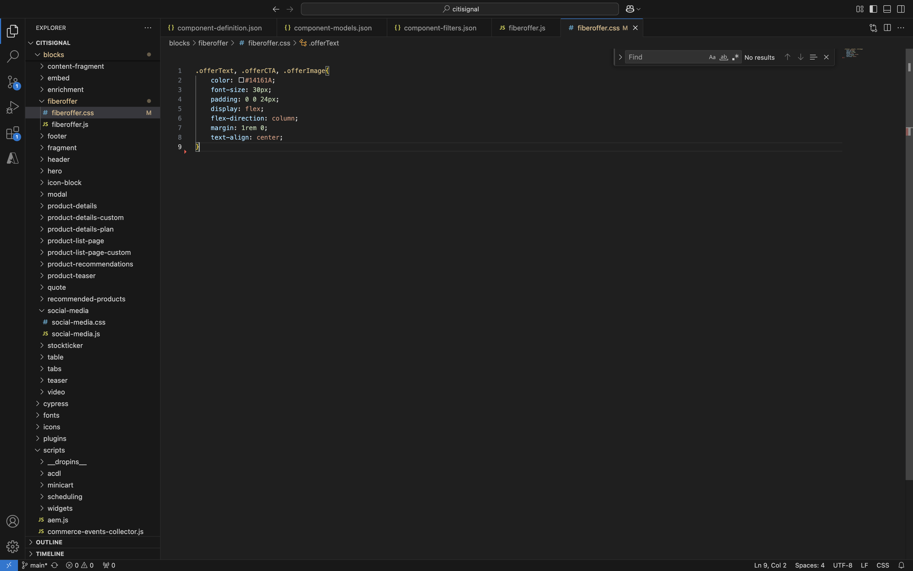
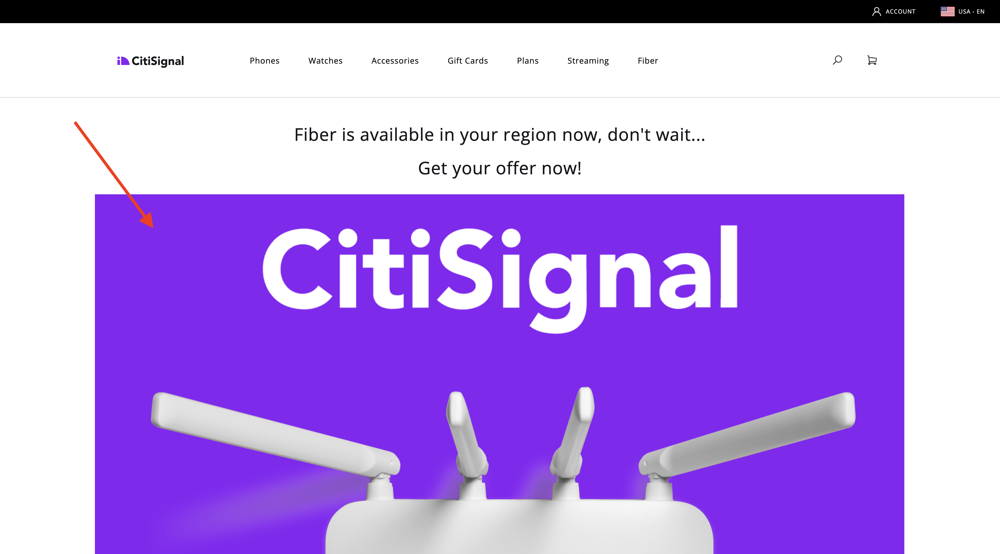

# 1.1.4進階自訂區塊

在上一個練習中，您設定名為&#x200B;**Fiber Offer**&#x200B;的基本自訂區塊，該區塊會在您的網站上顯示&#x200B;**優惠方案文字**、**優惠方案CTA**&#x200B;和&#x200B;**優惠方案影像**&#x200B;等欄位。

您現在可以繼續處理此區塊。

{zoomable="yes"}

## 1.1.4.1設定區塊樣式

現在您已擁有有效的&#x200B;**纖維選件**&#x200B;區塊，您可以套用樣式至該區塊。

返回Visual Studio Code並開啟資料夾&#x200B;**區塊**。 您現在應該會看到多個資料夾，每個資料夾都參照特定區塊。 為了讓您的&#x200B;**fiberoffer**&#x200B;區塊更進階，您現在需要為自訂區塊建立資料夾。

{zoomable="yes"}

選取資料夾&#x200B;**區塊**，然後按一下&#x200B;**建立新資料夾**&#x200B;圖示。

{zoomable="yes"}

為資料夾命名`fiberoffer`並按&#x200B;**Enter**。

{zoomable="yes"}

選取新的&#x200B;**fiberoffer**&#x200B;資料夾，然後按一下&#x200B;**建立新檔案**&#x200B;圖示。

{zoomable="yes"}

現在已建立新檔案。 輸入名稱&#x200B;**fiberoffer.js**&#x200B;並按Enter鍵。

{zoomable="yes"}

您現在可以將下列JavaScript新增至檔案&#x200B;**fiberoffer.js**，以實作區塊裝飾。

儲存檔案。

```js
export default function decorate(block) {
  const offerText = block.children[0];
  const offerCTA = block.children[1];
  const offerImage = block.children[2];

  offerText.id = 'offerText';
  offerText.className = 'offerText';
  offerCTA.id = 'offerCTA';
  offerCTA.className = 'offerCTA';
  offerImage.id = 'offerImage';
  offerImage.className = 'offerImage';
}
```

{zoomable="yes"}

選取新的&#x200B;**fiberoffer**&#x200B;資料夾，然後再次按一下「建立新檔案」**圖示。**

{zoomable="yes"}

現在已建立新檔案。 輸入名稱&#x200B;**fiberoffer.css**，然後按Enter鍵。

{zoomable="yes"}

將下列CSS程式碼複製並貼到新建立的檔案中。

```js
.offerText, .offerCTA, .offerImage{
    color: #14161A;
    font-size: 30px;
    padding: 0 0 24px;
    display: flex;
    flex-direction: column;
    margin: 1rem 0;
    text-align: center;
}
```

儲存您的變更。

{zoomable="yes"}

您現在已在專案中進行數項變更，這些變更需要提交回GitHub存放庫。 若要這麼做，請開啟&#x200B;**GitHub Desktop**。

然後您應該會在&#x200B;**變更**&#x200B;下看到您剛才編輯的2個檔案。 檢閱您的變更。

輸入您的PR名稱，`js css`。 按一下&#x200B;**認可至主要**。

{zoomable="yes"}

您應該會看到此訊息。 按一下&#x200B;**推播來源**。

{zoomable="yes"}

在瀏覽器中，前往您的GitHub帳戶，並前往您為CitiSignal建立的存放庫。 接著，您應該會看到類似這樣的畫面，表示已收到您的變更。

{zoomable="yes"}

您現在可以移至`main--citisignal-aem-accs--XXX.aem.page`及/或`main--citisignal-aem-accs--XXX.aem.live`，在將XXX取代為GitHub使用者帳戶（在此範例中為`woutervangeluwe`）之後，檢視您網站的變更。

在此範例中，完整URL會變成：
`https://main--citisignal-aem-accs--woutervangeluwe.aem.page`和/或`https://main--citisignal-aem-accs--woutervangeluwe.aem.live`。

之後，您應該會看到此訊息，且樣式會套用至頁面。

{zoomable="yes"}

## 1.1.4.2新增邏輯並從外部端點載入資料

在此練習中，您將執行Adobe的網頁SDK的「原始」設定，並將向Adobe Journey Optimizer Offer Decisioning請求下一個最佳選件。

需要澄清的是：這並不表示這是針對AEM as a Cloud Service實作Web SDK的最佳作法。 在下一個練習中，您將使用為此開發的特定外掛程式來實作資料收集。

本練習旨在向您展示JavaScript中的幾項基本功能，例如載入外部JS程式庫、使用&#x200B;**alloy.js**&#x200B;程式庫、傳送要求等。

資料庫&#x200B;**alloy.js**&#x200B;是位於Web SDK的資料庫，可讓您將請求從網站傳送至Adobe的Edge Network，以及從網站傳送至Adobe Experience Platform、Adobe Analytics、Adobe Target等應用程式。

在您針對區塊樣式新增的上一個程式碼底下新增此程式碼：

```javascript
var script1 = document.createElement('script');
  script1.text = "!function(n,o){o.forEach(function(o){n[o]||((n.__alloyNS=n.__alloyNS||[]).push(o),n[o]=function(){var u=arguments;return new Promise(function(i,l){n[o].q.push([i,l,u])})},n[o].q=[])})}(window,['alloy']);"
  document.head.appendChild(script1);

  var script2 = document.createElement('script');
  script2.async = true;
  script2.src = "https://cdn1.adoberesources.net/alloy/2.14.0/alloy.min.js";
  document.head.appendChild(script2);

  alloy("configure", {
    "edgeConfigId": "045c5ee9-468f-47d5-ae9b-a29788f5948f",
    "orgId": "907075E95BF479EC0A495C73@AdobeOrg",
    "defaultConsent": "in"
  });
```

然後您應該擁有此專案。

您新增的第一個指令碼標籤（指令碼1）是Web SDK使用的函式，會建立名為&#x200B;**alloy**&#x200B;的視窗物件。

第二個指令碼標籤(script2)將會從Adobe的CDN非同步載入alloy.js資料庫。

程式碼的第三個區塊基本上會設定alloy物件，將資料傳送至特定的Adobe IMS組織和資料流。

在&#x200B;**快速入門**&#x200B;模組中，您已設定名為`--aepUserLdap-- - One Adobe Datastream`的資料流。 上述程式碼中的欄位&#x200B;**edgeConfigId**&#x200B;參考已設定資料流的ID。

此時您不需要變更欄位&#x200B;**edgeConfigId**。 在下個練習中，您將能夠使用&#x200B;**MarTech**&#x200B;外掛程式來執行此操作。

{zoomable="yes"}

您現在應該擁有此專案。

{zoomable="yes"}

接下來，在您新增的上一個程式碼下方新增此區塊。

```javascript
var ECID = "";

  alloy("getIdentity")
    .then(function (result) {
      // The command succeeded.
      console.log("ECID:", result.identity.ECID);
      ECID = result.identity.ECID;
      getOffer(ECID);

    })
    .catch(function (error) {
      // The command failed.
      // "error" will be an error object with additional information.
    });
```

此程式碼區塊用於擷取Experience Cloud ID (ECID)的值。 ECID是瀏覽器的唯一裝置識別碼。

如上述程式碼所示，擷取ECID後，就會呼叫另一個函式。 此函式名為&#x200B;**getOffer()**，您稍後會新增此函式。

{zoomable="yes"}

接下來，將下列程式碼新增至

```javascript
async function getOffer(ECID) {
  var url = "https://edge.adobedc.net/ee/irl1/v1/interact?configId=045c5ee9-468f-47d5-ae9b-a29788f5948f";

  var timestamp = new Date().toISOString();

  var offerRequest = {
    "events": [
      {
        "xdm": {
          "eventType": "decisioning.propositionDisplay",
          "timestamp": timestamp,
          "_experienceplatform": {
            "identification": {
              "core": {
                "ecid": ECID
              }
            }
          },
          "identityMap": {
            "ECID": [
              {
                "id": ECID
              }
            ]
          }
        },
        "query": {
          "personalization": {
            "schemas": [
              "https://ns.adobe.com/personalization/default-content-item",
              "https://ns.adobe.com/personalization/html-content-item",
              "https://ns.adobe.com/personalization/json-content-item",
              "https://ns.adobe.com/personalization/redirect-item",
              "https://ns.adobe.com/personalization/ruleset-item",
              "https://ns.adobe.com/personalization/message/in-app",
              "https://ns.adobe.com/personalization/message/content-card",
              "https://ns.adobe.com/personalization/dom-action"
            ],
            "decisionScopes": [
              "eyJ4ZG06YWN0aXZpdHlJZCI6ImRwczpvZmZlci1hY3Rpdml0eToxYTI3ODk3NzAzYTY5NWZmIiwieGRtOnBsYWNlbWVudElkIjoiZHBzOm9mZmVyLXBsYWNlbWVudDoxYTI0ZGM2MWJmYjJlMjIwIn0=",
              "eyJ4ZG06YWN0aXZpdHlJZCI6ImRwczpvZmZlci1hY3Rpdml0eToxYTI3ODk3NzAzYTY5NWZmIiwieGRtOnBsYWNlbWVudElkIjoiZHBzOm9mZmVyLXBsYWNlbWVudDoxYTI0ZGM0MzQyZjJlMjFlIn0="
            ]
          }
        }
      }
    ]
  }

  try {
    const response = await fetch(url, {
      method: "POST",
      headers: {
        "Content-Type": "application/json"
      },
      body: JSON.stringify(offerRequest),
    });

    if (response.status === 200) {
      var body = await response.json();
      console.log("Offer Decisioning Response: ", body);

      const decisions = body["handle"];

      decisions.forEach(decision => {
        if (decision["type"] == "personalization:decisions") {
          console.log("Offer Decisioning decision detail: ", decision);
          const payloads = decision["payload"];

          if (payloads === undefined || payloads.length == 0) {
            //do nothing
          } else {
            payloads.forEach(payload => {
              if (payload["placement"]["name"] == "Web - Image") {
                console.log("Web-Image payload");
                const items = payload["items"];
                items.forEach(item => {
                  if (item["id"].includes("dps:fallback-offer")) {
                    console.log("Item details: ", item);
                    const deliveryURL = item["data"]["deliveryURL"];

                    document.querySelector("#offerImage").innerHTML = "";
                  } else if (item["id"].includes("dps:personalized-offer")) {
                    console.log("Item details: ", item);
                    const deliveryURL = item["data"]["deliveryURL"];
                    console.log("Web-Image Personalized Offer Content: ", deliveryURL)

                    document.querySelector("#offerImage").innerHTML = "";
                  }
                });
              } else if (payload["placement"]["name"] == "Web - JSON") {
                console.log("Web-JSON payload");
                const items = payload["items"];
                items.forEach(item => {
                  if (item["id"].includes("dps:fallback-offer")) {
                    const content = JSON.parse(item["data"]["content"]);

                    console.log("Web-JSON Fallback Content: ", content)

                    document.querySelector("#offerText").innerHTML = content.text;
                    document.querySelector("#offerCTA").innerHTML = content.cta;
                  } else if (item["id"].includes("dps:personalized-offer")) {
                    const content = JSON.parse(item["data"]["content"]);

                    console.log("Web-JSON Personalized Offer Content: " + content);

                    document.querySelector("#offerText").innerHTML = content.text;
                    document.querySelector("#offerCTA").innerHTML = content.cta;
                  }
                });
              }
            });
          }
          document.querySelector("#offerImage").style.display = "block";
          document.querySelector("#offerText").style.display = "block";
          document.querySelector("#offerCTA").style.display = "block";
        }
      });
    } else {
      console.warn("Offer Decisioning Response unsuccessful:", response.body);
    }
  } catch (error) {
    console.error("Error when getting Offer Decisioning Response:", error);
  }
}
```

請務必將此程式碼區塊貼在右方括弧下方，您可以在此範例的第42行看到該方塊。 您剛貼上的程式碼是獨立的函式，需要它在這個檔案中擁有自己的位置，而且無法巢狀內嵌在上述&#x200B;**預設函式**&#x200B;中。

{zoomable="yes"}

您剛貼上的程式碼區塊會模擬一般會由Web SDK/alloy.js提出的要求。 在此範例中，將會對&#x200B;**edge.adobedc.net**&#x200B;發出&#x200B;**擷取**&#x200B;要求。

在請求中指定了2 **決定範圍**，這會要求Adobe Journey Optimizer Offer Decisioning針對此ECID需要檢視哪些優惠提供決定。

收到回應後，此程式碼會剖析回應並篩選出需要顯示的影像URL等，以及包含優惠方案文字和優惠方案CTA等JSON回應，接著會在網站上顯示這些內容。

請記住 — 此方法僅用於啟用目的，並非實作資料收集的最佳實務方式。

儲存您的變更。接著，開啟&#x200B;**Github Desktop**，為您的PR命名，然後按一下&#x200B;**認可至主要**。

{zoomable="yes"}

接著，按一下&#x200B;**推播來源**。

{zoomable="yes"}

您現在可以移至`main--citisignal-aem-accs--XXX.aem.page`及/或`main--citisignal-aem-accs--XXX.aem.live`，在將XXX取代為GitHub使用者帳戶（在此範例中為`woutervangeluwe`）之後，檢視您網站的變更。

在此範例中，完整URL會變成：
`https://main--citisignal-aem-accs--woutervangeluwe.aem.page`和/或`https://main--citisignal-aem-accs--woutervangeluwe.aem.live`。

您應該會看到此訊息。

{zoomable="yes"}

下一步： [AEM Edge Delivery Services MarTech外掛程式](./ex5.md){target="_blank"}

返回[Adobe Experience Manager Cloud Service和Edge Delivery Services](./aemcs.md){target="_blank"}

[返回所有模組](./../../../overview.md){target="_blank"}
