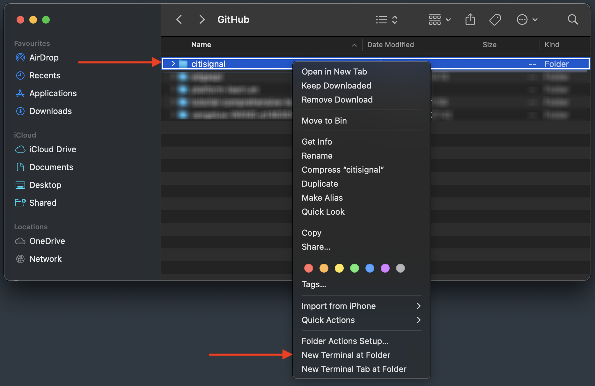
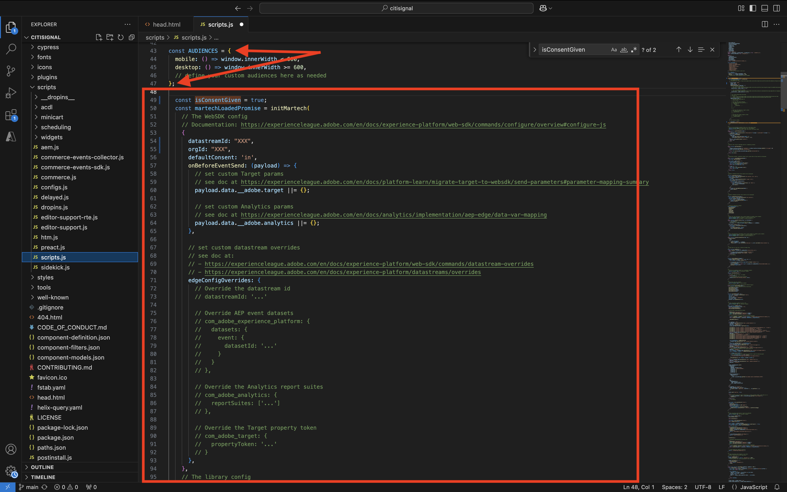
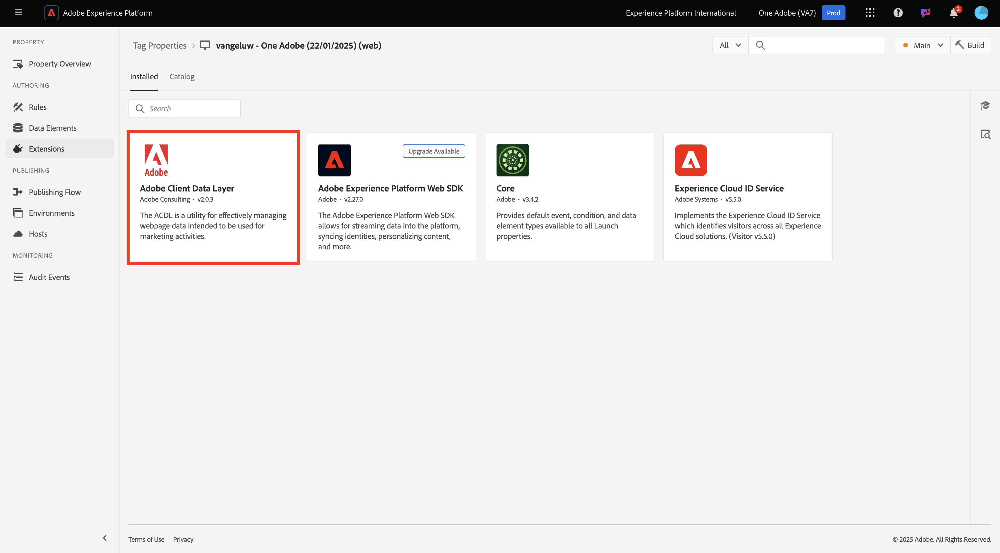

# 1.1.5 AEM Edge Delivery Services MarTech增效模組

AEM MarTech外掛程式可協助您為AEM專案快速設定完整的MarTech棧疊。

>[!NOTE]
>
>此外掛程式目前可透過共同創新專案，與AEM Engineering共同供客戶使用。 您可以在[https://github.com/adobe-rnd/aem-martech](https://github.com/adobe-rnd/aem-martech)找到更多資訊。

## 1.1.5.1將外掛程式新增至您的存放庫

導覽至您用於&#x200B;**citisignal** GitHub存放庫的資料夾。 在資料夾名稱上按一下滑鼠右鍵，然後選取&#x200B;**資料夾**&#x200B;的新終端機。

{zoomable="yes"}

您將會看到此訊息。 貼上下列命令並按&#x200B;**Enter**。

```
git subtree add --squash --prefix plugins/martech https://github.com/adobe-rnd/aem-martech.git main
```

您應該會看到此訊息。

{zoomable="yes"}

導覽至您用於&#x200B;**citisignal** GitHub存放庫的資料夾，開啟&#x200B;**plugins**&#x200B;資料夾。 您現在應該會看到名為&#x200B;**martech**&#x200B;的資料夾。

{zoomable="yes"}

## 1.1.5.2 head.html

在Visual Studio Code中，開啟檔案&#x200B;**head.html**。 複製下列程式碼並將其貼到檔案&#x200B;**head.html**&#x200B;中。

```javascript
<link rel="preload" as="script" crossorigin="anonymous" href="/plugins/martech/src/index.js"/>
<link rel="preload" as="script" crossorigin="anonymous" href="/plugins/martech/src/alloy.min.js"/>
<link rel="preconnect" href="https://edge.adobedc.net"/>
<!-- change to adobedc.demdex.net if you enable third party cookies -->
```

儲存您的變更。

{zoomable="yes"}

## 1.1.5.3 scripts.js

在Visual Studio Code中，移至資料夾&#x200B;**scripts**&#x200B;並開啟檔案&#x200B;**scripts.js**。 複製下列程式碼，並將其貼到檔案&#x200B;**scripts.js**&#x200B;中現有的匯入指令碼下。

```javascript
import {
  initMartech,
  updateUserConsent,
  martechEager,
  martechLazy,
  martechDelayed,
} from '../plugins/martech/src/index.js';
```

儲存您的變更。

{zoomable="yes"}

在Visual Studio Code中，在檔案&#x200B;**scripts.js**&#x200B;中找到下列程式碼：

```javascript
const AUDIENCES = {
  mobile: () => window.innerWidth < 600,
  desktop: () => window.innerWidth >= 600,
  // define your custom audiences here as needed
};
```

在&#x200B;**const AUDIENCES = {...}下；**&#x200B;貼上以下程式碼：

```javascript
  const isConsentGiven = true;
  const martechLoadedPromise = initMartech(
    // The WebSDK config
    // Documentation: https://experienceleague.adobe.com/en/docs/experience-platform/web-sdk/commands/configure/overview#configure-js
    {
      datastreamId: "XXX",
      orgId: "XXX",
      defaultConsent: 'in',
      onBeforeEventSend: (payload) => {
        // set custom Target params 
        // see doc at https://experienceleague.adobe.com/en/docs/platform-learn/migrate-target-to-websdk/send-parameters#parameter-mapping-summary
        payload.data.__adobe.target ||= {};

        // set custom Analytics params
        // see doc at https://experienceleague.adobe.com/en/docs/analytics/implementation/aep-edge/data-var-mapping
        payload.data.__adobe.analytics ||= {};
      },

      // set custom datastream overrides
      // see doc at:
      // - https://experienceleague.adobe.com/en/docs/experience-platform/web-sdk/commands/datastream-overrides
      // - https://experienceleague.adobe.com/en/docs/experience-platform/datastreams/overrides
      edgeConfigOverrides: {
        // Override the datastream id
        // datastreamId: '...'

        // Override AEP event datasets
        // com_adobe_experience_platform: {
        //   datasets: {
        //     event: {
        //       datasetId: '...'
        //     }
        //   }
        // },

        // Override the Analytics report suites
        // com_adobe_analytics: {
        //   reportSuites: ['...']
        // },

        // Override the Target property token
        // com_adobe_target: {
        //   propertyToken: '...'
        // }
      },
    },
    // The library config
    {
      launchUrls: ["XXX"],
      personalization: !!getMetadata('target') && isConsentGiven,
    },
  );
```

{zoomable="yes"}

在上述程式碼中，有一些變數需要由您自己的環境變數取代：

- `datastreamId: "XXX"`
- `orgId: "XXX"`
- `launchUrls: ["XXX"]`

您可以依照下列指示找到這些變數：

### datastreamId

前往[https://platform.adobe.com/](https://platform.adobe.com/)，然後在左側功能表中前往&#x200B;**資料串流**。 確定您是在正確的沙箱，應該是`--aepSandboxName--`。 搜尋在本教學課程的[快速入門]區段中建立的資料流，其名稱應該是`--aepUserLdap-- - One Adobe Datastream`。 按一下&#x200B;**複製**&#x200B;圖示以複製&#x200B;**資料串流ID**，並貼到Visual Studio Code檔案&#x200B;**scripts.js**&#x200B;中，方法是取代`XXX`旁的預留位置值`datastreamId:`。

{zoomable="yes"}

### orgId

前往[https://platform.adobe.com/](https://platform.adobe.com/)，然後在左側功能表中前往&#x200B;**查詢**。 在&#x200B;**認證**&#x200B;下，您會找到&#x200B;**IMS組織ID**，名稱為&#x200B;**使用者名稱**。 按一下&#x200B;**複製**&#x200B;圖示以複製&#x200B;**IMS組織ID**，並貼到Visual Studio Code檔案&#x200B;**scripts.js**&#x200B;中，方式是取代`XXX`旁的預留位置值`orgId:`。

{zoomable="yes"}

### launchUrls

前往[https://platform.adobe.com/](https://platform.adobe.com/)，然後在左側功能表中前往&#x200B;**標籤**。 使用您的LDAP （應為`--aepUserLdap--`）搜尋您的屬性。 開啟您的Web屬性。

{zoomable="yes"}

在左側功能表中，移至&#x200B;**環境**，然後按一下&#x200B;**開發**&#x200B;環境的&#x200B;**安裝**&#x200B;圖示。

{zoomable="yes"}

您會找到所需的URL，但位於HTML `<script></script>`標籤內。 您應該只複製從`https`開始直到`.min.js`的部分。

{zoomable="yes"}

URL看起來像這樣： `https://assets.adobedtm.com/b754ed1bed61/b9f7c7c484de/launch-5fcd90e5b482-development.min.js`。 請確定不會同時複製其他文字，因為這樣會導致錯誤。 在Visual Studio Code中，在檔案&#x200B;**scripts.js**&#x200B;中，取代`XXX`陣列中的預留位置值`launchUrls:`。

您現在擁有所需的三個變數。 您的檔案`scripts.js`現在看起來應該像這樣：

{zoomable="yes"}

接下來，搜尋以尋找此程式碼區塊：

```javascript
const main = doc.querySelector('main');
  if (main) {
    decorateMain(main);
    document.body.classList.add('appear');
    await loadSection(main.querySelector('.section'), waitForFirstImage);	
  }
```

{zoomable="yes"}

以此程式碼區塊取代：

```javascript
const main = doc.querySelector('main');
  if (main) {
    decorateMain(main);
    document.body.classList.add('appear');
    await Promise.all([
      martechLoadedPromise.then(martechEager),
      loadSection(main.querySelector('.section'), waitForFirstImage)
    ]);
  }
```

{zoomable="yes"}

接下來，搜尋並向下捲動至`async function loadLazy(doc) {`。

{zoomable="yes"}

在第`autolinkModals(doc);`行下方，新增這行程式碼：

```javascript
await martechLazy();
```

{zoomable="yes"}

接下來，搜尋並向下捲動至`function loadDelayed() {`行。

{zoomable="yes"}

在第`// load anything that can be postponed to the latest here`行下方新增此程式碼區塊。

```javascript
window.setTimeout(() => {
    martechDelayed();
    return import('./delayed.js');
  }, 3000);
```

{zoomable="yes"}

接下來，搜尋並移至包含`window.adobeDataLayer.push`的行。

{zoomable="yes"}

您會看到物件`pageContext`定義如下。 您現在需要在`pageContext`下新增兩個物件。

```javascript
	pageContext: {
      pageType,
      pageName: document.title,
      eventType: 'visibilityHidden',
      maxXOffset: 0,
      maxYOffset: 0,
      minXOffset: 0,
      minYOffset: 0,
    }
```

這是需要新增的程式碼：

```javascript
	,
    _experienceplatform: {
      identification:{
        core:{
          ecid: sessionStorage.getItem("com.adobe.reactor.dataElements.ECID")
        }
      }
    },
    web: {
      webPageDetails:{
        name: document.title,
        URL: window.location.href
      }
    }
```

**window.adobeDataLayer.push**&#x200B;現在看起來應該像這樣：

```javascript
  window.adobeDataLayer.push({
    pageContext: {
      pageType,
      pageName: document.title,
      eventType: 'visibilityHidden',
      maxXOffset: 0,
      maxYOffset: 0,
      minXOffset: 0,
      minYOffset: 0,
    },
    _experienceplatform: {
      identification:{
        core:{
          ecid: sessionStorage.getItem("com.adobe.reactor.dataElements.ECID")
        }
      }
    },
    web: {
      webPageDetails:{
        name: document.title,
        URL: window.location.href
      }
    }
  });
```

{zoomable="yes"}

您現在已在檔案&#x200B;**scripts.js**&#x200B;中進行所有必要的變更。

開啟GitHub Desktop使用者端並確認變更。

{zoomable="yes"}

按一下&#x200B;**推送來源**，將您的變更推送至您的GitHub存放庫。

{zoomable="yes"}

## 標籤屬性中的1.1.5.4 ACDL延伸

為了讓AEM Edge Delivery Services MarTech外掛程式能夠正常運作，您需要為

移至[https://experience.adobe.com/#/data-collection/](https://experience.adobe.com/#/data-collection/)。 搜尋Web的Tags屬性，然後開啟，其名稱為`--aepUserLdap-- - One Adobe (DD/MM/YYYY)`。

{zoomable="yes"}

移至&#x200B;**延伸模組**，移至&#x200B;**目錄**。 按一下擴充功能&#x200B;**Adobe Client Data Layer**，然後按一下&#x200B;**安裝**。

{zoomable="yes"}

您應該會看到此訊息。 目前不需要變更任何專案。 按一下&#x200B;**儲存至資料庫**。

{zoomable="yes"}

擴充功能會接著新增至您的Tags屬性。

{zoomable="yes"}

移至&#x200B;**發佈流程**&#x200B;並開啟您的&#x200B;**主要**&#x200B;資料庫。 按一下[新增所有變更的資源]**，然後按一下[儲存並建置至開發]****。**

{zoomable="yes"}

您的變更現已部署。

## 1.1.5.5傳送資料至Adobe Experience Platform Edge Network

您現在可以移至`main--citisignal--XXX.aem.page/us/en/`及/或`main--citisignal--XXX.aem.live/us/en/`，在將XXX取代為GitHub使用者帳戶（在此範例中為`woutervangeluwe`）之後，檢視您網站的變更。

在此範例中，完整URL會變成：
`https://main--citisignal--woutervangeluwe.aem.page/us/en/`和/或`https://main--citisignal--woutervangeluwe.aem.live/us/en/`。

>[!NOTE]
>
>請考慮開啟無痕網頁，以確保您是以全新且簡潔的設定檔開始資料收集。 這樣可更輕鬆進行偵錯和疑難排解。

{zoomable="yes"}

在Chrome中，移至&#x200B;**更多工具** > **開發人員工具**，以開啟&#x200B;**開發人員工具**。

{zoomable="yes"}

在&#x200B;**主控台**&#x200B;檢視中，您會看到以`[alloy]`開頭的許多行。 請檢視要求，其中一個要求應該看起來像這樣，並要求內文如影像中所示。

`[alloy] Request 55a9ddbc-0521-4ba3-b527-3da2cb35328a: Sending request.`

開啟裝載並深入研究欄位`events[0].xdm._experienceplatform.identification.core.ecid`，然後複製ECID。

{zoomable="yes"}

## 1.1.5.6在Adobe Experience Platform中檢視客戶設定檔

前往此URL登入Adobe Experience Platform： [https://experience.adobe.com/platform](https://experience.adobe.com/platform)。

登入後，您會登入Adobe Experience Platform的首頁。

{zoomable="yes"}

繼續之前，您必須選取&#x200B;**沙箱**。 要選取的沙箱名為``--aepSandboxName--``。 選取適當的沙箱後，您會看到畫面變更，現在您已進入專屬沙箱。

{zoomable="yes"}

在左側功能表中，移至&#x200B;**客戶** > **設定檔** > **瀏覽**。 選取&#x200B;**ECID**&#x200B;的&#x200B;**身分名稱空間**，然後經過您在上一步中複製的&#x200B;**ECID**。 按一下&#x200B;**檢視**。 之後，您應該會看到設定檔顯示在清單中。 按一下以開啟。

{zoomable="yes"}

然後您會看到&#x200B;**設定檔儀表板**&#x200B;總覽，其中顯示ECID。 接著，移至&#x200B;**活動**。

{zoomable="yes"}

在&#x200B;**Events**&#x200B;底下，您會看到數個體驗事件，包括具有eventType **web.webpagedetails.pageViews**&#x200B;的事件。 按一下&#x200B;**檢視JSON**&#x200B;以檢視所有收集的事件。

{zoomable="yes"}

在&#x200B;**JSON**&#x200B;檢視中，使用eventType **web.webpagedetails.pageViews**&#x200B;驗證事件，以檢視&#x200B;**頁面名稱**&#x200B;和&#x200B;**頁面URL**&#x200B;之類的專案。

{zoomable="yes"}

您現在已經完成此練習。

下一步： [摘要與優點](./summary.md){target="_blank"}

返回[Adobe Experience Manager Cloud Service和Edge Delivery Services](./aemcs.md){target="_blank"}

[返回所有模組](./../../../overview.md){target="_blank"}
