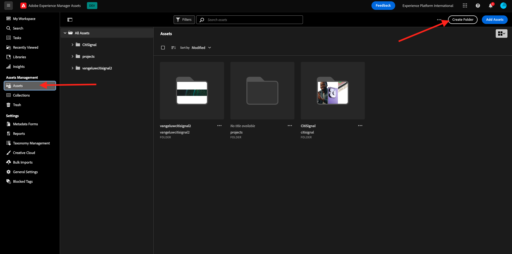
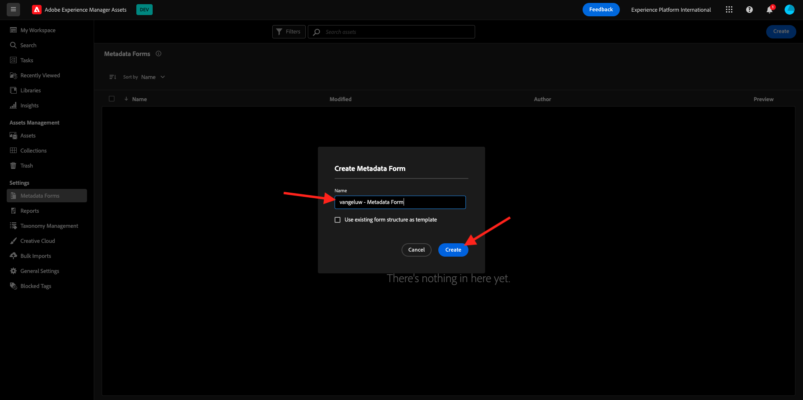
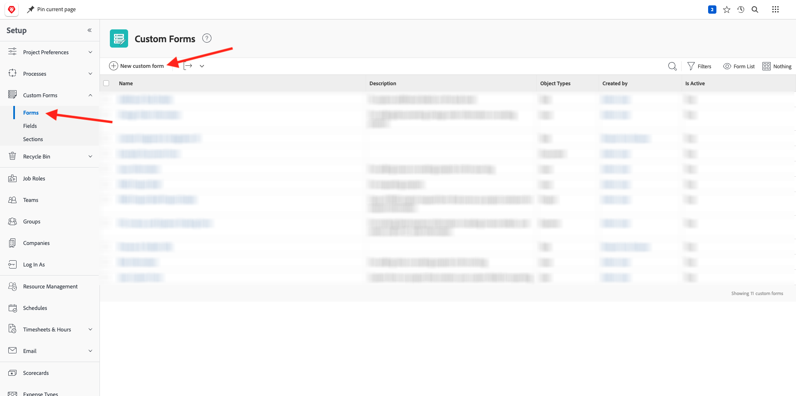
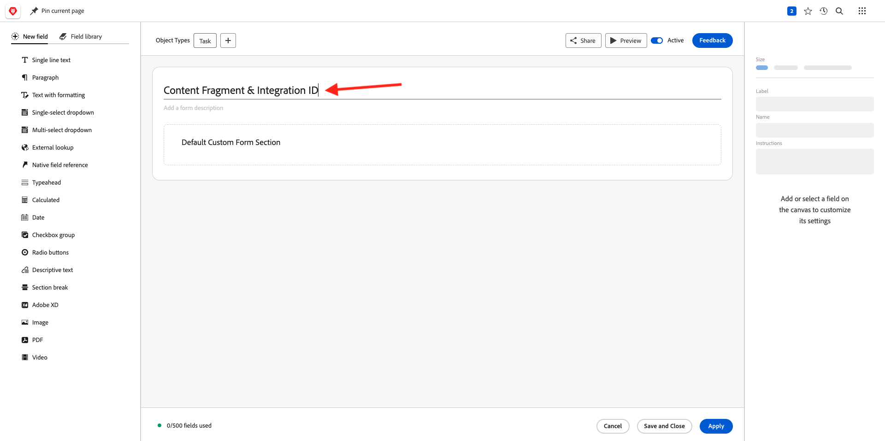

# 1.2.1 Workfront快速入門

前往[https://experienceplatform.my.workfront.com/](https://experienceplatform.my.workfront.com/){target="_blank"}登入Adobe Workfront。

然後您會看到這個訊息。

## 1.2.1.1設定您的AEM Assets整合

按一下9個點&#x200B;**漢堡**&#x200B;圖示，然後選取&#x200B;**設定**。

在左側功能表中，向下捲動至&#x200B;**檔案**，然後按一下&#x200B;**Experience Manager Assets**。

按一下&#x200B;**+新增Experience Manager整合**。

對於整合的名稱，請使用`--aepUserLdap-- - Citi Signal AEM`。

開啟&#x200B;**Experience Manager存放庫**&#x200B;下拉式清單，然後選取您應命名為`--aepUserLdap-- - Citi Signal`的AEM CS執行個體。

在&#x200B;**中繼資料**&#x200B;下，設定下列對應：

| Workfront欄位 | Experience Manager Assets欄位 |
| --------------- | ------------------------------ | 
| **檔案** > **名稱** | **wm：documentName** |
| **專案** > **描述** | **wm：projectDescription** |
| **任務** > **名稱** | **wm：taskName** |
| **工作** > **描述** | **wm：taskDescription** |

啟用&#x200B;**同步處理物件中繼資料**&#x200B;的開關。

按一下&#x200B;**儲存**。

您從Workfront到AEM Assets CS的整合現已設定完成。

## 1.2.1.2使用AEM Assets設定中繼資料整合

接下來，您需要設定AEM Assets，好讓Workfront中資產的中繼資料欄位能與AEM共用。

若要這麼做，請前往[https://experience.adobe.com/](https://experience.adobe.com/)。 按一下&#x200B;**Experience Manager Assets**。

按一下以選取您的AEM Assets環境，應命名為`--aepUserLdap-- - Citi Signal dev`。

您應該會看到此訊息。 在左側功能表中，前往&#x200B;**Assets**&#x200B;並按一下&#x200B;**建立資料夾**。

為資料夾命名`--aepUserLdap-- - Workfront Assets`並按一下&#x200B;**建立**。

接著，前往左側功能表中的&#x200B;**中繼資料Forms**，然後按一下&#x200B;**建立**。

使用名稱`--aepUserLdap-- - Metadata Form`並按一下&#x200B;**建立**。

新增3個新的&#x200B;**單行文字**&#x200B;欄位至表單，並選取第一個欄位。 然後，按一下&#x200B;**中繼資料屬性**&#x200B;欄位旁的&#x200B;**結構描述**&#x200B;圖示。

在搜尋欄位中輸入`wm:project`，然後選取欄位&#x200B;**專案描述**。 按一下&#x200B;**選取**。

將欄位標籤變更為&#x200B;**專案描述**。

接著，選取第2個&#x200B;**單行文字**&#x200B;欄位，然後再次按一下&#x200B;**中繼資料屬性**&#x200B;欄位旁的&#x200B;**結構描述**&#x200B;圖示。

之後您會再次看到此快顯視窗。 在搜尋欄位中輸入`wm:project`，然後選取欄位&#x200B;**專案識別碼**。 按一下&#x200B;**選取**。

將欄位標籤變更為&#x200B;**專案識別碼**。

選取第3個&#x200B;**單行文字**&#x200B;欄位，然後再次按一下&#x200B;**中繼資料屬性**&#x200B;欄位旁的&#x200B;**結構描述**&#x200B;圖示。

之後您會再次看到此快顯視窗。 在搜尋欄位中輸入`wm:project`，然後選取欄位&#x200B;**專案名稱**。 按一下&#x200B;**選取**。

將欄位標籤變更為&#x200B;**專案名稱**。 按一下&#x200B;**儲存**。

將表單上的&#x200B;**索引標簽名稱**&#x200B;變更為`--aepUserLdap-- - Workfront Metadata`。 按一下&#x200B;**儲存**&#x200B;和&#x200B;**關閉**。

您的&#x200B;**中繼資料表單**&#x200B;現已設定。

接下來，您需要將中繼資料表單指派給您之前建立的資料夾。 勾選中繼資料表單的核取方塊，然後按一下&#x200B;**指派至資料夾**。

選取應命名為`--aepUserLdap-- - Workfront Assets`的資料夾。 按一下&#x200B;**指派**。

中繼資料表單現在已成功指派至您的資料夾。

## 1.2.1.2設定您的AEM Sites整合

>[!NOTE]
>
>此外掛程式目前處於&#x200B;**搶先存取**&#x200B;模式，尚未普遍可用。
>
>此外掛程式可能已安裝在您使用的Workfront執行個體中。 如果已安裝，您可以檢閱下列指示，但不需要變更設定中的任何專案。

移至[https://experience.adobe.com/#/@experienceplatform/aem/extension-manager/universal-editor](https://experience.adobe.com/#/@experienceplatform/aem/extension-manager/universal-editor){target="_blank"}。

確定此外掛程式的&#x200B;**切換**&#x200B;設定為&#x200B;**已啟用**。 然後，按一下&#x200B;**齒輪**&#x200B;圖示。

您會看到&#x200B;**擴充功能組態**&#x200B;快顯視窗。 設定下列欄位以使用此外掛程式。

| 索引鍵 | 值 |
| --------------- | ------------------------------ | 
| **`IMS_ENV`** | **PROD** |
| **`WORKFRONT_INSTANCE_URL`** | **https://experienceplatform.my.workfront.com** |
| **`SHOW_CUSTOM_FORMS`** | **&#39;{&quot;previewUrl&quot;： true， &quot;publishUrl&quot;： true}&#39;** |

按一下&#x200B;**儲存**。

返回您的Workfront UI，然後按一下9個點&#x200B;**漢堡**&#x200B;圖示。 選取&#x200B;**安裝程式**。

在左側功能表中，移至&#x200B;**自訂Forms**&#x200B;並選取&#x200B;**表單**。 按一下&#x200B;**+新增自訂表單**。

選取&#x200B;**工作**&#x200B;並按一下&#x200B;**繼續**。

然後您會看到空的自訂表單。 輸入表單名稱`Content Fragment & Integration ID`。

將新的&#x200B;**單行文字**&#x200B;欄位拖放到畫布上。

設定新欄位，如下所示：

- **標籤**： **內容片段**
- **名稱**： **`aem_workfront_integration_content_fragment`**

將新的&#x200B;**單行文字**&#x200B;欄位新增到畫布上，並設定新欄位，如下所示：

- **標籤**： **整合識別碼**
- **名稱**： **`aem_workfront_integration_id`**

按一下&#x200B;**套用**。

您現在需要設定第二個自訂表單。 按一下&#x200B;**+新增自訂表單**。

選取&#x200B;**工作**&#x200B;並按一下&#x200B;**繼續**。

然後您會看到空的自訂表單。 輸入表單名稱`Preview & Publish URL`。

將新的&#x200B;**單行文字**&#x200B;欄位拖放到畫布上。

設定新欄位，如下所示：

- **標籤**： **預覽URL**
- **名稱**： **`aem_workfront_integration_preview_url`**

將新的&#x200B;**單行文字**&#x200B;欄位新增到畫布上，並設定新欄位，如下所示：

- **標籤**： **發佈URL**
- **名稱**： **`aem_workfront_integration_publish_url`**

按一下&#x200B;**套用**。

之後，您應該有2個可用的自訂表格。

下一步： [使用Workfront校訂1.2.2](./ex2.md){target="_blank"}

使用Adobe Workfront](./workfront.md){target="_blank"}返回[工作流程管理

[返回所有模組](./../../../overview.md){target="_blank"}
