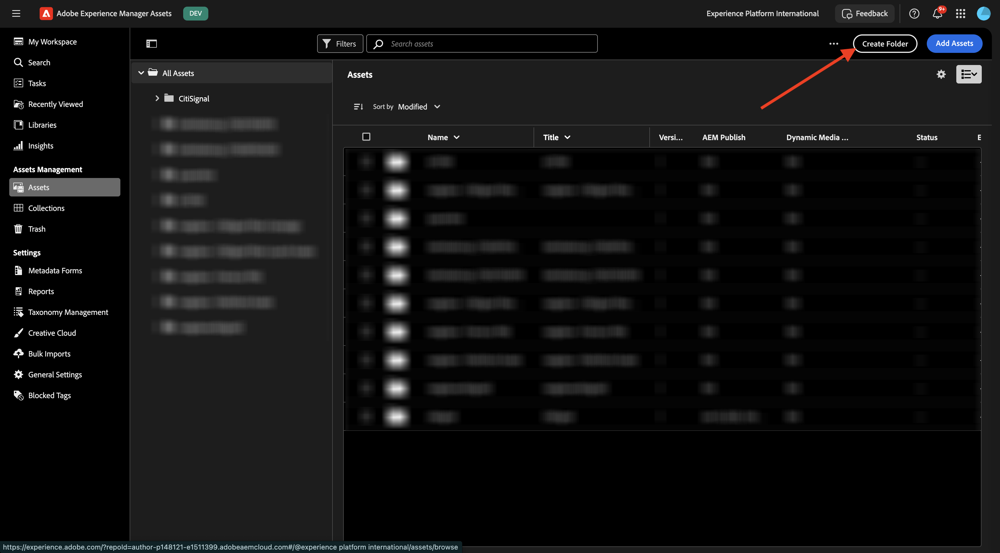
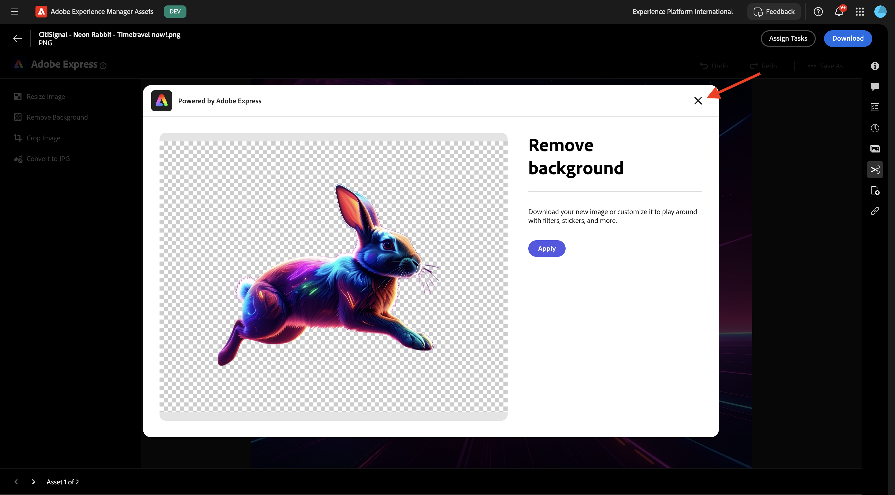

# 1.2.1 AEM Assets快速入門

移至[https://experience.adobe.com/](https://experience.adobe.com/){target="_blank"}。 確定您處於正確的環境，應該命名為`--aepImsOrgName--`。

開啟&#x200B;**Adobe Experience Manager Assets**。

選取指派給您的AEM Assets CS環境。 在此案例中，要選取的環境是`--aepUserLdap-- - CitiSignal dev author`。

您應該會看到此訊息。 移至&#x200B;**Assets**。

您應該使用名為`--aepUserLdap-- - CitiSignal Fiber Campaign`的資料夾。 如果資料夾尚不存在，請按一下[建立資料夾]。**&#x200B;**

輸入資料夾的名稱`--aepUserLdap--`，然後按一下&#x200B;**建立**。

開啟您新建立的資料夾。 在上一個練習中，您建立了2個名為`CitiSignal - Neon Rabbit - Get On Board Now!.png`和`CitiSignal - Neon Rabbit - Timetravel now!.png`的影像。 如果影像尚未上傳，您現在需要將這些影像上傳至此資料夾。

如果您沒有這些檔案，可以[這裡](./images/CitiSignal_Neon_Rabbit.zip){target="_blank"}下載。

按一下&#x200B;**新增Assets**。

選取上述2個影像。 按一下&#x200B;**「開啟」**。

按一下&#x200B;**上傳**。

按一下其中一個影像以選取它。

按一下&#x200B;**詳細資料**。

您現在可以看到特定檔案的可用中繼資料。

在右方功能表中，移至&#x200B;**轉譯**。 接著，您將會看見所選影像的許多預先定義轉譯，且可下載這些轉譯。

在右側功能表中，按一下&#x200B;**剪刀**&#x200B;圖示。 您會找到許多您可使用的編輯動作，由Adobe Express提供技術支援。 按一下&#x200B;**移除背景**。

幾秒鐘後，您應該會看到類似以下內容，包含套用變更或下載新檔案的功能。 關閉快顯。

剪裁&#x200B;**裁切影像**。

您可以測試不同裁切大小的某些變數。

在右方功能表中，移至&#x200B;**工作**。 按一下&#x200B;**指派工作**。

將&#x200B;**工作標題**&#x200B;設定為`Review image & approve`。 指派您自己。 按一下&#x200B;**建立**。

按一下通知上的&#x200B;**檢視**。

或者，重新整理畫面以檢視新建立的任務出現在&#x200B;**相關任務**&#x200B;清單中。 按一下&#x200B;**開啟**&#x200B;按鈕以檢視工作的詳細資訊。

您應該會看到類似這樣的內容。 按一下&#x200B;**核准**。

按一下&#x200B;**核准**&#x200B;以確認。

您的資產現已在AEM Assets中核准。

下一步： [摘要與優點](./summary.md){target="_blank"}

返回[Adobe Experience Manager Assets](./aemassets.md){target="_blank"}

[返回所有模組](./../../../overview.md){target="_blank"}
