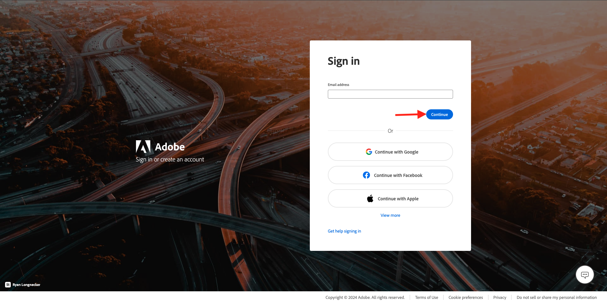

# 2.2.5設定Photoshop + Workfront外掛程式

## 2.2.5.1安裝適用於Photoshop的Workfront外掛程式

若要設定Workfront與Photoshop之間的整合，請在電腦上安裝Creative Cloud應用程式。 使用您的Adobe ID登入。

選取&#x200B;**公司或學校帳戶**&#x200B;並進行驗證。

選取要登入的設定檔。

到時您就會在這裡。 移至&#x200B;**Stock &amp; Marketplace**。

按一下&#x200B;**外掛程式**，然後按一下&#x200B;**管理外掛程式**。 在&#x200B;**Adobe Workfront for Photoshop**&#x200B;卡片上按一下&#x200B;**安裝**。

按一下&#x200B;**「確定」**。

您將會看到此訊息。

## 2.2.5.2在Photoshop中設定外掛程式

開啟Photoshop。 在工作列中，移至&#x200B;**外掛程式** > **Adobe Photoshop的Workfront** >按一下&#x200B;**Adobe Workfront**。

您將會看到此訊息。

輸入Adobe Workfront執行個體的網域。 按一下&#x200B;**登入**。

按一下&#x200B;**允許**。

使用您的&#x200B;**Adobe ID**&#x200B;登入。

選取&#x200B;**公司或學校帳戶**。

按一下&#x200B;**允許存取**。

然後您會看到此確認。

返回Photoshop，您會看到外掛程式現在已可供使用，且顯示您的作用中任務。

使用Adobe Workfront[&#128279;](./workfront.md){target="_blank"}返回工作流程管理

[返回所有模組](./../../../overview.md){target="_blank"}
