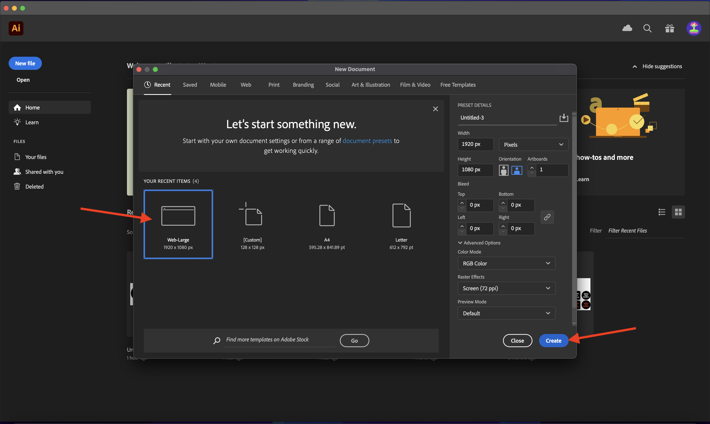
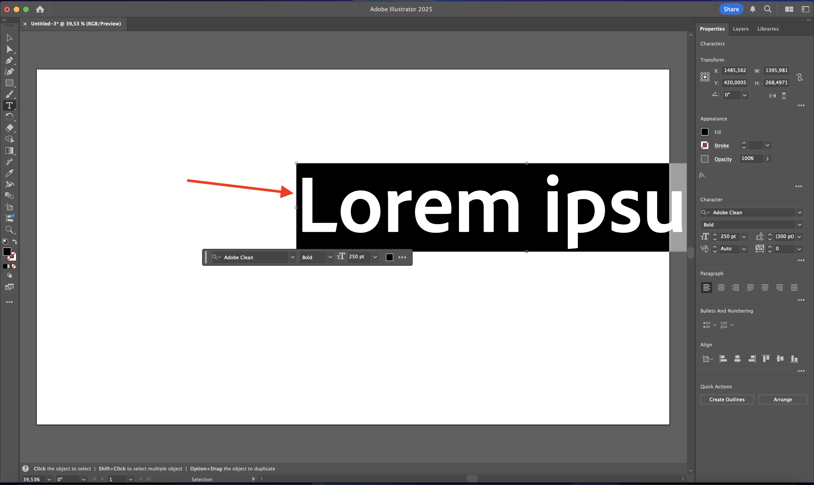
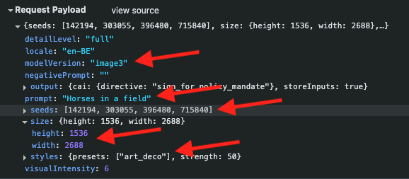

# 1.1.1 Firefly Services快速入門

Firefly Services包含&#x200B;**Firefly API**、**Lightroom API**、**Photoshop API**、**InDesign API**&#x200B;和&#x200B;**內容標籤API**。

這套API結合了Adobe創意工具(如Photoshop和Lightroom)的強大功能與尖端AI/ML功能，如內容標籤、產生式填色、文字轉影像等。

有了Firefly Services，您不僅要建立，還要自動化、擴展內容生產，並利用最新的AI/ML技術來強化工作流程。

在本練習中，您將瞭解如何使用Postman和Adobe I/O來使用各種Adobe Firefly Services API。

本練習特別針對Firefly API，例如：

- **Firefly產生影像API**：此API用於使用Firefly的模型產生影像
- **Firefly產生類似影像API**：此API用於產生與既有影像類似的影像
- **Firefly展開影像API**：此API用於將現有影像展開至更大的外觀比例/大小
- **Firefly填滿影像API**：此API會根據Firefly根據您的提示產生的影像，填滿現有影像的區域。 這是使用定義需要填滿區域的遮色片來達成。
- **Firefly產生物件複合API**：此API可讓您自行提供輸入影像，然後將影像與Firefly產生的影像結合，以建立影像複合或場景。
- **Firefly自訂模型API**：此API可讓您使用自己的Firefly自訂模型，根據您的Firefly自訂模型產生新影像

## 1.1.1.1必要條件

在繼續此練習之前，您必須先完成[您的Adobe I/O專案](./../../../modules/getting-started/gettingstarted/ex6.md)的設定，而且您還需要設定應用程式以與API互動，例如[Postman](./../../../modules/getting-started/gettingstarted/ex7.md)或[PostBuster](./../../../modules/getting-started/gettingstarted/ex8.md)。

## 1.1.1.2 API基本知識

有多種型別的API請求：

- **GET**：嘗試從API端點擷取資訊時（例如取得狀態報告），就會使用此專案
- **POST**：當有新工作需要完成時(例如讓Adobe Firefly Services產生新影像)，就會使用此專案
- **PUT**：這可用來完全更新現有的資料
- **PATCH**：這是用來選擇性更新現有資料
- **DELETE**：用於刪除資料

使用API時，您也會注意到各種API端點傳回回應代碼。

您可能會預期5種不同的回應類別：

- **1xx資訊回應**：已收到要求，正在繼續處理
- **2xx成功**：已成功接收、理解及接受要求
- **3xx重新導向**：需要進一步的動作才能完成要求
- **4xx使用者端錯誤**：要求包含錯誤的語法或無法完成
- **5xx伺服器錯誤**：伺服器無法完成明顯有效的要求

以下是您可能會預期的常見回應程式碼範例：

- **200 OK**：很好，您的要求已成功完成
- **201已建立**：很好，舉例來說，您的影像已建立
- **202 Accepted**：很好，您的要求已接受且將進行處理
- **401未獲授權**：這不是好事，可能是您的存取權杖無效
- **403已禁止**：這不是好事，您可能缺乏嘗試執行動作所需的許可權
- **404找不到**：這不是好事，您嘗試存取的URL可能不存在
- **429太多要求**：這不是好事，您可能已在短時間內傳送許多要求。 請稍後再試。

## 1.1.1.3探索firefly.adobe.com — 階段1

讓我們開始探索Adobe Firefly Services。 若想探索，您先來看一下CitiSignal影像產生範例。 CitiSignal設計團隊想要產生CitiSignal品牌名稱的霓虹版本。 他們想要使用Adobe Firefly Services來做這件事。

要達到這個目標，首先需要的是CitiSignal品牌名稱的黑白版本，看起來像這樣：


### 1.1.1.3.1建立您的組合參考影像

您可以使用[此範例影像](./images/CitiSignal.jpg)，也可以建立自己的文字來進行實驗。 請依照下列Adobe Illustrator中的步驟，建立您自己的影像檔案。 如果您選擇使用預先定義的影像，請略過以下章節並移至步驟&#x200B;**1.1.1.2。2直接產生影像**。

開啟&#x200B;**Adobe Illustrator**。 按一下&#x200B;**新增檔案**。


選取&#x200B;**網頁大1920 x 1080px**。 按一下&#x200B;**建立**。



然後您應該擁有此專案。 按一下&#x200B;**T**&#x200B;文字圖示。


然後您應該擁有此專案。


將字型型別變更為所選擇的字型，在此案例中，字型型別為&#x200B;**Adobe清除粗體**。


將字型大小變更為選擇的大小，在此案例中為&#x200B;**250 pt**。


然後您應該擁有此專案。



視需要變更文字，在此案例中為&#x200B;**CitiSignal**。


將檔案中的文字置中。


移至&#x200B;**檔案>匯出>儲存以供網頁使用（舊版）**


然後您應該擁有此專案。 按一下&#x200B;**儲存**。


提供檔案名稱，並將其儲存至案頭。 按一下&#x200B;**儲存**。


### 1.1.1.3.2產生您的影像

移至[https://firefly.adobe.com](https://firefly.adobe.com)。 按一下&#x200B;**設定檔**&#x200B;圖示，並確定您已登入右側的&#x200B;**帳戶**，應為`--aepImsOrgName--`。 如有需要，請按一下&#x200B;**切換設定檔**&#x200B;以切換至該帳戶。


輸入提示`neon light lettering on a brick wall of a night club`。 按一下&#x200B;**產生**。


之後，您應該會有類似的專案。 這些影像還無法使用。 在&#x200B;**構成**&#x200B;下，按一下&#x200B;**上傳影像**。


選取您先前建立的影像，在此案例中為&#x200B;**CitiSignal.jpg**。 按一下&#x200B;**開啟**，然後按一下&#x200B;**產生**。


之後，您應該會有類似的專案。 構成參考的應用程式還不完善。 若要變更，請將&#x200B;**強度**&#x200B;滑桿變更為最大值。 再按一下&#x200B;**產生**。


您現在有數個影像顯示CitiSignal品牌名稱的新版本，您可以使用這些影像進一步反複運算。


您現在已學會使用Firefly在幾分鐘內解決設計問題。

## 1.1.1.4探索firefly.adobe.com — 階段2

移至[https://firefly.adobe.com/generate/image](https://firefly.adobe.com/generate/image)。 您應該會看到此訊息。 按一下&#x200B;**模型**&#x200B;下拉式清單。 您會發現有3個可用版本的Adobe Firefly Services：

- Firefly Image 3
- Firefly Image 4
- Firefly Image 4 Ultra


>[!NOTE]
>
>Firefly Image 3和Image 4可供所有使用Adobe Firefly Services的人使用，而Firefly Image 4 Ultra需要Firefly Pro授權。

按一下以選取此練習的&#x200B;**Firefly影像3**。


輸入提示`Horses in a field`並按一下&#x200B;**產生**。


之後，您應該會看到類似以下內容。


接下來，在您的瀏覽器中開啟&#x200B;**開發人員工具**。


您應該會看到此訊息。 移至&#x200B;**網路**&#x200B;標籤。 接著，再按一下[產生&#x200B;****]。


輸入搜尋字詞&#x200B;**generate-async**。 您應該會看到名稱為&#x200B;**generate-async**&#x200B;的請求。 選取該專案，然後移至&#x200B;**裝載**，您將在其中檢視要求的詳細資料。


您在此看到的要求是傳送至Firefly Services伺服器端後端的要求。 它包含數個重要引數：

- **prompt**：這是您的提示，要求Firefly應該產生何種影像

- **種子**：在此要求中，種子是以隨機方式產生。 每當Firefly產生影像時，預設會透過挑選稱為種子的隨機數字來開始流程。 這個隨機數字有助於讓每個影像具有唯一性，如果您想要產生多種影像，這是很不錯的做法。 不過，您有時可能會想要產生多個請求中彼此相似的影像。 例如，當Firefly產生您要使用Firefly的其他選項（例如樣式預設集、參考影像等）修改的影像時，請在未來的HTTP要求中使用該影像的種子，以限制未來影像的隨機性，並接觸您想要的影像。


請再次檢視UI。 將&#x200B;**外觀比例**&#x200B;變更為&#x200B;**寬熒幕(16:9)**。


向下捲動至&#x200B;**效果**，移至&#x200B;**佈景主題**&#x200B;並選取&#x200B;**裝飾藝術效果**&#x200B;等效果。


請確定&#x200B;**開發人員工具**&#x200B;仍在您的瀏覽器中開啟。 然後，按一下[產生] **並檢查正在傳送的網路要求。**


當您檢查網路請求的詳細資訊時，您現在會看到以下內容：

- 與先前的要求相比，**prompt**&#x200B;未變更
- 與先前的請求相比，**種子**&#x200B;已變更
- 根據&#x200B;**外觀比例**&#x200B;的變更，**大小**&#x200B;已變更。
- 已新增&#x200B;**樣式**，並參考您選取的&#x200B;**art_deco**&#x200B;效果



若要進行下一個練習，您需要使用&#x200B;**seed**&#x200B;數字之一。 寫下選擇的種子編號。

>[!NOTE]
>
>種子數是按一下&#x200B;**[產生]**&#x200B;時選擇的隨機數。 如果您想要在多個&#x200B;**產生**&#x200B;要求中對您產生的影像有一致的外觀和感覺，請務必記住並指定在未來的要求中所選擇的&#x200B;**種子編號**。

在下一個練習中，您將使用Firefly Services完成類似工作，但接著使用API而非UI。 在此範例中，第一個影像的種子編號為&#x200B;**142194**，該影像有2匹馬互相注視，兩匹馬的頭朝彼此。

## 1.1.1.5 Adobe I/O - access_token

在&#x200B;**Adobe IO - OAuth**&#x200B;集合中，選取名為&#x200B;**POST - Get Access Token**&#x200B;的要求，並選取&#x200B;**傳送**。 回應應包含新的&#x200B;**access_token**。


## 1.1.1.6 Firefly Services API，文字2影像，影像3

現在您已具備有效且新的access_token，接下來就可以將您的第一個要求傳送至Firefly Services API了。

您在這裡使用的要求是&#x200B;**同步**&#x200B;要求，會在幾秒內提供包含要求的影像的回應。

>[!NOTE]
>
>隨著Firefly Image 4和Image 4 Ultra的發行，將取代同步要求，而採用非同步要求。 在本教學課程的下方，您將找到有關非同步請求的練習。

從&#x200B;**FF - Firefly Services Tech Insiders**&#x200B;集合中選取名為&#x200B;**POST - Firefly - T2I V3**&#x200B;的請求。 移至&#x200B;**Headers**&#x200B;並驗證索引鍵/值配對組合。

| 索引鍵 | 值 |
|:-------------:| :---------------:| 
| `x-api-key` | `{{API_KEY}}` |
| `Authorization` | `Bearer {{ACCESS_TOKEN}}` |

此請求中的這兩個值都參照預先定義的環境變數。 `{{API_KEY}}`參考您Adobe I/O專案的欄位&#x200B;**使用者端識別碼**。 在本教學課程的&#x200B;**快速入門**&#x200B;章節中，您已在Postman中完成設定。

欄位&#x200B;**授權**&#x200B;的值是位元特殊： `Bearer {{ACCESS_TOKEN}}`。 它包含您在上一步中產生的&#x200B;**存取權杖**&#x200B;的參考。 當您在&#x200B;**Adobe IO - OAuth**&#x200B;集合中收到使用要求&#x200B;**POST — 取得存取權杖**&#x200B;的&#x200B;**存取權杖**&#x200B;時，Postman中執行的指令碼會將欄位&#x200B;**access_token**&#x200B;儲存為環境變數，現在該指令碼會在要求&#x200B;**POST - Firefly - T2I V3**&#x200B;中參考。 請注意&#x200B;**Bearer**&#x200B;這個字的特定增加以及`{{ACCESS_TOKEN}}`之前的空格。 不記名文字會區分大小寫，而且需要空格。 如果未正確處理此專案，Adobe I/O將會傳回&#x200B;**401 Unauthorized**&#x200B;錯誤，因為它無法正確處理您的&#x200B;**存取Token**。


接著，前往&#x200B;**內文**&#x200B;並驗證提示。 按一下&#x200B;**傳送**。


從回應中複製（或按一下）影像URL，並在網頁瀏覽器中開啟以檢視影像。


您應該會看到描繪`horses in a field`的美麗影像。


在您的請求&#x200B;**POST - Firefly - T2I V3**&#x200B;的&#x200B;**內文**&#x200B;中，在欄位`"promptBiasingLocaleCode": "en-US"`下新增下列內容，並以Firefly Services UI隨機使用的其中一個種子數字取代變數`XXX`。 在此範例中，**seed**&#x200B;編號為`142194`。

```json
,
  "seeds": [
    XXX
  ]
```

按一下&#x200B;**傳送**。 之後，您會收到Firefly Services產生新影像的回應。 開啟影像進行檢視。


之後，您應該會根據使用的&#x200B;**seed**，看到稍有差異的新影像。 種子`142194`有2匹馬相互注視，頭彼此對視。


接著，在您的要求&#x200B;**POST - Firefly - T2I V3**&#x200B;的&#x200B;**內文**&#x200B;中，將下列&#x200B;**樣式**&#x200B;物件貼到&#x200B;**seed**&#x200B;物件下。 這會將產生的影像樣式變更為&#x200B;**art_deco**。

```json
,
  "contentClass": "art",
  "styles": {
    "presets": [
      "art_deco"
    ],
    "strength": 50
  }
```

然後您應該擁有此專案。 按一下&#x200B;**傳送**。


按一下影像URL以開啟。


您的影像現在已變更了一點。 套用樣式預設集時，種子影像的套用方式不再與之前相同。 整體而言，使用產生式AI，很難保證輸入引數的相同組合會產生相同的影像。


從您請求的&#x200B;**Body**&#x200B;移除&#x200B;**seed**&#x200B;物件的程式碼。 按一下&#x200B;**傳送**，然後按一下您從回應中取得的影像URL。

```json
,
  "seeds": [
    XXX
  ]
```


您的影像現在已再次變更。


## 1.1.1.7 Firefly Services API，一般擴展

從&#x200B;**FF - Firefly Services技術人員**&#x200B;集合中選取名為&#x200B;**POST - Firefly - Gen Expand**&#x200B;的請求，並移至請求的&#x200B;**Body**。

- **大小**：輸入所需的解析度。 此處輸入的值應大於影像的原始大小，且不能大於3999。
- **image.source.url**：此欄位需要需要需要展開影像的連結。 在此範例中，變數是用來參照上一個練習中產生的影像。

- **水準對齊**：接受的值為： `"center"`、`"left`、`"right"`。
- **垂直對齊**：接受的值為： `"center"`、`"top`、`"bottom"`。


按一下回應中的影像URL。


您現在會看到上一個練習產生的影像現在已擴展到3999x3999的解析度。


當您變更位置對齊方式時，輸出也會稍有不同。 在此範例中，位置已變更為左下&#x200B;**的**。 按一下&#x200B;**傳送**，然後按一下以開啟產生的影像URL。


然後您應該會看到原始影像已用於不同的位置，這會影響整個影像。


## 1.1.1.8 Firefly Services API，文字2影像，影像4與影像4 Ultra

在最新版本的Firefly Image Model 4中，已提供幾項改善功能：

- Firefly Image Model 4提供2K解析度輸出，並具備增強的定義和細節。
- Firefly Image Model 4在文字轉譯、人類、動物和架構方面提供顯著改善。
- Firefly Image Model 4秉承Adobe對IP友好、商業上安全的創作AI的承諾。

Firefly Image Model 4為您提供卓越的人類、動物和詳細場景影像，您可以使用Image Model 4 Ultra產生具有超逼真的人際互動、建築元素和複雜風景的影像&#x200B;。

### 1.1.1.8.1 image4_standard

從&#x200B;**FF - Firefly Services Tech Insiders**&#x200B;集合中選取名為&#x200B;**POST - Firefly - T2I V4**&#x200B;的請求，並移至請求的&#x200B;**Headers**。

您會發現要求的URL與&#x200B;**Firefly Services API，文字2影像，影像3**&#x200B;要求不同，為&#x200B;**https://firefly-api.adobe.io/v3/images/generate**。 此URL指向&#x200B;**https://firefly-api.adobe.io/v3/images/generate-async**。 在URL中新增&#x200B;**-async**&#x200B;表示您使用的是非同步端點。

在&#x200B;**Header**&#x200B;變數中，您會發現名為&#x200B;**x-model-version**&#x200B;的新變數。 這是與Firefly Image 4和Image 4 Ultra互動時的必要標頭。 若要在產生影像時使用Firefly Image 4或Image 4 Ultra，則標頭的值應設為`image4_standard`或`image4_ultra`。 在此範例中，您將使用`image4_standard`。

如果您未將&#x200B;**x-model-version**&#x200B;設定為`image4_standard`或`image4_ultra`，則Firefly Services目前將預設為使用`image3`。


前往請求的&#x200B;**內文**。 您應該會在內文中看到，正在要求4個影像變化。 提示與之前相同，且仍在要求產生欄位&#x200B;**中的**&#x200B;馬。 按一下&#x200B;**傳送**


然後您會立即收到回應。 與您使用的先前同步請求相反，此回應不包含產生影像的影像URL。 它包含您啟動之工作的狀態報告的URL，而且包含另一個可讓您取消執行中工作的URL。


若要檢視執行中工作的狀態報告，請從&#x200B;**FF - Firefly Services技術內部人士**&#x200B;集合中選取名為&#x200B;**GET - Firefly — 取得狀態報告**&#x200B;的請求。 按一下以開啟它，然後按一下[傳送]。****


之後，您將會看到剛啟動之影像產生工作的狀態報表。 驗證欄位&#x200B;**狀態**，因為它可能設定為&#x200B;**正在執行**，這表示工作尚未完成。 在此範例中，工作狀態設為&#x200B;**succeeded**，表示已產生您要求的影像。


在回應中向下捲動一點，您應該就會看到Adobe Firefly Services傳回的共4種影像變化。 按一下（或複製）其中一個影像的URL，然後在瀏覽器中開啟。


然後您應該會在欄位&#x200B;**中看到**&#x200B;匹馬的超真實影像。


### 1.1.1.8.2 image4_ultra

從&#x200B;**FF - Firefly Services技術人員**&#x200B;集合返回名為&#x200B;**POST - Firefly - T2I V4**&#x200B;的請求，並轉到請求的&#x200B;**Headers**。

將變數&#x200B;**x-model-version**&#x200B;變更為`image4_ultra`。 在此範例中，您將使用`image4_standard`。


前往請求的&#x200B;**內文**。 在內文中，將影像變化數變更為1，就像Firefly Image 4 Ultra一樣，一次只能產生1個影像。 提示與之前相同，且仍在要求產生欄位&#x200B;**中的**&#x200B;馬。 按一下&#x200B;**傳送**


回應中再次包含您啟動之工作的狀態報告URL，而且包含另一個可讓您取消執行中工作的URL。


若要檢視執行中工作的狀態報告，請從&#x200B;**FF - Firefly Services技術內部人士**&#x200B;集合中選取名為&#x200B;**GET - Firefly — 取得狀態報告**&#x200B;的請求。 按一下以開啟它，然後按一下[傳送]。****


之後，您將會看到剛啟動之影像產生工作的狀態報表。 驗證欄位&#x200B;**狀態**，因為它可能設定為&#x200B;**正在執行**，這表示工作尚未完成。 在此範例中，工作狀態設為&#x200B;**succeeded**，表示已產生您要求的影像。


然後您應該會在欄位&#x200B;**中看到**&#x200B;匹馬的超真實影像。


### 負面提示

如果您想要求Firefly不要在即將產生的影像中包含某些專案，您可以在使用API時包含欄位`negativePrompt` （此選專案前未公開給UI）。 例如，如果您不想在執行欄位&#x200B;**中的提示**&#x200B;馬時包含任何花，則您可以在API要求的&#x200B;**Body**&#x200B;中指定此專案：

```
"negativePrompt": "no flowers",
```

從&#x200B;**FF - Firefly Services技術人員**&#x200B;集合移至請求&#x200B;**POST - Firefly - T2I V4**，並移至請求的&#x200B;**Body**。 將以上文字貼到要求內文中。 按一下&#x200B;**傳送**。


您應該會看到此訊息。


若要檢視執行中工作的狀態報告，請從&#x200B;**FF - Firefly Services技術內部人士**&#x200B;集合中選取名為&#x200B;**GET - Firefly — 取得狀態報告**&#x200B;的請求。 按一下以開啟它，然後按一下[傳送]。**** 選取所產生影像的URL，然後在瀏覽器中開啟。


然後您會看到產生的影像，該影像不應包含任何花。


## 後續步驟

移至[使用Microsoft Azure和預先簽署的URL最佳化您的Firefly程式](./ex2.md){target="_blank"}

返回[Adobe Firefly Services概觀](./firefly-services.md){target="_blank"}

返回[所有模組](./../../../overview.md){target="_blank"}