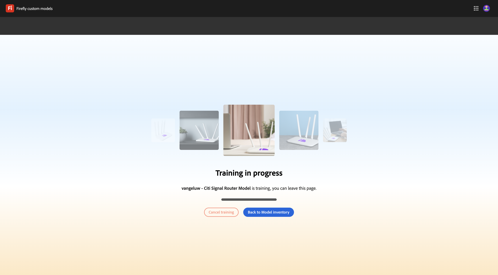
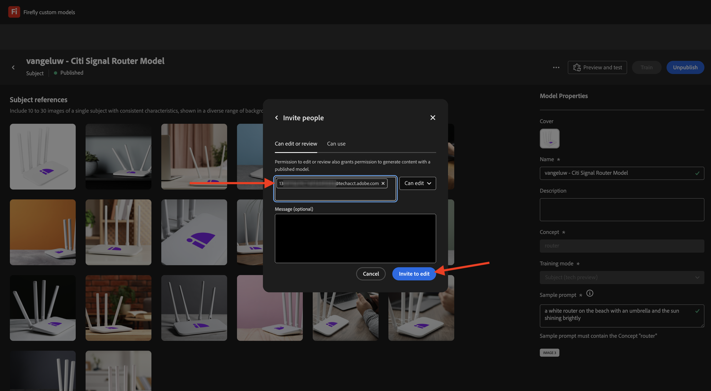
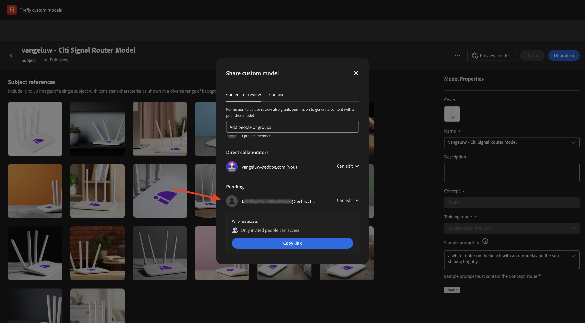

# 1.1.4 Firefly自訂模型API

## 1.1.4.1設定您的自訂模型

移至[https://firefly.adobe.com/](https://firefly.adobe.com/)。 按一下&#x200B;**自訂模型**。

{zoomable="yes"}

您可能會看到此訊息。 如果是，請按一下[同意]****&#x200B;繼續。

{zoomable="yes"}

您應該會看到此訊息。 按一下&#x200B;**訓練模型**。

{zoomable="yes"}

設定下列欄位：

- **名稱**：使用`--aepUserLdap-- - Citi Signal Router Model`
- **訓練模式**：選取&#x200B;**主題（技術預覽）**
- **概念**：輸入`router`
- **儲存至**：開啟下拉式清單，然後按一下&#x200B;**+建立新專案**

{zoomable="yes"}

為新專案命名： `--aepUserLdap-- - Custom Models`。 按一下&#x200B;**建立**。

{zoomable="yes"}

您應該會看到此訊息。 按一下&#x200B;**建立**。

{zoomable="yes"}

您現在需要提供參考影像，以訓練自訂模型。 按一下&#x200B;**從您的電腦選取影像**。

{zoomable="yes"}

在[這裡](https://tech-insiders.s3.us-west-2.amazonaws.com/CitiSignal_router.zip)下載參考影像。 將下載檔案解壓縮，這會為您提供此資訊。

{zoomable="yes"}

導覽至包含下載影像檔案的資料夾。 全部選取並按一下&#x200B;**開啟**。

{zoomable="yes"}

然後您會看到正在載入影像。

{zoomable="yes"}

幾分鐘後，您的影像就會正確載入。 您可能會看到部分影像發生錯誤，這是因為影像的標題尚未產生或長度不足。 檢閱每個有錯誤的影像，並輸入符合要求的註解及描述影像。

{zoomable="yes"}

一旦所有影像都有符合要求的註解，您仍需要提供範例提示。 輸入任何使用&#39;router&#39;字樣的提示。 完成後，您可以開始訓練您的模型。 按一下&#x200B;**訓練**。

{zoomable="yes"}

您將會看到此訊息。 訓練您的模型可能需要20到30分鐘或更長的時間。

{zoomable="yes"}

20-30分鐘後，您的模型現在已訓練完畢，可以發佈。 按一下&#x200B;**發佈**。

{zoomable="yes"}

再按一下&#x200B;**發佈**。

{zoomable="yes"}

關閉&#x200B;**共用自訂模型**&#x200B;快顯視窗。

{zoomable="yes"}

## 1.1.4.2在UI中使用您的自訂模型

移至[https://firefly.adobe.com/cme/train](https://firefly.adobe.com/cme/train)。 按一下「自訂模型」以開啟。

{zoomable="yes"}

按一下&#x200B;**預覽和測試**。

{zoomable="yes"}

之後，您將會看到在執行之前輸入的範例提示。

{zoomable="yes"}

## 1.1.4.3啟用Firefly服務自訂模型API的自訂模型

您的自訂模型培訓完成後，也可以透過API使用。 在練習1.1.1中，您已設定您的Adobe I/O專案，以透過API與Firefly服務互動。

移至[https://firefly.adobe.com/cme/train](https://firefly.adobe.com/cme/train)。 按一下「自訂模型」以開啟。

{zoomable="yes"}

按一下3個點&#x200B;**...**，然後按一下&#x200B;**共用**。

{zoomable="yes"}

若要存取Firefly自訂模型，該自訂模型必須與Adobe I/O專案的&#x200B;**技術帳戶電子郵件**&#x200B;共用。

若要擷取您的&#x200B;**技術帳戶電子郵件**，請移至[https://developer.adobe.com/console/projects](https://developer.adobe.com/console/projects)。 按一下以開啟名為`--aepUserLdap-- One Adobe tutorial`的專案。

{zoomable="yes"}

按一下&#x200B;**OAuth伺服器對伺服器**。

{zoomable="yes"}

按一下以複製您的&#x200B;**技術帳戶電子郵件**。

{zoomable="yes"}

貼上您的&#x200B;**技術帳戶電子郵件**&#x200B;並按一下&#x200B;**邀請編輯**。

{zoomable="yes"}

**技術帳戶電子郵件**&#x200B;現在應該能夠存取自訂模型。

{zoomable="yes"}

## 1.1.4.4與Firefly服務自訂模型API互動

在練習1.1.1開始使用Firefly Services時，您將此檔案： [postman-ff.zip](./../../../assets/postman/postman-ff.zip)下載到您的本機案頭，然後將該集合匯入Postman。

開啟Postman並前往資料夾&#x200B;**FF — 自訂模型API**。

{zoomable="yes"}

開啟要求&#x200B;**1。 FF - getCustomModels**&#x200B;並按一下&#x200B;**傳送**。

{zoomable="yes"}

您應該會看到您之前建立的自訂模型（名為`--aepUserLdap-- - Citi Signal Router Model`）做為回應的一部分。 欄位&#x200B;**assetId**&#x200B;是您的自訂模型的唯一識別碼，將在下一個請求中參照。

{zoomable="yes"}

開啟要求&#x200B;**2。 非同步**&#x200B;產生影像。 在此範例中，您將要求根據自訂模型產生2個變數。 請隨時更新此例中為`a white router on a volcano in Africa`的提示。

按一下&#x200B;**傳送**。

{zoomable="yes"}

回應包含欄位&#x200B;**jobId**。 產生這2個影像的工作正在執行，您可以使用下一個請求來檢查狀態。

{zoomable="yes"}

開啟要求&#x200B;**3。 取得CM狀態**&#x200B;並按一下&#x200B;**傳送**。 之後，您應該會看到狀態已設為「執行中」。

{zoomable="yes"}

幾分鐘後，再按一下請求&#x200B;**3的**&#x200B;傳送&#x200B;**。 取得CM狀態**。 之後，您應該會看到狀態變更為&#x200B;**succeeded**，而且輸出中應該會看到兩個影像URL。 按一下以開啟兩個檔案。

{zoomable="yes"}

這是此範例產生的第一個影像。

{zoomable="yes"}

這是此範例產生的第二個影像。

{zoomable="yes"}

您現在已經完成此練習。

## 後續步驟

移至[摘要與優點](./summary.md){target="_blank"}

返回[使用Photoshop API](./ex3.md){target="_blank"}

返回[Adobe Firefly服務總覽](./firefly-services.md){target="_blank"}
