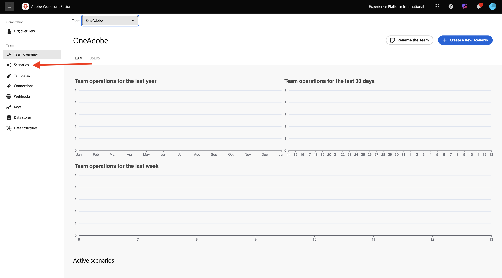
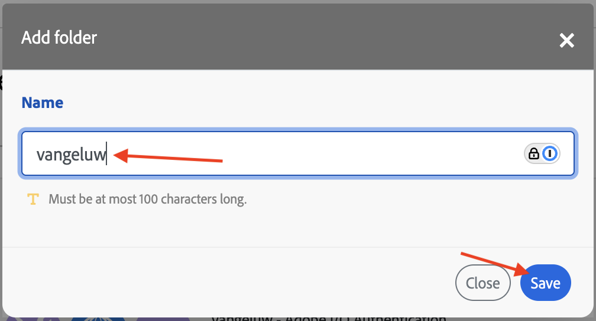
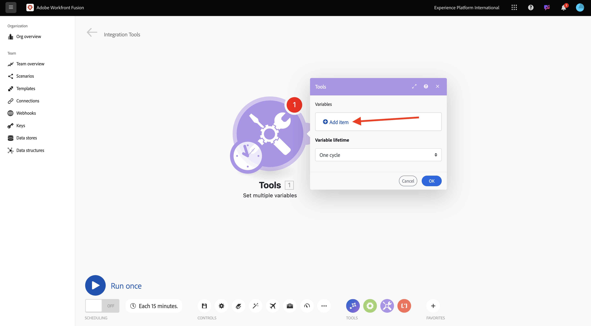
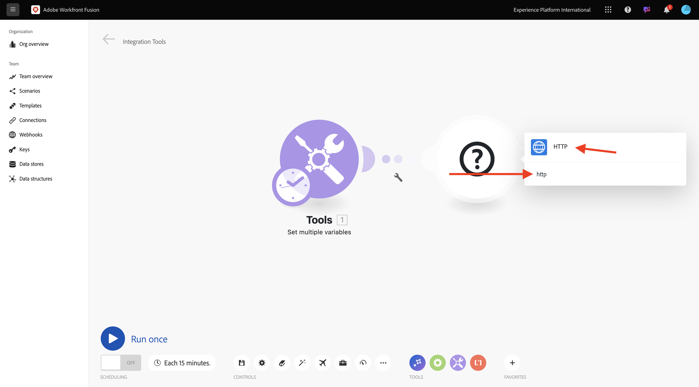
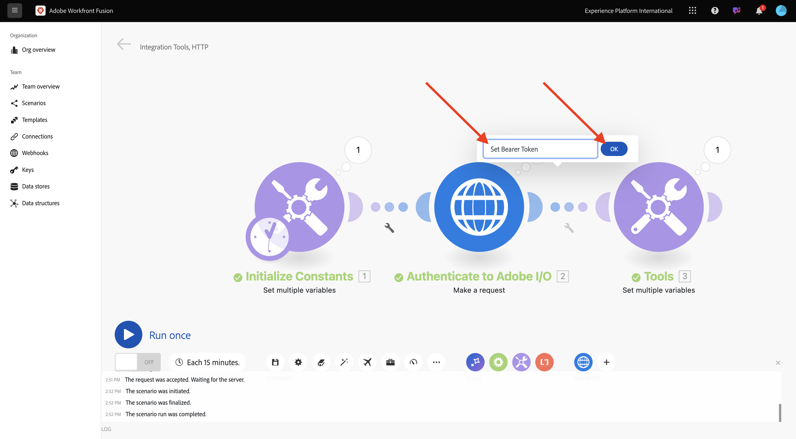

# 1.2.1 Workfront Fusion快速入門

瞭解如何使用 Workfront Fusion 和 Adobe Systems I/O 來查詢 Adobe Systems Firefly Services API。

## 1.2.1.1 建立新藍本

轉到 [https://experience.adobe.com/](https://experience.adobe.com/)。 開啟 **Workfront Fusion**。

轉到 **“方案**”。

按一下&#x200B;**+圖示**，為您的工作建立新資料夾。

為資料夾命名`--aepUserLdap--`並選取&#x200B;**儲存**。

選取您的資料夾，然後選取&#x200B;**建立新情境**。

出現空白情境，請選取&#x200B;**工具**&#x200B;並選取&#x200B;**設定多個變數**。

將&#x200B;**時鐘**&#x200B;圖示移至新新增的&#x200B;**設定多個變數**。

您的屏幕應該看起來按讚這樣。

右鍵按下問號並選擇 **刪除模組**。

接著，用滑鼠右鍵按一下&#x200B;**設定多個變數**&#x200B;並選取&#x200B;**設定**。

## 1.2.1.2 配置Adobe Systems I/O 身份驗證

現在，您需要配置針對Adobe Systems I/O 進行身份驗證所需的變數。在上一練習中，您創建了一個 Adobe Systems I/O 專案。 現在需要在 Workfront Fusion 中定義該 Adobe Systems I/O 專案的變數。

您必須定義下列變數：

| 索引鍵 | 值 |
|:-------------:| :---------------:| 
| `CONST_client_id` | 您的Adobe I/O專案使用者端ID |
| `CONST_client_secret` | 您的Adobe I/O專案使用者端密碼 |
| `CONST_scope` | 您的Adobe I/O專案範圍 |

前往[https://developer.adobe.com/console/projects](https://developer.adobe.com/console/projects)並開啟名為`--aepUserLdap-- One Adobe tutorial`的Adobe I/O專案，以尋找這些變數。

在您的專案中，選取&#x200B;**OAuth Serverto-Server**&#x200B;以檢視上述金鑰的值。

使用上述索引鍵和值，您可以設定&#x200B;**設定多個變數**&#x200B;物件。 選取&#x200B;**新增專案**。

輸入&#x200B;**變數名稱**： **CONST_client_id**&#x200B;及其&#x200B;**變數值**，請選取&#x200B;**新增**。

選取&#x200B;**新增專案**。

輸入&#x200B;**變數名稱**： **CONST_client_secret**&#x200B;及其&#x200B;**變數值**，請選取&#x200B;**新增**。

選擇添加 **項**。

輸入&#x200B;**變數名稱**： **CONST_scope**&#x200B;及其&#x200B;**變數值**，請選取&#x200B;**新增**。

選取&#x200B;**確定**。

將游標暫留在&#x200B;**設定多個變數**&#x200B;上，並選取大&#x200B;**+**&#x200B;圖示以新增另一個模組。

您的熒幕應如下所示。

在搜尋列中輸入&#x200B;**http**。 選取&#x200B;**HTTP**&#x200B;以開啟。

選擇「 **製作請求**」。

| 索引鍵 | 值 |
|:-------------:| :---------------:| 
| `URL` | `https://ims-na1.adobelogin.com/ims/token/v3` |
| `Method` | `POST` |
| `Body Type` | `x-www-form-urlencoded` |

選擇添加 **項**。

為以下每個值新增專案：

| 索引鍵 | 值 |
|:-------------:| :---------------:| 
| `client_id` | 您預先定義的 變數 `CONST_client_id` |
| `client_secret` | 您預先定義的`CONST_client_secret`變數 |
| `scope` | 您預先定義的`CONST_scope`變數 |
| `grant_type` | `client_credentials` |

`client_id`的設定：

`client_secret`的設定。

`scope`的設定。

`grant_type`的設定。

向下捲動並勾選&#x200B;**剖析回應**&#x200B;的方塊。 選擇確定&#x200B;****。

您的屏幕應該看起來按讚這樣。 選取&#x200B;**執行一次**。

案例執行後，您的畫面應如下所示：

**選擇「設置多個變數**」**物件上的問號**&#x200B;圖示，查看該物件運行時發生的情況。

**選擇 HTTP**- 建立請求&#x200B;**物件上的問號**&#x200B;圖示以查看該物件運行時發生的情況。在 **輸出**&#x200B;中，查看 **I/O 返回Adobe Systems access_token** 。

將游標暫留在&#x200B;**HTTP上 — 提出要求**&#x200B;並選取&#x200B;**+**&#x200B;圖示以新增另一個模組。

在搜尋列中搜尋`tools`。 選取&#x200B;**工具**。

選擇設置 **多個變數**。

選擇添加 **項**。

將&#x200B;**變數名稱**&#x200B;設為`bearer_token`。 選取`access_token`作為動態&#x200B;**變數值**。 選取&#x200B;**新增**。

您的屏幕應該看起來按讚這樣。 選擇確定&#x200B;****。

再次選擇「 **運行** 」。

方案運行后，選擇&#x200B;**最後一個**「設置多個變數&#x200B;**」物件上的問號**&#x200B;圖示。您應該會看到access_token儲存在變數`bearer_token`中。

接著，用滑鼠右鍵按一下第一個物件&#x200B;**設定多個值**&#x200B;並選取&#x200B;**重新命名**。

將名稱設定為&#x200B;**初始化常數**。 選取&#x200B;**確定**。

將第二個物件重新命名為&#x200B;**驗證Adobe I/O**。 選取&#x200B;**確定**。

將第三個物件重新命名為&#x200B;**設定持有人權杖**。 選取&#x200B;**確定**。

您的螢幕應按讚如下所示：

下一個，將方案 `--aepUSerLdap-- - Adobe I/O Authentication`的名稱更改為 。

選取「**儲存**」。

## 後續步驟

前往在 [Workfront Fusion 中使用 Adobe Systems API](./ex2.md){target="_blank"}

[返回 Creative 工作流程自動化與 Workfront 融合](./automation.md){target="_blank"}

返回 [「所有模組」](./../../../overview.md){target="_blank"}
