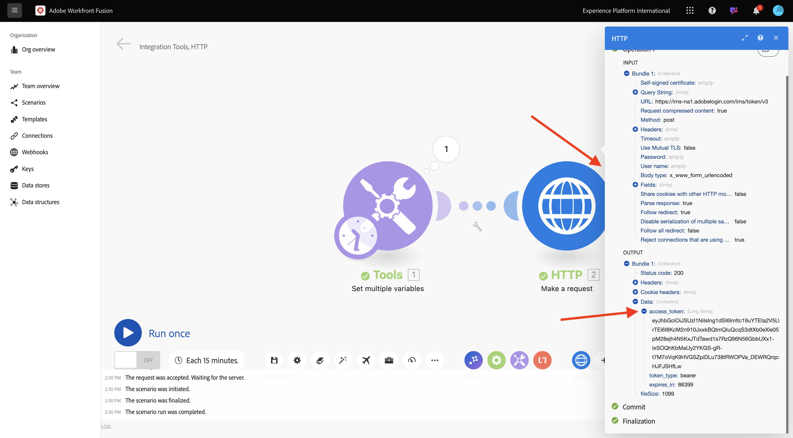
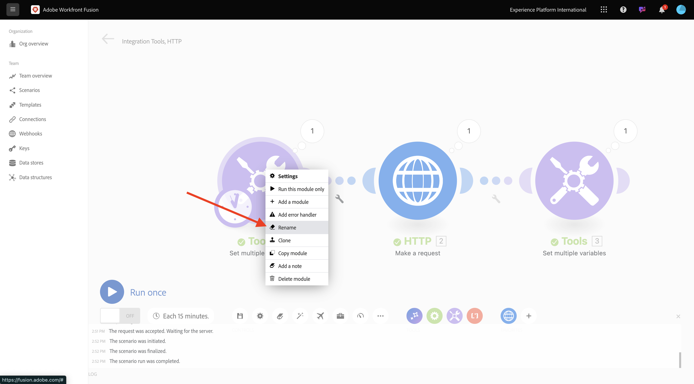

# 1.2.1 Workfront Fusion快速入門

瞭解如何使用Workfront Fusion和Adobe I/O來查詢Adobe Firefly Services API。

## 1.2.1.1建立新情境

移至[https://experience.adobe.com/](https://experience.adobe.com/){target="_blank"}。 開啟&#x200B;**Workfront Fusion**。

移至&#x200B;**案例**。

按一下&#x200B;**+圖示**，為您的工作建立新資料夾。

為資料夾命名`--aepUserLdap--`並選取&#x200B;**儲存**。

選取您的資料夾，然後選取&#x200B;**建立新情境**。

出現空白情境，請選取&#x200B;**工具**&#x200B;並選取&#x200B;**設定多個變數**。

將&#x200B;**時鐘**&#x200B;圖示移至新新增的&#x200B;**設定多個變數**。

您的熒幕應如下所示。

以滑鼠右鍵按一下問號，然後選取&#x200B;**刪除模組**。

接著，用滑鼠右鍵按一下&#x200B;**設定多個變數**&#x200B;並選取&#x200B;**設定**。

## 1.2.1.2設定Adobe I/O驗證

您現在需要設定根據Adobe I/O進行驗證所需的變數。在上一個練習中，您已建立Adobe I/O專案。 該Adobe I/O專案的變數現在需要在Workfront Fusion中定義。

需要定義下列變數：

| 索引鍵 | 值 |
|:-------------:| :---------------:| 
| `CONST_client_id` | 您的Adobe I/O專案使用者端ID |
| `CONST_client_secret` | 您的Adobe I/O專案使用者端密碼 |
| `CONST_scope` | 您的Adobe I/O專案範圍 |

前往[https://developer.adobe.com/console/projects](https://developer.adobe.com/console/projects){target="_blank"}並開啟名為`--aepUserLdap-- One Adobe tutorial`的Adobe I/O專案，以尋找這些變數。

在您的專案中，選取&#x200B;**OAuth Serverto-Server**&#x200B;以檢視上述金鑰的值。

使用上述索引鍵和值，您可以設定&#x200B;**設定多個變數**&#x200B;物件。 選取&#x200B;**新增專案**。

輸入&#x200B;**變數名稱**： **CONST_client_id**&#x200B;及其&#x200B;**變數值**，請選取&#x200B;**新增**。

選取&#x200B;**新增專案**。

輸入&#x200B;**變數名稱**： **CONST_client_secret**&#x200B;及其&#x200B;**變數值**，請選取&#x200B;**新增**。

選取&#x200B;**新增專案**。

輸入&#x200B;**變數名稱**： **CONST_scope**&#x200B;及其&#x200B;**變數值**，請選取&#x200B;**新增**。

選取&#x200B;**確定**。

將游標暫留在&#x200B;**設定多個變數**&#x200B;上，並選取大&#x200B;**+**&#x200B;圖示以新增另一個模組。

您的熒幕應如下所示。

在搜尋列中輸入&#x200B;**http**。 選取&#x200B;**HTTP**&#x200B;以開啟。

選取&#x200B;**提出要求**。

| 索引鍵 | 值 |
|:-------------:| :---------------:| 
| `URL` | `https://ims-na1.adobelogin.com/ims/token/v3` |
| `Method` | `POST` |
| `Body Type` | `x-www-form-urlencoded` |

選取&#x200B;**新增專案**。

為每個以下值新增專案：

| 索引鍵 | 值 |
|:-------------:| :---------------:| 
| `client_id` | 您預先定義的`CONST_client_id`變數 |
| `client_secret` | 您預先定義的`CONST_client_secret`變數 |
| `scope` | 您預先定義的`CONST_scope`變數 |
| `grant_type` | `client_credentials` |

`client_id`的設定：

`client_secret`的設定。

`scope`的設定。

`grant_type`的設定。

向下捲動並勾選&#x200B;**剖析回應**&#x200B;的方塊。 選取&#x200B;**確定**。

您的熒幕應如下所示。 選取&#x200B;**執行一次**。

案例執行後，您的畫面應如下所示：

選取&#x200B;**設定多個變數**&#x200B;物件上的&#x200B;**問號**&#x200B;圖示，檢視該物件執行時發生的情況。

在&#x200B;**HTTP上選取**&#x200B;問號&#x200B;**圖示 — 提出要求**&#x200B;物件以檢視當該物件執行時發生的情況。 在&#x200B;**OUTPUT**&#x200B;中，檢視Adobe I/O傳回的&#x200B;**access_token**。

將游標暫留在&#x200B;**HTTP上 — 提出要求**&#x200B;並選取&#x200B;**+**&#x200B;圖示以新增另一個模組。

在搜尋列中搜尋`tools`。 選取&#x200B;**工具**。

選取&#x200B;**設定多個變數**。

選取&#x200B;**新增專案**。

將&#x200B;**變數名稱**&#x200B;設為`bearer_token`。 選取`access_token`作為動態&#x200B;**變數值**。 選取&#x200B;**新增**。

您的熒幕應如下所示。 選取&#x200B;**確定**。

再次選取&#x200B;**執行一次**。

案例執行後，在最後&#x200B;**設定多個變數**&#x200B;物件上選取&#x200B;**問號**&#x200B;圖示。 您應該會看到access_token儲存在變數`bearer_token`中。

接著，用滑鼠右鍵按一下第一個物件&#x200B;**設定多個值**&#x200B;並選取&#x200B;**重新命名**。

將名稱設定為&#x200B;**初始化常數**。 選取&#x200B;**確定**。

將第二個物件重新命名為&#x200B;**驗證Adobe I/O**。 選取&#x200B;**確定**。

將第三個物件重新命名為&#x200B;**設定持有人權杖**。 選取&#x200B;**確定**。

您的畫面應如下所示：

接下來，將您的情境名稱變更為`--aepUserLdap-- - Adobe I/O Authentication`。

選取「**儲存**」。

## 後續步驟

移至[在Workfront Fusion中使用Adobe API](./ex2.md){target="_blank"}

返回[使用Workfront Fusion進行Creative工作流程自動化](./automation.md){target="_blank"}

返回[所有模組](./../../../overview.md){target="_blank"}
