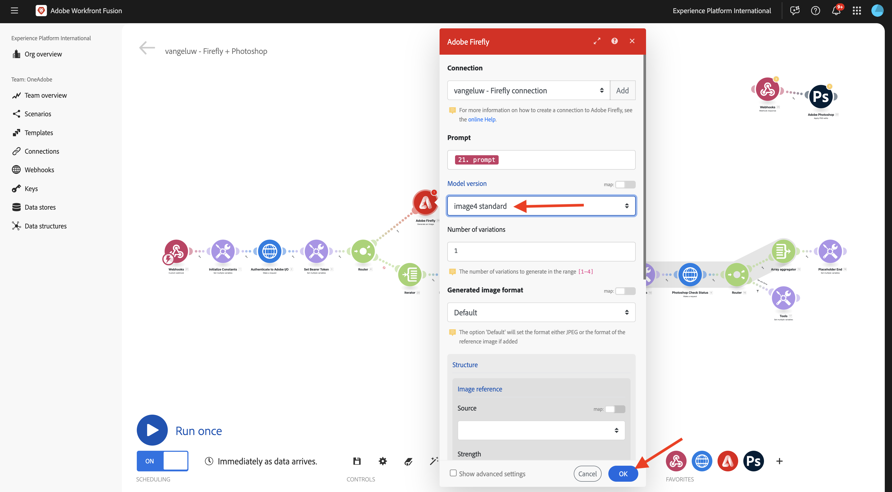
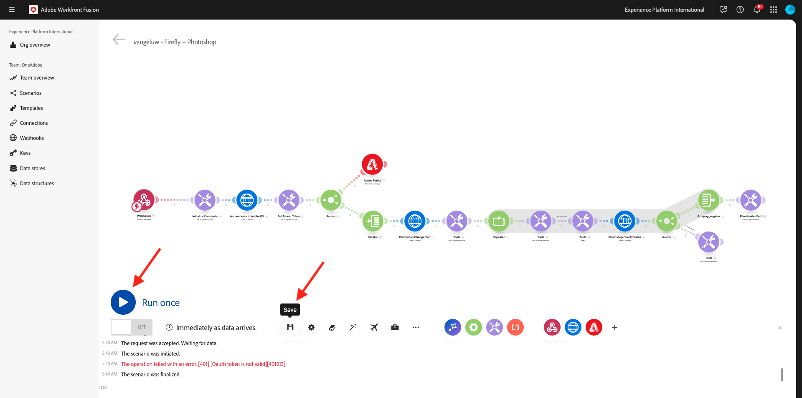

# 1.2.4使用聯結器自動化

現在，您將開始在Photoshop的Workfront Fusion中使用現成的聯結器，並將Firefly Text-2-Image請求和Photoshop請求連線到一個案例中。

## 1.2.4.1更新變數

繼續聯結器設定前，必須將下列變數新增至&#x200B;**初始化常數**&#x200B;模組。

- `AZURE_STORAGE_URL`
- `AZURE_STORAGE_CONTAINER`
- `AZURE_STORAGE_SAS_READ`
- `AZURE_STORAGE_SAS_WRITE`

返回您的第一個節點，選取&#x200B;**初始化常數**，然後為每個變數選擇&#x200B;**新增專案**。


| 索引鍵 | 範例值 |
|:-------------:| :---------------:| 
| `AZURE_STORAGE_URL` | `https://vangeluw.blob.core.windows.net` |
| `AZURE_STORAGE_CONTAINER` | `vangeluw` |
| `AZURE_STORAGE_SAS_READ` | `?sv=2023-01-03&st=2025-01-13T07%3A36%3A35Z&se=2026-01-14T07%3A36%3A00Z&sr=c&sp=rl&sig=4r%2FcSJLlt%2BSt9HdFdN0VzWURxRK6UqhB8TEvbWkmAag%3D` |
| `AZURE_STORAGE_SAS_WRITE` | `?sv=2023-01-03&st=2025-01-13T17%3A21%3A09Z&se=2025-01-14T17%3A21%3A09Z&sr=c&sp=racwl&sig=FD4m0YyyqUj%2B5T8YyTFJDi55RiTDC9xKtLTgW0CShps%3D` |

您可以返回Postman並開啟&#x200B;**環境變數**&#x200B;來尋找變數。


將這些值複製至Workfront Fusion，並為這4個變數分別新增專案。

您的熒幕應如下所示。 選取&#x200B;**確定**。


## 1.2.4.2使用webhook啟用您的情境

到目前為止，您已手動執行您的案例以進行測試。 現在來使用webhook更新您的情境，以便從外部環境啟動它。

選取&#x200B;**+**，搜尋&#x200B;**webhook**，然後選取&#x200B;**Webhook**。


選取&#x200B;**自訂webhook**。


將&#x200B;**自訂webhook**&#x200B;模組拖曳到情境的開頭。 接著，選取&#x200B;**時鐘**&#x200B;圖示，並將其拖曳至&#x200B;**自訂webhook**&#x200B;模組。


您應該會看到此訊息。 接著，將第一個模組上的紅點拖曳至第二個模組的紫點。


您應該會看到此訊息。 新增，按一下&#x200B;**自訂webhook**&#x200B;模組。


按一下&#x200B;**新增**。


將&#x200B;**Webhook名稱**&#x200B;設定為`--aepUserLdap-- - Firefly + Photoshop Webhook`。 按一下&#x200B;**儲存**。


您的webhook URL現已可用。 按一下&#x200B;**將地址複製到剪貼簿**&#x200B;以複製URL。


開啟Postman，並在集合&#x200B;**FF - Firefly Services技術業內人士**&#x200B;中新增資料夾。


為資料夾命名`--aepUserLdap-- - Workfront Fusion`。


在您剛建立的資料夾中，選取3個點&#x200B;**...**，然後選取&#x200B;**新增要求**。


將&#x200B;**方法型別**&#x200B;設定為&#x200B;**POST**，並將webhook的URL貼到位址列。


您必須傳送自訂內文，才能從外部來源將變數元素提供給Workfront Fusion案例。

移至&#x200B;**內文**&#x200B;並選取&#x200B;**原始**。


將下列文字貼入要求內文。 選取&#x200B;**傳送**。

```json
{
    "psdTemplate": "citisignal-fiber.psd",
    "xlsFile": "placeholder",
    "prompt":"misty meadows",
    "cta": "Buy this now!",
    "button": "Click here to buy!"
}
```


回到Workfront Fusion後，您的自訂webhook上會顯示一則訊息，指出： **已成功判定**。


## 1.2.4.3 Adobe Firefly聯結器

按一下&#x200B;**+**&#x200B;圖示以新增模組。


輸入搜尋字詞`Adobe Firefly`，然後選取&#x200B;**Adobe Firefly**。


選取&#x200B;**產生影像**。


按一下&#x200B;**Adobe Firefly**&#x200B;模組以開啟，然後按一下&#x200B;**新增**&#x200B;以建立新連線。


填寫下列欄位：

- **連線名稱**：使用`--aepUserLdap-- - Firefly connection`。
- **環境**：使用&#x200B;**生產**。
- **型別**：使用&#x200B;**個人帳戶**。
- **使用者端識別碼**：從您名為&#x200B;**的Adobe I/O專案複製**&#x200B;使用者端識別碼`--aepUserLdap-- - One Adobe tutorial`。
- **使用者端密碼**：從您名為&#x200B;**的Adobe I/O專案複製**&#x200B;使用者端密碼`--aepUserLdap-- - One Adobe tutorial`。

您可以在&#x200B;**這裡**&#x200B;找到您Adobe I/O專案的&#x200B;**使用者端識別碼**&#x200B;和[使用者端密碼](https://developer.adobe.com/console/projects.){target="_blank"}。


填寫完所有欄位後，請按一下[繼續]。**** 之後，您的連線將會自動驗證。


接著，選取傳入的&#x200B;**自訂webhook**&#x200B;提供給情境的變數&#x200B;**提示**。


將&#x200B;**模型版本** **提示**&#x200B;設定為&#x200B;**image4 standard**。 按一下&#x200B;**「確定」**。



按一下[儲存]儲存變更，然後按一下[執行一次]以測試設定。********



移至Postman，驗證要求中的提示，然後按一下[傳送]。****


按一下「傳送」後，請返回Workfront Fusion並按一下&#x200B;**Adobe Firefly**&#x200B;模組上的泡泡圖示以驗證詳細資料。


移至&#x200B;**OUTPUT**&#x200B;至&#x200B;**詳細資料** > **URL**，以尋找&#x200B;**Adobe Firefly**&#x200B;所產生之影像的URl。


複製URL並在瀏覽器中將其貼上。 您現在應該會看到代表您從Postman請求傳入的提示的影像，在此案例中為&#x200B;**霧狀草甸**。


## 1.2.4.2變更PSD檔案的背景

您現在將更新情境，使用更多現成可用的聯結器使其更聰明。 您也會將輸出從Firefly連線至Photoshop，以便PSD檔案的背景影像能使用Firefly「產生影像」動作的輸出動態變更。

您應該會看到此訊息。 接著，將游標暫留在&#x200B;**Adobe Firefly**&#x200B;模組上，然後按一下&#x200B;**+**&#x200B;圖示。


在搜尋功能表中輸入`Photoshop`，然後按一下&#x200B;**Adobe Photoshop**&#x200B;動作。


選取&#x200B;**套用PSD編輯**。


您應該會看到此訊息。 按一下&#x200B;**[新增**]，新增與Adobe Photoshop的連線。


依照以下方式設定您的連線：

- 連線型別：選取&#x200B;**Adobe Photoshop （伺服器對伺服器）**
- 連線名稱：輸入`--aepUserLdap-- - Adobe I/O`
- 使用者端ID：貼上您的使用者端ID
- 使用者端密碼：貼上您的使用者端密碼

按一下&#x200B;**繼續**。


若要尋找您的&#x200B;**使用者端識別碼**&#x200B;和&#x200B;**使用者端密碼**，請移至[https://developer.adobe.com/console/home](https://developer.adobe.com/console/home){target="_blank"}並開啟您名為`--aepUserLdap-- One Adobe tutorial`的Adobe I/O專案。 移至&#x200B;**OAuth伺服器對伺服器**&#x200B;以尋找您的使用者端ID和使用者端密碼。 複製這些值，並貼到Workfront Fusion中的連線設定中。


按一下&#x200B;**繼續**&#x200B;後，驗證您的認證時，將會短暫顯示快顯視窗。 完成後，您應該會看到此內容。


您現在必須輸入您希望Fusion使用的PSD檔案位置。 對於&#x200B;**儲存體**，請選取&#x200B;**Azure**，對於&#x200B;**檔案位置**，請輸入`{{1.AZURE_STORAGE_URL}}/{{1.AZURE_STORAGE_CONTAINER}}/{{1.AZURE_STORAGE_SAS_READ}}`。 將游標放在第二個`/`旁邊。 接著，檢視可用的變數，然後向下捲動以尋找變數&#x200B;**psdTemplate**。 按一下變數&#x200B;**psdTemplate**&#x200B;以選取它。


您應該會看到此訊息。


一直向下捲動直到看到&#x200B;**圖層**。 按一下&#x200B;**新增專案**。


您應該會看到此訊息。 您現在需要在Photoshop PSD範本中輸入檔案背景所用的圖層名稱。


在&#x200B;**citisignal-fiber.psd**&#x200B;檔案中，您會找到用於背景的圖層。 在此範例中，該圖層名為&#x200B;**2048x2048-background**。


在Workfront Fusion對話方塊中貼上名稱&#x200B;**2048x2048-background**。


向下捲動，直到看到&#x200B;**輸入**&#x200B;為止。 您現在需要定義需要插入背景圖層的內容。 在此情況下，您需要選取包含動態產生影像的&#x200B;**Adobe Firefly**&#x200B;模組的輸出。

針對&#x200B;**儲存體**，選取&#x200B;**外部**。 針對&#x200B;**檔案位置**，您必須從`{{XX.details[].url}}`Adobe Firefly **模組的輸出複製並貼上變數**，但您需要以&#x200B;**Adobe Firefly**&#x200B;模組的序號取代變數中的&#x200B;**XX**，在此範例中為&#x200B;**5**。


接著，向下捲動直到看到&#x200B;**編輯**&#x200B;為止。 將&#x200B;**Edit**&#x200B;設定為&#x200B;**是**&#x200B;並將&#x200B;**Type**&#x200B;設定為&#x200B;**Layer**。 按一下&#x200B;**新增**。


您應該會看到此訊息。 接下來，您需要定義動作的輸出。 按一下&#x200B;**輸出**&#x200B;下的&#x200B;**新增專案**。


選取&#x200B;**儲存體**&#x200B;的&#x200B;**Azure**，將此`{{1.AZURE_STORAGE_URL}}/{{1.AZURE_STORAGE_CONTAINER}}/citisignal-fiber-replacedbg.psd{{1.AZURE_STORAGE_SAS_WRITE}}`貼到&#x200B;**檔案位置**&#x200B;下，並選取&#x200B;**型別**&#x200B;下的&#x200B;**vnd.adobe.photoshop**。 按一下以啟用&#x200B;**顯示進階設定**。


在&#x200B;**進階設定**&#x200B;下，選取&#x200B;**是**以覆寫相同名稱的檔案。
按一下**新增**。


然後您應該擁有此專案。 按一下&#x200B;**「確定」**。


按一下[儲存]儲存變更，然後按一下[執行一次]以測試設定。********


移至Postman，驗證要求中的提示，然後按一下[傳送]。****


您應該會看到此訊息。 按一下&#x200B;**Adobe Photoshop — 套用PSD編輯**&#x200B;模組上的泡泡。


您現在可以看到新的PSD檔案已成功產生，並儲存在您的Microsoft Azure儲存體帳戶中。


## 1.2.4.3變更PSD檔案的文字圖層

接著，將游標暫留在&#x200B;**Adobe Photoshop — 套用PSD編輯**&#x200B;模組上，然後按一下&#x200B;**+**&#x200B;圖示。


選取&#x200B;**Adobe Photoshop**。


選取&#x200B;**編輯文字圖層**。


您應該會看到此訊息。 首先，選取您先前已設定的Adobe Photoshop連線，名稱應為`--aepUserLdap-- Adobe I/O`。


針對&#x200B;**輸入檔案**，選取&#x200B;**輸入檔案儲存體**&#x200B;的&#x200B;**Azure**，並確定選取先前要求的輸出，**Adobe Photoshop — 套用PSD編輯**，您可將其定義如下： ``{{XX.data[].`_links`.renditions[].href}}`` (將XX取代為先前模組Adobe Photoshop — 套用PSD編輯的序號)。

接著，按一下「**圖層**」下的「**+新增專案**」以開始新增需要更新的文字圖層。


需進行2項變更，檔案&#x200B;**citisignal-fiber.psd**&#x200B;中的CTA文字和按鈕文字需要更新。

若要尋找圖層名稱，請開啟檔案&#x200B;**citisignal-fiber.psd**。 在檔案中，您會發現包含call to action的圖層名稱為&#x200B;**2048x2048-cta**。


在檔案&#x200B;**citisignal-fiber.psd**&#x200B;中，您也會注意到包含call to action的圖層名為&#x200B;**2048x2048-button-text**。


您必須先設定層&#x200B;**2048x2048-cta**&#x200B;需要進行的變更。 在對話方塊的&#x200B;**Name**&#x200B;下輸入名稱&#x200B;**2048x2048-cta**。


向下捲動，直到您看到&#x200B;**文字** > **內容**&#x200B;為止。 從Webhook承載中選取變數&#x200B;**cta**。 按一下&#x200B;**新增**。


您應該會看到此訊息。 按一下「**圖層**」下的「新增&#x200B;**+專案**」，開始新增下一個需要更新的文字圖層。


在對話方塊的&#x200B;**Name**&#x200B;下輸入名稱&#x200B;**2048x2048-button-text**。


向下捲動，直到您看到&#x200B;**文字** > **內容**&#x200B;為止。 從Webhook裝載中選取變數&#x200B;**按鈕**。 按一下&#x200B;**新增**。


您應該會看到此訊息。


向下捲動直到看到&#x200B;**輸出**&#x200B;為止。 針對&#x200B;**儲存體**，選取&#x200B;**Azure**。 對於&#x200B;**檔案位置**，請輸入以下位置。 請注意，檔案名稱中新增了變數`{{timestamp}}`，用來確保產生的每個檔案都有唯一的名稱。 此外，請將&#x200B;**Type**&#x200B;設定為&#x200B;**vnd.adobe.photoshop**。

`{{1.AZURE_STORAGE_URL}}/{{1.AZURE_STORAGE_CONTAINER}}/citisignal-fiber-changed-text-{{timestamp}}.psd{{1.AZURE_STORAGE_SAS_WRITE}}`

將&#x200B;**Type**&#x200B;設定為&#x200B;**vnd.adobe.photoshop**。 按一下&#x200B;**「確定」**。


按一下[儲存]儲存變更。****


## 1.2.4.4 Webhook回應

將這些變更套用至您的Photoshop檔案後，您現在需要設定&#x200B;**Webhook回應**，此回應將傳回已啟動此案例的任何應用程式。

將滑鼠停留在模組&#x200B;**Adobe Photoshop — 編輯文字圖層**&#x200B;並按一下&#x200B;**+**&#x200B;圖示。


搜尋`webhooks`並選取&#x200B;**Webhook**。


選取&#x200B;**Webhook回應**。


您應該會看到此訊息。 在&#x200B;**內文**&#x200B;中貼上以下承載。

```json
{
    "newPsdTemplate": ""
}
```


複製並貼上變數`{{XX.data[]._links.renditions[].href}}`並以最後&#x200B;**Adobe Photoshop — 編輯文字圖層**&#x200B;模組的序號取代&#x200B;**XX**，在此例中為&#x200B;**7**。


啟用&#x200B;**顯示進階設定**&#x200B;的核取方塊，然後按一下&#x200B;**新增專案**。


在欄位&#x200B;**索引鍵**&#x200B;中，輸入`Content-Type`。 在欄位&#x200B;**值**&#x200B;中，輸入`application/json`。 按一下&#x200B;**新增**。


然後您應該擁有此專案。 按一下&#x200B;**「確定」**。


按一下&#x200B;**自動對齊**。


您應該會看到此訊息。 按一下[儲存]儲存您的變更，然後按一下[執行一次]**測試您的情境。******


返回Postman並按一下&#x200B;**傳送**。 這裡使用的提示是&#x200B;**霧狀的Meadows**。


隨後將啟動情境，並在一段時間後，Postman中將顯示包含新建立PSD檔案URL的回應。


提醒您：一旦案例在Workfront Fusion中執行，您就能按一下每個模組上方的泡泡檢視每個模組的相關資訊。


使用Azure儲存體總管，您可以在Azure儲存體總管中按兩下新建立的PSD檔案，找到並開啟該檔案。


您的檔案應該會看起來像這樣，背景會由&#x200B;**霧狀草甸**&#x200B;所取代。


如果您再次執行情境，然後使用其他提示從Postman傳送新請求，您就會看到情境變得多麼容易且可重複使用。 在此範例中，使用的新提示是&#x200B;**sunny desert**。


幾分鐘後，新的PSD檔案已經以新背景產生。


## 後續步驟

移至[1.2.3 Frame.io與Workfront Fusion](./ex3.md){target="_blank"}

返回[使用Workfront Fusion進行Creative工作流程自動化](./automation.md){target="_blank"}

返回[所有模組](./../../../overview.md){target="_blank"}
