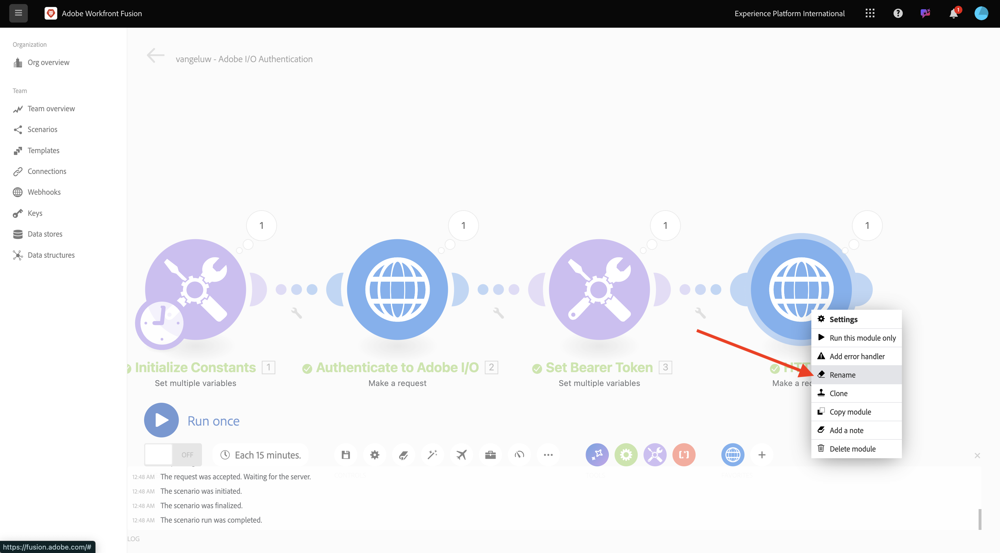
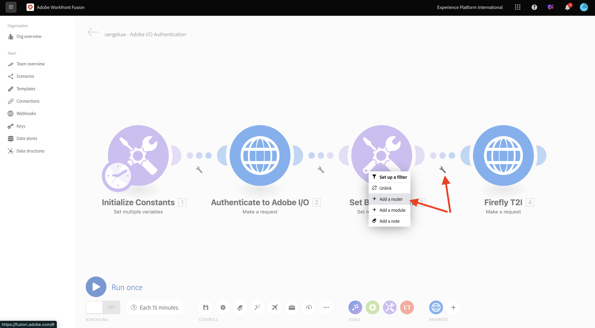
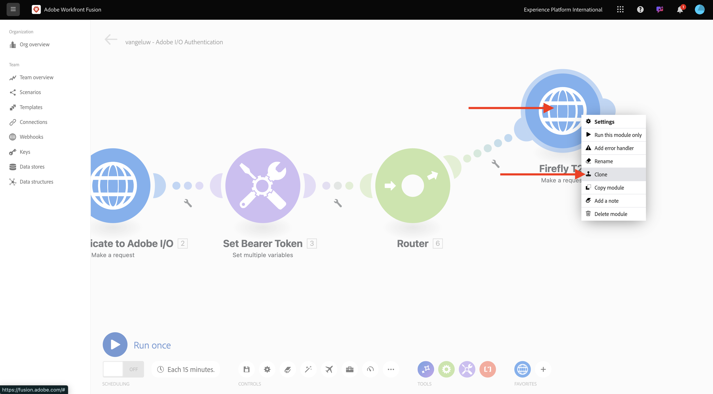
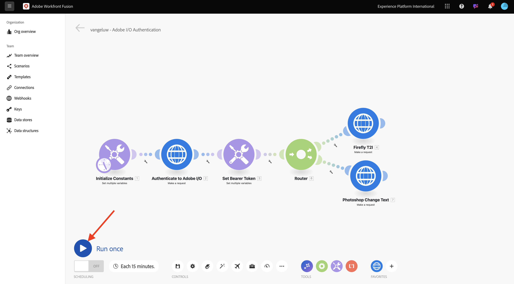
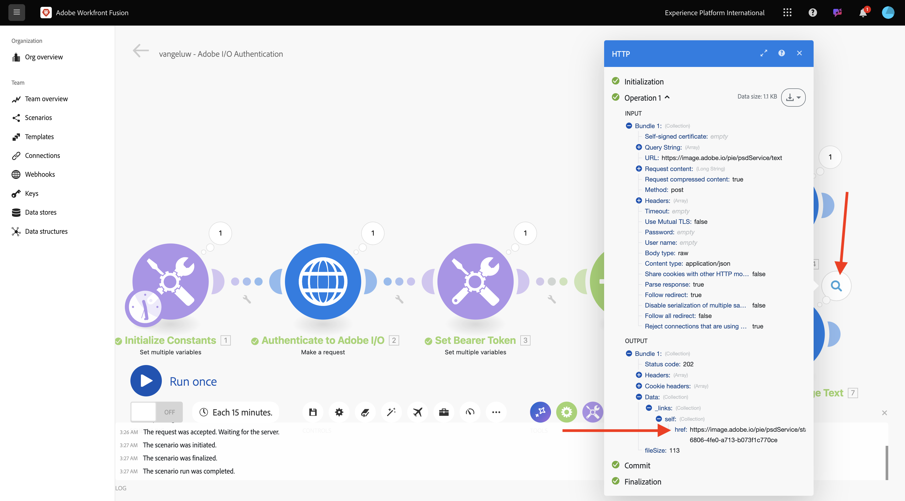
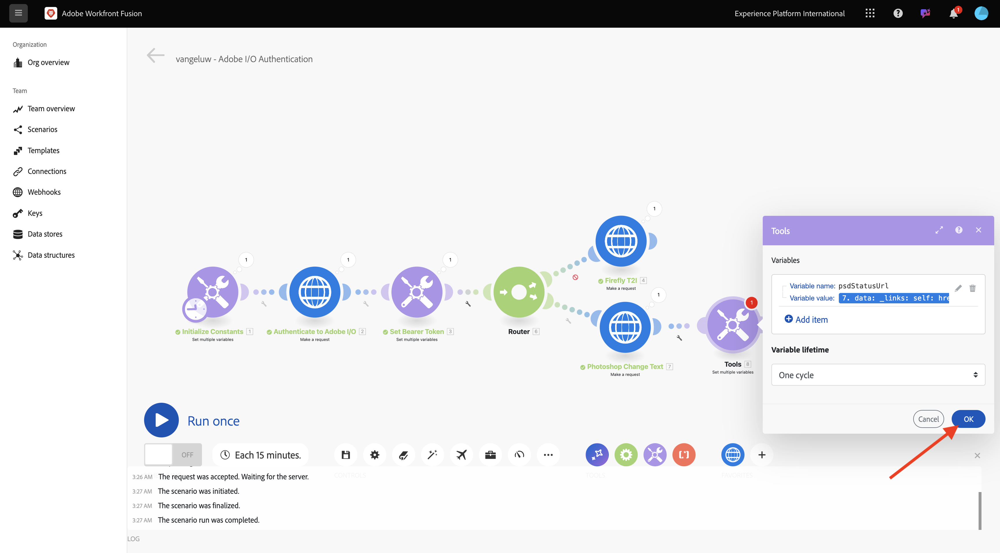
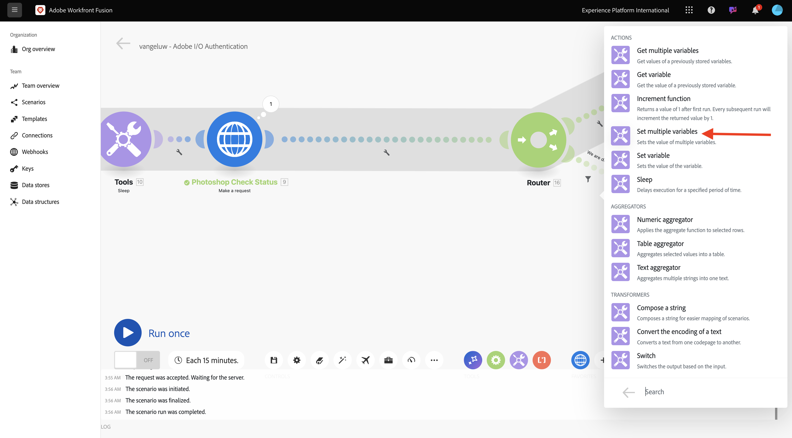
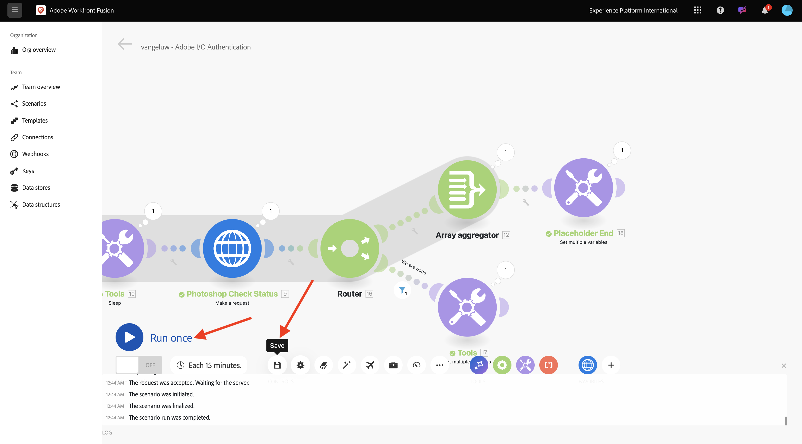

# 1.2.2在Workfront Fusion中使用Adobe API

瞭解如何在Workfront Fusion中使用Adobe API。

## 1.2.2.1透過Workfront Fusion使用Firefly文字對影像API

將滑鼠停留在第二個&#x200B;**設定多個變數**&#x200B;節點，並選取&#x200B;**+**&#x200B;以新增另一個模組。


搜尋&#x200B;**http**&#x200B;並選取&#x200B;**HTTP**。


選取&#x200B;**提出要求**。


選取這些變數：

- **URL**： `https://firefly-api.adobe.io/v3/images/generate`
- **方法**： `POST`

選取&#x200B;**新增標頭**。


輸入下列標題：

| 索引鍵 | 值 |
|:-------------:| :---------------:| 
| `x-api-key` | 您為`CONST_client_id`儲存的變數 |
| `Authorization` | `Bearer ` +您為`bearer_token`儲存的變數 |
| `Content-Type` | `application/json` |
| `Accept` | `*/*` |

輸入`x-api-key`的詳細資料。 選取&#x200B;**新增**。


選取&#x200B;**新增標頭**。


輸入`Authorization`的詳細資料。 選取&#x200B;**新增**。


選取&#x200B;**新增標頭**。 輸入`Content-Type`的詳細資料。 選取&#x200B;**新增**。


選取&#x200B;**新增標頭**。 輸入`Accept`的詳細資料。 選取&#x200B;**新增**。


將&#x200B;**主體型別**&#x200B;設定為&#x200B;**原始**。 針對&#x200B;**內容型別**，選取&#x200B;**JSON (application/json)**。


將此裝載貼到&#x200B;**要求內容**&#x200B;欄位。

```json
{
	"numVariations": 1,
	"size": {
		"width": 2048,
      "height": 2048
    },
    "prompt": "Horses in a field",
    "promptBiasingLocaleCode": "en-US"
}
```

勾選&#x200B;**剖析回應**&#x200B;的方塊。 選取&#x200B;**確定**。


選取&#x200B;**執行一次**。


您的熒幕應如下所示。


選取&#x200B;**？第四個節點HTTP上的**&#x200B;圖示以檢視回應。 您應該會在回應中看到影像檔案。


複製影像URL並在瀏覽器視窗中開啟。 您的畫面應如下所示：


在&#x200B;**HTTP**&#x200B;上按一下滑鼠右鍵，並重新命名為&#x200B;**Firefly T2I**。



選取&#x200B;**儲存**&#x200B;以儲存您的變更。


## 1.2.2.2搭配Workfront Fusion使用Photoshop API

在節點&#x200B;**設定持有人權杖**&#x200B;和&#x200B;**Firefly T2I**&#x200B;之間選取&#x200B;**扳手**。 選取&#x200B;**新增路由器**。



用滑鼠右鍵按一下&#x200B;**Firefly T2I**&#x200B;物件，然後選取&#x200B;**複製**。



將複製的物件拖放到&#x200B;**路由器**&#x200B;物件附近，它會自動連線到&#x200B;**路由器**。 您的畫面應如下所示：


根據&#x200B;**Firefly T2I** HTTP要求，您現在有相同的復本。 **Firefly T2I** HTTP要求的部分設定類似於您需要與&#x200B;**Photoshop API**&#x200B;互動所需的設定，這是省時的選擇。 現在，您只需要變更不相同的變數，例如要求URL和裝載。

將&#x200B;**URL**&#x200B;變更為`https://image.adobe.io/pie/psdService/text`。


以下列承載取代&#x200B;**要求內容**：

```json
  {
    "inputs": [
      {
        "storage": "external",
        "href": "{{AZURE_STORAGE_URL}}/{{AZURE_STORAGE_CONTAINER}}/citisignal-fiber.psd{{AZURE_STORAGE_SAS_READ}}"
      }
    ],
    "options": {
      "layers": [
        {
          "name": "2048x2048-button-text",
          "text": {
            "content": "Click here"
          }
        },
        {
          "name": "2048x2048-cta",
          "text": {
            "content": "Buy this stuff"
          }
        }
      ]
    },
    "outputs": [
      {
        "storage": "azure",
        "href": "{{AZURE_STORAGE_URL}}/{{AZURE_STORAGE_CONTAINER}}/citisignal-fiber-changed-text.psd{{AZURE_STORAGE_SAS_WRITE}}",
        "type": "vnd.adobe.photoshop",
        "overwrite": true
      }
    ]
  }
```


為了讓此&#x200B;**要求內容**&#x200B;正常運作，有些變數遺失：

- `AZURE_STORAGE_URL`
- `AZURE_STORAGE_CONTAINER`
- `AZURE_STORAGE_SAS_READ`
- `AZURE_STORAGE_SAS_WRITE`

返回您的第一個節點，選取&#x200B;**初始化常數**，然後為每個變數選擇&#x200B;**新增專案**。


| 索引鍵 | 範例值 |
|:-------------:| :---------------:| 
| `AZURE_STORAGE_URL` | `https://vangeluw.blob.core.windows.net` |
| `AZURE_STORAGE_CONTAINER` | `vangeluw` |
| `AZURE_STORAGE_SAS_READ` | `?sv=2023-01-03&st=2025-01-13T07%3A36%3A35Z&se=2026-01-14T07%3A36%3A00Z&sr=c&sp=rl&sig=4r%2FcSJLlt%2BSt9HdFdN0VzWURxRK6UqhB8TEvbWkmAag%3D` |
| `AZURE_STORAGE_SAS_WRITE` | `?sv=2023-01-03&st=2025-01-13T17%3A21%3A09Z&se=2025-01-14T17%3A21%3A09Z&sr=c&sp=racwl&sig=FD4m0YyyqUj%2B5T8YyTFJDi55RiTDC9xKtLTgW0CShps%3D` |

您可以返回Postman並開啟&#x200B;**環境變數**&#x200B;來尋找變數。


將這些值複製至Workfront Fusion，並為這4個變數分別新增專案。

您的熒幕應如下所示。 選取&#x200B;**確定**。


接著，返回複製的HTTP要求以更新&#x200B;**要求內容**。 請注意&#x200B;**要求內容**&#x200B;中的黑色變數，這些是您從Postman複製的變數。 您需要變更您剛才在Workfront Fusion中定義的變數。 刪除黑色文字並以正確的變數取代每個變數，逐一取代。


在&#x200B;**輸入**&#x200B;區段中進行這3個變更。 選取&#x200B;**確定**。


在&#x200B;**輸出**&#x200B;區段中進行這3項變更。 選取&#x200B;**確定**。


用滑鼠右鍵按一下複製的節點，然後選取&#x200B;**重新命名**。 將名稱變更為&#x200B;**Photoshop變更文字**。


您的畫面應如下所示：


選取&#x200B;**執行一次**。



選取&#x200B;**Photoshop變更文字**&#x200B;節點上的&#x200B;**搜尋**&#x200B;圖示以檢視回應。 您應該有如下的回應，其中包含狀態檔案的連結。



在繼續Photoshop API互動之前，請停用前往&#x200B;**Firefly T2I**&#x200B;節點的路由，以免傳送不需要的API呼叫至該API端點。 選取&#x200B;**扳手**&#x200B;圖示，然後選取&#x200B;**停用路由**。


您的畫面應如下所示：


接下來，新增另一個&#x200B;**設定多個變數**&#x200B;節點。


將它置於&#x200B;**Photoshop變更文字**&#x200B;節點之後。


選取&#x200B;**設定多個變數**&#x200B;節點，選取&#x200B;**新增專案**。 從先前請求的回應中選取變數值。

| 變數名稱 | 變數值 |
|:-------------:| :---------------:| 
| `psdStatusUrl` | `data > _links > self > href` |

選取&#x200B;**新增**。


選取&#x200B;**確定**。



以滑鼠右鍵按一下&#x200B;**Photoshop變更文字**&#x200B;節點，然後選取&#x200B;**複製**。


將複製的HTTP要求拖曳到您剛建立的&#x200B;**設定多個變數**&#x200B;節點之後。


用滑鼠右鍵按一下複製的HTTP要求，選取&#x200B;**重新命名**，並將名稱變更為&#x200B;**Photoshop檢查狀態**。


選取「 」以開啟HTTP請求。 變更URL，使其參考您在上一步中建立的變數，並將&#x200B;**方法**&#x200B;設定為&#x200B;**GET**。


選取空白選項，移除&#x200B;**內文**。


選取&#x200B;**確定**。


選取&#x200B;**執行一次**。


顯示包含欄位&#x200B;**狀態**，且狀態設定為&#x200B;**執行中**&#x200B;的回應。 Photoshop需要幾秒鐘才能完成此程式。


現在您知道回應需要更多時間才能完成，所以最好在此HTTP要求前面新增計時器，以免立即執行。

選取&#x200B;**工具**&#x200B;節點，然後選取&#x200B;**睡眠**。


將&#x200B;**睡眠**&#x200B;節點放置在&#x200B;**設定多個變數**&#x200B;和&#x200B;**Photoshop檢查狀態**&#x200B;之間。 將&#x200B;**延遲**&#x200B;設定為&#x200B;**5**&#x200B;秒。 選取&#x200B;**確定**。


您的熒幕應如下所示。 使用下列設定的挑戰是，等待5秒可能足夠了，但可能還不夠。 實際上，最好有更智慧型的解決方案，例如do...while回圈，每5秒檢查一次狀態，直到狀態等於&#x200B;**succeeded**。 因此，您可在後續步驟中實施此策略。


選取介於&#x200B;**設定多個變數**&#x200B;和&#x200B;**睡眠**&#x200B;之間的&#x200B;**扳手**&#x200B;圖示。 選取&#x200B;**新增模組**。


搜尋`flow`，然後選取&#x200B;**流量控制**。


選取&#x200B;**中繼器**。


將&#x200B;**重複**&#x200B;設定為&#x200B;**20**。 選取&#x200B;**確定**。


接下來，在&#x200B;**Photoshop檢查狀態**&#x200B;上選取&#x200B;**+**&#x200B;以新增另一個模組。


搜尋&#x200B;**流量**&#x200B;並選取&#x200B;**流量控制**。


選擇 **陣列聚合器**。


將&#x200B;**Source模組**&#x200B;設定為&#x200B;**中繼器**。 選取&#x200B;**確定**。


您的畫面應如下所示：


選取&#x200B;**扳手**&#x200B;圖示並選取&#x200B;**新增模組**。


搜尋&#x200B;**工具**&#x200B;並選取&#x200B;**工具**。


選取&#x200B;**取得多個變數**。


選取&#x200B;**+新增專案**&#x200B;並將&#x200B;**變數名稱**&#x200B;設為`done`。


選取&#x200B;**確定**。


選取您之前設定的&#x200B;**設定多個變數**&#x200B;節點。 若要初始化變數&#x200B;**done**，您必須在這裡將其設為`false`。 選取&#x200B;**+新增專案**。


使用`done`作為&#x200B;**變數名稱**

若要設定狀態，需要一個布林值。 若要尋找布林值，請選取&#x200B;**齒輪**，然後選取`false`。 選取&#x200B;**新增**。


選取&#x200B;**確定**。


接著，在您設定的&#x200B;**取得多個變數**&#x200B;節點之後，選取&#x200B;**扳手**&#x200B;圖示。


選取&#x200B;**設定篩選器**。 您現在需要檢查變數&#x200B;**done**&#x200B;的值。 如果該值設定為&#x200B;**false**，則必須執行回圈的下一部分。 如果值設定為&#x200B;**true**，則表示處理序已順利完成，因此不需要繼續回圈的下一部分。


對於標籤，請使用&#x200B;**我們完成了嗎？**。使用現有的變數&#x200B;**done**&#x200B;設定&#x200B;**條件**，運運算元應設為&#x200B;**等於**，而值應為布林值變數`false`。 選取&#x200B;**確定**。


接下來，在節點&#x200B;**Photoshop檢查狀態**&#x200B;和&#x200B;**陣列彙總**&#x200B;之間騰出一些空間。 接著，選取&#x200B;**扳手**&#x200B;圖示並選取&#x200B;**新增路由器**。 您之所以這麼做，是因為在檢查Photoshop檔案的狀態後，應該會有2個路徑。 如果狀態為`succeeded`，則&#x200B;**done**&#x200B;的變數應設為`true`。 如果狀態不等於`succeeded`，則應該繼續回圈。 路由器可以檢查並設定此專案。


新增路由器之後，請選取&#x200B;**扳手**&#x200B;圖示，然後選取&#x200B;**設定篩選器**。


對於標籤，請使用&#x200B;**我們已完成**。 選擇回應欄位&#x200B;**data.outputs[].status**，使用來自&#x200B;**Photoshop Check Status**&#x200B;節點的回應設定&#x200B;**條件**，運運算元應設為&#x200B;**等於**，而值應為`succeeded`。 選取&#x200B;**確定**。


接著，選取帶有問號的空白節點，並搜尋&#x200B;**工具**。 然後，選取&#x200B;**工具**。


選取&#x200B;**設定多個變數**。



使用路由器的這個分支時，表示Photoshop檔案建立的狀態已順利完成。 這表示do...while回圈不再需要繼續檢查Photoshop中的狀態，因此您應該將變數`done`設定為`true`。

對於&#x200B;**變數名稱**，請使用`done`。

對於&#x200B;**變數值**，您應該使用布林值`true`。 選取&#x200B;**齒輪**&#x200B;圖示，然後選取`true`。 選取&#x200B;**新增**。


選取&#x200B;**確定**。


接著，用滑鼠右鍵按一下您剛建立的&#x200B;**設定多個變數**&#x200B;節點，並選取&#x200B;**複製**。


拖曳複製的節點，使其與&#x200B;**陣列彙總**&#x200B;連線。 然後，以滑鼠右鍵按一下節點，並選取&#x200B;**重新命名**，然後將名稱變更為`Placeholder End`。


拿掉現有變數，然後選擇“ **+ 添加項**”。 對於&#x200B;**變數名稱**，請使用`placeholder`，對於&#x200B;**變數值**，請使用`end`。 選取&#x200B;**新增**，然後選取&#x200B;**確定**。


選取&#x200B;**儲存**&#x200B;以儲存您的情境。 接下來，選取   **執行一次**。



接著會執行您的情境，應該會成功完成。 請注意，您設定的do...while回圈運作正常。 在下列執行中，您可以看到根據&#x200B;**工具>取得多個變數**&#x200B;節點上的泡泡圖，**中繼器**&#x200B;已執行20次。 在該節點之後，您已設定篩選器以檢查狀態，而且只有在狀態不等於&#x200B;**succeeded**&#x200B;時，才會執行下一個節點。 在這個執行中，篩選之後的部分只執行一次，因為狀態在第一次執行中已經是&#x200B;**succeeded**。


您可以按一下&#x200B;**Photoshop Check Status** HTTP請求上的泡泡並向下展開至&#x200B;**狀態**&#x200B;欄位，以驗證建立新Photoshop檔案的狀態。


您現在已設定可重複案例的基本版本，可自動化許多步驟。 在下一個練習中，您將透過增加複雜性來反複研究這個問題。

## 後續步驟

移至[使用Workfront Fusion進行程式自動化](./ex3.md){target="_blank"}

返回[使用Workfront Fusion進行Creative工作流程自動化](./automation.md){target="_blank"}

返回[所有模組](./../../../overview.md){target="_blank"}
