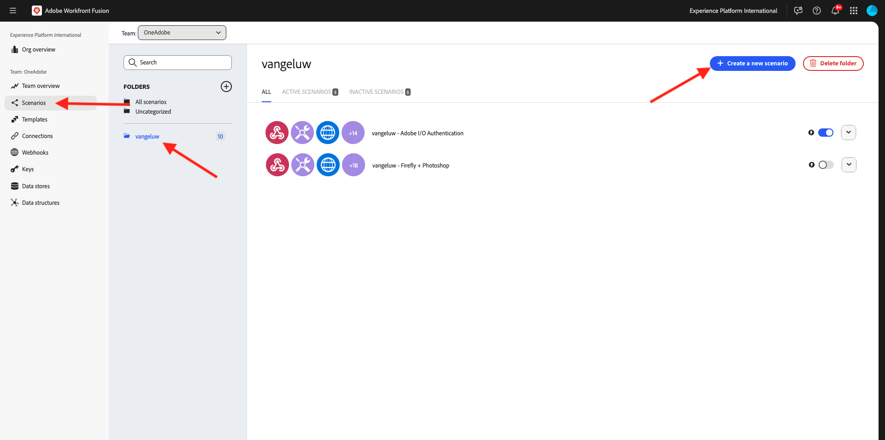
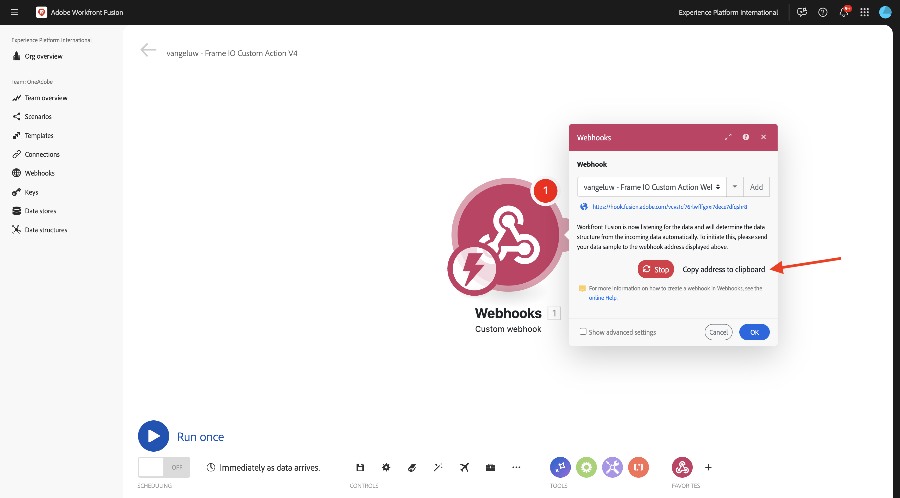
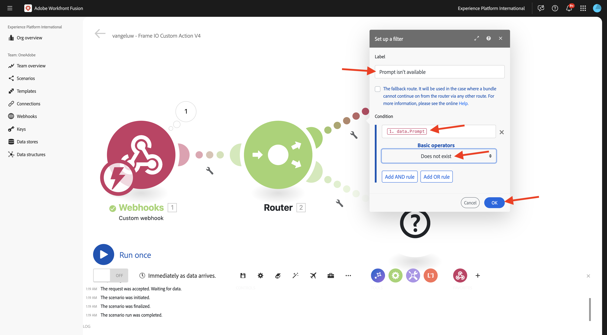
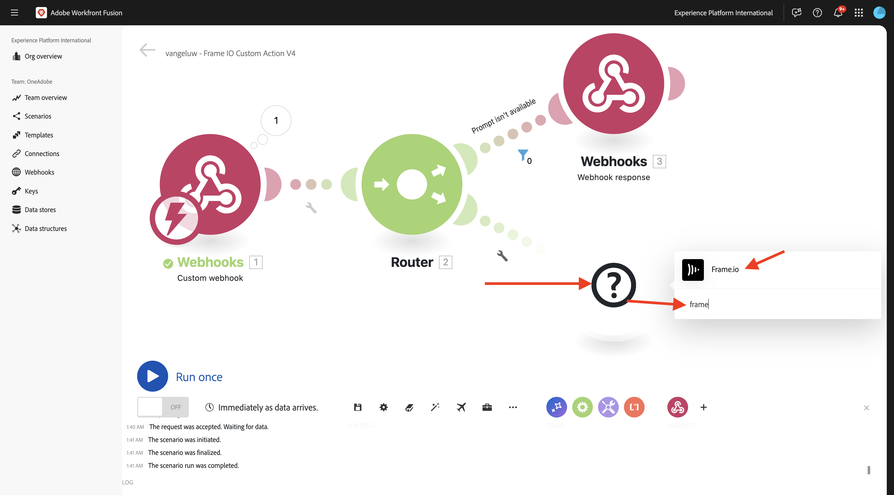

# 1.2.3 Frame.io和Workfront Fusion

在上一個練習中，您設定了案例`--aepUserLdap-- - Firefly + Photoshop`並設定了傳入webhook以觸發案例，以及在案例成功完成時設定webhook回應。 然後您使用Postman來觸發該情境。 Postman是絕佳的測試工具，但在實際商業案例中，商業使用者不會使用Postman來觸發案例。 相反地，他們會使用另一個應用程式，並期望其他應用程式在Workfront Fusion中啟動情境。 在本練習中，您將會使用Frame.io做的事情正是如此。

>[!NOTE]
>
>此練習是針對Frame.io V4所建立。 本練習中使用的以下部分功能目前為Alpha版，尚未普遍可用。

## 1.2.3.1必要條件

在繼續此練習之前，您必須先完成[您的Adobe I/O專案](./../../../modules/getting-started/gettingstarted/ex6.md)的設定，包括將&#x200B;**Frame.io API**&#x200B;新增至您的Adobe I/O專案，而且您還需要設定應用程式以與API互動，例如[Postman](./../../../modules/getting-started/gettingstarted/ex7.md)或[PostBuster](./../../../modules/getting-started/gettingstarted/ex8.md)。

## 1.2.3.2正在存取Frame.io

移至[https://next.frame.io/](https://next.frame.io/){target="_blank"}。


按一下執行個體圖示，確認您目前登入的執行個體。 選擇您已獲得存取權的執行個體，應為`--aepImsOrgName--`。

按一下&#x200B;**+新專案**，在Frame.io中建立您自己的專案。


選取&#x200B;**Blank**&#x200B;範本，然後為您的專案輸入名稱`--aepUserLdap--`。 按一下&#x200B;**建立新專案**。


然後，您將在左側選單中看到您的專案。 按一下&#x200B;**+**&#x200B;圖示，然後選取&#x200B;**新增資料夾**。


輸入名稱`CitiSignal Fiber Campaign`，然後按兩下資料夾以開啟它。


按一下&#x200B;**上傳**。


在先前的練習中，您下載了[citisignal-fiber.psd](./../../../assets/ff/citisignal-fiber.psd){target="_blank"}。 選取該檔案並按一下&#x200B;**開啟**。


然後，您新建立的資料夾中將可以使用&#x200B;**citisignal-fiber.psd**&#x200B;檔案。


## 1.2.3.3 Workfront Fusion和Frame.io

在上一個練習中，您建立了案例`--aepUserLdap-- - Firefly + Photoshop`，該案例以自訂webhook開始，以webhook回應結束。 接著，我們使用Postman測試了Webhook的使用情況，但很顯然，這種情況的要點是由外部應用程式呼叫。 如前所述，Frame.io將是該練習，但在Frame.io和`--aepUserLdap-- - Firefly + Photoshop`之間需要另一個Workfront Fusion案例。 您現在將設定該案例。

移至[https://experience.adobe.com/](https://experience.adobe.com/){target="_blank"}。 開啟&#x200B;**Workfront Fusion**。


在左側功能表中，移至&#x200B;**案例**&#x200B;並選取您的資料夾`--aepUserLdap--`。 按一下&#x200B;**建立新情境**。



使用名稱`--aepUserLdap-- - Frame IO Custom Action V4`。


按一下畫布上的&#x200B;**問號物件**。 在搜尋方塊中輸入文字`webhook`，然後按一下&#x200B;**Webhooks**。


按一下&#x200B;**自訂webhook**。


按一下&#x200B;**[新增**]以建立新的webhook url。


對於&#x200B;**Webhook名稱**，請使用`--aepUserLdap-- - Frame IO Custom Action Webhook`。 按一下&#x200B;**儲存**。


您應該會看到此訊息。 將此熒幕保持開啟且未觸控，因為您會在下一個步驟中需要它。 您必須按一下&#x200B;**將地址複製到剪貼簿**，在下一個步驟中複製webhook URL。



## 1.2.3.4 Frame.io V4自訂動作API

移至Postman並開啟要求&#x200B;**POST — 取得集合** Adobe IO - OAuth **中的存取權杖**。 驗證&#x200B;**引數**&#x200B;下的欄位&#x200B;**領域**。 欄位&#x200B;**範圍**&#x200B;應包含範圍`frame.s2s.all`。 如果遺失，請新增它。 接著，按一下[傳送]，要求新的&#x200B;**access_token**。****


接著，開啟要求&#x200B;**GET — 列出集合** Frame.io V4 — 技術內部人士&#x200B;**中的帳戶**。 按一下&#x200B;**傳送**。


之後，您應該會看到包含一或多個帳戶的類似回應。 檢閱回應，並找到您正在使用的Frame.io V4帳戶的欄位&#x200B;**id**。 您可以在Frame.io V4使用者介面中找到帳戶的名稱：


複製欄位&#x200B;**id**&#x200B;的值。


在左側功能表中，移至&#x200B;**環境**&#x200B;並選取您正在使用的環境。 尋找變數&#x200B;**`FRAME_IO_ACCOUNT_ID`**，並在&#x200B;**初始值**&#x200B;資料行和&#x200B;**目前值**&#x200B;資料行中，貼上您從先前要求取得的&#x200B;**id**。 按一下&#x200B;**儲存**。


在左側功能表中，返回&#x200B;**集合**。 開啟請求&#x200B;**GET — 列出集合** Frame.io V4 — 技術內部人士&#x200B;**中的Workspace**。 按一下&#x200B;**傳送**。


之後，您應該會看到包含一或多個帳戶的類似回應。 檢閱回應，並找到您正在使用的Frame.io V4 Workspace的欄位&#x200B;**id**。 複製欄位&#x200B;**id**&#x200B;的值。


在左側功能表中，移至&#x200B;**環境**&#x200B;並選取您正在使用的環境。 尋找變數&#x200B;**`FRAME_IO_WORKSPACE_ID`**，並在&#x200B;**初始值**&#x200B;資料行和&#x200B;**目前值**&#x200B;資料行中，貼上您從先前要求取得的&#x200B;**id**。 按一下&#x200B;**儲存**。


在左側功能表中，返回&#x200B;**集合**。 開啟集合&#x200B;**Frame.io V4 - Tech Insidets**&#x200B;中的請求&#x200B;**POST — 建立自訂動作**，資料夾&#x200B;**自訂動作**。

前往請求的&#x200B;**內文**。 將欄位&#x200B;**name**&#x200B;變更為`--aepUserLdap--  - Frame.io Custom Action V4`，然後將欄位&#x200B;**url**&#x200B;變更為您從Workfront Fusion複製的Webhook URL值。

按一下&#x200B;**傳送**。


您的Frame.io V4自訂動作現已建立。


返回[https://next.frame.io/](https://next.frame.io/){target="_blank"}，並移至您在專案&#x200B;**中建立的資料夾** CitiSignal Fiber Campaign`--aepUserLdap--`。 重新整理頁面。


重新整理頁面後，按一下資產&#x200B;**citisignal-fiber.psd**&#x200B;上的3個點&#x200B;**...**，然後開啟&#x200B;**自訂動作**&#x200B;功能表。 之後，您應該會看到先前建立的自訂動作出現在顯示的功能表中。 按一下自訂動作`--aepUserLdap-- - Frame IO Custom Action Fusion V4`。


您應該會看到類似的&#x200B;**自訂動作**&#x200B;快顯視窗。 此快顯視窗是Frame.io與Workfront Fusion之間通訊的結果。


將畫面變更回Workfront Fusion。 您現在應該會看到&#x200B;**已成功判定**&#x200B;出現在自訂Webhook物件上。 按一下&#x200B;**「確定」**。


按一下&#x200B;**執行一次**&#x200B;以啟用測試模式，然後再次測試與Frame.io的通訊。


返回Frame.io，然後再次按一下自訂動作`--aepUserLdap-- - Frame IO Custom Action Fusion V4`。


將畫面切換回Workfront Fusion。 您現在應該會看到綠色核取記號，以及顯示&#x200B;**1**&#x200B;的泡泡。 按一下泡泡圖示以檢視詳細資訊。


泡泡圖的詳細檢視畫面會顯示從Frame.io收到的資料。 您應該會看到各種ID。例如，欄位&#x200B;**resource.id**&#x200B;會顯示資產&#x200B;**citisignal-fiber.psd**&#x200B;之Frame.io中的唯一ID。


現在，Frame.io與Workfront Fusion之間的通訊已建立，您可以繼續設定。

## 1.2.3.5提供對Frame.io的自訂表單回應

在Frame.io中叫用自訂動作時，Frame.io預期會收到來自Workfront Fusion的回應。 如果您回想一下您在上一個練習中建立的情境，則需要多個變數來更新標準Photoshop PSD檔案。 這些變數會在您使用的裝載中定義：

```json
{
    "psdTemplate": "citisignal-fiber.psd",
    "xlsFile": "placeholder",
    "prompt":"misty meadows",
    "cta": "Buy this now!",
    "button": "Click here to buy!"
}
```

因此，為了成功執行案例`--aepUserLdap-- - Firefly + Photoshop`，需要&#x200B;**prompt**、**cta**、**button**&#x200B;和&#x200B;**psdTemplate**&#x200B;等欄位。

前3個欄位(**prompt**、**cta**、**button**)需要使用者輸入，當使用者叫用自訂動作時，需要在Frame.io中收集這些輸入。 因此，在Workfront Fusion中首先需要做的就是檢查這些變數是否可用，如果不可用，Workfront Fusion應回傳給Frame.io，要求輸入這些變數。 要達到此目的，請在Frame.io中使用表單。

返回Workfront Fusion並開啟您的案例`--aepUserLdap-- - Frame IO Custom Action`。 將游標暫留在&#x200B;**自訂webhook**&#x200B;物件上，然後按一下&#x200B;**+**&#x200B;圖示以新增另一個模組。


搜尋`Flow Control`並按一下&#x200B;**流量控制**。


按一下以選取&#x200B;**路由器**。


您應該會看到此訊息。


按一下&#x200B;**？**&#x200B;物件，然後按一下以選取&#x200B;**Webhooks**。


選取&#x200B;**Webhook回應**。


您應該會看到此訊息。


複製下列JSON程式碼並將其貼到欄位&#x200B;**內文**。


```json
{
  "title": "What do you want Firefly to generate?",
  "description": "Enter your Firefly prompt.",
  "fields": [
    {
      "type": "text",
      "label": "Prompt",
      "name": "Prompt",
      "value": ""
    },
    {
      "type": "text",
      "label": "CTA Text",
      "name": "CTA Text",
      "value": ""
    },
    {
      "type": "text",
      "label": "Button Text",
      "name": "Button Text",
      "value": ""
    }
  ]
}
```

按一下圖示以清理和美化JSON程式碼。 然後，按一下&#x200B;**確定**。


按一下[儲存]儲存變更。****


接下來，您需要設定篩選器，以確保此情境路徑僅在沒有提示可用時執行。 按一下&#x200B;**扳手**&#x200B;圖示，然後選取&#x200B;**設定篩選器**。


設定下列欄位：

- **標籤**：使用`Prompt isn't available`。
- **條件**：使用`{{1.data.Prompt}}`。
- **基本運運算元**：選取&#x200B;**不存在**。

>[!NOTE]
>
>可以使用下列語法手動指定Workfront Fusion中的變數： `{{1.data.Prompt}}`。 變數中的數字會參考情境中的模組。 在此範例中，您可以看到情境中的第一個模組稱為&#x200B;**Webhooks**，其序號為&#x200B;**1**。 這表示變數`{{1.data.Prompt}}`將會從序號為1的模組存取欄位&#x200B;**data.Prompt**。 序號有時可能不同，因此在複製/貼上這類變數時請務必注意，並務必確認所使用的序號是否正確。

按一下&#x200B;**「確定」**。



您應該會看到此訊息。 先按一下&#x200B;**儲存**&#x200B;圖示，然後按一下&#x200B;**執行一次**&#x200B;以測試您的情境。


您應該會看到此訊息。


返回Frame.io，然後再次按一下資產`--aepUserLdap-- - Frame IO Custom Action Fusion`citisignal-fiber.psd **上的自訂動作**。


您現在應該會在Frame.io中看到提示。 尚未填寫欄位且尚未提交表單。 系統會根據您剛設定的Workfront Fusion回應顯示此提示。


切換回Workfront Fusion，然後按一下&#x200B;**Webhook回應**&#x200B;模組上的泡泡。 您會在&#x200B;**INPUT**&#x200B;下看到包含表單之JSON裝載的主體。 再按一下&#x200B;**執行一次**。


您應該會再次看到此專案。


返回Frame.io並按指示填寫欄位。

- **提示**：透過空間的未來鐳射光束
- **CTA**：立即旅行時間！
- **按鈕文字**：加入討論區！

按一下&#x200B;**提交**。


接著，您應該會在Frame.io中看到類似以下的快顯視窗。


切換回Workfront Fusion，然後按一下&#x200B;**自訂webhook**&#x200B;模組上的泡泡。 在作業1的&#x200B;**輸出**&#x200B;下，您現在可以看到新的&#x200B;**資料**&#x200B;物件，其中包含&#x200B;**按鈕文字**、**CTA文字**&#x200B;和&#x200B;**提示字元**&#x200B;等欄位。 有了這些可在您的情境中使用的使用者輸入變數，您就有足夠的空間繼續您的設定。


## 1.2.3.6從Frame.io擷取檔案位置

如前所述，此情境需要&#x200B;**prompt**、**cta**、**button**&#x200B;和&#x200B;**psdTemplate**&#x200B;等欄位才能運作。 前3個欄位現在已可供使用，但仍遺失要使用的&#x200B;**psdTemplate**。 **psdTemplate**&#x200B;現在會參考Frame.io位置，因為檔案&#x200B;**citisignal-fiber.psd**&#x200B;是在Frame.io中託管。 為了擷取該檔案的位置，您需要在Workfront Fusion中設定和使用Frame.io連線。

返回Workfront Fusion並開啟您的案例`--aepUserLdap-- - Frame IO Custom Action V4`。 將游標暫留在&#x200B;**上？**&#x200B;模組，按一下&#x200B;**+**&#x200B;圖示以新增另一個模組並搜尋`frame`。 按一下&#x200B;**Frame.io**。



按一下&#x200B;**Frame.io**。


按一下&#x200B;**進行自訂API呼叫**。


若要使用Frame.io連線，您必須先進行設定。 按一下&#x200B;**[新增**]即可執行這個動作。


選取&#x200B;**連線型別** **IMS伺服器到伺服器**，並輸入名稱`--aepUserLdap-- - Adobe I/O - Frame.io S2S`。


接下來，您必須輸入您設定為&#x200B;**快速入門**&#x200B;模組一部分之Adobe I/O專案的&#x200B;**使用者端識別碼**&#x200B;和&#x200B;**使用者端密碼**。 您可以在&#x200B;**這裡**&#x200B;找到您Adobe I/O專案的&#x200B;**使用者端識別碼**&#x200B;和[使用者端密碼](https://developer.adobe.com/console/projects.){target="_blank"}。


返回Workfront Fusion中的案例。 在連線設定視窗中，將&#x200B;**使用者端識別碼**&#x200B;和&#x200B;**使用者端密碼**&#x200B;的值貼到其各自的欄位中。 按一下&#x200B;**繼續**。 您的連線現在將由Workfront Fusion測試。


如果連線測試成功，就會自動顯示在&#x200B;**連線**&#x200B;下。 您現在已成功連線，而且您必須完成設定，才能從Frame.io取得所有資產詳細資訊，包括檔案位置。 若要這麼做，您必須使用&#x200B;**資源識別碼**。


欄位&#x200B;**資源ID**&#x200B;由Frame.io共用給Workfront Fusion，做為初始&#x200B;**自訂webhook**&#x200B;通訊的一部分，可以在&#x200B;**resource.id**&#x200B;下找到。

針對模組&#x200B;**Frame.io — 進行自訂API呼叫**，使用URL： `/v4/accounts/{{1.account_id}}/files/{{1.resource.id}}`。

>[!NOTE]
>
>可以使用下列語法手動指定Workfront Fusion中的變數： `{{1.account_id}}`和`{{1.resource.id}}`。 變數中的數字會參考情境中的模組。 在此範例中，您可以看到情境中的第一個模組稱為&#x200B;**Webhooks**，其序號為&#x200B;**1**。 這表示變數`{{1.account_id}}`和`{{1.resource.id}}`將會從序號為1的模組存取該欄位。 序號有時可能不同，因此在複製/貼上這類變數時請務必注意，並務必確認所使用的序號是否正確。

接著，按一下&#x200B;**查詢字串**&#x200B;下的&#x200B;**+新增專案**。


輸入這些值，然後按一下&#x200B;**新增**。

| 索引鍵 | 價值 |
|:-------------:| :---------------:| 
| `include` | `media_links.original` |


您現在應該擁有此專案。 按一下&#x200B;**「確定」**。


接下來，您需要設定篩選器，以確保此情境路徑僅在沒有提示可用時執行。 按一下&#x200B;**扳手**&#x200B;圖示，然後選取&#x200B;**設定篩選器**。


設定下列欄位：

- **標籤**：使用`Prompt is available`。
- **條件**：使用`{{1.data.Prompt}}`。
- **基本運運算元**：選取&#x200B;**存在**。

>[!NOTE]
>
>可以使用下列語法手動指定Workfront Fusion中的變數： `{{1.data.Prompt}}`。 變數中的數字會參考情境中的模組。 在此範例中，您可以看到情境中的第一個模組稱為&#x200B;**Webhooks**，其序號為&#x200B;**1**。 這表示變數`{{1.data.Prompt}}`將會從序號為1的模組存取欄位&#x200B;**data.Prompt**。 序號有時可能不同，因此在複製/貼上這類變數時請務必注意，並務必確認所使用的序號是否正確。

按一下&#x200B;**「確定」**。


您現在應該會看到此訊息。 儲存您的變更，然後按一下&#x200B;**執行一次**&#x200B;以測試您的情境。


返回Frame.io，然後再次按一下資產`--aepUserLdap-- - Frame IO Custom Action Fusion V4`citisignal-fiber.psd **上的自訂動作**。


您現在應該會在Frame.io中看到提示。 尚未填寫欄位且尚未提交表單。 系統會根據您剛設定的Workfront Fusion回應顯示此提示。


切換回Workfront Fusion。 再按一下&#x200B;**執行一次**。


返回Frame.io並按指示填寫欄位。 按一下&#x200B;**提交**。

- **提示**：透過空間的未來鐳射光束
- **CTA**：立即旅行時間！
- **按鈕文字**：加入討論區！


切換回Workfront Fusion，然後按一下&#x200B;**Frame.io — 進行自訂API呼叫**&#x200B;模組。


在&#x200B;**OUTPUT** > **Body** > **資料**&#x200B;下方，您現在可以看到許多有關特定資產&#x200B;**citisignal-fiber.psd**&#x200B;的中繼資料。


此使用案例所需的特定資訊是檔案&#x200B;**citisignal-fiber.psd**&#x200B;的位置URL，您可以向下捲動至&#x200B;**media_links** > **Original** > **download_url**&#x200B;欄位，找到該檔案。


您現在擁有此使用案例運作所需的所有資訊（**prompt**、**cta**、**button**&#x200B;和&#x200B;**psdTemplate**）。

## 1.2.3.7叫用另一個Workfront情境

在上一個練習中，您已設定情境`--aepUserLdap-- - Firefly + Photoshop`。 您現在需要對該情境進行微幅變更。

在另一個索引標籤中開啟案例`--aepUserLdap-- - Firefly + Photoshop`，然後按一下第一個&#x200B;**Adobe Photoshop — 套用PSD編輯**&#x200B;模組。 您現在應該會看到輸入檔案已設定為使用Microsoft Azure中的動態位置。 基於此使用案例，輸入檔案不再儲存在Microsoft Azure中，而是使用Frame.io儲存，因此您需要變更這些設定。


將&#x200B;**儲存體**&#x200B;變更為&#x200B;**外部**，並變更&#x200B;**檔案位置**&#x200B;以僅使用從傳入&#x200B;**自訂webhook**&#x200B;模組取得的&#x200B;**psdTemplate**&#x200B;變數。 按一下[確定]****，然後按一下[儲存]****&#x200B;儲存您的變更。


按一下&#x200B;**自訂webhook**&#x200B;模組，然後按一下&#x200B;**將地址複製到剪貼簿**。 您需要複製URL，因為您需要在其他案例中使用它。


返回您的案例`--aepUserLdap-- - Frame IO Custom Action V4`。 將游標暫留在&#x200B;**Frame.io — 進行自訂API呼叫**&#x200B;模組，然後按一下&#x200B;**+**&#x200B;圖示。


輸入`http`，然後按一下&#x200B;**HTTP**。


選取&#x200B;**提出要求**。


在欄位&#x200B;**URL**&#x200B;中貼上自訂webhook的URL。 將&#x200B;**方法**&#x200B;設定為&#x200B;**POST**。


將&#x200B;**主體型別**&#x200B;設定為&#x200B;**原始**，並將&#x200B;**內容型別**&#x200B;設定為&#x200B;**JSON (application/json)**。
將下列JSON裝載貼到欄位**要求內容**&#x200B;中，並啟用&#x200B;**剖析回應**&#x200B;的核取方塊。

```json
{
    "psdTemplate": "citisignal-fiber.psd",
    "xlsFile": "placeholder",
    "prompt":"misty meadows",
    "cta": "Buy this now!",
    "button": "Click here to buy!"
}
```

您現在已設定靜態裝載，但需要使用先前收集的變數將其變成動態。


針對欄位&#x200B;**psdTemplate**，將靜態變數&#x200B;**citisignal-fiber.psd**&#x200B;取代為變數&#x200B;**`Body > data > media_links > original > download_url`**。


對於欄位&#x200B;**prompt**、**cta**&#x200B;和&#x200B;**button**，請以Frame.io傳入的webhook要求插入情境中的動態變數來取代靜態變數，這些欄位是&#x200B;**data.Prompt**、**data.CTA Text**&#x200B;和&#x200B;**data.Button Text**。

此外，請啟用&#x200B;**剖析回應**&#x200B;的核取方塊。

按一下&#x200B;**「確定」**。


按一下[儲存]儲存變更。****


## 1.2.3.8在Frame.io中儲存新資產

叫用另一個Workfront Fusion案例後，即可使用新的Photoshop PSD範本。 該PSD檔案需要儲存回Frame.io，這是此情境中的最後一個步驟。

將游標暫留在&#x200B;**HTTP上 — 提出要求**&#x200B;模組並按一下&#x200B;**+**&#x200B;圖示。


選取&#x200B;**Frame.io**。


選取&#x200B;**進行自訂API呼叫**。


系統將會自動選取您的Frame.io連線。


針對模組&#x200B;**Frame.io — 進行自訂API呼叫**，使用URL： `/v4/accounts/{{1.account_id}}/folders/{{4.body.data.parent_id}}/files/remote_upload`。

>[!NOTE]
>
>如前所述，可以使用以下語法手動指定Workfront Fusion中的變數： `{{1.account_id}}`和`{{4.body.data.parent_id}}`。 變數中的數字會參考情境中的模組。
>在此範例中，您可以看到情境中的第一個模組稱為&#x200B;**Webhooks**，其序號為&#x200B;**1**。 這表示變數`{{1.account_id}}`會從序號為1的模組存取該欄位。
>在此範例中，您可以看到情境中的第四個模組稱為&#x200B;**Frame.io — 進行自訂API呼叫**，其序號為&#x200B;**4**。 這表示變數`{{4.body.data.parent_id}}`將會從序號為4的模組存取該欄位。
>如果模組的序號不同，您必須更新上述URL中的變數，才能連結至正確的模組。


將欄位&#x200B;**方法**&#x200B;變更為&#x200B;**POST**。

將下列JSON程式碼片段複製並貼到欄位&#x200B;**內文**。

```json
{
  "data": {
    "name": "citisignal-fiber-{{timestamp}}.psd",
    "source_url": "{{6.data.newPsdTemplate}}"
  }
}
```

>[!NOTE]
>
>可以使用下列語法手動指定Workfront Fusion中的變數： `{{6.data.newPsdTemplate}}`。 變數中的數字會參考情境中的模組。 在此範例中，您可以看到情境中的第六個模組稱為&#x200B;**HTTP — 提出要求**，其序號為&#x200B;**6**。 這表示變數`{{6.data.newPsdTemplate}}`將會從序號為6的模組存取欄位&#x200B;**data.newPsdTemplate**。
>如果模組的序號不同，您必須更新上述URL中的變數，才能連結至正確的模組。

按一下&#x200B;**「確定」**。


按一下[儲存]儲存變更。****


## 1.2.3.9測試您的端對端使用案例

在您的情境&#x200B;**中按一下**&#x200B;執行一次`--aepUserLdap-- - Frame IO Custom Action`。


返回Frame.io，然後再次按一下資產`--aepUserLdap-- - Frame IO Custom Action Fusion V4`citisignal-fiber.psd **上的自訂動作**。


您現在應該會在Frame.io中看到提示。 尚未填寫欄位且尚未提交表單。 系統會根據您剛設定的Workfront Fusion回應顯示此提示。


切換回Workfront Fusion。 在您的情境&#x200B;**中按一下**&#x200B;執行一次`--aepUserLdap-- - Frame IO Custom Action V4`。


在Workfront Fusion中，開啟案例`--aepUserLdap-- - Firefly + Photoshop`，然後按一下該案例中的&#x200B;**執行一次**。


返回Frame.io並按指示填寫欄位。 按一下&#x200B;**提交**。

- **提示**：透過空間的未來鐳射光束
- **CTA**：立即旅行時間！
- **按鈕文字**：加入討論區！


1-2分鐘後，您應該會在Frame.io中看到自動顯示的新資產。 按兩下新資產以將其開啟。


現在，您可以清楚看到所有使用者輸入變數均已自動套用。


您現在已成功完成此練習。

## 後續步驟

移至[1.2.4 Frame.io to Fusion to AEM Assets](./ex4.md){target="_blank"}

返回[使用Workfront Fusion進行Creative工作流程自動化](./automation.md){target="_blank"}

返回[所有模組](./../../../overview.md){target="_blank"}

