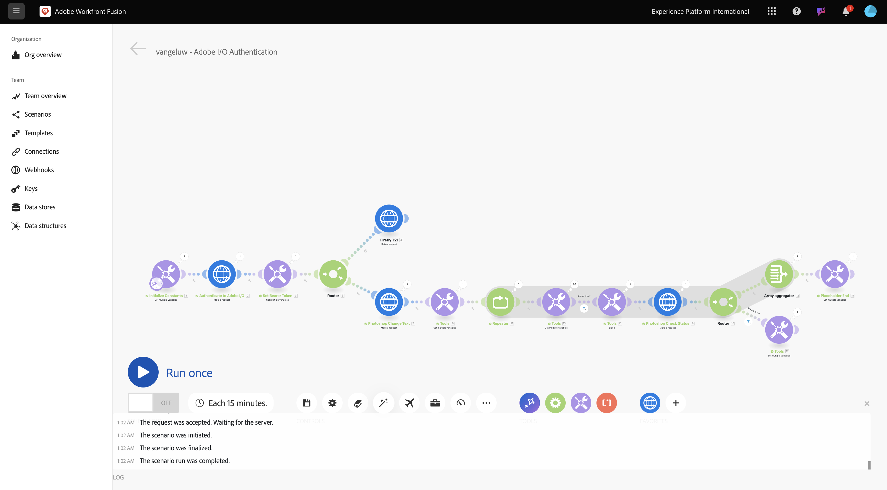
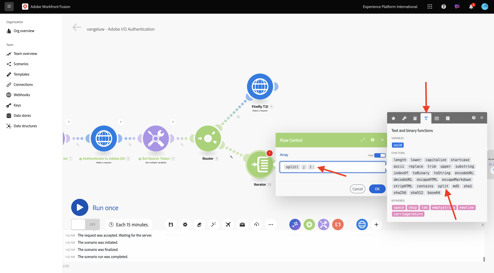
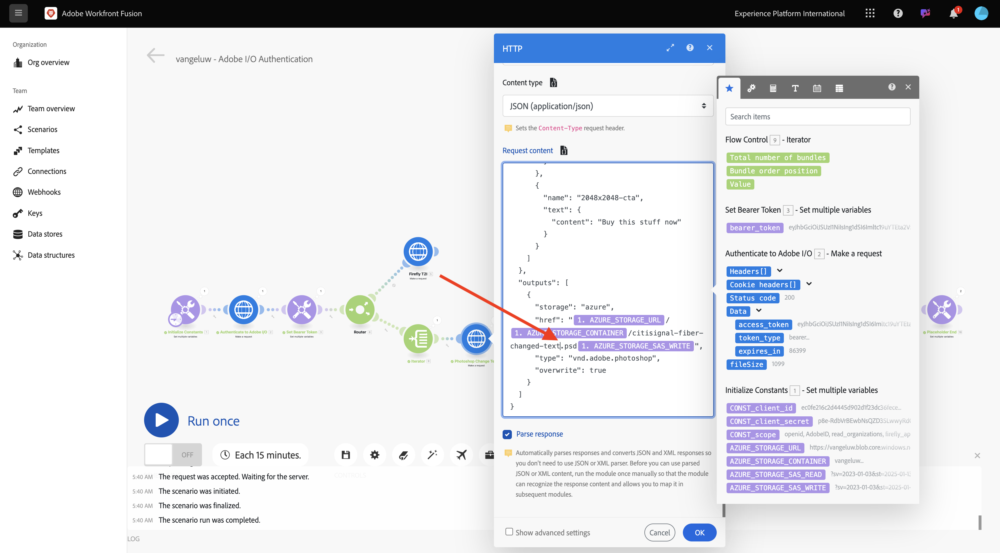
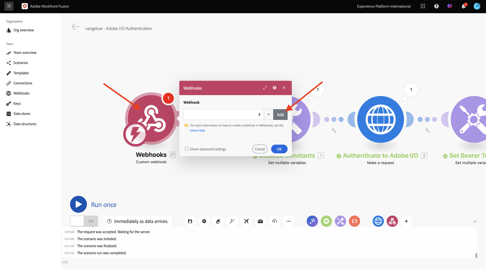
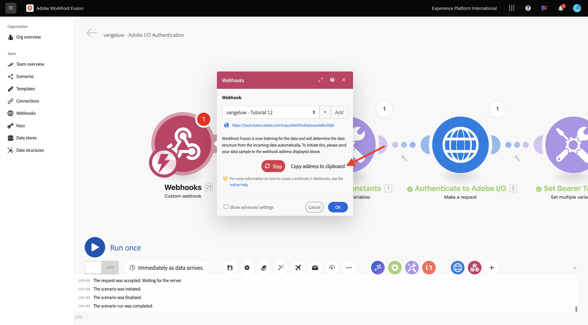
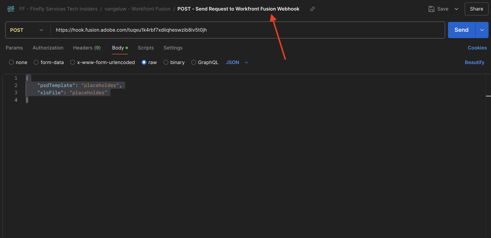

# 1.2.3使用Workfront Fusion實現流程自動化

瞭解如何使用Workfront Fusion實現流程自動化。

## 1.2.3.1反複處理多個值

您的情境應如下所示：



到目前為止，您已變更Photoshop檔案中的文字，改為使用靜態值。 為了縮放和自動化您的內容建立工作流程，需要反複處理值清單，並將這些值動態插入Photoshop檔案中。 在接下來的步驟中，您將新增一個水來反複運算現有案例中的值。

在&#x200B;**路由器**&#x200B;節點和&#x200B;**Photoshop變更文字**&#x200B;節點之間，選取&#x200B;**扳手**&#x200B;圖示並選取&#x200B;**新增模組**。


搜尋`flow`並選取&#x200B;**流量控制**。


選取&#x200B;**迭代器**。


您的畫面應如下所示：


雖然您可以讀取CSV檔案之類的輸入檔案，但目前，您需要透過定義文字字串並分割該文字檔案來使用基本版本的CSV檔案。

您可以選取&#x200B;**T**&#x200B;圖示找到&#x200B;**分割**&#x200B;函式，您可在其中看到所有可用函式來操作文字值。 選取&#x200B;**分割**&#x200B;函式，您應該會看到這個專案。



split函式預期分號前的值陣列，並預期您指定分號後的分隔符號。 對於此測試，您應該使用包含2個欄位的簡單陣列，**立即購買**&#x200B;和&#x200B;**按一下這裡**，而要使用的分隔符號為&#x200B;**，**。

透過取代目前空白的&#x200B;**分割**&#x200B;函式，在&#x200B;**陣列**&#x200B;欄位中輸入此專案： `{{split("Buy now, Click here "; ",")}}`。 選取&#x200B;**確定**。


選取&#x200B;**Photoshop變更文字**&#x200B;以新增某些變數，而非輸入和輸出欄位的靜態值。


在&#x200B;**要求內容**&#x200B;中，是文字&#x200B;**按一下這裡**。 此文字需要取代為來自您陣列的值。


刪除文字&#x200B;**按一下這裡**，並從&#x200B;**迭代器**&#x200B;節點選取變數&#x200B;**值**&#x200B;來取代它。 這可確保動態更新Photoshop檔案中按鈕上的文字。


您也需要更新用來在您的Azure儲存體帳戶中寫入檔案的檔案名稱。 如果檔案名稱是靜態的，則每個新的版序只會覆寫先前的檔案，因此會遺失自訂檔案。 目前的靜態檔案名稱是&#x200B;**citisignal-fiber-changed-text.psd**，您現在需要更新它。

將游標放在單字`text`後面。



首先，新增連字型大小`-`，然後選取值&#x200B;**組合訂單位置**。 這可確保對於第一次反複專案，Workfront Fusion會將`-1`新增到檔案名稱、第二次反複專案`-2`等等。 選取&#x200B;**確定**。


儲存您的情境，然後選取&#x200B;**執行一次**。


案例執行後，請返回Azure儲存體總管並重新整理資料夾。 之後，您應該會看到2個新建立的檔案。


下載並開啟每個檔案。 您應在按鈕上加上各種文字。 這是檔案`citisignal-fiber-changed-text-1.psd`。


這是檔案`citisignal-fiber-changed-text-2.psd`。


## 1.2.3.2使用webhook啟用您的情境

到目前為止，您已手動執行您的案例以進行測試。 現在來使用webhook更新您的情境，以便從外部環境啟動它。

選取&#x200B;**+**，搜尋&#x200B;**webhook**，然後選取&#x200B;**Webhook**。


選取&#x200B;**自訂webhook**。

拖曳並連線&#x200B;**自訂webhook**&#x200B;節點，使其連線到畫布上的第一個節點，稱為&#x200B;**初始化常數**。


選取&#x200B;**自訂webhook**&#x200B;節點。 然後，選取&#x200B;**新增**。



將&#x200B;**Webhook名稱**&#x200B;設定為`--aepUserLdap-- - Tutorial 1.2`。


勾選&#x200B;**取得要求標題**&#x200B;的方塊。 選取「**儲存**」。


您的webhook URL現已可用。 複製URL。



開啟Postman，並在集合&#x200B;**FF - Firefly Services技術業內人士**&#x200B;中新增資料夾。


為資料夾命名`--aepUserLdap-- - Workfront Fusion`。


在您剛建立的資料夾中，選取3個點&#x200B;**...**，然後選取&#x200B;**新增要求**。


將&#x200B;**方法型別**&#x200B;設定為&#x200B;**POST**，並將webhook的URL貼到位址列。


您必須傳送自訂內文，才能從外部來源將變數元素提供給Workfront Fusion案例。

移至&#x200B;**內文**&#x200B;並選取&#x200B;**原始**。


將下列文字貼入要求內文。 選取&#x200B;**傳送**。

```json
{
	"psdTemplate": "placeholder",
	"xlsFile": "placeholder"
}
```


回到Workfront Fusion後，您的自訂webhook上會顯示一則訊息，指出： **已成功判定**。


選取&#x200B;**儲存**，然後選取&#x200B;**執行一次**。 您的情境現在已啟用，但必須等到您在Postman中再次選取&#x200B;**傳送**&#x200B;後才會執行。


在Postman中再次選取&#x200B;**傳送**。


您的案例會再次執行，並像之前一樣建立2個檔案。


將您的Postman請求名稱變更為`POST - Send Request to Workfront Fusion Webhook`。



現在您必須開始使用變數&#x200B;**psdTemplate**。 您將使用Postman要求中的傳入變數，而不以硬式編碼方式編寫輸入檔案在&#x200B;**Photoshop變更文字**&#x200B;節點中的位置。

開啟&#x200B;**Photoshop變更文字**&#x200B;節點並移至&#x200B;**要求內容**。 選取&#x200B;**inputs**&#x200B;下的硬式編碼檔案名稱&#x200B;**citisignal-fiber.psd**&#x200B;並刪除它。


選取變數&#x200B;**psdTemplate**。 選取「**確定**」，然後儲存您的情境。


選取&#x200B;**開啟**&#x200B;以開啟您的情境。 您的案例目前正在執行不停機。


返回Postman，輸入檔案名稱`citisignal-fiber.psd`作為變數&#x200B;**psdTemplate**&#x200B;的值，然後再次選取&#x200B;**傳送**&#x200B;以再次執行您的案例。


透過將PSD範本指定為外部系統提供的變數，您現在已建立可重複使用的案例。

現在您已完成此練習。

## 後續步驟

使用聯結器[&#128279;](./ex4.md){target="_blank"}移至1.2.4 Automation

返回[使用Workfront Fusion進行Creative工作流程自動化](./automation.md){target="_blank"}

返回[所有模組](./../../../overview.md){target="_blank"}
