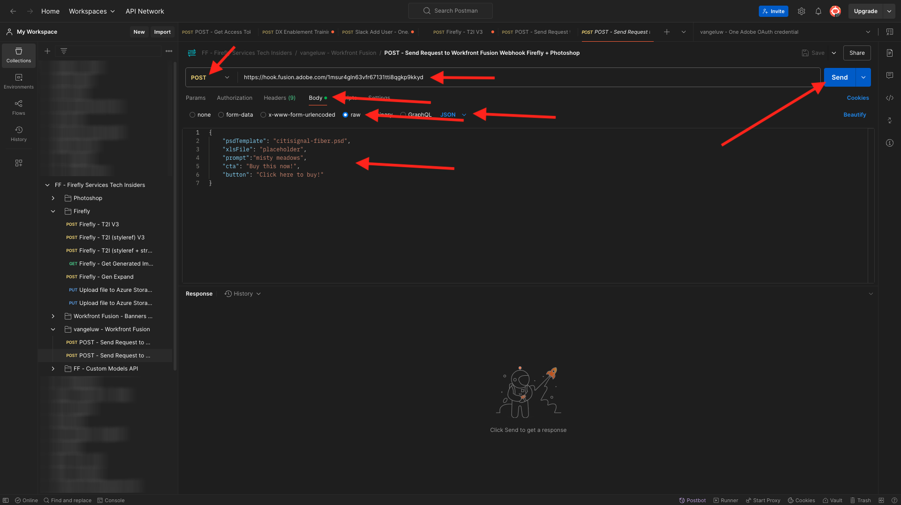
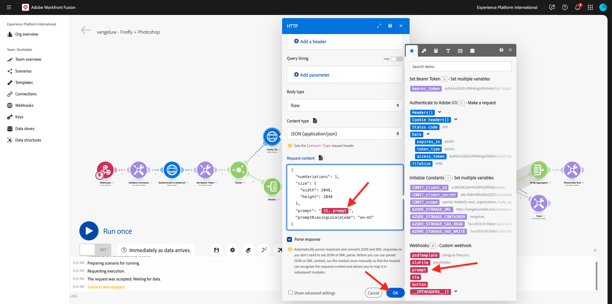
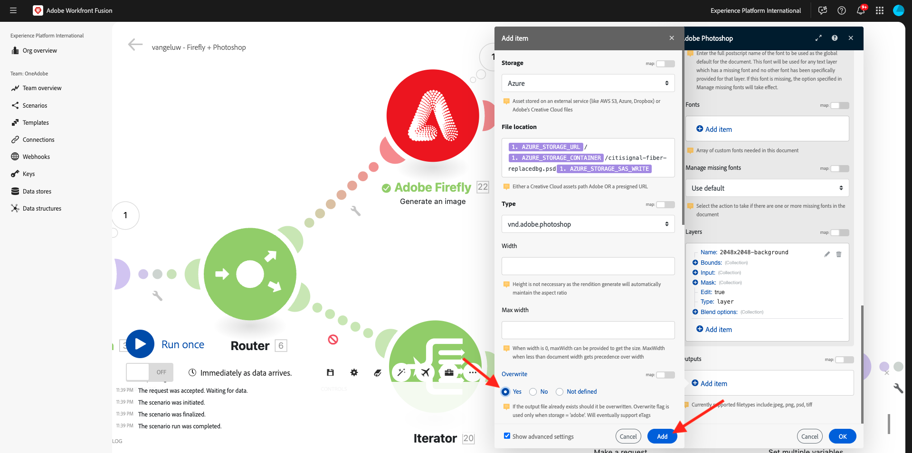
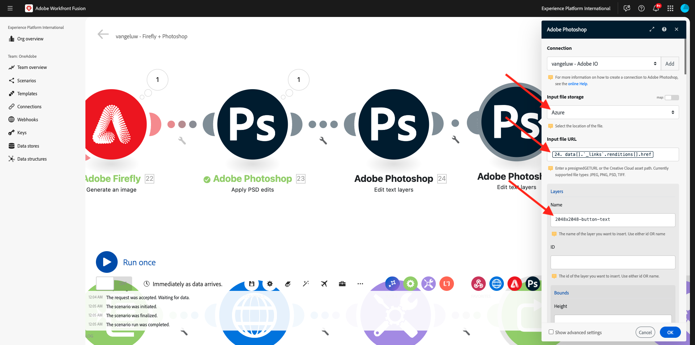

# 1.2.4使用聯結器自動化

現在，您將開始在Photoshop的Workfront Fusion中使用現成的聯結器，並將Firefly Text-2-Image請求和Photoshop請求連線到一個案例中。

## 1.2.4.1複製並準備您的情境

在左側功能表中，移至&#x200B;**案例**&#x200B;並選取您的資料夾`--aepUserLdap--`。 然後您應該會看到您之前建立的案例，其名稱為`--aepUSerLdap-- - Adobe I/O Authentication`。


按一下箭頭以開啟下拉式功能表，並選取&#x200B;**複製**。


將複製案例的&#x200B;**名稱**&#x200B;設定為`--aepUserLdap-- - Firefly + Photoshop`，並選取適當的&#x200B;**目標團隊**。 按一下&#x200B;**[新增**]以新增新的webhook。


將&#x200B;**Webhook名稱**&#x200B;設定為`--aepUserLdap-- - Firefly + Photoshop Webhook`。 按一下&#x200B;**儲存**。


您應該會看到此訊息。 按一下&#x200B;**儲存**。


您應該會看到此訊息。 按一下&#x200B;**Webhook**&#x200B;節點。


按一下&#x200B;**將地址複製到剪貼簿**，然後按一下&#x200B;**重新決定資料結構**。


開啟Postman。 在您之前使用的相同資料夾中新增請求。


請確定已套用下列設定：

- 要求名稱： `POST - Send Request to Workfront Fusion Webhook Firefly + Photoshop`
- 要求型別： `POST`
- 請求URL：貼上您從Workfront Fusion案例的webhook複製的URL。

移至&#x200B;**內文**&#x200B;並將&#x200B;**內文型別**&#x200B;設定為&#x200B;**原始** - **JSON**。 將下列裝載貼到&#x200B;**內文**&#x200B;中。

```json
{
    "psdTemplate": "citisignal-fiber.psd",
    "xlsFile": "placeholder",
    "prompt":"misty meadows",
    "cta": "Buy this now!",
    "button": "Click here to buy!"
}
```

此新裝載將確保從案例外部提供所有變數資訊，而非在案例中以硬式編碼提供。 在企業情境中，組織需要以可重複使用的方式定義情境，這表示許多變數需要提供為輸入變數，而不是在情境中以硬式編碼表示。

然後您應該擁有此專案。 按一下&#x200B;**傳送**。



Workfront Fusion Webhook仍在等待輸入。


按一下&#x200B;**傳送**&#x200B;後，郵件應該變更步驟&#x200B;**已順利決定**。 按一下&#x200B;**「確定」**。


## 1.2.4.2更新Firefly T2I節點

按一下節點&#x200B;**Firefly T2I**。 您應該會看到此訊息。 此要求中的提示先前已硬式編碼為欄位&#x200B;**中的**&#x200B;馬。 您現在將移除該硬式編碼文字，並以webhook中的欄位取代。


移除欄位&#x200B;**中的文字** hories，並以&#x200B;**Webhook**&#x200B;變數下的變數&#x200B;**提示字元**&#x200B;取代。 按一下&#x200B;**確定**&#x200B;以儲存變更。



## 1.2.4.2變更PSD檔案的背景

您現在將更新情境，使用現成可用的聯結器使其更聰明。 您也會將輸出從Firefly連線至Photoshop，以便PSD檔案的背景影像能使用Firefly「產生影像」動作的輸出動態變更。

在上一個練習中，您已停用&#x200B;**Firefly T2I**&#x200B;路由。 您現在應該還原該動作。 按一下&#x200B;**stop**&#x200B;圖示以再次啟用路由。


然後您會看到&#x200B;**停止**&#x200B;圖示消失。 接著，按一下通往前一個練習組態的另一個路由上的&#x200B;**扳手**&#x200B;圖示，並選取&#x200B;**停用路由**。


您應該會看到此訊息。 接著，將游標暫留在&#x200B;**Firefly T2I**&#x200B;節點上，然後按一下&#x200B;**+**&#x200B;圖示。


在搜尋功能表中輸入`Photoshop`，然後按一下&#x200B;**Adobe Photoshop**&#x200B;動作。


選取&#x200B;**套用PSD編輯**。


您應該會看到此訊息。 按一下&#x200B;**[新增**]，新增與Adobe Photoshop的連線。


依照以下方式設定您的連線：

- 連線型別：選取&#x200B;**Adobe Photoshop （伺服器對伺服器）**
- 連線名稱：輸入`--aepUserLdap-- - Adobe IO`
- 使用者端ID：貼上您的使用者端ID
- 使用者端密碼：貼上您的使用者端密碼

按一下&#x200B;**繼續**。


若要尋找您的&#x200B;**使用者端識別碼**&#x200B;和&#x200B;**使用者端密碼**，請移至[https://developer.adobe.com/console/home](https://developer.adobe.com/console/home){target="_blank"}並開啟您名為`--aepUserLdap-- One Adobe tutorial`的Adobe I/O專案。 移至&#x200B;**OAuth伺服器對伺服器**&#x200B;以尋找您的使用者端ID和使用者端密碼。 複製這些值，並貼到Workfront Fusion中的連線設定中。


按一下&#x200B;**繼續**&#x200B;後，驗證您的認證時，將會短暫顯示快顯視窗。 完成後，您應該會看到此內容。


您現在必須輸入您希望Fusion使用的PSD檔案位置。 對於&#x200B;**儲存體**，請選取&#x200B;**Azure**，對於&#x200B;**檔案位置**，請輸入`{{1.AZURE_STORAGE_URL}}/{{1.AZURE_STORAGE_CONTAINER}}/{{1.AZURE_STORAGE_SAS_READ}}`。 將游標放在第二個`/`旁邊。 接著，檢視可用的變數，然後向下捲動以尋找變數&#x200B;**psdTemplate**。 按一下變數&#x200B;**psdTemplate**&#x200B;以選取它。


您應該會看到此訊息。


一直向下捲動直到看到&#x200B;**圖層**。 按一下&#x200B;**新增專案**。


您應該會看到此訊息。 您現在需要在Photoshop PSD範本中輸入檔案背景所用的圖層名稱。


在&#x200B;**citisignal-fiber.psd**&#x200B;檔案中，您會找到用於背景的圖層。 在此範例中，該圖層名為&#x200B;**2048x2048-background**。


在Workfront Fusion對話方塊中貼上名稱&#x200B;**2048x2048-background**。


向下捲動，直到看到&#x200B;**輸入**&#x200B;為止。 您現在需要定義需要插入背景圖層的內容。 在此情況下，您需要選取Firefly T2I物件的輸出，其中包含動態產生的影像。

針對&#x200B;**儲存體**，選取&#x200B;**外部**。 針對&#x200B;**檔案位置**，從&#x200B;**Firefly T2I**&#x200B;要求的輸出中搜尋並尋找變數`data.outputs[].image.url`。


接著，向下捲動直到看到&#x200B;**編輯**&#x200B;為止。 將&#x200B;**Edit**&#x200B;設定為&#x200B;**是**&#x200B;並將&#x200B;**Type**&#x200B;設定為&#x200B;**Layer**。 按一下&#x200B;**新增**。


您應該會看到此訊息。 接下來，您需要定義動作的輸出。 按一下&#x200B;**輸出**&#x200B;下的&#x200B;**新增專案**。


選取&#x200B;**儲存體**&#x200B;的&#x200B;**Azure**，將此`{{1.AZURE_STORAGE_URL}}/{{1.AZURE_STORAGE_CONTAINER}}/citisignal-fiber-replacedbg.psd{{1.AZURE_STORAGE_SAS_WRITE}}`貼到&#x200B;**檔案位置**&#x200B;下，並選取&#x200B;**型別**&#x200B;下的&#x200B;**vnd.adobe.photoshop**。 按一下以啟用&#x200B;**顯示進階設定**。


在&#x200B;**進階設定**&#x200B;下，選取&#x200B;**是**以覆寫相同名稱的檔案。
按一下**新增**。



然後您應該擁有此專案。 按一下&#x200B;**「確定」**。


## 1.2.4.3變更PSD檔案的文字圖層

### 呼叫動作的文字

接著，將游標暫留在&#x200B;**Adobe Photoshop — 套用PSD編輯**&#x200B;節點上，然後按一下&#x200B;**+**&#x200B;圖示。


選取&#x200B;**Adobe Photoshop**。


選取&#x200B;**編輯文字圖層**。


您應該會看到此訊息。 首先，選取您先前已設定的Adobe Photoshop連線，名稱應為`--aepUserLdap-- Adobe IO`。

您現在需要定義&#x200B;**輸入檔**&#x200B;的位置，這是上一個步驟的輸出，而且在&#x200B;**圖層**&#x200B;下，您必須輸入您要變更的文字圖層的&#x200B;**名稱**。


針對&#x200B;**輸入檔案**，選取&#x200B;**輸入檔案儲存體**&#x200B;的&#x200B;**Azure**，並確定選取先前要求&#x200B;**Adobe Photoshop — 套用PSD編輯**&#x200B;的輸出，您可以在此取得： `data[]._links.renditions[].href`


開啟檔案&#x200B;**citisignal-fiber.psd**。 在檔案中，您會發現包含行動號召的圖層名為&#x200B;**2048x2048-cta**。


在對話方塊的&#x200B;**Name**&#x200B;下輸入名稱&#x200B;**2048x2048-cta**。


向下捲動，直到您看到&#x200B;**文字** > **內容**&#x200B;為止。 從Webhook承載中選取變數&#x200B;**cta**。


向下捲動直到看到&#x200B;**輸出**&#x200B;為止。 針對&#x200B;**儲存體**，選取&#x200B;**Azure**。 對於&#x200B;**檔案位置**，請輸入以下位置。 請注意，檔案名稱中新增了變數`{{timestamp}}`，用來確保產生的每個檔案都有唯一的名稱。 此外，請將&#x200B;**Type**&#x200B;設定為&#x200B;**vnd.adobe.photoshop**。 按一下&#x200B;**「確定」**。

`{{1.AZURE_STORAGE_URL}}/{{1.AZURE_STORAGE_CONTAINER}}/citisignal-fiber-changed-text-{{timestamp}}.psd{{1.AZURE_STORAGE_SAS_WRITE}}`


### 按鈕文字

用滑鼠右鍵按一下您剛建立的節點，然後選取&#x200B;**複製**。 這會建立第二個類似的物件。


您應該會看到此訊息。 首先，選取您先前已設定的Adobe Photoshop連線，名稱應為`--aepUserLdap-- Adobe IO`。

您現在需要定義&#x200B;**輸入檔**&#x200B;的位置，這是上一個步驟的輸出，而且在&#x200B;**圖層**&#x200B;下，您必須輸入您要變更的文字圖層的&#x200B;**名稱**。



針對&#x200B;**輸入檔案**，選取&#x200B;**輸入檔案儲存體**&#x200B;的&#x200B;**Azure**，並確定選取先前要求&#x200B;**Adobe Photoshop — 編輯文字圖層**&#x200B;的輸出，您可以在此取得： `data[]._links.renditions[].href`

開啟檔案&#x200B;**citisignal-fiber.psd**。 在檔案中，您會注意到包含行動號召的圖層名為&#x200B;**2048x2048-button-text**。


在對話方塊的&#x200B;**Name**&#x200B;下輸入名稱&#x200B;**2048x2048-cta**。


向下捲動，直到您看到&#x200B;**文字** > **內容**&#x200B;為止。 從Webhook承載中選取變數&#x200B;**cta**。


向下捲動直到看到&#x200B;**輸出**&#x200B;為止。 針對&#x200B;**儲存體**，選取&#x200B;**Azure**。 對於&#x200B;**檔案位置**，請輸入以下位置。 請注意，檔案名稱中新增了變數`{{timestamp}}`，用來確保產生的每個檔案都有唯一的名稱。 此外，請將&#x200B;**Type**&#x200B;設定為&#x200B;**vnd.adobe.photoshop**。 按一下&#x200B;**「確定」**。

`{{1.AZURE_STORAGE_URL}}/{{1.AZURE_STORAGE_CONTAINER}}/citisignal-fiber-changed-text-{{timestamp}}.psd{{1.AZURE_STORAGE_SAS_WRITE}}`


按一下[儲存]儲存變更。****


## 1.2.4.4 Webhook回應

將這些變更套用至您的Photoshop檔案後，您現在需要設定&#x200B;**Webhook回應**，此回應將傳回已啟動此案例的任何應用程式。

將游標停留在節點&#x200B;**Adobe Photoshop — 編輯文字圖層**&#x200B;並按一下&#x200B;**+**&#x200B;圖示。


搜尋&#x200B;**webhook**&#x200B;並選取&#x200B;**Webhook**。


選取&#x200B;**Webhook回應**。


您應該會看到此訊息。 在&#x200B;**內文**&#x200B;中貼上以下承載。

```json
{
    "newPsdTemplate": ""
}
```


從前一個要求的輸出中選取路徑`data[]._links.renditions[].href`。 啟用&#x200B;**顯示進階設定**&#x200B;的核取方塊，然後按一下&#x200B;**新增專案**。


在欄位&#x200B;**索引鍵**&#x200B;中，輸入`Content-Type`。 在欄位&#x200B;**值**&#x200B;中，輸入`application/json`。 按一下&#x200B;**儲存**。


然後您應該擁有此專案。 按一下&#x200B;**「確定」**。


按一下&#x200B;**自動對齊**。


您應該會看到此訊息。 按一下&#x200B;**執行一次**。


返回Postman並按一下&#x200B;**傳送**。 這裡使用的提示是&#x200B;**霧狀的Meadows**。


隨後將啟動情境，並在一段時間後，Postman中將顯示包含新建立PSD檔案URL的回應。


提醒您：一旦案例在Workfront Fusion中執行，您就可以按一下每個節點上方的泡泡圖來檢視每個節點的資訊。


使用Azure儲存體總管，您可以在Azure儲存體總管中按兩下新建立的PSD檔案，找到並開啟該檔案。


您的檔案應該會看起來像這樣，背景會由&#x200B;**霧狀草甸**&#x200B;所取代。


如果您再次執行情境，然後使用其他提示從Postman傳送新請求，您就會看到情境變得多麼容易且可重複使用。 在此範例中，使用的新提示是&#x200B;**sunny desert**。


幾分鐘後，新的PSD檔案已經以新背景產生。


## 後續步驟

移至[Firefly Services Automation的摘要與優點](./summary.md){target="_blank"}

返回[自動化Adobe Firefly服務](./automation.md){target="_blank"}

返回[所有模組](./../../../overview.md){target="_blank"}
