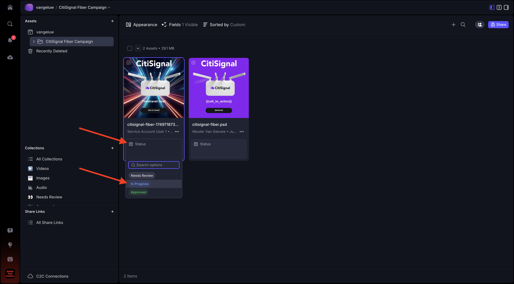
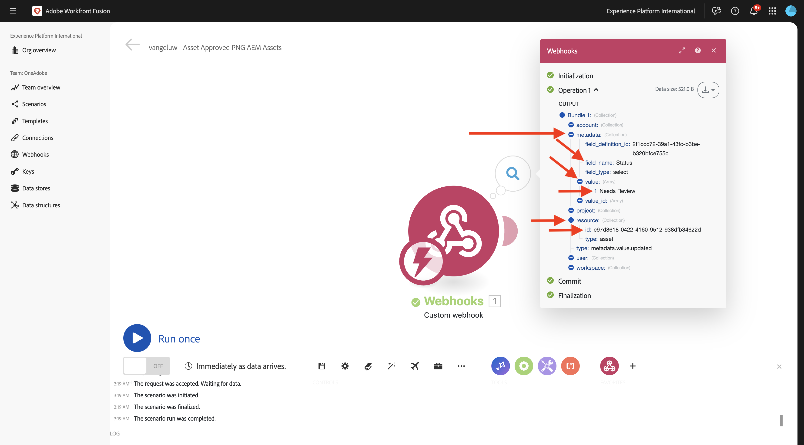
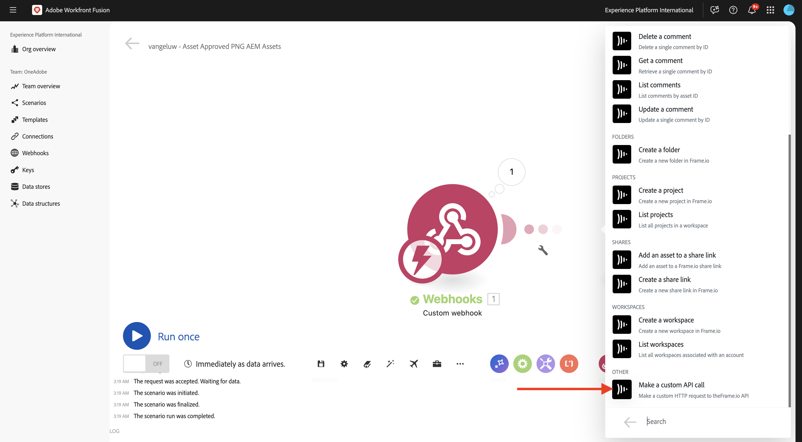
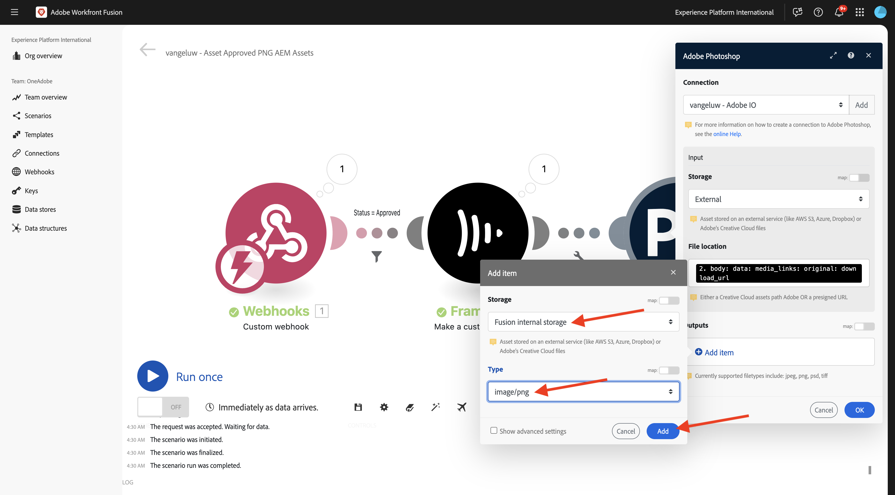
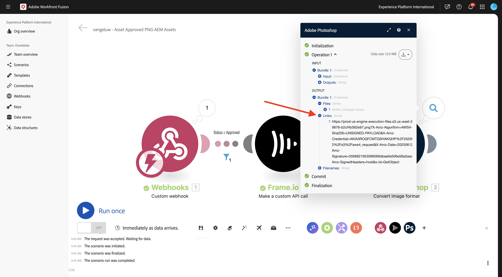
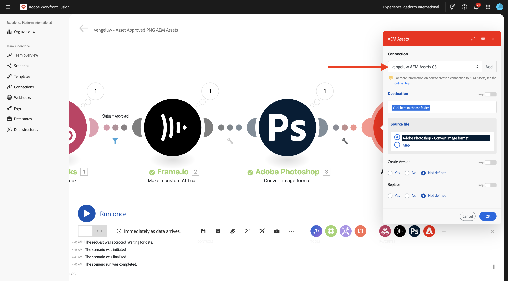
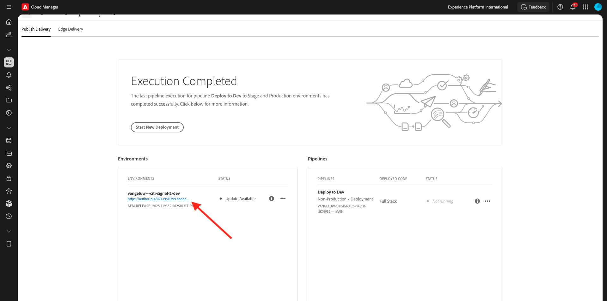
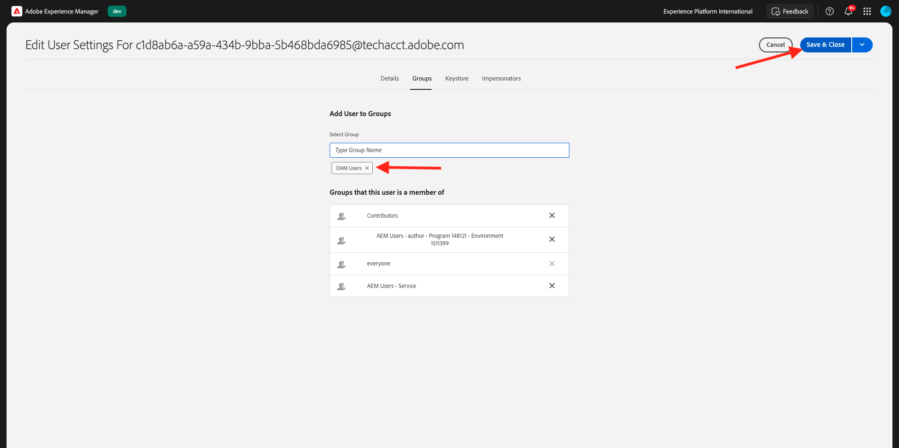
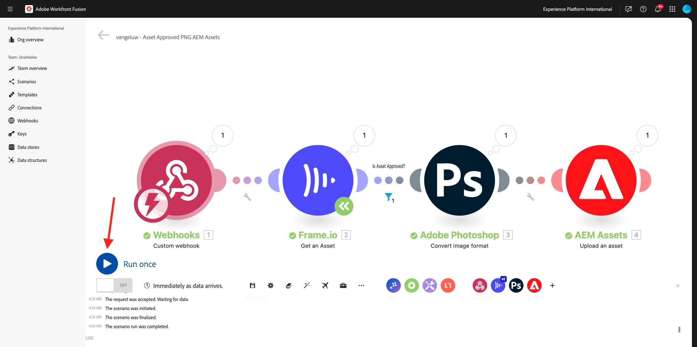
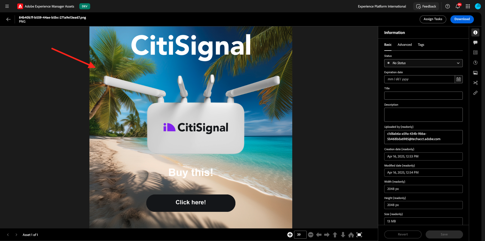

# 1.2.6框架I/O至Workfront Fusion至AEM Assets

>[!IMPORTANT]
>
>為了完成此練習，您需要有權存取運作中的AEM Assets CS作者環境。 如果您按照練習[Adobe Experience Manager Cloud Service和Edge Delivery Services](./../../../modules/asset-mgmt/module2.1/aemcs.md){target="_blank"}，您將有權存取這樣的環境。

>[!IMPORTANT]
>
>如果您先前已使用Author環境設定AEM Assets CS計畫，可能是您的AEM CS沙箱已休眠。 考慮到讓這樣的沙箱解除休眠需要10-15分鐘，最好現在開始解除休眠過程，以免以後卡住。

在上一個練習中，您已設定一個情境，使用Adobe Firefly、Adobe Photoshop API和Workfront Fusion自動產生Photoshop PSD檔案的變數。 該案例的輸出是新的Photoshop PSD檔案。

但業務團隊不需要PSD檔案，他們需要PNG檔案或JPG檔案。 在本練習中，您將設定新的自動化功能，一旦影格I/O中的資產獲得核准，就會產生PNG檔案，且PNG檔案會自動儲存至AEM Assets中。

## 1.2.6.1建立新情境

移至[https://experience.adobe.com/](https://experience.adobe.com/){target="_blank"}。 開啟&#x200B;**Workfront Fusion**。

在左側功能表中，移至&#x200B;**案例**&#x200B;並選取您的資料夾`--aepUserLdap--`。 按一下&#x200B;**建立新情境**。

使用名稱`--aepUserLdap-- - Asset Approved PNG AEM Assets`。 接下來，按一下「**」？**&#x200B;模組，輸入搜尋字詞`webhook`，然後按一下&#x200B;**Webhooks**。

按一下&#x200B;**自訂webhook**。

按一下&#x200B;**[新增**]以建立新的webhook。

使用名稱`--aepUserLdap-- - Frame.io Webhook`。 按一下&#x200B;**儲存**。

您應該會看到此訊息。 按一下&#x200B;**將地址複製到剪貼簿**。

## 1.2.6.2在Frame.io中設定Webhook

移至[https://developer.frame.io/](https://developer.frame.io/){target="_blank"}。 按一下&#x200B;**開發人員工具**，然後選擇&#x200B;**自訂動作**。

按一下&#x200B;**建立Webhook**。

輸入下列值：

- **名稱**：使用`--aepUserLdap-- - Asset Labels Updated`
- **URL**：輸入您剛才在Workfront Fusion中建立的webhook的URL
- **團隊**：選取適當的Frame.io團隊，在此案例中為&#x200B;**一個Adobe教學課程**。

向下捲動並啟用&#x200B;**資產標籤 — 已更新**&#x200B;旁的核取方塊。 按一下&#x200B;**提交**。

您應該會看到此訊息。

前往[https://app.frame.io/projects](https://app.frame.io/projects){target="_blank"}，然後前往您之前建立的資料夾，該資料夾應該命名為`--aepUserLdap--`。 按兩下以開啟在上一個練習中建立的資產。

您應該會看到類似這樣的內容。 按一下欄位&#x200B;**無狀態**&#x200B;並將狀態變更為&#x200B;**進行中**。

切換回Workfront Fusion。 您現在應該會看到連線是&#x200B;**已成功判定**。

按一下[儲存]儲存變更，然後按一下[執行一次]&#x200B;**執行快速測試。**&#x200B;**&#x200B;**

切換回Frame.io並按一下&#x200B;**進行中**&#x200B;欄位，並將狀態變更為&#x200B;**需要檢閱**。

切換回Workfront Fusion，然後按一下&#x200B;**自訂webhook**&#x200B;模組上的泡泡。

泡泡圖的詳細檢視畫面會顯示從Frame.io收到的資料。 您應該會看到各種ID。例如，欄位&#x200B;**resource.id**&#x200B;會顯示資產&#x200B;**citisignal-fiber.psd**&#x200B;之Frame.io中的唯一ID。

## 1.2.6.3從Frame.io取得資產詳細資訊

現在Frame.io與Workfront Fusion之間的通訊已透過自訂webhook建立，您應該取得有關其狀態標籤已更新的資產的更多詳細資訊。 為此，您將再次使用Workfront Fusion中的Frame.io聯結器，類似於上一個練習。

按一下&#x200B;**？**&#x200B;模組並輸入搜尋字詞`frame`。 按一下&#x200B;**Frame.io**。

按一下&#x200B;**Frame.io （舊版）**。

按一下&#x200B;**取得資產**。

確認連線已設定為您在上一個練習中建立的連線，應該命名為`--aepUserLdap-- - Frame.io Token`。

接下來，您必須提供&#x200B;**資產識別碼**。 **資產ID**&#x200B;由Frame.io共用至Workfront Fusion，做為初始&#x200B;**自訂webhook**&#x200B;通訊的一部分，可以在&#x200B;**resource.id**&#x200B;欄位下找到。 選取&#x200B;**resource.id**&#x200B;並按一下&#x200B;**確定**。

按一下[儲存]儲存變更，然後按一下[執行一次]以測試設定。**&#x200B;**&#x200B;**&#x200B;**

切換回Frame.io並按一下欄位&#x200B;**需要檢閱**&#x200B;並將狀態變更為&#x200B;**進行中**。

返回Workfront Fusion並按一下&#x200B;**Frame.io — 取得資產**&#x200B;模組。 您應該會看到類似的概觀。

在Frame.io提供的資產詳細資訊中，您可以找到名為&#x200B;**Label**&#x200B;的欄位，其設定為&#x200B;**in_progress**。 您稍後必須使用該欄位來設定篩選器。

## 1.2.6.4轉換成PNG

將游標暫留在模組&#x200B;**Frame.io — 取得資產**&#x200B;並按一下&#x200B;**+**&#x200B;圖示。

輸入搜尋字詞`photoshop`，然後按一下&#x200B;**Adobe Photoshop**。

按一下&#x200B;**轉換影像格式**。

確認欄位&#x200B;**Connection**&#x200B;正在使用您先前建立的名為`--aepUserLdap-- - Adobe IO`的連線。

在&#x200B;**Input**&#x200B;下，將欄位&#x200B;**Storage**&#x200B;設定為&#x200B;**External**，並將&#x200B;**檔案位置**&#x200B;設定為使用模組&#x200B;**Frame.io傳回的變數** Original **— 取得資產**。

接著，按一下&#x200B;**輸出**&#x200B;下的&#x200B;**新增專案**。

針對&#x200B;**輸出**&#x200B;組態，請將欄位&#x200B;**儲存體**&#x200B;設定為&#x200B;**Fusion內部儲存體**，並將&#x200B;**型別**&#x200B;設定為&#x200B;**影像/png**。 按一下&#x200B;**儲存**。

按一下&#x200B;**「確定」**。

按一下[儲存]儲存變更。**&#x200B;**

接下來，您應該設定篩選器，以確保只有狀態為&#x200B;**已核准**&#x200B;的資產會呈現PNG檔案。 若要這麼做，請按一下模組&#x200B;**Frame.io — 取得資產**&#x200B;與&#x200B;**Adobe Photoshop — 轉換影像格式**&#x200B;之間的&#x200B;**扳手**&#x200B;圖示，然後選取&#x200B;**設定篩選器**。

設定下列欄位：

- **標籤**：使用`Is Asset Approved`。
- **條件**：從&#x200B;**Frame.io的回應中選取欄位**&#x200B;標籤&#x200B;**— 取得資產**&#x200B;模組。
- **基本運運算元**：選取&#x200B;**等於**。
- **值**： `approved`。

按一下&#x200B;**「確定」**。

按一下[儲存]儲存變更，然後按一下[執行一次]以測試設定。**&#x200B;**&#x200B;**&#x200B;**

切換回Frame.io並按一下&#x200B;**進行中**&#x200B;欄位，並將狀態變更為&#x200B;**已核准**。

返回Workfront Fusion。 您現在應該會看到案例中的所有模組都已成功執行。 按一下&#x200B;**Adobe Photoshop — 轉換影像格式**&#x200B;模組上的泡泡。

在執行&#x200B;**Adobe Photoshop — 轉換影像格式**&#x200B;模組的詳細資訊中，您可以看到現在已產生PNG檔案。 下一步是將該檔案儲存在AEM Assets CS中。

## 1.2.6.5在AEM Assets CS中儲存PNG

將游標暫留在&#x200B;**Adobe Photoshop — 轉換影像格式**&#x200B;模組上，然後按一下&#x200B;**+**&#x200B;圖示。

輸入搜尋字詞`aem`並選取&#x200B;**AEM Assets**。

按一下&#x200B;**上傳資產**。

您現在需要設定與AEM Assets CS的連線。 按一下&#x200B;**新增**。

使用下列設定：

- **連線型別**： **AEM Assets as a Cloud Service**。
- **連線名稱**： `--aepUserLdap-- AEM Assets CS`。
- **執行個體URL**：複製您AEM Assets CS作者環境的執行個體URL，看起來應該像這樣： `https://author-pXXXXX-eXXXXXXX.adobeaemcloud.com`。
- **存取詳細資料填入選項**：選取&#x200B;**提供JSON**。

您現在需要提供JSON格式的&#x200B;**技術帳戶認證**。 使用AEM Cloud Manager時，需遵循許多步驟才能達成此目的。 在執行此操作時，請保持此畫面開啟。

移至[https://my.cloudmanager.adobe.com](https://my.cloudmanager.adobe.com){target="_blank"}。 您應該選取的組織是`--aepImsOrgName--`。 您將會看到類似這樣的內容。 按一下以開啟您的程式，程式應該命名為`--aepUserLdap-- - Citi Signal`。

按一下3個點&#x200B;**...**，然後選取&#x200B;**Developer Console**。

按一下&#x200B;**使用Adobe登入**。

接著您就會進入&#x200B;**Developer Console**。 按一下&#x200B;**建立新的技術帳戶**。

您應該會看到類似這樣的內容。 將完整的JSON裝載複製到剪貼簿。

返回Workfront Fusion，並將完整的JSON裝載貼到&#x200B;**JSON格式的技術帳戶認證**&#x200B;欄位中。 按一下&#x200B;**繼續**。

您的連線將會經過驗證，在成功後，您的連線將會在AEM Assets模組中自動選取。 下一步要做的就是設定資料夾。 在練習中，您應該建立新的專用資料夾。

若要建立新的專用資料夾，請移至[https://experience.adobe.com](https://experience.adobe.com/){target="_blank"}。 確保選取正確的Experience Cloud執行個體，應為`--aepImsOrgName--`。 然後，按一下&#x200B;**Experience Manager Assets**。

在您的AEM Assets CS環境中按一下&#x200B;**選取**，應該命名為`--aepUserLdap-- - Citi Signal dev`。

移至&#x200B;**資產**&#x200B;並按一下&#x200B;**建立資料夾**。

輸入名稱`--aepUserLdap-- - Frame.io PNG`並按一下&#x200B;**建立**。

接著會建立您的資料夾。

返回Workfront Fusion，按一下&#x200B;**按一下這裡以選擇資料夾**，然後選擇資料夾`--aepUserLdap-- - Frame.io PNG`。

確認目的地已設為`--aepUserLdap-- - Frame.io PNG`。 然後，在&#x200B;**Source檔案**&#x200B;底下，選取&#x200B;**地圖**。

在&#x200B;**檔案名稱**&#x200B;底下，選擇變數`{{3.filenames[]}}`。

在&#x200B;**資料**&#x200B;底下，選擇變數`{{3.files[]}}`。

>[!NOTE]
>
>可以使用下列語法手動指定Workfront Fusion中的變數： `{{3.filenames[]}}`。 變數中的數字會參考情境中的模組。 在此範例中，您可以看到情境中的第三個模組稱為&#x200B;**Adobe Photoshop — 轉換影像格式**，其序號為&#x200B;**3**。 這表示變數`{{3.filenames[]}}`將會從序號為3的模組存取欄位&#x200B;**檔案名稱[]**。 序號有時可能不同，因此在複製/貼上這類變數時請務必注意，並務必確認所使用的序號是否正確。

按一下&#x200B;**「確定」**。

按一下[儲存]儲存變更。**&#x200B;**

接下來，您需要為您剛剛建立的技術帳戶設定特定許可權。 當帳戶是在&#x200B;**Cloud Manager**&#x200B;的&#x200B;**Developer Console**&#x200B;中建立時，已授予&#x200B;**讀取**&#x200B;存取權，但在此使用案例中，需要&#x200B;**寫入**&#x200B;存取權。 您可以前往AEM CS Author環境完成此操作。

移至[https://my.cloudmanager.adobe.com](https://my.cloudmanager.adobe.com){target="_blank"}。 您應該選取的組織是`--aepImsOrgName--`。 按一下以開啟您的程式，程式應該命名為`--aepUserLdap-- - Citi Signal`。 您將會看到類似這樣的內容。 按一下作者URL。

按一下&#x200B;**使用Adobe登入**。

移至&#x200B;**設定** > **安全性** > **使用者**。

按一下以開啟Technical Account使用者帳戶。

移至&#x200B;**群組**&#x200B;並將此「技術帳戶」使用者新增至群組&#x200B;**DAM-Users**。

按一下&#x200B;**儲存並關閉**。

返回Workfront Fusion。 按一下&#x200B;**執行一次**&#x200B;以測試您的情境。

切換回Frame.io，並確認您的資產狀態已再次變更為&#x200B;**已核准**。

>[!NOTE]
>
>您可能需要先將它變更回&#x200B;**進行中**&#x200B;或&#x200B;**需要檢閱**，然後再變更回&#x200B;**已核准**。

之後將啟動您的Workfront Fusio案例，並成功完成。 檢視&#x200B;**AEM Assets**&#x200B;模組上泡泡圖中的資訊，即可看出PNG檔案已成功儲存在AEM Assets CS中。

返回AEM Assets CS並開啟資料夾`--aepUserLdap-- - Frame.io PNG`。 您現在應該會看到在Workfront Fusion案例中產生的PNG檔案。 連按兩下檔案以開啟。

您現在可以看到有關所產生PNG檔案中繼資料的更多詳細資料。

您現在已成功完成此練習。

## 後續步驟

移至[使用Workfront Fusion進行Creative工作流程自動化的摘要與優點](./summary.md){target="_blank"}

返回[使用Workfront Fusion進行Creative工作流程自動化](./automation.md){target="_blank"}

返回[所有模組](./../../../overview.md){target="_blank"}
