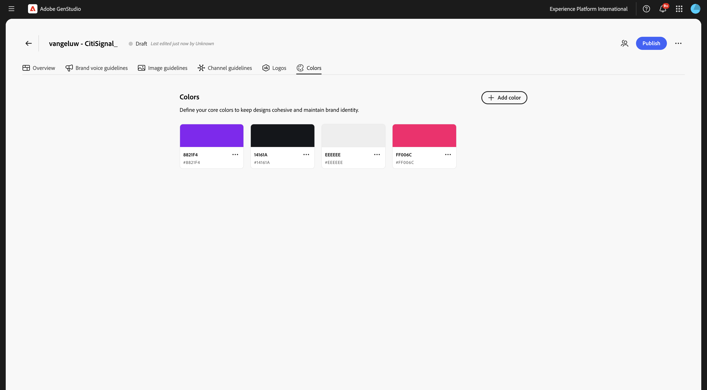
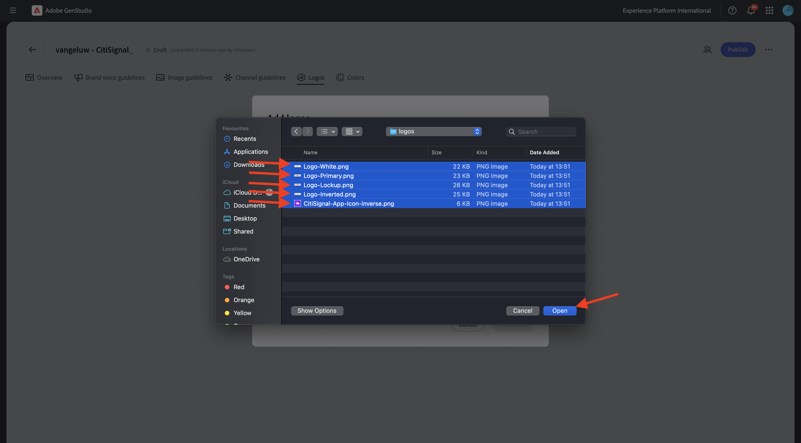
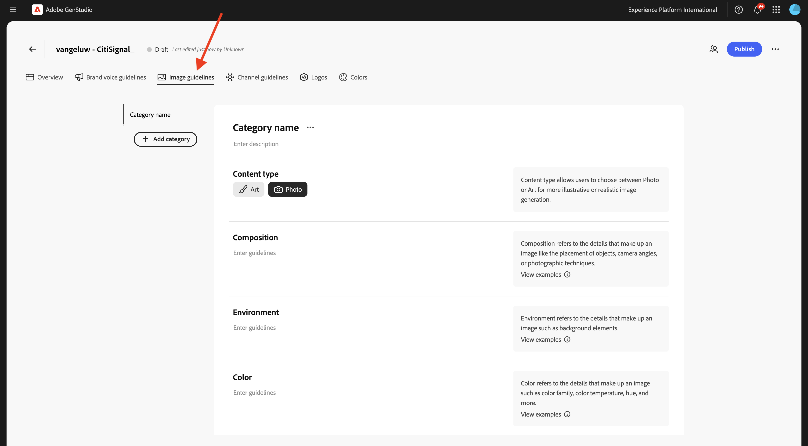
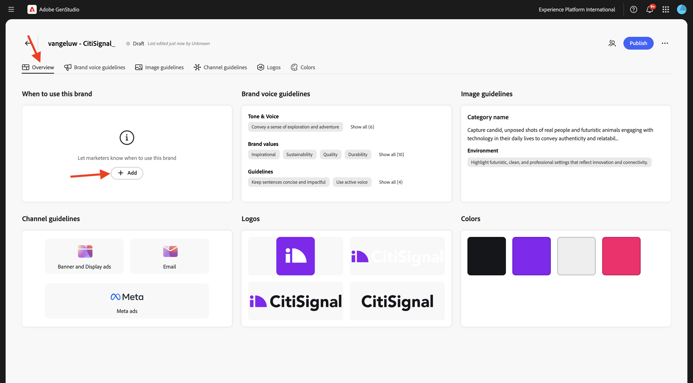
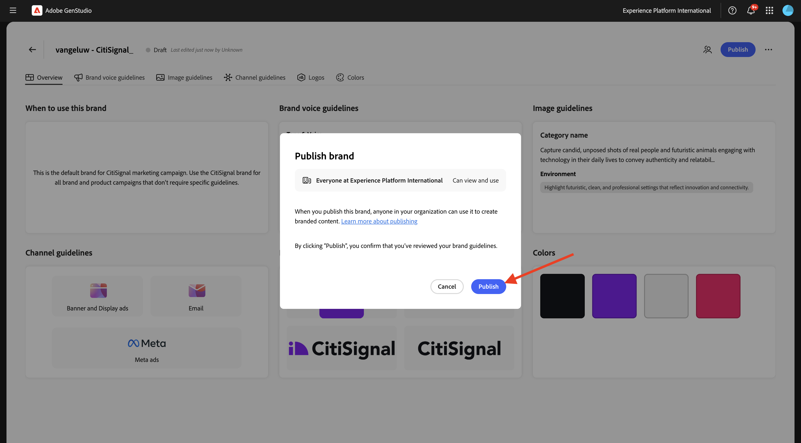

# 1.3.1設定：品牌

移至[https://experience.adobe.com/](https://experience.adobe.com/){target="_blank"}。 開啟&#x200B;**GenStudio**。


您應該會看到此訊息。


使用GenStudio for Performance Marketing的第一件事就是設定您的品牌。 按一下&#x200B;**品牌**&#x200B;圖示。


按一下&#x200B;**+新增品牌**。


輸入您品牌的名稱`--aepUserLdap-- - CitiSignal`。 選取&#x200B;**手動新增**，然後按一下&#x200B;**新增品牌**。


## 1.3.1.1色彩

您應該會看到此訊息。 按一下&#x200B;**色彩**。


按一下&#x200B;**+新增色彩**。


有4種不同的顏色可新增：

- `#8821F4`
- `#14161A`
- `#EEEEEE`
- `#FF006C`

輸入色彩`#8821F4`的十六進位代碼。 按一下&#x200B;**新增**。


按一下&#x200B;**+新增色彩**。


輸入色彩`#14161A`的十六進位代碼。 按一下&#x200B;**新增**。


按一下&#x200B;**+新增色彩**。


輸入色彩`#EEEEEE `的十六進位代碼。 按一下&#x200B;**新增**。


按一下&#x200B;**+新增色彩**。


輸入色彩`#FF006C `的十六進位代碼。 按一下&#x200B;**新增**。


您現在應該擁有此專案。



## 1.3.1.2標誌

將檔案[CitiSignal-GSPeM-assets.zip](../../../assets/gspem/CitiSignal-GSPeM-assets.zip)下載到您的案頭並解壓縮。


接著，移至&#x200B;**標誌**。 按一下&#x200B;**+新增標誌**。


按一下&#x200B;**瀏覽**。


前往資料夾&#x200B;**CitiSignal-GSPeM-assets** > **標誌**，並選取這些檔案。 按一下&#x200B;**「開啟」**。



然後您應該擁有此專案。 按一下&#x200B;**新增標誌**。


然後您應該擁有此專案。


## 1.3.1.3品牌語音准則

接著，移至&#x200B;**品牌語音准則**。


對於&#x200B;**音調和語音**，請使用這個選項：

```
• Convey a sense of exploration and adventure
• Be authentic and conversational
• Evoke excitement and curiosity
• Speak honestly and straightforwardly
• Be approachable and relatable
• Use everyday language
```


對於&#x200B;**品牌值**，請使用此：

```
• Inspirational
• Sustainability
• Quality
• Durability
• Functionality
• Reliability
• Community-oriented
• Be inclusive and welcome diversity
• Encourage active lifestyles
• Promote discovery
```


對於&#x200B;**編輯指南**，請使用以下內容：

```
• Keep sentences concise and impactful
• Use active voice
• Lists, bullets, and series should be consistent — either they all start with a noun, or they all start with a verb
• Use serial commas
```


對於&#x200B;**編輯限制**，請使用以下專案：

```
• Avoid activity-specific jargon unless it’s widely adopted
• Avoid promoting the skill level or experience level of the user of our outdoor equipment
• Avoid technical language or jargon
```


## 1.3.1.4影像指導方針

接著，移至&#x200B;**影像指導方針**。



將&#x200B;**內容型別**&#x200B;設定為&#x200B;**Art**，對於&#x200B;**描述**，請使用下列專案：

```
Capture candid, unposed shots of real people and futuristic animals engaging with technology in their daily lives to convey authenticity and relatability.
```


對於&#x200B;**組合**，請使用此：

```
Focus on the experiences, speed and emotions of using technology, rather than just the products themselves.
```


針對&#x200B;**環境**，請使用此：

```
Highlight futuristic, clean, and professional settings that reflect innovation and connectivity.
```


若為&#x200B;**色彩**，請使用此選項：

```
Use a palette inspired by technology, including sleek metallics, cool purple and blue, and neutral tones.
```


對於&#x200B;**照明**，請使用此：

```
Utilize bright, natural lighting to create a welcoming and dynamic atmosphere.
```


針對&#x200B;**情境**，請使用此專案：

```
Each image should evoke a feeling of speed, innovation and being part of the future.
```


對於&#x200B;**Restrictions**，請使用此：

```
Avoid cluttered or busy backgrounds that detract from the main subject.
```


## 1.3.1.4頻道准則

接著，移至&#x200B;**頻道准則**。


對於&#x200B;**電子郵件**，請使用下列值：

- **一般**

```
• Use simple, short sentences
• Be clear and concise
• Invoke a sense of adventure and exploration
```

- **主旨列**

```
• Limit to less than 8 words
• Provide specific details about what’s inside the email
• Use sentence case
• Do not use end punctuation
```

- **Preheader**

```
• Limit to less than 80 characters
• Provide specific details about what’s inside the email
• Use sentence case
• Use ending punctuation
```

- **標題**

```
• Limit to less than 12 words
• Generate excitement through compelling and exciting statements
• Use sentence case
```

- **Sub-headline**：暫時留空

- **內文**

```
• Limit to less than 120 words
• Use bullet points for lists containing more than 3 items
• Use between 0 to 4 headings within the body to separate main ideas
• Use sentence case
• Use ending punctuation
```

- **Call-to-action (CTA)**

```
• Limit to between 1 to 3 short words
• Limit to less than 20 characters
• Use an action-oriented verb as the first word and intended action the end-user should take
• Avoid ending punctuation
• Use title case
```


對於&#x200B;**中繼廣告**，請使用下列值：

- **一般**

```
• Use simple, short sentences
• Be clear and concise
• Invoke a sense of adventure and exploration
• Make product names prominent
• Use community-building concepts and language
```

- **標題**

```
• Limit  to less than 8 words
• Limit to less than 27 characters
• Make it clear what action the reader should take
• Use sentence case
• Avoid ending punctuation
```

- **內文**

```
• Limit to less than 125 characters
• Use sentence case
• Use ending punctuation
```

- **在影像文字**&#x200B;上：暫時留空


針對&#x200B;**橫幅和顯示廣告**，請使用下列值：

- **一般**

```
• Make readers feel inspired, interested, and sure of the next step
• Avoid word repetition
• Make product names prominent
```

- **標題**

```
• Clearly state the main benefit of the offer
• Use sentence case
• Use ending punctuation
• Limit to less than 60 characters
```

- **Sub-headline**：暫時留空

- **內文**

```
• Communicate the benefits of clicking into the offer
• Use sentence case
• Use ending punctuation
```

- **Call-to-action (CTA)**

```
• Limit to between 1 to 3 short words
• Limit to less than 20 characters
• Use an action-oriented verb as the first word
• Use title case
• Avoid ending punctuation
```


對於&#x200B;**LinkedIn**，請使用下列值：

- **一般**：暫時留空

- **Headline**：暫時留空

- **描述**：暫時留空

- **簡介文字**：暫時留空

- **在影像文字**&#x200B;上：暫時留空


最後，移至&#x200B;**總覽**。 您現在可以看到所有已設定專案的概觀。 最後要做一件事。 按一下&#x200B;**何時使用此品牌**&#x200B;下的&#x200B;**+新增**。



輸入以下文字並按一下&#x200B;**儲存變更**。

```
This is the default brand for CitiSignal marketing campaign. Use the CitiSignal brand for all brand and product campaigns that don't require specific guidelines.
```


按一下&#x200B;**發佈**。


再按一下&#x200B;**發佈**。



您的品牌現已發佈，此品牌現在可用於建立品牌內容。 按一下&#x200B;**「完成」**。


## 後續步驟

移至[設定：角色、產品和範本](./ex2.md){target="_blank"}

返回[GenStudio for Performance Marketing](./genstudio.md){target="_blank"}

返回[所有模組](./../../../overview.md){target="_blank"}
