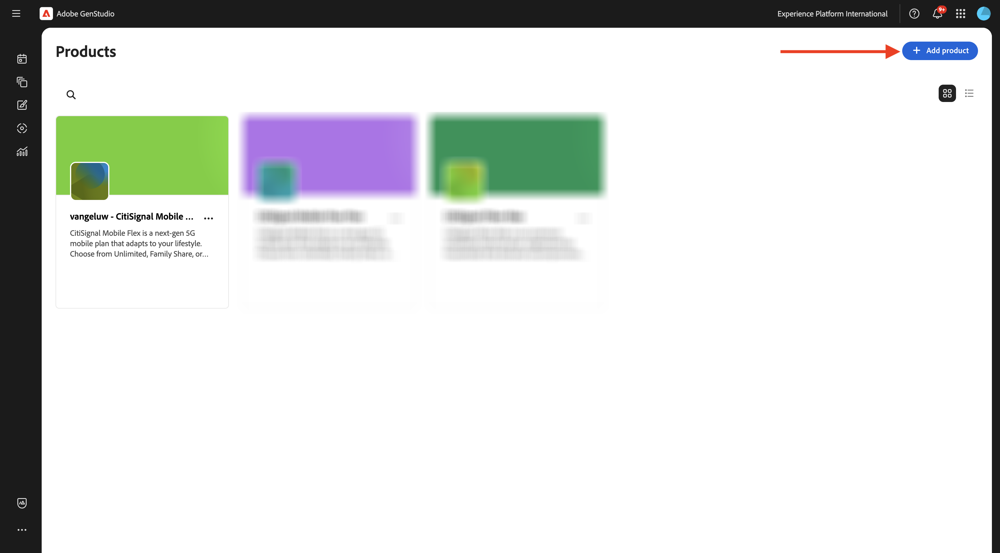
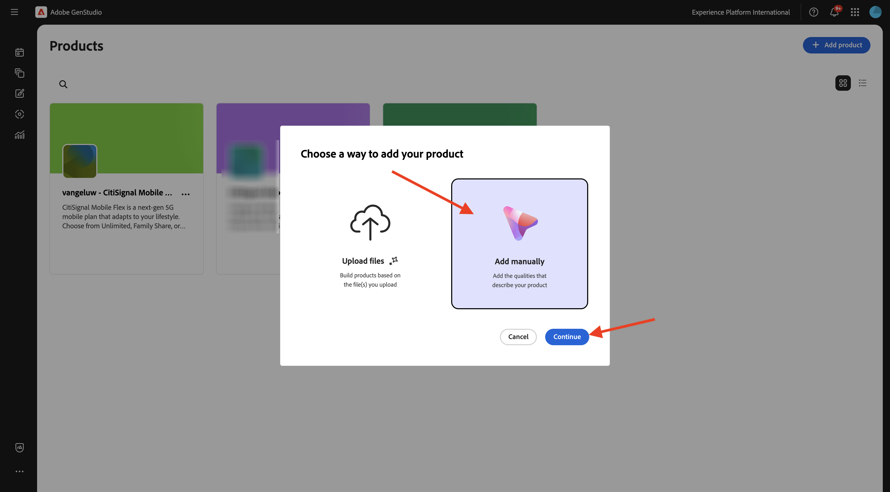
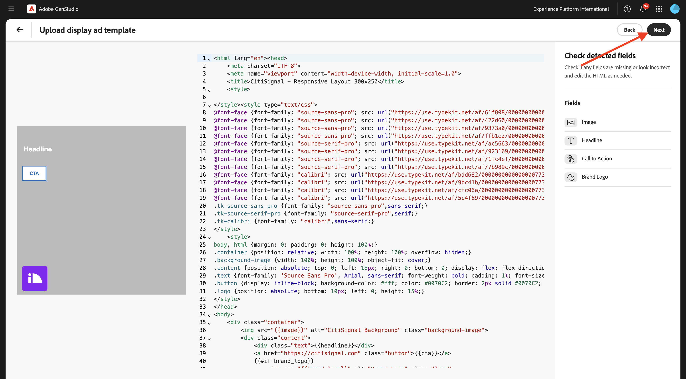
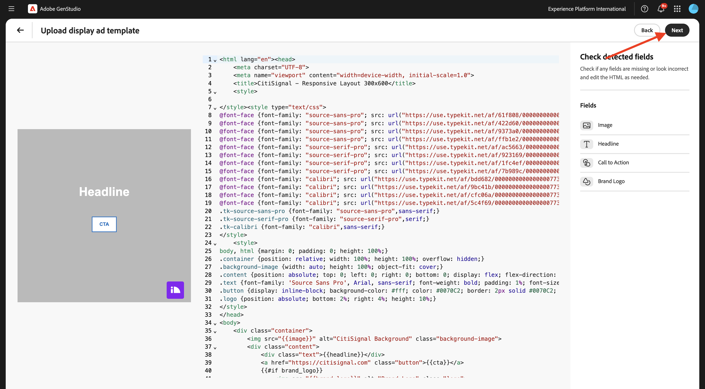

# 1.3.2設定：角色、產品和範本

## 1.3.2.1產品

按一下3個點&#x200B;**...**，然後選取&#x200B;**產品**。


按一下&#x200B;**+新增產品**。


選取&#x200B;**手動新增**，然後按一下&#x200B;**繼續**。


您應該會看到此訊息。


對於產品名稱，請使用`--aepUserLdap-- - CitiSignal Mobile Flex Plan`。

對於欄位&#x200B;**描述**，請使用以下內容：

```
CitiSignal Mobile Flex is a next-gen 5G mobile plan that adapts to your lifestyle. Choose from Unlimited, Family Share, or Data Saver tiers, with optional add-ons like international roaming, hotspot tethering, and SmartFamily™ parental controls. All plans include priority access to CitiSignal’s 5G UltraWide network and seamless integration with CitiSignal Fiber for unified billing, shared data pools, and SmartSwitch™ connectivity. 
```

對於欄位&#x200B;**價值主張**，請使用以下內容：

```
A mobile plan that flexes with your life—fast, fair, and fully connected to your world.
```

對於欄位&#x200B;**訊息喜好設定**，請使用以下專案：

```
Remote Professionals: “Work from anywhere with a mobile plan that’s as flexible as your schedule.”
Online Gamers: “Unlimited 5G. No throttling. Just pure performance—on the go.”
Smart Home Families: “One plan. One bill. One less thing to worry about.”
```

您的產品設定現在看起來應該像這樣。 按一下&#x200B;**上一步**&#x200B;圖示。


按一下&#x200B;**+新增產品**。



選取&#x200B;**手動新增**，然後按一下&#x200B;**繼續**。



您應該會看到此訊息。


對於產品名稱，請使用`--aepUserLdap-- - CitiSignal Fiber Max`。

對於欄位&#x200B;**描述**，請使用以下內容：

```
CitiSignal Fiber Max is our premium residential internet plan, engineered for households that demand uncompromising speed, stability, and coverage. With symmetrical speeds up to 2 Gbps, it’s ideal for remote professionals juggling Zoom calls and cloud apps, gamers chasing millisecond precision, and families running dozens of smart devices. The plan includes a Wi-Fi 6E router, optional mesh extenders for whole-home coverage, and proactive network monitoring. 
```

對於欄位&#x200B;**價值主張**，請使用以下內容：

```
Power your work, play, and home with the fastest, most reliable fiber internet—built for the way you live today and tomorrow.
```

對於欄位&#x200B;**訊息喜好設定**，請使用以下專案：

```
Remote Professionals: “Stay connected, stay productive—no matter how many meetings or megabytes your day demands.”
Online Gamers: “Zero lag. Zero mercy. Dominate with 2 Gbps fiber and ultra-low ping.”
Smart Home Families: “Every room. Every device. Always on. Welcome to whole-home harmony.”
```

您的產品設定現在看起來應該像這樣。 按一下&#x200B;**上一步**&#x200B;圖示。


之後，您應該會看到已設定的2個產品。


## 1.3.2.2角色

按一下3個點&#x200B;**...**，然後選取&#x200B;**角色**。


按一下&#x200B;**+新增角色**。


選取&#x200B;**手動新增**，然後按一下&#x200B;**繼續**。


您應該會看到此訊息。


角色名稱請使用`--aepUserLdap-- - Smart Home Families`。

對於欄位&#x200B;**描述**，請使用以下內容：

```
These are tech-forward households with multiple connected devices—smart TVs, thermostats, security systems, voice assistants, and more. They value convenience, automation, and seamless connectivity across the home. They often have children and are concerned about online safety, parental controls, and whole-home coverage.
```

對於欄位&#x200B;**訊息喜好設定**，請使用以下專案：

```
Friendly, family-oriented tone
Visuals showing whole-home coverage and device compatibility
Messaging that highlights security, parental controls, and easy setup
Bundled offers (e.g., mesh Wi-Fi, smart home consultations)
How-to content or setup guides for non-tech-savvy users
```

您的角色設定現在看起來應該像這樣。 按一下&#x200B;**上一步**&#x200B;圖示。


按一下&#x200B;**+新增角色**。


選取&#x200B;**手動新增**，然後按一下&#x200B;**繼續**。


您應該會看到此訊息。


角色名稱請使用`--aepUserLdap-- - Online Gamers`。

對於欄位&#x200B;**描述**，請使用以下內容：

```
This persona includes competitive and casual gamers who demand ultra-fast, low-latency internet. They often stream gameplay, participate in multiplayer matches, and use voice chat platforms. They are highly sensitive to lag, jitter, and packet loss, and they’re vocal about their experiences online. Many are early adopters of new tech and value performance above all else.
```

對於欄位&#x200B;**訊息喜好設定**，請使用以下專案：

```
Bold, energetic tone with gaming lingo
Metrics like ping time, jitter, and upload/download speeds
Visuals showing latency improvements or side-by-side comparisons
Endorsements from gaming influencers or esports teams
Promotions tied to gaming platforms or bundles (e.g., free months of Xbox Game Pass)
```

您的角色設定現在看起來應該像這樣。 按一下&#x200B;**上一步**&#x200B;圖示。


按一下&#x200B;**+新增角色**。


選取&#x200B;**手動新增**，然後按一下&#x200B;**繼續**。


您應該會看到此訊息。


角色名稱請使用`--aepUserLdap-- - Remote Professionals`。

對於欄位&#x200B;**描述**，請使用以下內容：

```
These are knowledge workers, freelancers, consultants, and hybrid employees who rely on a stable, high-speed internet connection to maintain productivity from home. Their workdays are filled with video calls, cloud-based collaboration, and large file transfers. They often use multiple devices simultaneously and expect seamless performance across all of them. Many are tech-savvy and value proactive customer support and service transparency.
```

對於欄位&#x200B;**訊息喜好設定**，請使用以下專案：

```
Clear, professional tone with a focus on productivity and reliability
Testimonials or case studies from similar professionals
Visuals like speed comparison charts and uptime guarantees
Emphasis on 24/7 support and service-level agreements
Messaging that highlights “work-from-anywhere” flexibility
```

您的角色設定現在看起來應該像這樣。 按一下&#x200B;**上一步**&#x200B;圖示。


然後您應該會看到您設定的3個角色。


## 1.3.2.3個範本

在上一個練習中，您將[CitiSignal-GSPeM-assets.zip](../../../assets/gspem/CitiSignal-GSPeM-assets.zip)檔案下載到您的案頭並解壓縮。 該資料夾包含4個範例範本，您現在需要將這些範本匯入GenStudio。


移至&#x200B;**內容** > **範本**。 按一下&#x200B;**+新增範本**。


選取&#x200B;**中繼廣告**，然後按一下&#x200B;**瀏覽**。


在包含下載的&#x200B;**CitiSignal-GSPeM-assets**&#x200B;檔案的資料夾中，導覽至資料夾&#x200B;**範本**。 選取檔案&#x200B;**citisignal-meta-ad.html**&#x200B;並按一下&#x200B;**開啟**。


您應該會看到此訊息。 按一下&#x200B;**下一步**。


按一下&#x200B;**下一步**。


將此用於欄位&#x200B;**範本名稱**：
`--aepUserLdap---citisignal-meta-ad`並將外觀比例設定為&#x200B;**1:1**。 按一下&#x200B;**發佈範本**。


您的範本現在已儲存，並可在範本資料庫中使用。


按一下&#x200B;**+新增範本**。


選取&#x200B;**橫幅和顯示廣告**，然後按一下&#x200B;**瀏覽**。


在包含下載的&#x200B;**CitiSignal-GSPeM-assets**&#x200B;檔案的資料夾中，導覽至資料夾&#x200B;**範本**。 選取檔案&#x200B;**citisignal-displaytemplate-300x250.html**，然後按一下&#x200B;**開啟**。


您應該會看到此訊息。 按一下&#x200B;**下一步**。


按一下&#x200B;**下一步**。



將此用於欄位&#x200B;**範本名稱**：
`--aepUserLdap---citisignal-displaytemplate-300x250`並將&#x200B;**廣告寬度**&#x200B;和&#x200B;**廣告高度**&#x200B;設定為&#x200B;**300x250**。 按一下&#x200B;**發佈範本**。


您的範本現在已儲存，並可在範本資料庫中使用。


按一下&#x200B;**+新增範本**。


選取&#x200B;**橫幅和顯示廣告**，然後按一下&#x200B;**瀏覽**。


在包含下載的&#x200B;**CitiSignal-GSPeM-assets**&#x200B;檔案的資料夾中，導覽至資料夾&#x200B;**範本**。 選取檔案&#x200B;**citisignal-displaytemplate-300x600.html**，然後按一下&#x200B;**開啟**。


您應該會看到此訊息。 按一下&#x200B;**下一步**。


按一下&#x200B;**下一步**。



將此用於欄位&#x200B;**範本名稱**：
`--aepUserLdap---citisignal-displaytemplate-300x600`並將&#x200B;**廣告寬度**&#x200B;和&#x200B;**廣告高度**&#x200B;設定為&#x200B;**300x600**。 按一下&#x200B;**發佈範本**。


您的範本現在已儲存，並可在範本資料庫中使用。


按一下&#x200B;**+新增範本**。


選取&#x200B;**橫幅和顯示廣告**，然後按一下&#x200B;**瀏覽**。


在包含下載的&#x200B;**CitiSignal-GSPeM-assets**&#x200B;檔案的資料夾中，導覽至資料夾&#x200B;**範本**。 選取檔案&#x200B;**citisignal-displaytemplate-970x250.html**，然後按一下&#x200B;**開啟**。


您應該會看到此訊息。 按一下&#x200B;**下一步**。


按一下&#x200B;**下一步**。


將此用於欄位&#x200B;**範本名稱**：
`--aepUserLdap---citisignal-displaytemplate-970x250`並將&#x200B;**廣告寬度**&#x200B;和&#x200B;**廣告高度**&#x200B;設定為&#x200B;**970x250**。 按一下&#x200B;**發佈範本**。


您的範本現在已儲存，並可在範本資料庫中使用。


您現在已經設定好下一次練習所需的範本。

## 後續步驟

移至[Meta](./ex3.md){target="_blank"}的促銷活動啟用

返回[GenStudio for Performance Marketing](./genstudio.md){target="_blank"}

返回[所有模組](./../../../overview.md){target="_blank"}
