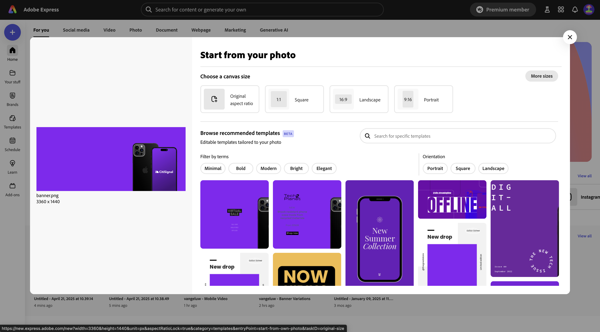
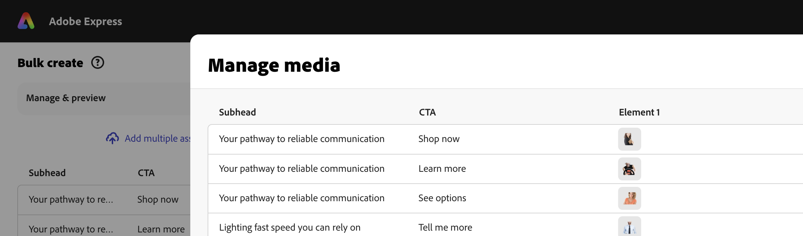

# 1.3.3在Adobe Express中大量建立Assets

瞭解如何使用。

https://new.express.adobe.com/brands

## 後續步驟

移至Adobe Express中的[動畫和視訊](./ex2.md){target="_blank"}

返回[Adobe Express和Adobe Experience Cloud](./express.md){target="_blank"}

返回[所有模組](./../../../overview.md){target="_blank"}
