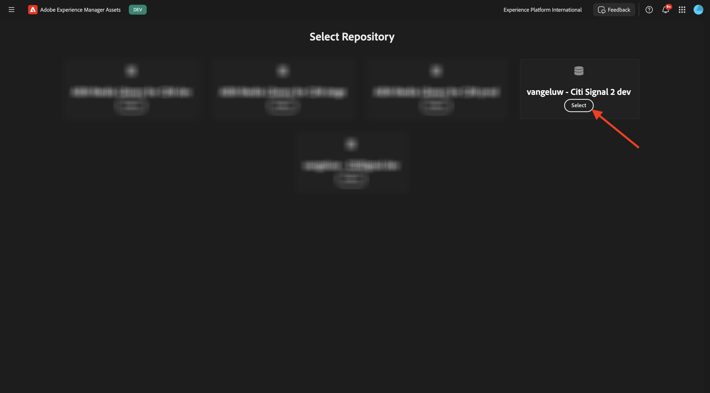

# 1.3.3對中繼的Campaign啟用

>[!IMPORTANT]
>
>為了完成此練習，您需要具有啟用AEM Content Hub之有效AEM Assets CS製作環境的存取權。 如果您按照練習[Adobe Experience Manager Cloud Service和Edge Delivery Services](./../../../modules/asset-mgmt/module2.1/aemcs.md){target="_blank"}，您將有權存取這樣的環境。

>[!IMPORTANT]
>
>如果您先前已使用Author和AEM Assets環境設定AEM Assets CS計畫，可能是您的AEM CS沙箱已休眠。 鑑於讓這樣的沙箱解除休眠需要10-15分鐘，最好現在開始解除休眠過程，這樣以後就不必等待了。

## 1.3.3.1建立行銷活動

在&#x200B;**GenStudio for Performance Marketing**&#x200B;中，前往左側功能表中的&#x200B;**行銷活動**。 按一下&#x200B;**+新增行銷活動**。


之後，您應該會看到空白的行銷活動概覽。


欄位名稱請使用`--aepUserLdap-- - CitiSignal Fiber Launch Campaign`。

對於欄位&#x200B;**描述**，請使用以下文字。

```
The CitiSignal Fiber Launch campaign introduces CitiSignal’s flagship fiber internet service—CitiSignal Fiber Max—to key residential markets. This campaign is designed to build awareness, drive sign-ups, and establish CitiSignal as the go-to provider for ultra-fast, reliable, and future-ready internet. The campaign will highlight the product’s benefits for remote professionals, online gamers, and smart home families, using persona-driven messaging across digital and physical channels.
```

針對欄位&#x200B;**目標**，請使用下列文字。

```
Generate brand awareness in target regions
Drive early sign-ups and pre-orders for CitiSignal Fiber Max
Position CitiSignal as a premium, customer-first fiber internet provider
Educate consumers on the benefits of fiber over cable or DSL
```

對於&#x200B;**金鑰訊息**&#x200B;欄位，請使用以下文字。

```
Supporting Points:
Symmetrical speeds up to 2 Gbps
Whole-home Wi-Fi 6E coverage
99.99% uptime guarantee
24/7 concierge support
No data caps or throttling
 Channels:
Digital Advertising: Google Display, YouTube pre-roll, Meta (Facebook/Instagram), TikTok (for gamers)
Email Marketing: Persona-segmented drip campaigns
Social Media: Organic and paid posts with testimonials, speed demos, and influencer partnerships
Out-of-Home (OOH): Billboards, transit ads in suburban commuter corridors
Local Events: Pop-up booths at tech expos, family festivals, and gaming tournaments
Direct Mail: Personalized flyers with QR codes for early sign-up discounts
 
Target Regions:
Primary Launch Markets:
Denver Metro Area, CO
Austin, TX
Raleigh-Durham, NC
Salt Lake City, UT
Demographic Focus:
Suburban neighborhoods with high remote work density
Areas with high smart home adoption
Zip codes with underserved or dissatisfied cable customers
```

之後，您應該具備此功能：


向下捲動以檢視更多欄位：


針對欄位&#x200B;**開始**，將其設定為今天的日期。

針對欄位&#x200B;**End**，將其設定為從現在起1個月的日期。

針對欄位&#x200B;**狀態**，將其設定為&#x200B;**作用中**。

針對欄位&#x200B;**頻道**，將其設定為&#x200B;**Meta**，**電子郵件**，**付費媒體**，**顯示**。

針對欄位&#x200B;**Regions**，請選取選擇的區域。

針對欄位&#x200B;**References** > **Products**&#x200B;的欄位：選擇產品`--aepUserLdap-- - CitiSignal Fiber Max`。

**參考** > **角色**：選擇角色`--aepUserLdap-- - Remote Professionals`、`--aepUserLdap-- - Online Gamers`、`--aepUserLdap-- - Smart Home Families`

您應該會看到以下內容：


您的行銷活動現已準備就緒。 按一下&#x200B;**箭頭**&#x200B;以返回。


之後，您便會在清單中看到行銷活動。 按一下行事曆檢檢視示以變更行銷活動行事曆的檢視。


接著，您應該會看到行銷活動行事曆，以更直觀的方式瞭解哪些行銷活動在此刻處於作用中狀態。


## 1.3.3.2設定中繼連線

>[!IMPORTANT]
>
>為了設定您與中繼的連線，您需要有一個可用的中繼使用者帳戶，並且該使用者帳戶需要新增到中繼企業帳戶。

若要設定與中繼的連線，請按一下3個點&#x200B;**...**，然後選取&#x200B;**設定**。


按一下&#x200B;**中繼廣告**&#x200B;的&#x200B;**連線**。


使用您的中繼帳戶登入。 按一下&#x200B;**繼續**。


如果您的帳戶連結至中繼企業帳戶，您將能夠選取已在中繼中設定的企業投資組合。


成功建立連線後，按一下顯示&#x200B;**X個已連線的帳戶**&#x200B;的行。


之後，您應該會看到連線至GenStudio for Performance Marketing的中繼企業帳戶的詳細資料。


## 1.3.3.3建立新資產

移至[https://firefly.adobe.com/](https://firefly.adobe.com/){target="_blank"}。 輸入提示`a neon rabbit running very fast through space`並按一下&#x200B;**產生**。


然後您會看到正在產生數個影像。 選擇您最喜歡的影像，按一下影像上的&#x200B;**共用**&#x200B;圖示，然後選取&#x200B;**在Adobe Express中開啟**。


之後，您會看到剛才產生的影像可在Adobe Express中用於編輯。 您現在需要在影像上新增CitiSignal標誌。 若要這麼做，請移至&#x200B;**品牌**。


接著，您應該會在Adobe Express中看到在GenStudio for Performance Marketing中建立的CitiSignal品牌範本。 按一下以選取應命名為`--aepUserLdap-- - CitiSignal`的品牌範本。


移至&#x200B;**圖志**&#x200B;並按一下&#x200B;**白色** Citisignal圖志，將其拖曳至影像上。


將CitiSignal標誌放在左上角。


接著，按一下&#x200B;**共用**。


選取&#x200B;**AEM Assets**。


按一下&#x200B;**選取資料夾**。


選取您應命名為`--aepUserLdap-- - CitiSignal`的AEM Assets CS存放庫，然後選取資料夾`--aepUserLdap-- - CitiSignal Fiber Campaign`。 按一下&#x200B;**選取**。


您應該會看到此訊息。 按一下&#x200B;**上傳1資產**。 您的影像現在將上傳至AEM Assets CS。


移至[https://experience.adobe.com/](https://experience.adobe.com/){target="_blank"}。 開啟&#x200B;**Experience Manager Assets**。


選取您應命名為`--aepUserLdap-- - CitiSignal dev`的AEM Assets CS環境。



前往&#x200B;**Assets**，然後按兩下資料夾`--aepUserLdap-- - CitiSignal Fiber Campaign`。


之後，您應該會看到類似以下內容。 按兩下影像`--aepUserLdap-- - neon rabbit`。


接著會顯示影像`--aepUserLdap-- - neon rabbit`。 將&#x200B;**狀態**&#x200B;變更為&#x200B;**已核准**，然後按一下&#x200B;**儲存**

>[!IMPORTANT]
>
>如果影像的狀態未設定為&#x200B;**已核准**，則影像將不會顯示在GenStudio for Performance Marketing中。 在GenStudio for Performance Marketing中只能存取已核准的資產。


切換回GenStudio for Performance Marketing。 在左側功能表中，前往&#x200B;**Assets**&#x200B;並選取您的AEM Assets CS存放庫，此存放庫應命名為`--aepUserLdap-- - CitiSignal`。 之後，您將會看見剛才建立並核准的影像，該影像便可在GenStudio for Performance Marketing中使用。


## 1.3.3.4建立和核准中繼廣告

## 1.3.3.5將廣告發佈至中繼資料

## 後續步驟

移至[摘要與優點](./summary.md){target="_blank"}

返回[GenStudio for Performance Marketing](./genstudio.md){target="_blank"}

返回[所有模組](./../../../overview.md){target="_blank"}
