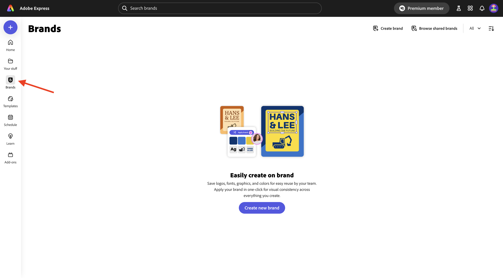
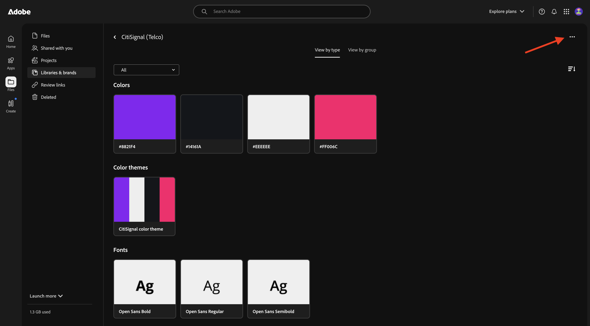
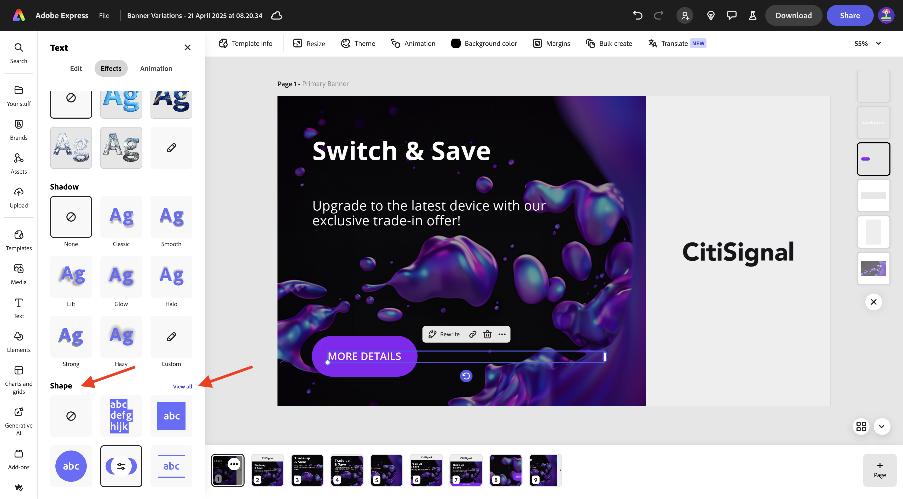
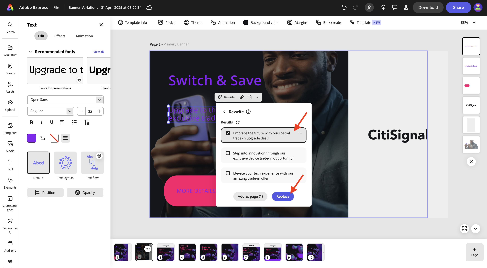
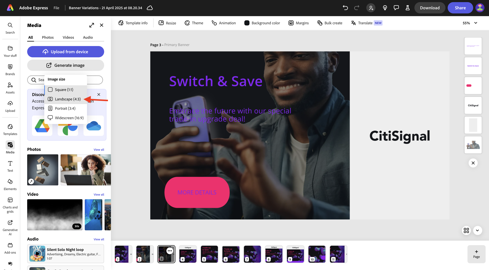

# 1.4.1 Adobe Express快速入門

## 1.4.1.1登入Adobe Express

開啟新的無痕瀏覽器視窗，並移至[https://www.adobe.com/home](https://www.adobe.com/home){target="_blank"}。 使用您的&#x200B;**公司或學校帳戶**&#x200B;登入，然後選取帳戶&#x200B;**`--aepImsOrgName--`**。

Adobe Express屬於貴組織授權的一部分，可供您使用。 為確保您能夠存取Adobe Express，您需要確認自己登入了正確的組織。 若要這麼做，請按一下&#x200B;**設定檔**&#x200B;圖示，然後確認哪個帳戶作用中。 您應該使用的帳戶名稱為`--aepImsOrgName--`。

按一下&#x200B;**切換設定檔**&#x200B;以變更帳戶。

從功能表選擇正確的帳戶，在此案例中是&#x200B;**Experience Platform International** （但可能是其他組織）。

一旦正確的帳戶啟用，請移至&#x200B;**應用程式**，然後按一下&#x200B;**Adobe Express**&#x200B;卡片上的&#x200B;**開始使用**。

您現在已登入&#x200B;**Adobe Express**。

## 1.4.1.2從品牌範本開始

在Adobe Express中，移至&#x200B;**品牌**。 您的品牌範本程式庫目前可能為空白。 CitiSignal先前已定義品牌範本，您現在應重複使用該現有範本。

若要這麼做，請前往[https://www.adobe.com/files/link/1c2f92cf-17bc-4d11-6031-dbd251e6cb57](https://www.adobe.com/files/link/1c2f92cf-17bc-4d11-6031-dbd251e6cb57)。

您應該會看到此訊息。 按一下3個點&#x200B;**...**。

選取&#x200B;**製作復本**。

大約一分鐘後，您應該會看到一則訊息，確認您已製作品牌範本的個人復本。

返回Adobe Express至&#x200B;**品牌**，然後重新整理頁面。 您現在應該會看到&#x200B;**CitiSignal (Telco)**&#x200B;品牌範本。 按一下以開啟&#x200B;**CitiSignal (Telco)**&#x200B;品牌範本。

然後您應該會看到資產資料庫，例如標誌、字型、顏色、範本等。

移至&#x200B;**快速範本**，然後按一下以開啟範本&#x200B;**橫幅變化**。

按一下&#x200B;**開始新檔案**。

您應該會看到此訊息。

按一下顯示&#x200B;**換位並儲存**&#x200B;的文字方塊。 接著，選取&#x200B;**重寫**&#x200B;並選擇樣式，然後按一下[產生]。**&#x200B;**

選擇變數並按一下&#x200B;**取代**。

之後，您應該會看到更新的文字。

接著，按一下文字&#x200B;**更多詳細資料**。

選取&#x200B;**效果**。

移至&#x200B;**圖形**&#x200B;並按一下&#x200B;**全部檢視**。

按一下&#x200B;**finetune**&#x200B;按鈕。 變更&#x200B;**形狀大小**，然後按一下顏色按鈕。

從&#x200B;**CitiSignal色彩主題**&#x200B;中選取其他色彩，以變更色彩。

然後您應該會看到已變更的按鈕。

接下來，移至&#x200B;**品牌**，然後按一下[套用品牌]。**&#x200B;** 然後您應該會看到影像的外觀變更。

請注意，您也可以按一下&#x200B;**齒輪**&#x200B;圖示，以詳細說明&#x200B;**套用品牌**&#x200B;設定。

接著，按一下您正在處理的影像上的3個點&#x200B;**...**，然後按一下[複製]。**&#x200B;**。

然後您應該會看到完全相同的新影像。 按一下熒幕右側的背景圖層。

>[!IMPORTANT]
>
>為了完成此練習，您需要有權存取運作中的AEM Assets CS作者環境。 如果您按照練習[Adobe Experience Manager Cloud Service和Edge Delivery Services](./../../../modules/asset-mgmt/module2.1/aemcs.md){target="_blank"}，您將有權存取這樣的環境。

前往左側功能表中的&#x200B;**Assets**，選取您應命名為`--aepUserLdap-- - CitiSignal dev`的AEM Assets CS存放庫。 接著，移至資料夾&#x200B;**citisignal**。

選取影像&#x200B;**homepage-hero-1.png**。 然後您應該會看到背景圖層變更。

依指示選取文字方塊，然後按一下&#x200B;**重新寫入**。 選取「**重述**」，然後選取特定樣式。 按一下&#x200B;**產生**。

選取變體並按一下&#x200B;**取代**。

您應該會看到此訊息。 接著，按一下頁面底部頁面上的3個點&#x200B;**...**，然後按一下&#x200B;**複製**。

在新建立的影像上，移至&#x200B;**媒體**&#x200B;並按一下&#x200B;**產生影像**。

選取&#x200B;**橫向(4:3)**。

輸入提示`laser beams running through space`並按一下&#x200B;**產生**。

之後，您應該會看到Adobe Firefly產生的影像。 請注意，產生影像的圖層會一直位於頂端。

向下移動新產生的影像，並放在上一個背景圖層的頂端。

按一下舊背景圖層並選取&#x200B;**刪除**，移除舊背景圖層。

調整影像，使其涵蓋整個畫布。

選取文字方塊&#x200B;**切換並儲存**&#x200B;以將字型顏色變更為&#x200B;**白色**。

將字型顏色變更為&#x200B;**白色**。

選取其他文字方塊，將字型顏色變更為&#x200B;**白色**。

將字型顏色變更為&#x200B;**白色**。

接著，按一下&#x200B;**調整大小**，並輸入&#x200B;**2600** x **1080**&#x200B;的自訂解析度。 確定已核取&#x200B;**展開影像**&#x200B;的核取方塊。 按一下&#x200B;**調整大小**。

您應該會看到此訊息。

幾分鐘後，您會看到影像的一些新變化。 選擇一個，然後按一下&#x200B;**保留**。

您應該會看到此訊息。

移動並調整影像，使其填滿可用空間。

接著，按一下&#x200B;**翻譯**。

選擇某些語言，例如&#x200B;**法文**、**荷蘭文**&#x200B;和&#x200B;**西班牙文**。 請確定只選取您正在處理的特定頁面，在此例中是&#x200B;**第3**&#x200B;頁。 按一下&#x200B;**翻譯**。

然後會產生翻譯。

之後，您應該會看到許多新頁面正在建立。 按一下&#x200B;**關閉**&#x200B;圖示。

驗證翻譯，並視需要加以變更，例如在此範例中，翻譯並非最佳選擇。

視需要更新文字。

您的資產現已準備就緒。

## 後續步驟

移至Adobe Express中的[動畫和視訊](./ex2.md){target="_blank"}

返回[Adobe Express和Adobe Experience Cloud](./express.md){target="_blank"}

返回[所有模組](./../../../overview.md){target="_blank"}
