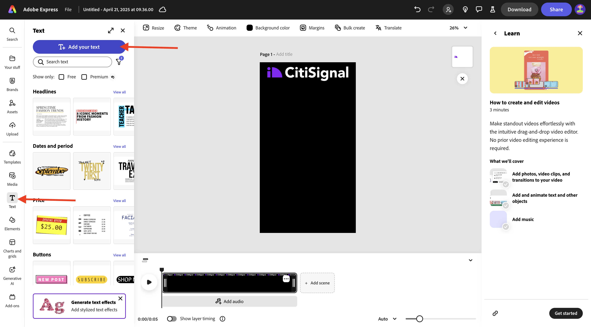
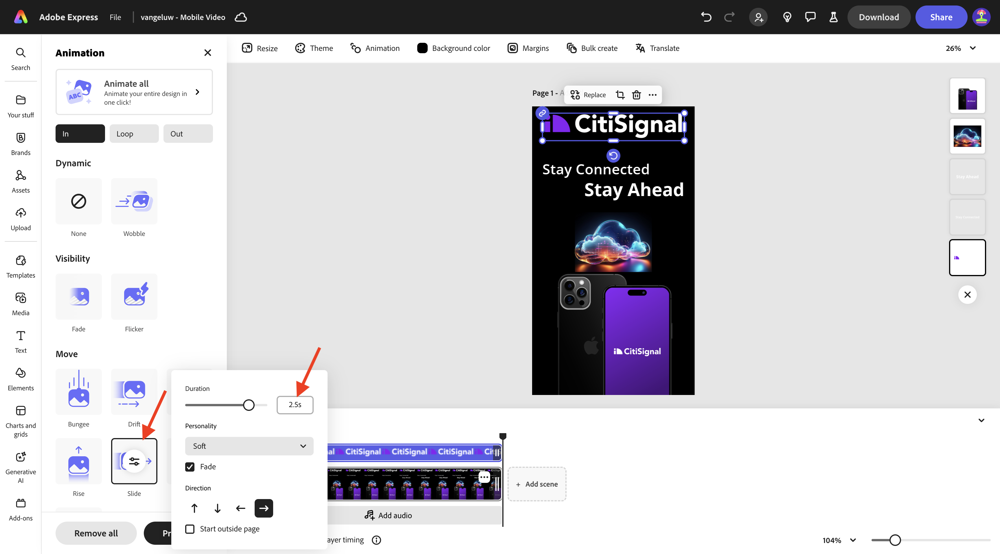
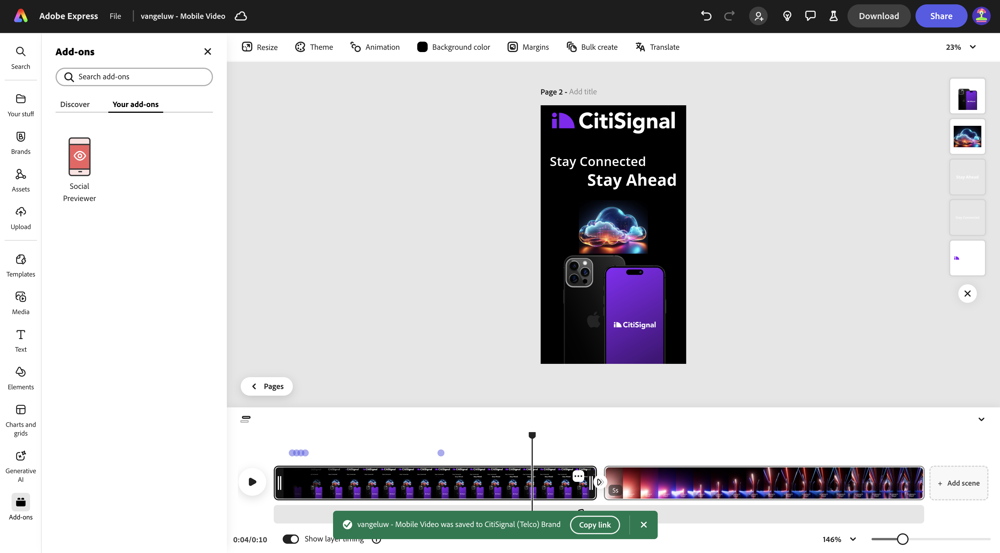

# 1.4.2 Adobe Express中的動畫和視訊

開始此練習前，請先從[https://one-adobe-tech-insiders.s3.us-west-2.amazonaws.com/one-adobe/Adobe_Express.zip](https://one-adobe-tech-insiders.s3.us-west-2.amazonaws.com/one-adobe/Adobe_Express.zip){target="_blank"}下載必要的資產，然後在您的案頭上解壓縮。

## 1.4.2.1建立影片

移至[https://new.express.adobe.com/](https://new.express.adobe.com/){target="_blank"}。 按一下&#x200B;**+**&#x200B;圖示以建立新的&#x200B;**影像**。

移至&#x200B;**影片**，然後選取&#x200B;**行動影片**。

您應該會看到此訊息。

選取&#x200B;**背景顏色**，然後選擇&#x200B;**黑色**。

接下來，您應該新增&#x200B;**CitiSignal**&#x200B;標誌。 移至&#x200B;**品牌**&#x200B;並選取白色CitiSignal標誌。 按一下3個點&#x200B;**...**，然後選取&#x200B;**置入**。

將CitiSignal標誌置中於影像頂端。

移至&#x200B;**文字**，然後選取&#x200B;**新增您的文字**。

輸入文字`Stay Connected`，並將文字方塊置於類似位置，如下圖所示。

移至&#x200B;**文字**，然後選取&#x200B;**新增您的文字**。 輸入文字`Stay Ahead`。

將文字方塊放置在類似位置，如下圖所示。

選取文字為&#x200B;**保持連線**&#x200B;的第一個文字方塊。 移至&#x200B;**品牌**、**字型**。 按一下第一個字型上的3個點&#x200B;**...**，然後按一下&#x200B;**套用**。

選取第二個文字方塊，其文字為&#x200B;**保持領先**。 移至&#x200B;**品牌**、**字型**。 按一下第3字型上的3個點&#x200B;**...**，然後按一下&#x200B;**套用**。

您應該會看到此訊息。 移至&#x200B;**媒體**&#x200B;並選取&#x200B;**產生影像**。

輸入提示`futuristic looking transparent cloud on a black background`並按一下&#x200B;**產生**。

選取&#x200B;**橫向(4:3)**。

您應該會看到此訊息。 選擇其中一個變數。

將產生的影像置中。 移至&#x200B;**媒體**，然後按一下&#x200B;**從裝置上傳**。

導覽至您的案頭，前往包含您先前下載之資產的資料夾&#x200B;**Adobe_Express**。 選取檔案&#x200B;**CitiSignalPhoneLogo.png**&#x200B;並按一下&#x200B;**開啟**。

您應該會看到此訊息。

向下拖曳影像，使其看起來類似下方影像。

將專案名稱變更為`--aepUserLdap-- - Mobile Video`。

移至&#x200B;**動畫**，然後按一下&#x200B;**滑動**&#x200B;動畫。

按一下&#x200B;**播放**&#x200B;圖示以測試您的動畫。

選取文字方塊&#x200B;**保持領先**。

調整文字方塊的時間軸滑桿&#x200B;**保持領先**，使其在半途開始。

選取&#x200B;**CitiSignal**&#x200B;標誌。

開啟&#x200B;**投影片**&#x200B;動作上的詳細資訊設定，並將持續時間變更為2.5秒。

接著，按一下&#x200B;**下載**。 選取&#x200B;**檔案格式** **MP4**，並將&#x200B;**視訊解析度**&#x200B;設定為&#x200B;**1080p**。 按一下&#x200B;**下載**。

您的視訊檔案將會產生，並下載到您的電腦。 您的第一部影片現已準備就緒。

## 1.4.2.2新增到您的視訊

關閉&#x200B;**時間表**&#x200B;檢視。

按一下3個點&#x200B;**...**&#x200B;並選取&#x200B;**複製**。

然後會產生新頁面。 按一下&#x200B;**編輯時間表**&#x200B;以開始使用新頁面。

按一下&#x200B;**+新增場景**。

之後，您應該會看到新增的場景。

導覽至您的案頭，前往包含您先前下載之資產的資料夾&#x200B;**Adobe_Express**。 選取檔案&#x200B;**`AdobeStock_648887461_trimmed.mp4`**&#x200B;並按一下&#x200B;**開啟**。

然後，您的視訊檔案將新增到新場景中。

在2個場景的中間按一下，然後選取&#x200B;**新增轉變**。

按一下&#x200B;**跳至黑色**。

將&#x200B;**持續時間**&#x200B;變更為2秒。 您可以按一下&#x200B;**播放**&#x200B;按鈕，測試您的轉變。

移至&#x200B;**文字**，然後按一下&#x200B;**新增您的文字**。

輸入文字`with lightning fast speed from CitiSignal`。 按一下&#x200B;**置中對齊**，將文字置中。

將字型大小變更為&#x200B;**60**。

## 在Adobe Express中1.4.2.3使用附加元件

移至&#x200B;**附加元件**&#x200B;並搜尋附加元件&#x200B;**社交預覽器**。

按一下「**+新增**」以新增附加元件。

選取附加元件&#x200B;**社交預覽器**，然後按一下&#x200B;**Instagram貼文**&#x200B;預覽選項。 您現在可以輕鬆預覽貼文在最常見社群媒體平台上的外觀。

## 1.4.2.4在Adobe Express中建立新範本

接著，按一下[共用]按鈕，然後選取[建立範本]。**&#x200B;**&#x200B;**&#x200B;**

使用名稱`--aepUserLdap-- - Mobile Video`，選取品牌&#x200B;**CitiSignal (Telco)**，然後按一下&#x200B;**儲存範本**。

您的視訊範本現在已儲存在品牌範本中。

## 1.4.2.5將您的視訊儲存在AEM Assets CS

再按一下「共用&#x200B;**」**，然後選取「儲存至雲端」**&#x200B;**。 選取&#x200B;**AEM Assets**。

選取&#x200B;**目前頁面**。 使用名稱`--aepUserLdap-- - Mobile Video`，然後按一下&#x200B;**選取資料夾**。

選取資料夾&#x200B;**`--aepUserLdap-- - Frame.io PNG`**&#x200B;並按一下&#x200B;**選取**。

按一下&#x200B;**上傳1資產**。

移至[https://experience.adobe.com/](https://experience.adobe.com/){target="_blank"}並按一下&#x200B;**Experience Manager Assets**。

選取您應命名為`--aepUserLdap-- - Citi Signal dev`的AEM Assets CS環境。

在&#x200B;**Assets**&#x200B;中，導覽至資料夾&#x200B;**`--aepUserLdap-- - Frame.io PNG`**。 按兩下資產&#x200B;**`--aepUserLdap-- - Mobile Video`**&#x200B;以開啟它。

您之前在Adobe Express中建立的影片，現在可在Adobe Experience Manager Assets中使用。

## 後續步驟

移至[在Adobe Express中大量建立Assets](./ex3.md){target="_blank"}

返回[Adobe Express和Adobe Experience Cloud](./express.md){target="_blank"}

返回[所有模組](./../../../overview.md){target="_blank"}
