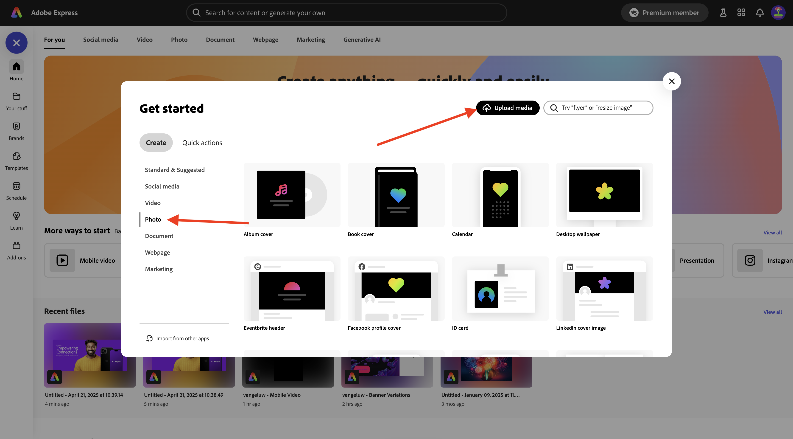
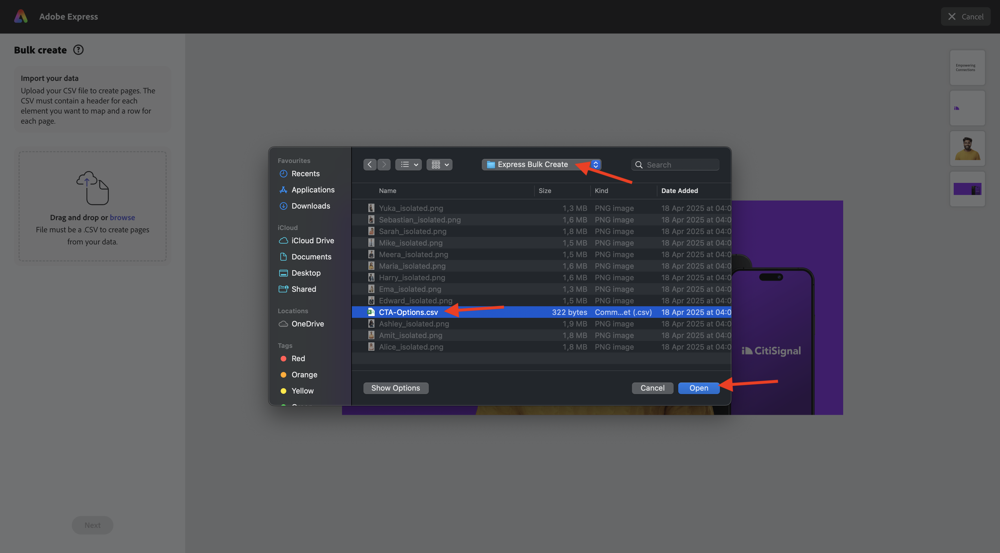
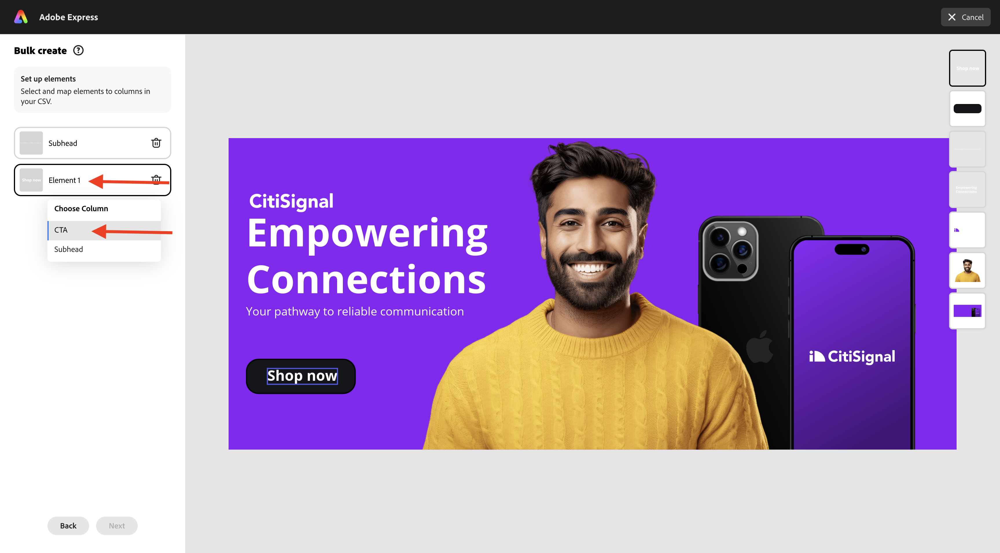

# 1.4.3在Adobe Express中大量建立Assets

開始此練習前，請先從[https://one-adobe-tech-insiders.s3.us-west-2.amazonaws.com/one-adobe/Adobe_Express.zip](https://one-adobe-tech-insiders.s3.us-west-2.amazonaws.com/one-adobe/Adobe_Express.zip){target="_blank"}下載必要的資產，然後在您的案頭上解壓縮。

## 1.4.3.1建立您的基本資產

移至[https://new.express.adobe.com/](https://new.express.adobe.com/){target="_blank"}。 按一下&#x200B;**+**&#x200B;圖示以建立新的&#x200B;**影像**。

選取&#x200B;**像片**，然後選擇&#x200B;**上傳媒體**。

導覽至您的案頭，前往包含您先前下載之資產的資料夾&#x200B;**Adobe_Express**。 選取檔案&#x200B;**banner.png**&#x200B;並按一下&#x200B;**開啟**。

您應該會看到此訊息。 選取&#x200B;**編輯影像**。

接著，移至&#x200B;**媒體**&#x200B;並選取&#x200B;**上傳影像**。 導覽至您的案頭，前往包含您先前下載之資產的資料夾&#x200B;**Adobe_Express**。 選取檔案&#x200B;**man.png**&#x200B;並按一下&#x200B;**開啟**。

您應該會看到此訊息。

接下來，您應該新增&#x200B;**CitiSignal**&#x200B;標誌。 移至&#x200B;**品牌**&#x200B;並選取白色CitiSignal標誌。 按一下3個點&#x200B;**...**，然後選取&#x200B;**置入**。

調整CitiSignal標誌影像的位置，以反映以下影像中的相同位置。

移至&#x200B;**文字**&#x200B;並按一下&#x200B;**新增您的文字**。

在新文字方塊中，新增文字`Empowering Connections`。 將文字方塊拖曳至類似位置，如下圖所示。 接下來，移至&#x200B;**品牌**，移至&#x200B;**字型**。 按一下第3字型上的3個點&#x200B;**...**，然後按一下&#x200B;**套用**。

接著，將字型顏色變更為&#x200B;**白色**。

再次移至&#x200B;**文字**&#x200B;並按一下&#x200B;**新增您的文字**。

在新文字方塊中，輸入文字`Your pathway to reliable communication`。 調整文字方塊的位置，使其位於上一個文字方塊下方，類似於下面的影像。

移至&#x200B;**品牌**、**字型**，然後按一下第二個字型上的3個點&#x200B;**...**。 然後，按一下&#x200B;**套用**。

然後您應該擁有此專案。 接著，移至&#x200B;**元素**、**形狀**，然後按一下圓角矩形形狀。

您的影像就會有新的圓角矩形形狀。 調整大小和位置，使其看起來像按鈕。 然後，將圓角矩形的顏色變更為&#x200B;**黑色**。

再次移至&#x200B;**文字**&#x200B;並按一下&#x200B;**新增您的文字**。

在新文字方塊中輸入文字`Shop now`，並將文字方塊的位置變更為以按鈕為中心。 移至&#x200B;**品牌**、**字型**，然後按一下第三個字型上的3個點&#x200B;**...**。 然後，按一下&#x200B;**套用**。

您應該會看到此訊息。

## 在Adobe Express中大量建立1.4.3.2

接著，按一下&#x200B;**大量建立**。

您應該會看到此訊息。 按一下&#x200B;**瀏覽**。

導覽至您的案頭，並移至資料夾&#x200B;**Adobe_Express**&#x200B;中的&#x200B;**Express Bulk Create**&#x200B;資料夾，其中包含您先前下載的資產。 選取檔案&#x200B;**CTA-options.csv**&#x200B;並按一下&#x200B;**開啟**。

您應該會看到此訊息。 按一下&#x200B;**下一步**。

按一下&#x200B;**連線元素**。

選取包含文字&#x200B;**您通往可靠通訊的路徑**&#x200B;的文字方塊。 然後按一下「**元素1**」按鈕，並將其連結至CSV檔案中的欄位，在此案例中是欄位&#x200B;**Subhead**。

接著，選取包含文字&#x200B;**立即購物**&#x200B;的文字方塊。

然後按一下「**元素1**」按鈕，並將其連結至CSV檔案中的欄位，在此案例中是欄位&#x200B;**CTA**。

您應該會看到此訊息。 接著，按一下個人的影像。

按一下按鈕&#x200B;**元素1**。

然後您會看到此快顯視窗。 按一下&#x200B;**瀏覽**。

導覽至您的案頭，並移至資料夾&#x200B;**Adobe_Express**&#x200B;中的&#x200B;**Express Bulk Create**&#x200B;資料夾，其中包含您先前下載的資產。 選取6-7個影像檔案，然後按一下&#x200B;**開啟**。

您將會看到此訊息。 將不同的影像拖放至資產的每個變數。 按一下&#x200B;**完成**

然後您會看到產生的影像變化。 按一下&#x200B;**建立頁面**。

您的變數現已準備就緒，您可以個別檢查每個變數以進行檢閱和驗證。

您現在已經完成此練習。

## 後續步驟

移至[摘要與優點](./summary.md){target="_blank"}

返回[Adobe Express和Adobe Experience Cloud](./express.md){target="_blank"}

返回[所有模組](./../../../overview.md){target="_blank"}