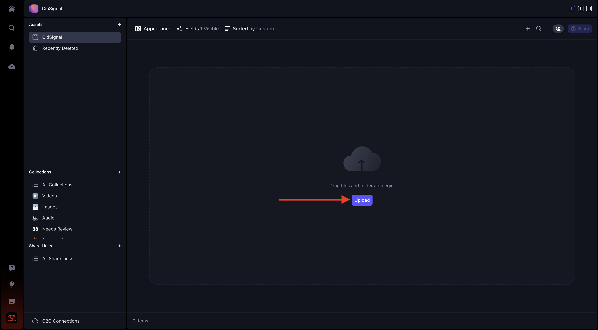

# 1.5.1 Frame.io快速入門

>[!NOTE]
>
> 下方熒幕擷圖顯示使用的特定環境。 當您閱讀本教學課程時，您的環境很可能有不同的名稱。 當您註冊參加本教學課程時，系統已為您提供要使用的環境詳細資訊，請依照這些指示操作。

移至[https://next.frame.io/](https://next.frame.io/)。 請確定您已登入環境`--aepImsOrgName--`。

如果您未登入右側環境，請按一下左下方的標誌，然後按一下以選取您需要使用的環境。

## 1.5.1.1建立您的工作區和專案

按一下&#x200B;**+新Workspace**。

對於工作區名稱，請使用： `--aepUserLdap--`。 按一下&#x200B;**儲存**。

您的工作區現已建立。 接下來，您應該建立新專案。 按一下&#x200B;**+新專案**。

選取&#x200B;**空白**&#x200B;並使用名稱`CitiSignal`。 按一下&#x200B;**建立新專案**。

您的專案現已建立。 您現在需要在專案中上傳資產。 按一下&#x200B;**上傳**。

將這些檔案： [https://one-adobe-tech-insiders.s3.us-west-2.amazonaws.com/Frame.io_Assets.zip](https://one-adobe-tech-insiders.s3.us-west-2.amazonaws.com/Frame.io_Assets.zip)下載到您的案頭，然後解壓縮到您的案頭。

選取所有檔案，然後按一下&#x200B;**開啟**。

>[!NOTE]
>
>如熒幕擷圖所示，目前未選取資料夾&#x200B;**音效**。 這是因為手動上傳不支援上傳資料夾。 幾分鐘後，您將會安裝Frame.io Transfer應用程式，以便用來上傳該資料夾及其檔案。

幾分鐘後，您會看到您的檔案在Frame.io中變得可用。

您現在已手動上傳檔案，但您可以更快更好的方式上傳檔案，以及從Frame.io下載檔案。 最好的辦法是使用Frame.io傳輸應用程式。

## 1.5.1.2下載並設定Frame.io傳輸應用程式

移至[https://frame.io/transfer](https://frame.io/transfer)下載電腦的版本。

安裝應用程式，然後開啟它。

應用程式開啟時，需要您登入。 按一下&#x200B;**登入**。

輸入您Adobe帳戶的電子郵件地址，然後按一下&#x200B;**開始吧**。

成功驗證後，按一下&#x200B;**開啟Frame.io傳輸應用程式**。

您應該會看到此訊息。 若要選取正確的環境，請按一下以開啟下拉式清單。

選取此教學課程需要使用的環境，即`--aepImsOrgName--`。

之後，您應該會看到先前建立的工作區和專案，以及您手動上傳的檔案。

按一下&#x200B;**上傳**。

移至您之前使用的資料夾，其中包含您之前下載的解壓縮檔案。 選取資料夾&#x200B;**聲音效果**，然後按一下&#x200B;**上傳**。

然後會上傳您的檔案。

上傳後，您會看到新資料夾在Frame.io中變得可用。

## 後續步驟

使用Frame.io[移至](./ex2.md){target="_blank"}1.5.2核准

返回[使用Frame.io簡化您的工作流程](./frameio.md){target="_blank"}

返回[所有模組](./../../../overview.md){target="_blank"}
