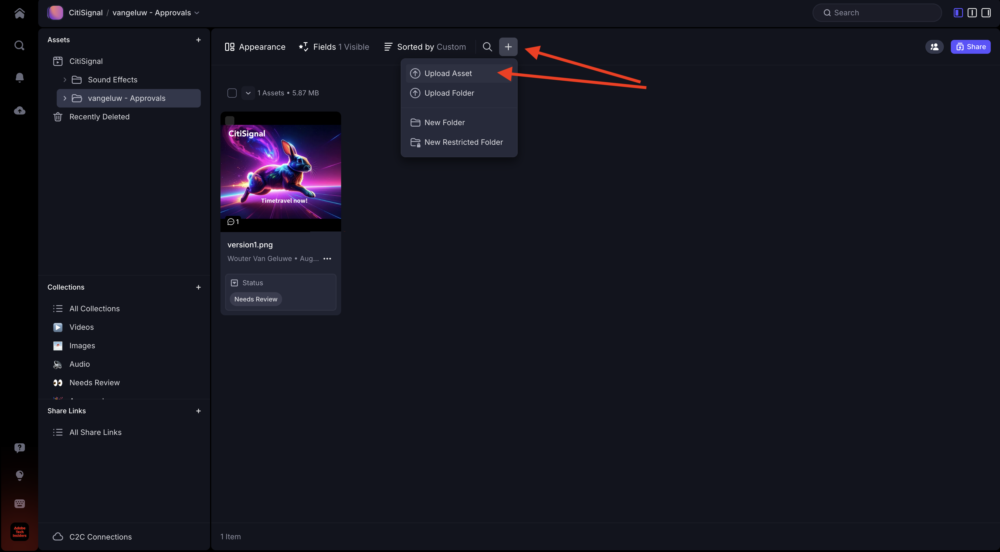

# 1.5.2具有Frame.io的核准

>[!NOTE]
>
> 下方熒幕擷圖顯示使用的特定環境。 當您閱讀本教學課程時，您的環境很可能有不同的名稱。 當您註冊參加本教學課程時，系統已為您提供要使用的環境詳細資訊，請依照這些指示操作。

若要在Frame.io中逐步進行核准工作流程，您需要資產。 在本練習中，您首先會使用Adobe Firefly和Adobe Express自行建立該資產。 擁有資產後，您將會在Frame.io中上傳資產，並最終核准。

## 1.5.2.1使用Adobe Firefly Services和Adobe Express建立資產

移至[https://firefly.adobe.com/](https://firefly.adobe.com/){target="_blank"}。 輸入提示`a neon rabbit running very fast through space`並按一下&#x200B;**產生**。

然後您會看到正在產生數個影像。 選擇您最喜歡的影像，按一下影像上的&#x200B;**共用**&#x200B;圖示，然後選取&#x200B;**在Adobe Express中開啟**。

之後，您會看到剛才產生的影像可在Adobe Express中用於編輯。 您現在需要在影像上新增CitiSignal標誌。 若要這麼做，請移至&#x200B;**品牌**。

然後您應該會看到CitiSignal品牌範本。 在GenStudio for Performance Marketing中建立的報表會顯示在Adobe Express中。 按一下以選取名稱中有`CitiSignal`的品牌範本。

移至&#x200B;**圖志**&#x200B;並按一下&#x200B;**白色** Citisignal圖志，將其拖曳至影像上。

將CitiSignal標誌放在影像上方，中間不遠。

移至&#x200B;**文字**。

按一下&#x200B;**新增您的文字**。

輸入文字`Timetravel now!`，變更字型顏色和字型大小，將文字設定為&#x200B;**粗體**，讓您的影像與此類似。

接著，按一下&#x200B;**共用**。

按一下&#x200B;**...顯示全部**。

向下捲動並選取&#x200B;**下載**。

按一下&#x200B;**下載**。

接著，您的資產就會位於本機電腦上。

## 1.5.2.2在Frame.io中核准您的資產

移至[https://next.frame.io/](https://next.frame.io/)。 請確定您已登入環境`--aepImsOrgName--`。

如果您未登入右側環境，請按一下左下方的標誌，然後按一下以選取您需要使用的環境。

前往您的工作區，該工作區應命名為`--aepUserLdap--`，然後開啟資料夾&#x200B;**CitiSignal**。 按一下&#x200B;**+**&#x200B;圖示，然後選取&#x200B;**新增資料夾**。

為資料夾命名`--aepUserLdap-- - Approvals`。 連按兩下資料夾以開啟它。

您現在會將您在上一個練習中建立的檔案上傳至此資料夾。 按一下&#x200B;**上傳**。

選取檔案並按一下&#x200B;**開啟**。

然後您應該擁有此專案。 連按兩下檔案以開啟。

啟用圖示以留下錨定註解。

輸入註解，例如`Change CTA to "Get on board now!"`。 按一下&#x200B;**傳送**&#x200B;圖示以分享您的註解。

然後您應該擁有此專案。 移至&#x200B;**欄位**。

在&#x200B;**狀態**&#x200B;欄位中，將狀態變更為&#x200B;**需要檢閱**。

然後您應該擁有此專案。 按一下箭頭返回資料夾。

按一下3個點&#x200B;**...**，然後選取&#x200B;**重新命名**。

將檔案名稱變更為`version1.png`。

## 1.5.2.3在Adobe Express中進行設計變更

移至[https://new.express.adobe.com/your-stuff/files](https://new.express.adobe.com/your-stuff/files)，然後再次開啟您先前建立的影像。

將CTA文字變更為`Get On Board Now!`。

按一下[共用]****，然後選取[下載]****。

按一下&#x200B;**下載**。

然後，您將在本機電腦上下載新影像。 將檔案重新命名為`version2.png`。

## 1.5.2.4在Frame.io中核准版本2

在Frame.io的資料夾中，按一下&#x200B;**+**&#x200B;圖示並選取&#x200B;**上傳資產**。

選取檔案&#x200B;**version2.png**&#x200B;並按一下&#x200B;**開啟**。

接著，將檔案&#x200B;**version2.png**&#x200B;拖曳至檔案&#x200B;**version1.png**&#x200B;上方。 此動作將啟用Frame.io中的版本棧疊。

您應該會看到此訊息。

按一下影像上的3個點&#x200B;**...**，然後選取&#x200B;**比較版本**。

然後您應該會看到此比較檢視，其中顯示檔案的兩個版本。 移至&#x200B;**欄位**。

將欄位&#x200B;**狀態**&#x200B;變更為&#x200B;**已核准**。

然後您應該擁有此專案。 按一下箭頭圖示以返回資料夾檢視。

按一下3個點&#x200B;**...**，然後選取&#x200B;**下載**，以備您要在其他應用程式中使用此檔案。

## 後續步驟

[1.5.3 Frame.io和Premiere Pro](./ex3.md){target="_blank"}

返回[使用Frame.io簡化您的工作流程](./frameio.md){target="_blank"}

返回[所有模組](./../../../overview.md){target="_blank"}
