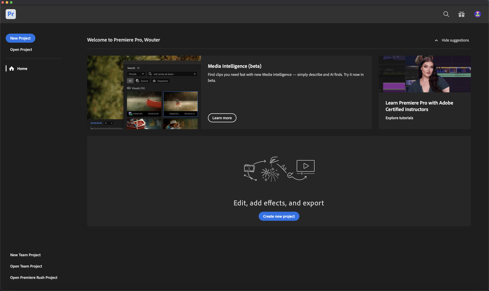

# 1.5.3 Frame.io和Premiere Pro

>[!NOTE]
>
> 下方熒幕擷圖顯示使用的特定環境。 當您閱讀本教學課程時，您的環境很可能有不同的名稱。 當您註冊參加本教學課程時，系統已為您提供要使用的環境詳細資訊，請依照這些指示操作。

移至[https://next.frame.io/](https://next.frame.io/)。 請確定您已登入環境`--aepImsOrgName--`。

如果您未登入右側環境，請按一下左下方的標誌，然後按一下以選取您需要使用的環境。

## 1.5.3.1設定Adobe Premiere Pro Beta

您已將Adobe Premiere Pro Beta安裝在「快速入門」模組中。 若要搭配Adobe Premiere Pro Beta使用Frame.io，您可以利用為此整合開發的外掛程式。

開啟Creative Cloud應用程式並搜尋`frame.io`。

向下捲動搜尋結果以尋找外掛程式&#x200B;**Frame.io V4 Comments**。 按一下它。

您應該會看到此訊息。 按一下&#x200B;**安裝**。

如果Adobe Premiere Pro Beta已開啟，您必須先&#x200B;**關閉**，才能安裝外掛程式。

按一下&#x200B;**確定**。 外掛程式正在安裝中。

安裝外掛程式後，請在電腦上開啟Adobe Premiere Pro Beta 。

## 後續步驟

移至[摘要與優點](./summary.md){target="_blank"}

返回[使用Frame.io簡化您的工作流程](./frameio.md){target="_blank"}

返回[所有模組](./../../../overview.md){target="_blank"}
