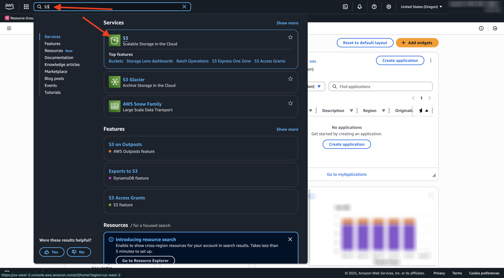
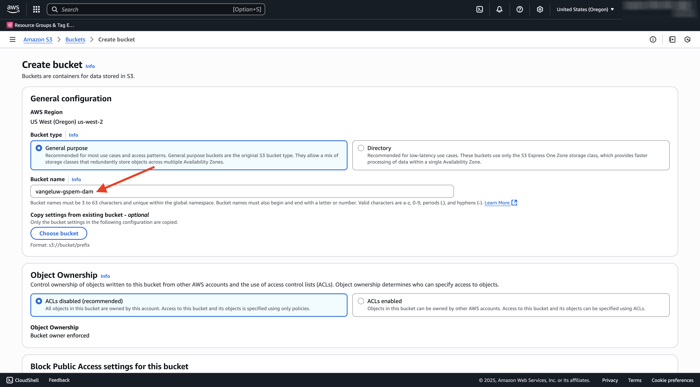
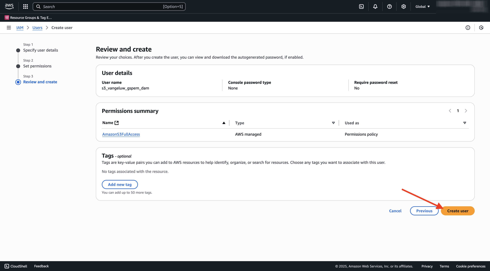

# 1.6.2建立您的AWS S3貯體

## 1.6.2.1建立您的S3貯體

移至[https://console.aws.amazon.com](https://console.aws.amazon.com)並登入。

>[!NOTE]
>
>如果您還沒有AWS帳戶，請使用您的個人電子郵件地址建立新的AWS帳戶。

登入後，系統會將您重新導向至&#x200B;**AWS管理主控台**。

在搜尋列中搜尋&#x200B;**s3**。 按一下第一個搜尋結果： **S3 — 雲端中的可擴充儲存空間**。

然後您會看到&#x200B;**Amazon S3**&#x200B;首頁。 按一下&#x200B;**建立貯體**。

在「**建立貯體**」畫面中，使用名稱`--aepUserLdap---gspem-dam`。

保留所有其他預設設定。 向下捲動並按一下&#x200B;**建立貯體**。

接著，您會看到儲存貯體已建立，且系統會將您重新導向至Amazon S3首頁。

## 設定存取S3貯體的許可權

下一步是設定您S3貯體的存取權。

若要這麼做，請前往[https://console.aws.amazon.com/iam/home](https://console.aws.amazon.com/iam/home)。

AWS資源的存取權由Amazon Identity and Access Management (IAM)控制。

您現在會看到此頁面。

在左側功能表中，按一下&#x200B;**使用者**。 然後您會看到&#x200B;**使用者**&#x200B;畫面。 按一下&#x200B;**建立使用者**。

接下來，設定您的使用者：

- 使用者名稱：使用`s3_--aepUserLdap--_gspem_dam`

按一下&#x200B;**下一步**。

然後您會看到此許可權畫面。 按一下&#x200B;**直接附加原則**。

輸入搜尋字詞&#x200B;**s3**&#x200B;以檢視所有相關的S3原則。 選取原則&#x200B;**AmazonS3FullAccess**。 向下捲動並按一下&#x200B;**下一步**。

檢閱您的設定。 按一下&#x200B;**建立使用者**。

您將會看到此訊息。 按一下&#x200B;**檢視使用者**。

按一下&#x200B;**安全性認證**，然後按一下&#x200B;**建立存取金鑰**。

選取&#x200B;**在AWS**&#x200B;外部執行的應用程式。 向下捲動並按一下&#x200B;**下一步**。

按一下&#x200B;**建立存取金鑰**

您將會看到此訊息。 按一下&#x200B;**顯示**&#x200B;檢視您的秘密存取金鑰：

現在顯示您的&#x200B;**秘密存取金鑰**。

>[!IMPORTANT]
>
>將您的認證儲存在電腦的文字檔中。
>
> - 存取金鑰ID： ...
> - 秘密存取金鑰： ...
>
> 按一下&#x200B;**完成**，您將再也看不到您的認證！

按一下&#x200B;**「完成」**。

您現在已成功建立AWS S3貯體，並已建立具有存取此貯體許可權的使用者。

## 1.6.2.2將Assets上傳至您的S3貯體

在搜尋列中搜尋&#x200B;**s3**。 按一下第一個搜尋結果： **S3 — 雲端中的可擴充儲存空間**。

按一下以開啟您新建立的S3儲存貯體，應命名為`--aepUserLdap---gspem-dam`。

按一下&#x200B;**上傳**。

您應該會看到此訊息。

您可以在[這裡](./../../asset-mgmt/module2.2/images/CitiSignal_Neon_Rabbit.zip){target="_blank"}下載CitiSignal影像檔案。

將檔案匯出至案頭。

將該資料夾中的2個影像檔案拖放至S3儲存貯體上傳視窗中。 按一下&#x200B;**上傳**。

您應該會看到此訊息。 您的S3儲存貯體、影像檔案和IAM使用者現已準備好供您的外部DAM應用程式使用。

## 後續步驟

移至[建立您的外部DAM應用程式](./ex3.md){target="_blank"}

返回[GenStudio for Performance Marketing — 擴充性](./genstudioext.md){target="_blank"}

返回[所有模組](./../../../overview.md){target="_blank"}
