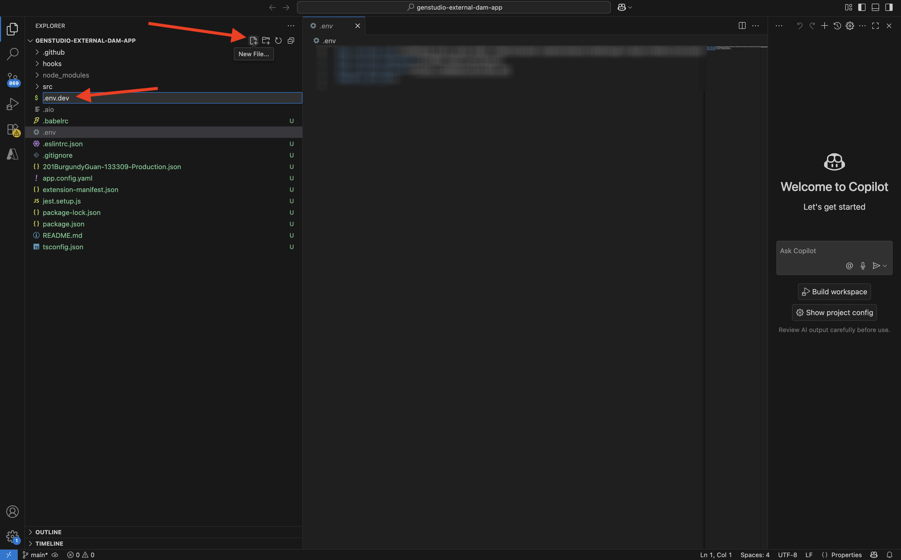

# 1.6.3建立外部DAM應用程式

## 1.6.3.1下載範例應用程式檔案

移至[https://github.com/adobe/genstudio-extensibility-examples](https://github.com/adobe/genstudio-extensibility-examples)。 按一下&#x200B;**代碼**，然後選取&#x200B;**下載ZIP**。


將zip檔案解壓縮至案頭。


開啟資料夾&#x200B;**genstudio-extensibility-examples-main**。 您將會看到多個範例應用程式。 此練習的興趣是&#x200B;**genstudio-external-dam-app**。

複製該目錄並貼到您的案頭上。


您的案頭上現在應該有此專案：


在接下來的練習中，您只會使用&#x200B;**genstudio-external-dam-app**&#x200B;資料夾。

## 1.6.3.2設定Adobe Developer命令列介面

在&#x200B;**genstudio-external-dam-app**&#x200B;資料夾上按一下滑鼠右鍵，然後選取&#x200B;**資料夾的新終端機**。


您應該會看到此訊息。 輸入命令`aio login`。 此命令會重新導向至您的瀏覽器，並預期您會登入。


成功登入後，您應該會在瀏覽器中看到此資訊。


瀏覽器會重新導向回終端機視窗。 您應該會看到顯示&#x200B;**登入成功**&#x200B;的訊息，以及瀏覽器傳回的長權杖。


下一步是設定您用於外部DAM應用程式的例項和Adobe IO專案。

為此，您需要從您之前設定的Adobe IO專案下載檔案。

移至[https://developer.adobe.com/console/home](https://developer.adobe.com/console/home){target="_blank"}，並開啟您之前建立的專案（名為`--aepUserLdap-- GSPeM EXT`）。 開啟&#x200B;**生產**&#x200B;工作區。


按一下&#x200B;**全部下載**。 如此將下載JSON檔案。


將JSON檔案從您的&#x200B;**Downloads**&#x200B;目錄複製到外部DAM應用程式的根目錄中。


返回您的終端機視窗。 輸入命令`aio app use XXX-YYY-Production.json`。

>[!NOTE]
>
>您需要變更檔案名稱以符合檔案名稱。

命令執行後，您的外部DAM應用程式現在會連線至使用您之前建立的App Builder的Adobe IO專案。


## 1.6.3.3安裝GenStudio擴充性SDK

接下來，您必須安裝&#x200B;**GenStudio擴充性SDK**。 您可以在這裡找到有關SDK的更多詳細資料： [https://github.com/adobe/genstudio-extensibility-sdk](https://github.com/adobe/genstudio-extensibility-sdk)。

若要安裝SDK，請在終端機視窗中執行此命令：

`npm install @adobe/genstudio-extensibility-sdk`


幾分鐘後，就會安裝SDK。


## 1.6.3.4在Visual Studio Code中檢閱外部DAM應用程式

開啟Visual Studio Code。 按一下&#x200B;**開啟……**&#x200B;以開啟資料夾。


選取包含您之前下載的應用程式的資料夾&#x200B;**genstudio-external-dam-app**。


按一下以開啟檔案&#x200B;**.env**。


**.env**&#x200B;檔案是由您在上一步中執行的命令`aio app use`所建立，包含使用App Builder連線至您的Adobe IO專案所需的資訊。


您現在需要在資料夾的根目錄中建立2個新檔案：

- `.env.dev`。按一下&#x200B;**新增檔案**&#x200B;按鈕，然後輸入檔案名稱`.env.dev`。



- `.env.prod`。  按一下&#x200B;**新增檔案**&#x200B;按鈕，然後輸入檔案名稱`.env.prod`。


這些檔案將包含連線至您之前建立的AWS S3儲存貯體所需的認證。

```
AWS_ACCESS_KEY_ID=
AWS_SECRET_ACCESS_KEY=
AWS_REGION=
AWS_BUCKET_NAME=
```

在上一個練習中建立IAM使用者後，即可使用欄位&#x200B;**AWS_ACCESS_KEY_ID**&#x200B;和&#x200B;**AWS_SECRET_ACCESS_KEY**。 系統要求您寫下這些值，您現在可以複製這些值。


欄位&#x200B;**AWS_REGION**&#x200B;可以從AWS S3 Home檢視取得，位於您的儲存貯體名稱旁。 在此範例中，區域是&#x200B;**us-west-2**。


欄位&#x200B;**AWS_BUCKET_NAME**&#x200B;應為`--aepUserLdap---gspem-dam`。

此資訊可讓您更新每個變數的值。

```
AWS_ACCESS_KEY_ID=XXX
AWS_SECRET_ACCESS_KEY=YYY
AWS_REGION=us-west-2
AWS_BUCKET_NAME=--aepUserLdap---gspem-dam
```

您現在應該將此文字貼到兩個檔案中： `.env.dev`和`.env.prod`。 別忘了儲存您的變更。


接下來，返回您的終端機視窗。 執行此命令：

`export $(grep -v '^#' .env.dev | xargs)`


## 1.6.3.5執行您的外部DAM應用程式

在終端機視窗中，執行命令`aio app run`。 1-2分鐘後，您應該會看到此訊息。


## 後續步驟

移至[部署您的程式碼並私下發佈您的應用程式](./ex4.md){target="_blank"}

返回[GenStudio for Performance Marketing — 擴充性](./genstudioext.md){target="_blank"}

返回[所有模組](./../../../overview.md){target="_blank"}
