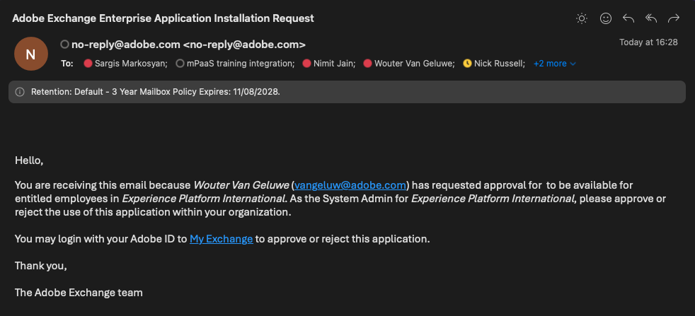

# 1.6.4部署您的程式碼並私下發佈您的應用程式

私下發佈您的應用程式，表示您的應用程式可在GenStudio for Performance Marketing中使用，不必使用查詢字串引數。

## 1.6.4.1發佈您的應用程式

移至[https://developer.adobe.com/console/projects](https://developer.adobe.com/console/projects){target="_blank"}。

>[!NOTE]
>
> 下方熒幕擷圖顯示選取的特定組織。 完成本教學課程時，您的組織很可能有不同的名稱。 當您註冊參加本教學課程時，系統已為您提供要使用的環境詳細資訊，請依照這些指示操作。

使用App Builder開啟Adobe IO專案，名稱應為`--aepUserLdap-- GSPeM EXT`。

移至&#x200B;**生產**。

按一下&#x200B;**私人發佈**。

然後，您需要填寫一些欄位。

填寫下列欄位，如下所示：

- **應用程式標題**： `--aepUserLdap-- - External DAM AWS S3`。
- **應用程式描述**： `External DAM AWS S3`
- **連絡人電子郵件**：輸入您的電子郵件地址
- **應用程式圖示**：下載並使用這個影像： [S3影像](./images/s3.jpeg)
- **稽核者注意事項**：外部DAM AWS S3

按一下&#x200B;**提交**。

按一下&#x200B;**提交**。

## 1.6.4.2核准您的應用程式

開發人員提交新應用程式以供發佈後，將會通知您組織的系統管理員，並要求他們檢閱和核准。

如果您是系統管理員，將會收到這封電子郵件，然後您可以按一下[我的Exchange] ****&#x200B;開始該程式。

在&#x200B;**Adobe Exchange**&#x200B;上會顯示App Builder應用程式，而剛才提交的應用程式正在等候檢閱。 按一下應用程式&#x200B;**的**&#x200B;檢閱`--aepUserLdap-- - External DAM AWS S3`按鈕。

新增註解並按一下&#x200B;**核准**。

您的應用程式現已核准，且將在GenStudio for Performance Marketing中自動運作，無需指定查詢字串引數。

## 後續步驟

移至[摘要與優點](./summary.md){target="_blank"}

返回[GenStudio for Performance Marketing — 擴充性](./genstudioext.md){target="_blank"}

返回[所有模組](./../../../overview.md){target="_blank"}
