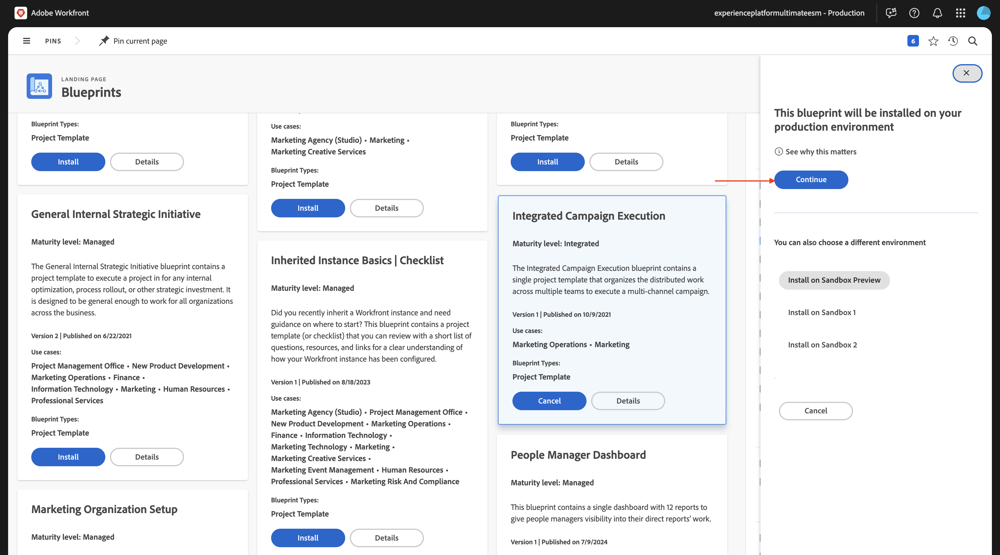
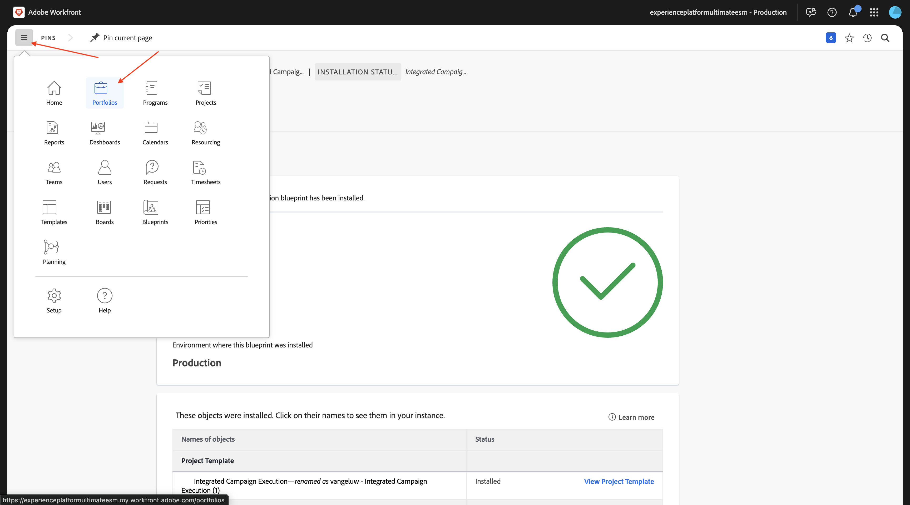
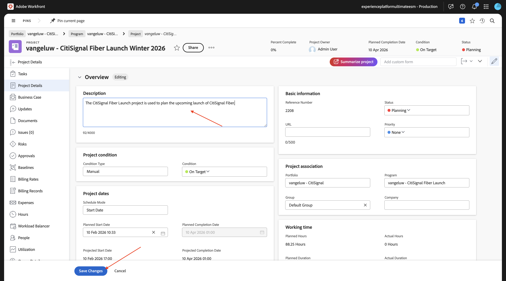
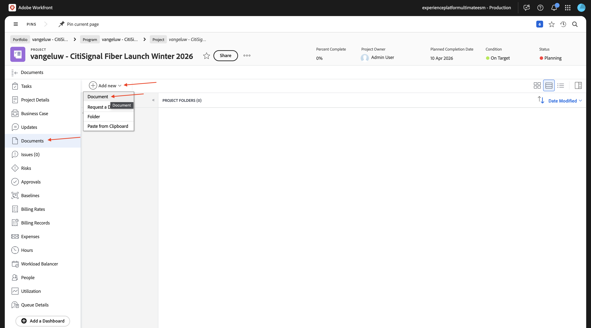
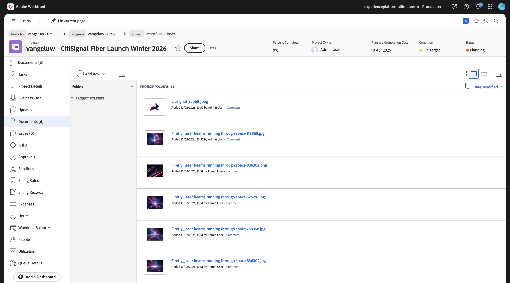

# 1.8.1 Workfront、Frame.io和ESM快速入門

## 1.8.1.1 Workfront工作流程術語

以下是主要的Workfront物件和概念：

| 名稱 | 上次更新 |
| ---------------------- | ------------ | 
| 產品組合 | 具有統一特性的專案集合。 這些專案通常會爭奪相同的資源、預算或時段。 |
| 方案 | 產品組合中的子集，可將類似的專案分組在一起，以獲得明確定義的利益。 |
| 專案 | 必須在特定時間範圍內完成的大量工作，且必須使用特定預算和資源數量。 為了讓專案易於管理，您可將專案分成一系列工作。 完成所有任務會導致專案完成。 |
| 專案範本 | 您可以使用專案範本來擷取與組織中專案相關的大部分可重複流程、資訊和設定。 建立範本後，您可以將範本附加至現有專案，也可以使用範本建立新專案。 |
| 任務 | 作為達成最終目標（完成專案）的步驟而必須執行的活動。 工作永遠無法獨立存在。 它們永遠是專案的一部分。 |
| 指定任務 | 指派給問題或任務的使用者、工作角色或團隊。 專案、專案組合或方案不能有指派。 |
| 檔案/版本 | 附加至Workfront中物件的任何檔案。 每次將相同的檔案上傳到相同的物件時，都會為其指定版本編號。 使用者可以檢視和變更舊版檔案的多個選項。 |
| 核准 | 指定的工作專案，例如工作、檔案或時程表，可能需要主管或其他使用者登出該工作專案。 此登出程式稱為核准。 |

移至[https://experience.adobe.com/](https://experience.adobe.com/){target="_blank"}。 按一下以開啟&#x200B;**Workfront**。

您將會看到此訊息。

## 1.8.1.2啟用Workfront Blueprint

在下一步中，您將使用範本建立新專案。 Adobe Workfront提供您許多隻需啟用的可用Blueprint。

針對CitiSignal的使用案例，您需要使用&#x200B;**整合式行銷活動執行**&#x200B;藍圖。

若要安裝該Blueprint，請開啟功能表並選取&#x200B;**Blueprint**。

選取篩選器&#x200B;**行銷**，然後向下捲動以尋找&#x200B;**整合式行銷活動執行**&#x200B;藍圖。 按一下&#x200B;**安裝**。

按一下&#x200B;**繼續**。

將&#x200B;**專案範本名稱**&#x200B;變更為`--aepUserLdap-- - Integrated Campaign Execution`。

按一下&#x200B;**安裝Blueprint**。

您應該會看到此訊息。 安裝可能需要幾分鐘的時間。

幾分鐘後，將安裝Blueprint。

## 1.8.1.3建立新專案

開啟&#x200B;**功能表**&#x200B;並移至&#x200B;**Porftolios**。

按一下&#x200B;**+新Portfolio**。

輸入投資組合名稱`--aepUserLdap-- - CitiSignal`。

移至&#x200B;**程式**&#x200B;並按一下&#x200B;**+新程式**。 選取&#x200B;**新程式**。

輸入程式名稱： `--aepUserLdap-- CitiSignal Fiber Launch`。

在您的程式中，移至&#x200B;**專案**。 按一下「**+新增專案**」，然後從範本選取「**新增專案**」。

選取範本`--aepUserLdap-- - Integrated Campaign Execution`並按一下&#x200B;**使用範本**。

您應該會看到此訊息。 將名稱變更為`--aepUserLdap-- - CitiSignal Fiber Launch Winter 2026`並按一下&#x200B;**建立專案**。

您的專案現已建立。 移至&#x200B;**專案詳細資料**。

移至&#x200B;**專案詳細資料**。 按一下以選取&#x200B;**描述**&#x200B;下的目前文字。

將描述設為`The CitiSignal Fiber Launch project is used to plan the upcoming launch of CitiSignal Fiber.`

按一下&#x200B;**儲存變更**。

您的專案現在已可供使用。

專案中的任務和相依性是根據您選擇的範本建立的，並且您已經設定為。 專案的所有者。 專案狀態已設定為&#x200B;**規劃**。 您可以在清單中選取其他值來變更專案狀態。

## Frame.io中的1.8.1.4專案檢視

移至[https://next.frame.io/](https://next.frame.io/){target="_blank"}。 登入並選取要使用的執行個體，在此範例中&#x200B;**Experience Platform International ESM**。 您會注意到Frame.io中已存在您剛建立之專案的資料夾。 資料夾是以您先前輸入的專案名稱命名。

這是Enterprise Storage Management的一項功能，這是雲端型儲存解決方案，可作為Adobe企業產品(包括Workfront和Frame.io)資產的中央存放庫。

Adobe企業儲存的主要優點包括：

- 適用於創意與工作管理資產的統一儲存層
- 透過Adobe Identity Management系統(IMS)集中管理許可權，以進行安全存取控制
- Workfront和Frame.io的端對端資產可見性
- 可擴充的儲存與配額管理，因應企業需求

## 1.8.1.5建立新任務

請返回Workfront。 移至&#x200B;**工作**，將滑鼠游標停留在工作&#x200B;**開始建立設計範本**&#x200B;並按一下3個點&#x200B;**...**。

選取選項&#x200B;**在下方插入任務**。

為您的工作輸入此名稱： `Create layout using approved assets and copy`。

將欄位&#x200B;**指派**&#x200B;設定為角色&#x200B;**Designer**。
將欄位**Duration**&#x200B;設定為&#x200B;**5天**。
將前置工作列位設定為**9**。
輸入欄位**開始日期**&#x200B;和&#x200B;**到期日期**&#x200B;的日期（此任務的開始日期應排程在前一個任務的結束日期之後）。

按一下畫面中的其他位置以儲存新任務。

您應該會看到此訊息。 按一下工作以開啟它。

移至&#x200B;**任務詳細資料**&#x200B;並將欄位&#x200B;**描述**&#x200B;設定為： `This task is used to track the progress of the creation of the assets for the CitiSignal Fiber Launch Campaign.`

按一下&#x200B;**儲存變更**。

您應該會看到此訊息。 按一下&#x200B;**指派**&#x200B;欄位並選取&#x200B;**指派給我**。

按一下&#x200B;**儲存**。

按一下&#x200B;**處理它**。

您應該會看到此訊息。

在此任務中，需要建立新資產。 在下一個步驟中，首先您要在Workfront中提供參考影像，讓設計人員知道預期的情形。 接著，您會變更為Designer的角色，並使用Adobe Express自行建立該資產。

## 1.8.1.6上傳參考影像

將參考影像[這裡](./assets/reference_images.zip)下載到您的案頭並解壓縮。

在Workfront中，導覽至&#x200B;**專案**&#x200B;層級。

移至&#x200B;**檔案**，按一下&#x200B;**+新增**，然後選取&#x200B;**檔案**。

導覽至您下載的資料夾，其中包含參考影像。 選取所有影像，然後按一下&#x200B;**開啟**。

幾分鐘後，所有影像將上傳並附加至專案。

設定好參考影像後，設計人員現在就可以為此行銷活動建立新資產。

## 後續步驟

下一步： [建立新資產，檢閱並核准](./ex2.md){target="_blank"}

返回[使用Workfront、Frame.io和企業儲存體管理進行統一檢閱和核准](./esm.md){target="_blank"}

返回[所有模組](./../../../overview.md){target="_blank"}
