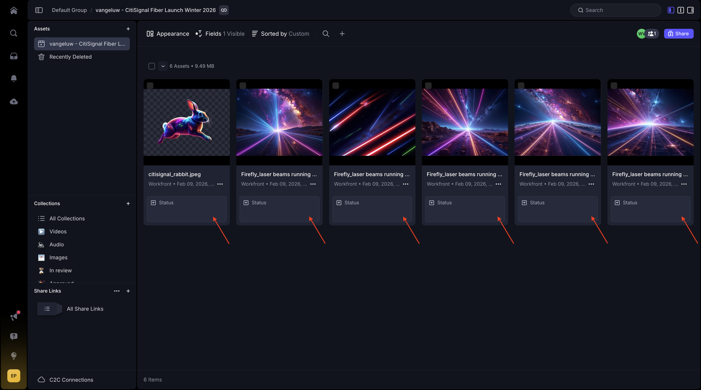
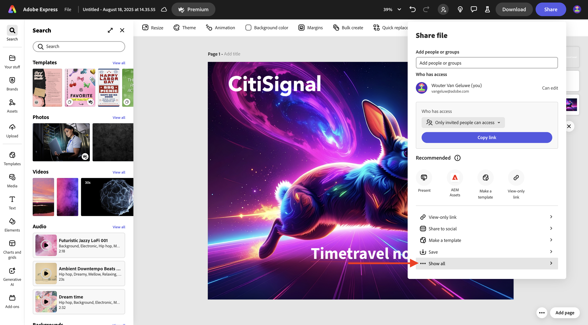
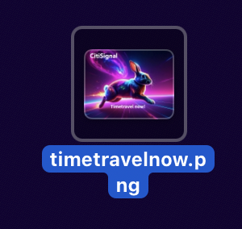
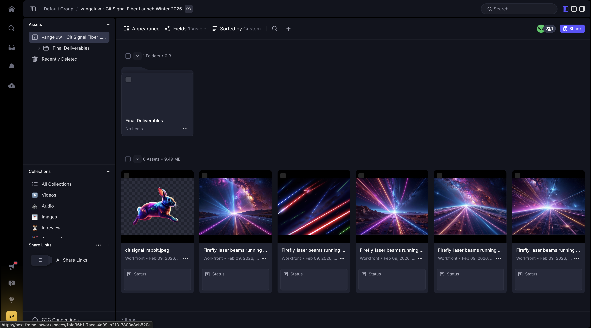
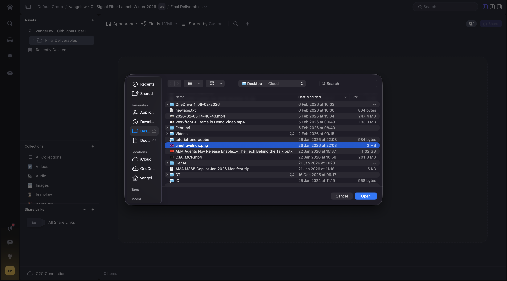

# 1.8.2建立新資產，檢閱並核准

## 1.8.2.1驗證Frame.io中的參考影像

移至[https://next.frame.io/](https://next.frame.io/){target="_blank"}。 按一下以開啟專案的資料夾。

您現在應該會看到Workfront中提供的所有參考影像。 設計人員現在可以在安全的環境中，自動存取所有上傳至Workfront的檔案。

按一下&#x200B;**+**，然後選取&#x200B;**新增資料夾**。

輸入名稱： `Final Deliverables`並按&#x200B;**Enter**。 此資料夾將用來上傳設計師建立的最終檔案

## 1.8.2.2使用Adobe Firefly Services和Adobe Express建立新資產

>[!NOTE]
>
>若您不想自行建立新資產，您可以在[這裡](./images/timetravelnow.png)下載完成的版本。

移至[https://firefly.adobe.com/](https://firefly.adobe.com/){target="_blank"}。 輸入提示`a neon rabbit running very fast through space`並按一下&#x200B;**產生**。

然後您會看到正在產生數個影像。 選擇您最喜歡的影像，按一下影像上的&#x200B;**共用**&#x200B;圖示，然後選取&#x200B;**在Adobe Express中開啟**。

之後，您會看到剛才產生的影像可在Adobe Express中用於編輯。 您現在需要在影像上新增CitiSignal標誌。 若要這麼做，請移至&#x200B;**品牌**。

然後您應該會看到CitiSignal品牌範本。 在GenStudio for Performance Marketing中建立的報表會顯示在Adobe Express中。 按一下以選取名稱中有`CitiSignal`的品牌範本。

移至&#x200B;**圖志**&#x200B;並按一下&#x200B;**白色** Citisignal圖志，將其拖曳至影像上。

將CitiSignal標誌放在影像上方，中間不遠。

移至&#x200B;**文字**。

按一下&#x200B;**新增您的文字**。

輸入文字`Timetravel now!`，變更字型顏色和字型大小，將文字設定為&#x200B;**粗體**，讓您的影像與此類似。

接著，按一下&#x200B;**共用**。

按一下&#x200B;**...顯示全部**。

向下捲動並選取&#x200B;**下載**。

按一下&#x200B;**下載**。

接著，您的資產就會位於本機電腦上。

將檔案名稱變更為`timetravelnow.png`。

## 1.8.2.3在Frame.io中檢閱資產

返回[https://next.frame.io/](https://next.frame.io/){target="_blank"}並開啟專案的資料夾。

按一下&#x200B;**上傳**。

選取檔案&#x200B;**timetravelnow.png**&#x200B;並按一下&#x200B;**開啟**。

您應該會看到此訊息。

將狀態變更為&#x200B;**需要檢閱**，然後按兩下影像以開啟它。

標籤環境中的一位檢閱者，並新增訊息，例如： `ready for your feedback on this one`。

檢閱者接著可提出註解，以進行變更或確認其是否良好。

## 1.8.2.4在Workfront中查詢資產

當設計團隊反複檢視他們建立的資產時，Workfront中的專案經理可以關注正在發生的事情。 返回Workfront。 重新整理頁面。

現在，您會看到在Frame.io中建立的資料夾出現在Workfront中。 按一下以開啟。

您應該會看到此訊息。 將游標暫留在檔案&#x200B;**timetravelnow.png**&#x200B;上，然後按一下&#x200B;**檔案詳細資料**。

身為專案經理，您現在可以看到該影像的最新版本，因此您可以知道正在發生什麼並且正在積極處理此專案。

## 1.8.2.5核准資產

在Workfront中，移至&#x200B;**核准**&#x200B;並按一下&#x200B;**新增**。

將您新增為核准者，然後按一下&#x200B;**送出要求**。

您應該會看到此訊息。 按一下「**開啟檢閱**」，系統會將您帶至Frame.io。

在Frame.io中，您可以看到所有註解並檢閱資產。 按一下以開啟&#x200B;**您的決定**&#x200B;欄位。

選取&#x200B;**已核准**。

切換回Workfront並重新整理頁面，您現在也會看到此處的狀態已變更。 資產已核准，且接下來可用於傳送和啟用。

## 後續步驟

返回[使用Workfront、Frame.io和企業儲存體管理進行統一檢閱和核准](./esm.md){target="_blank"}

返回[所有模組](./../../../overview.md){target="_blank"}
