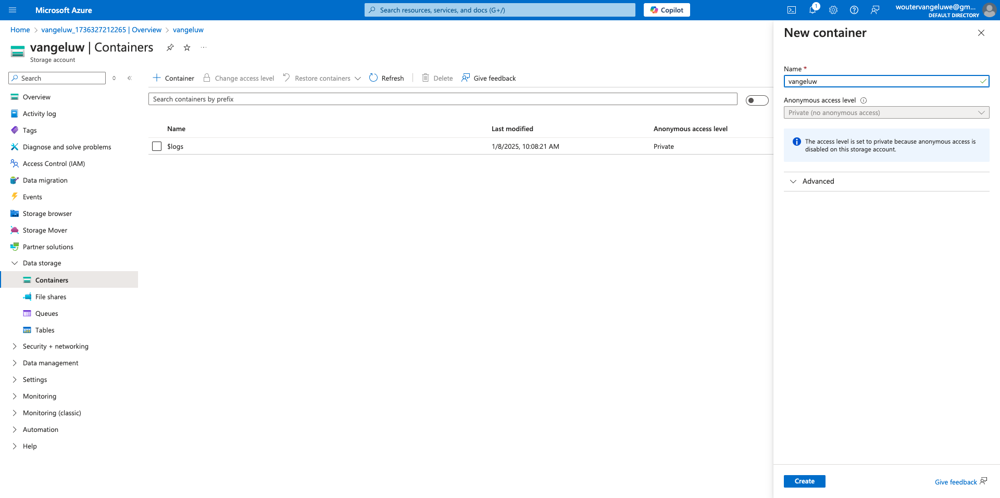
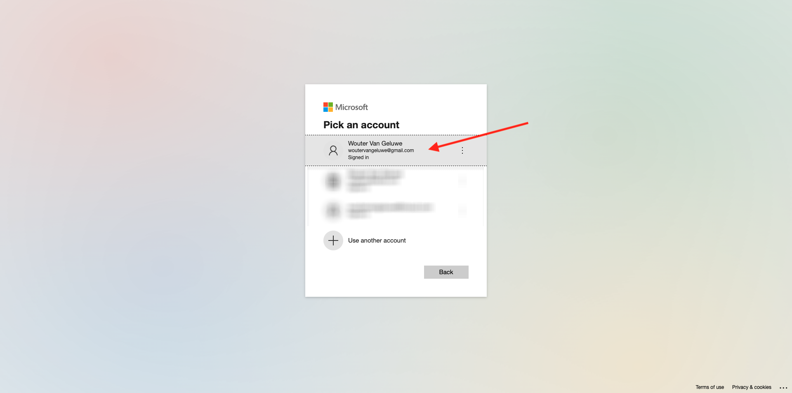
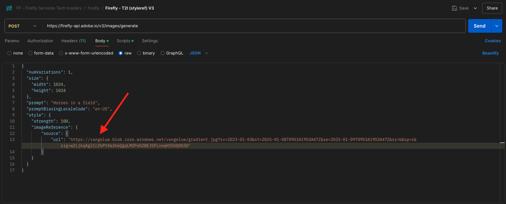

# 1.1.2使用Microsoft Azure和預先簽署的URL最佳化Firefly程式

## 1.1.2.1建立Azure訂閱

>[!NOTE]
>
>如果您已有現有的Azure訂閱，可以略過此步驟。 請繼續進行該案例的下一個練習。

移至[https://portal.azure.com](https://portal.azure.com)並使用您的Azure帳戶登入。 如果您沒有電子郵件地址，請使用個人電子郵件地址來建立您的Azure帳戶。

成功登入後，您會看到下列畫面：

按一下左側功能表並選取&#x200B;**所有資源**，如果您尚未訂閱，將會顯示Azure訂閱畫面。 在這種情況下，請選取&#x200B;**開始使用Azure免費試用**。

填寫Azure訂閱表單，提供您的行動電話和信用卡以進行啟用（您將有30天的免費套餐，除非您升級，否則不會向您收費）。

訂閱程式完成後，您就可以開始了：

## 1.1.2.2建立Azure儲存體帳戶

搜尋`storage account`，然後按一下&#x200B;**儲存帳戶**。

按一下&#x200B;**+建立**。

請填寫下列詳細資料：

- 選取您的&#x200B;**訂閱**
- 選取（或建立） **資源群組**
- **儲存體帳戶名稱**：使用`--aepUserLdap--`

按一下&#x200B;**檢閱+建立**。

按一下&#x200B;**建立**。

之後，您會獲得類似的確認。 按一下&#x200B;**前往資源**。

您的Azure儲存體帳戶現在已可供使用。

按一下&#x200B;**資料儲存體**，然後移至&#x200B;**容器**。 按一下&#x200B;**+容器**。

對於名稱，請使用`--aepUserLdap--`。 按一下&#x200B;**建立**。

您的容器現在已可供使用。

## 1.1.2.3安裝Azure儲存體總管

您將使用Microsoft Azure儲存體總管來管理您的檔案。 您可以透過[此連結](https://azure.microsoft.com/en-us/products/storage/storage-explorer#Download-4)下載。 針對您的特定作業系統選取正確的版本，下載並安裝。

安裝應用程式後，請開啟它。 您會看到類似內容。 按一下&#x200B;**使用Azure**&#x200B;登入。

按一下&#x200B;**訂閱**。

選取&#x200B;**Azure**&#x200B;並按一下&#x200B;**下一步**。

選取您的Microsoft Azure帳戶並完成驗證程式。

驗證後，您將看到以下訊息。

切換回Microsoft Azure儲存體總管應用程式。 選取您的訂閱，然後按一下&#x200B;**開啟總管**。

您會在&#x200B;**儲存體帳戶**&#x200B;下找到您的儲存體帳戶。

開啟&#x200B;**Blob容器**，然後按一下您在上一個練習中建立的容器。

## 1.1.2.4手動檔案上傳和使用影像檔案作為樣式參考

您現在應上傳所選影像檔案至容器。 您可以使用任何選擇的影像檔案，也可以透過下載到電腦來使用[這個檔案](./images/gradient.jpg)。

將影像檔案拖放到Azure儲存體總管的容器中。

上傳後，您會在容器中看到：

用滑鼠右鍵按一下您的檔案`gradient.jpg`，然後按一下&#x200B;**取得共用存取權簽章**。

在&#x200B;**許可權**&#x200B;之下，只需要&#x200B;**讀取**。 按一下&#x200B;**建立**。

接著，您會看到此影像檔案的預先簽署URL。 視需要複製它，以便下一個API請求Firefly。

返回Postman。 開啟請求&#x200B;**POST- Firefly - T2I (styleref) V3**。 您會在&#x200B;**內文**&#x200B;中看到此內容。

將預留位置URL取代為您從Azure儲存體總管複製的影像檔案預先簽署的URL。 您就會擁有此專案。 按一下&#x200B;**傳送**。

接著，您會再次從Firefly服務取得回應，並附上新影像。 在瀏覽器中開啟影像檔案。

您之後會看到另一個含有`horses in a field`的影像，但這次的樣式將與您提供做為樣式參考的影像檔案類似。

## 1.1.2.5程式化檔案上傳

若要搭配Azure儲存體帳戶使用程式化檔案上傳，您必須建立新的&#x200B;**共用存取簽章(SAS)**&#x200B;權杖，並具有可讓您寫入檔案的許可權。

若要這麼做，請返回Azure儲存體總管。 用滑鼠右鍵按一下您的容器，然後按一下&#x200B;**取得共用存取權簽章**。

在&#x200B;**許可權**&#x200B;下，需要下列許可權：

- **讀取**
- **新增**
- **建立**
- **寫入**
- **清單**

按一下&#x200B;**建立**。

然後您會取得您的&#x200B;**SAS-Token**。 按一下&#x200B;**複製**。

您現在可以使用此&#x200B;**SAS-token**&#x200B;將檔案上傳至您的Azure儲存體帳戶。 返回Postman即可完成此操作。

按一下以選取資料夾&#x200B;**FF -Firefly服務技術內部人員**，然後按一下資料夾&#x200B;**Firefly**&#x200B;上的3個點&#x200B;**...**，然後按一下&#x200B;**新增請求**。

之後，您將會有空白請求。 將要求的名稱變更為&#x200B;**將檔案上傳到Azure儲存體帳戶**，將&#x200B;**要求型別**&#x200B;變更為&#x200B;**PUT**，並在URL區段中貼上SAS權杖URL。

然後，按一下&#x200B;**內文**。

您現在需要從本機電腦中選取檔案。 您可以使用選擇的新影像檔，或使用另一個您可以在[這裡](./images/gradient2-p.jpg)找到的影像檔。

在&#x200B;**內文**&#x200B;中，選取&#x200B;**二進位**，然後按一下&#x200B;**選取檔案**，然後按一下本機電腦的&#x200B;**+新增檔案**。

選取您選擇的檔案，然後按一下&#x200B;**開啟**。

您將會看到此訊息。 接下來要做的就是指定要用於Azure儲存體帳戶的檔案名稱。 若要這麼做，您必須將游標放在問號&#x200B;**前面？URL中的**。 您目前可以在那裡看到：

URL目前看起來像這樣，但需要變更。

`https://vangeluw.blob.core.windows.net/vangeluw?sv=2023-01-03...`

要使用的檔案名稱為`gradient2-p.jpg`，這表示URL必須變更以包含檔案名稱，如下所示：

`https://vangeluw.blob.core.windows.net/vangeluw/gradient2-p.jpg?sv=2023-01-03...`

接著，移至&#x200B;**Headers**，您必須在此手動新增標題。 使用此：

| 索引鍵 | 值 |
|:-------------:| :---------------:| 
| `x-ms-blob-type` | `BlockBlob` |

移至&#x200B;**授權**&#x200B;並將&#x200B;**驗證型別**&#x200B;設定為&#x200B;**無驗證**。 按一下&#x200B;**傳送**。

接著，您會在Postman中看到此空白回應，表示您的檔案上傳沒有問題。

如果您接著返回Azure儲存體總管並重新整理資料夾的內容，您現在可以在那裡找到新上傳的檔案。

## 1.1.2.5程式化檔案使用

若要以程式設計方式從Azure儲存體帳戶讀取檔案，您必須建立新的&#x200B;**共用存取簽章(SAS)**&#x200B;權杖，其許可權可讓您讀取檔案。 從技術上講，您可以使用您在上一個練習中建立的SAS-Token，但最佳實務是隻使用具有&#x200B;**讀取**&#x200B;許可權的個別Token。

若要這麼做，請返回Azure儲存體總管。 用滑鼠右鍵按一下您的容器，然後按一下&#x200B;**取得共用存取權簽章**。

在&#x200B;**許可權**&#x200B;下，需要下列許可權：

- **讀取**
- **新增**
- **建立**
- **寫入**
- **清單**

按一下&#x200B;**建立**。

下一步： [1.1.3 ...](./ex3.md)

[返回模組1.1](./firefly-services.md)

[返回所有模組](./../../../overview.md)
