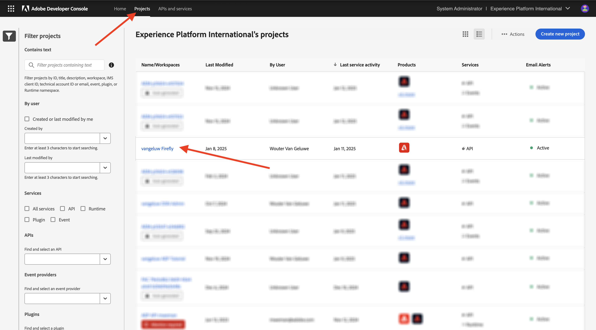

# 使用Photoshop API

瞭解如何使用Photoshop API和Firefly服務。

## 更新您的Adobe I/O整合

1. 移至[https://developer.adobe.com/console/home](https://developer.adobe.com/console/home){target="_blank"}。


1. 移至&#x200B;**專案**，並選取您在上一個練習中建立的專案（稱為`--aepUserLdap-- Firefly`）。



1. 選取&#x200B;**+新增至專案**，然後選取&#x200B;**API**。


1. 選取&#x200B;**Creative Cloud**&#x200B;並選擇&#x200B;**Photoshop -Firefly服務**。 選取&#x200B;**下一步**。


1. 選取&#x200B;**下一步**。


接下來，您需要選取產品設定檔，以定義此整合可用的許可權。

1. 選取&#x200B;**預設Firefly服務組態**&#x200B;和&#x200B;**預設Creative Cloud自動化服務組態**。

1. 選取&#x200B;**儲存設定的API**。


您的Adobe I/O專案現已更新，可搭配Photoshop和Firefly服務API使用。


## 以程式設計方式與PSD檔案互動

1. 將[citisignal-fiber.psd](./../../../assets/ff/citisignal-fiber.psd){target="_blank"}下載到您的案頭。

1. 在Photoshop中開啟&#x200B;**citisignal-fiber.psd**。


在&#x200B;**圖層**&#x200B;窗格中，檔案的設計者已為每個圖層指定唯一的名稱。 您可以在Photoshop中開啟PSD檔案來檢視圖層資訊，也可以利用程式設計方式來進行。

讓我們將您的第一個API要求傳送至Photoshop API。

1. 在Postman中，傳送API請求給Photoshop之前，您需要向Adobe I/O進行驗證。開啟名稱為&#x200B;**POST — 取得存取Token**&#x200B;的上一個要求。

1. 移至&#x200B;**Params**，並確認引數&#x200B;**Scope**&#x200B;已正確設定。 **範圍**&#x200B;的&#x200B;**值**&#x200B;應該如下所示：

`openid,session,AdobeID,read_organizations,additional_info.projectedProductContext, ff_apis, firefly_api`

1. 選取&#x200B;**傳送**。


現在您擁有與Photoshop API互動的有效存取Token。


### Photoshop API - Hello World

接下來，讓我們向Photoshop API問好，以測試所有許可權和存取權是否已正確設定。

1. 在集合&#x200B;**Photoshop**&#x200B;中，開啟要求&#x200B;**Photoshop Hello （測試驗證）。**。選取&#x200B;**傳送**。


您應該會收到回應&#x200B;**歡迎使用Photoshop API！**。


接著，若要以程式設計方式與PSD檔案&#x200B;**citisignal-fiber.psd**&#x200B;互動，您必須將其上傳至儲存帳戶。 您可以使用Azure儲存體總管將其拖放到容器中，手動執行此操作，但這次您應透過API執行此操作。

### 將PSD上傳至Azure

1. 在Postman中，開啟要求&#x200B;**將PSD上傳至Azure儲存體帳戶**。 在上一個練習中，您已在Postman中設定這些環境變數，現在將使用：

- `AZURE_STORAGE_URL`
- `AZURE_STORAGE_CONTAINER`
- `AZURE_STORAGE_SAS_READ`
- `AZURE_STORAGE_SAS_WRITE`

如您在要求&#x200B;**將PSD上傳至Azure儲存體帳戶**&#x200B;中看到的，URL已設定為使用這些變數。


1. 在&#x200B;**主體**&#x200B;中，選取檔案&#x200B;**citisignal-fiber.psd**。


1. 您的熒幕應如下所示。 選取&#x200B;**傳送**。


您應該從Azure取得此空白回應，這表示您的檔案儲存在Azure儲存體帳戶的容器中。


如果您使用Azure Storage Explorer檢視檔案，請務必重新整理資料夾。


### Photoshop API — 取得資訊清單

接下來，您需要取得PSD檔案的資訊清單檔案。

1. 在Postman中，開啟要求&#x200B;**Photoshop — 取得PSD資訊清單**。 移至&#x200B;**內文**。

內文看起來應該像這樣：

```json
{
  "inputs": [
    {
      "storage": "external",
      "href": "{{AZURE_STORAGE_URL}}/{{AZURE_STORAGE_CONTAINER}}/citisignal-fiber.psd{{AZURE_STORAGE_SAS_READ}}"
    }
  ],
  "options": {
    "thumbnails": {
      "type": "image/jpeg"
    }
  }
}
```

1. 選取&#x200B;**傳送**。

在回應中，您現在會看到連結。 由於Photoshop中的作業有時需要一些時間才能完成，因此Photoshop會提供狀態檔案來回應大多數傳入的請求。 若要瞭解您的請求正在發生什麼事，您需要讀取狀態檔案。


1. 若要讀取狀態檔案，請開啟要求&#x200B;**Photoshop — 取得PS狀態**。 您可以看到此要求正在使用變數做為URL，這是由您傳送的上一個要求所設定的變數，**Photoshop — 取得PSD資訊清單**。 變數是在每個要求的&#x200B;**指令碼**&#x200B;中設定。 選取&#x200B;**傳送**。


您的熒幕應如下所示。 目前，狀態設定為&#x200B;**擱置**，表示處理序尚未完成。


1. 在&#x200B;**Photoshop — 取得PS Status**&#x200B;上再選取傳送幾次，直到狀態變更為&#x200B;**succeeded**。 這可能需要幾分鐘的時間。

當回應可用時，您可以看到json檔案包含PSD檔案所有層的資訊。 這是有用的資訊，因為可以識別圖層名稱或圖層ID等。


例如，搜尋文字`2048x2048-cta`。 您的畫面應如下所示：


### Photoshop API — 變更文字

接下來，您需要使用API變更行動號召的文字。

1. 在Postman中，開啟請求&#x200B;**Photoshop — 變更文字**，並移至&#x200B;**內文**。

您的畫面應如下所示：

- 首先，指定輸入檔案： `citisignal-fiber.psd`
- 第二，指定要變更的圖層，並將文字變更為
- 第三，指定了輸出檔案： `citisignal-fiber-changed-text.psd`

```json
{
  "inputs": [
    {
      "storage": "external",
      "href": "{{AZURE_STORAGE_URL}}/{{AZURE_STORAGE_CONTAINER}}/citisignal-fiber.psd{{AZURE_STORAGE_SAS_READ}}"
    }
  ],
  "options": {
    "layers": [
      {
        "name": "2048x2048-cta",
        "text": {
          "content": "Get Fiber now!"
        }
      }
    ]
  },
  "outputs": [
    {
      "storage": "azure",
      "href": "{{AZURE_STORAGE_URL}}/{{AZURE_STORAGE_CONTAINER}}/citisignal-fiber-changed-text.psd{{AZURE_STORAGE_SAS_WRITE}}",
      "type": "vnd.adobe.photoshop",
      "overwrite": true
    }
  ]
}
```

輸出檔案的名稱不同，因為您不想覆寫原始輸入檔案。

1. 選取&#x200B;**傳送**。


就像之前一樣，回應包含一個連結，指向可追蹤進度的狀態檔案。


1. 若要讀取狀態檔，請開啟要求&#x200B;**Photoshop — 取得PS狀態**，然後選取&#x200B;**傳送**。 如果狀態未立即設定為&#x200B;**成功**，請等待幾秒鐘，然後再次選取&#x200B;**傳送**。

1. 選取要下載輸出檔案的URL。


1. 將檔案下載到您的電腦後，開啟&#x200B;**citisignal-fiber-changed-text.psd**。 您應該會看到呼叫動作的預留位置已被文字&#x200B;**立即取得Fiber！**&#x200B;取代。


您也可以使用Azure儲存體總管在容器中檢視此檔案。


## 後續步驟

移至[Firefly自訂模型API](./ex4.md){target="_blank"}

返回[Adobe Firefly服務總覽](./firefly-services.md){target="_blank"}

返回[所有模組](./../../../overview.md){target="_blank"}