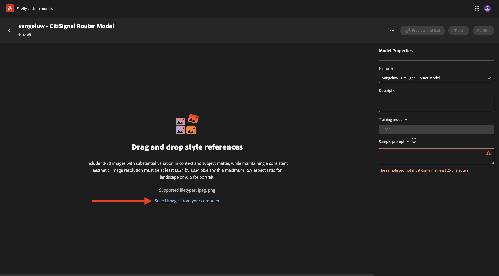
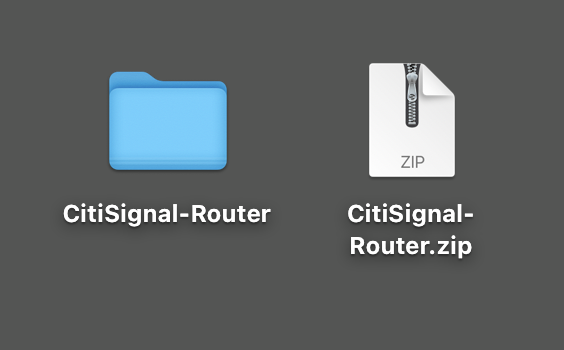
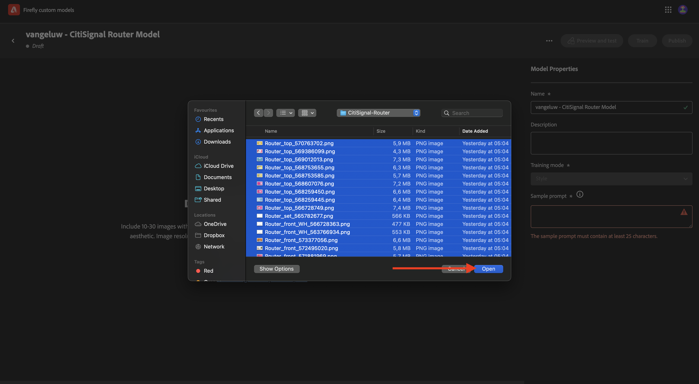

# 1.1.4Firefly自訂模型

移至[https://firefly.adobe.com](https://firefly.adobe.com){target="_blank"}。 移至&#x200B;**自訂模型**。

**同意**&#x200B;使用Firefly自訂模型的條件。

按一下&#x200B;**訓練模型**。

使用名稱`--aepUserLdap-- - CitiSignal Router Model`。 選取&#x200B;**樣式**&#x200B;並按一下&#x200B;**+建立新專案**。

使用名稱`--aepUserLdap-- - CitiSignal Custom Model`。 按一下&#x200B;**建立**。

按一下&#x200B;**繼續**。

按一下&#x200B;**從您的電腦選取影像**。

您可以使用這些資產。 將它們下載到您的電腦，並將zip檔案解壓縮到您案頭上的資料夾中。

選取所有影像，然後按一下&#x200B;**開啟**。

您的影像現在將上傳。 這可能需要一些時間。

您現在已經完成此練習。

下一步： [摘要與優點](./summary.md){target="_blank"}

[返回模組1.1](./firefly-services.md){target="_blank"}

[返回所有模組](./../../../overview.md){target="_blank"}
