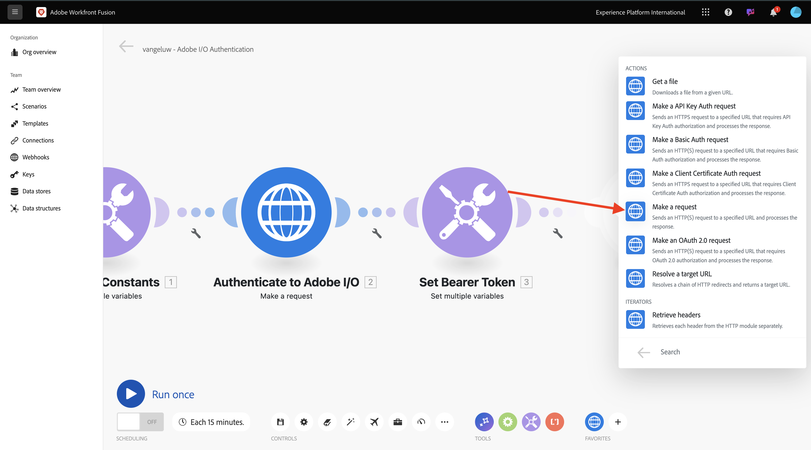
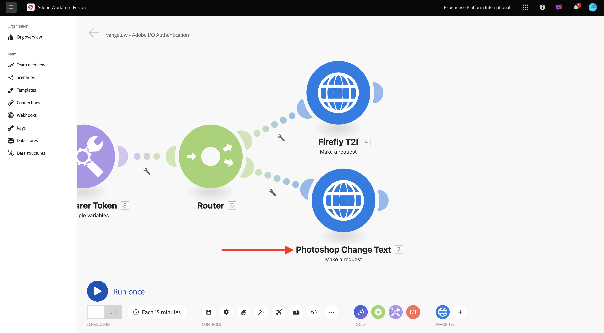

# 1.2.2在Workfront Fusion中使用Adobe API

## 1.2.2.1透過Workfront Fusion使用Firefly文字到影像API

將游標停留在第二個&#x200B;**設定多個變數**&#x200B;節點，然後按一下&#x200B;**+**&#x200B;以新增另一個模組。


搜尋&#x200B;**http**，然後選取&#x200B;**HTTP**。


選取&#x200B;**提出要求**。



選取這些變數：

- **URL**： `https://firefly-api.adobe.io/v3/images/generate`
- **方法**： `POST`

按一下&#x200B;**新增標題**。


您必須輸入下列標題：

| 索引鍵 | 值 |
|:-------------:| :---------------:| 
| `x-api-key` | 您為`CONST_client_id`儲存的變數 |
| `Authorization` | `Bearer ` +您為`bearer_token`儲存的變數 |
| `Content-Type` | `application/json` |
| `Accept` | `*/*` |

輸入`x-api-key`的詳細資料。 按一下&#x200B;**新增**。


按一下&#x200B;**新增標題**。


輸入`Authorization`的詳細資料。 按一下&#x200B;**新增**。


按一下&#x200B;**新增標題**。 輸入`Content-Type`的詳細資料。 按一下&#x200B;**新增**。


按一下&#x200B;**新增標題**。 輸入`Accept`的詳細資料。 按一下&#x200B;**新增**。


將&#x200B;**主體型別**&#x200B;設定為&#x200B;**原始**。 針對&#x200B;**內容型別**，選取&#x200B;**JSON (application/json)**。


將此裝載貼到&#x200B;**要求內容**&#x200B;欄位。

```json
{
  "numVariations": 1,
  "size": {
    "width": 2048,
    "height": 2048
  },
  "prompt": "Horses in a field",
  "promptBiasingLocaleCode": "en-US"
}
```

核取&#x200B;**剖析回應**&#x200B;的核取方塊。 按一下&#x200B;**「確定」**。


按一下&#x200B;**執行一次**。


一旦您的案例執行後，您應該會看到此訊息。


按一下&#x200B;**？第四個節點HTTP上的**&#x200B;圖示以檢視回應。 您應該會在回應中看到影像檔案。


複製影像URL並在瀏覽器視窗中開啟。 之後，您應該會看到類似以下的內容：


以滑鼠右鍵按一下&#x200B;**HTTP**&#x200B;物件，並將其重新命名為&#x200B;**FireflyT2I**。


按一下[儲存]儲存變更。****


## 1.2.2.2搭配使用Photoshop API與Workfront Fusion

按一下節點&#x200B;**設定持有人權杖**&#x200B;和&#x200B;**FireflyT2I**&#x200B;之間的&#x200B;**扳手**&#x200B;圖示。 選取&#x200B;**新增路由器**。


用滑鼠右鍵按一下&#x200B;**FireflyT2I**&#x200B;物件，然後選取&#x200B;**複製**。


將複製的物件拖放到&#x200B;**路由器**&#x200B;物件附近，它將自動連線到&#x200B;**路由器**。 然後您應該擁有此專案。


您現在擁有根據&#x200B;**FireflyT2I** HTTP要求的相同復本。 **FireflyT2I** HTTP要求的部分設定類似於您需要與&#x200B;**Photoshop API**&#x200B;互動所需的設定，這是省時的選擇。 您現在只需要變更不相同的變數，例如要求URL和裝載。

將&#x200B;**URL**&#x200B;變更為`https://image.adobe.io/pie/psdService/text`。


以下列承載取代&#x200B;**要求內容**：

```json
{
  "inputs": [
    {
      "storage": "external",
      "href": "{{AZURE_STORAGE_URL}}/{{AZURE_STORAGE_CONTAINER}}/sevoi-psd.psd{{AZURE_STORAGE_SAS_READ}}"
    }
  ],
  "options": {
    "layers": [
      {
        "name": "2048x2048-button",
        "text": {
          "content": "Click here"
        }
      },
      {
        "name": "2048x2048-cta",
        "text": {
          "content": "Buy this stuff"
        }
      }
    ]
  },
  "outputs": [
    {
      "storage": "azure",
      "href": "{{AZURE_STORAGE_URL}}/{{AZURE_STORAGE_CONTAINER}}/sevoi-psd-changed-text.psd{{AZURE_STORAGE_SAS_WRITE}}",
      "type": "vnd.adobe.photoshop",
      "overwrite": true
    }
  ]
}
```


為了讓此&#x200B;**要求內容**&#x200B;正常運作，有些變數遺失：

- `AZURE_STORAGE_URL`
- `AZURE_STORAGE_CONTAINER`
- `AZURE_STORAGE_SAS_READ`
- `AZURE_STORAGE_SAS_WRITE`

返回您的第一個節點，按一下&#x200B;**初始化常數**，然後為每個變數選取&#x200B;**新增專案**。


| 索引鍵 | 範例值 |
|:-------------:| :---------------:| 
| `AZURE_STORAGE_URL` | `https://vangeluw.blob.core.windows.net` |
| `AZURE_STORAGE_CONTAINER` | `vangeluw` |
| `AZURE_STORAGE_SAS_READ` | `?sv=2023-01-03&st=2025-01-13T07%3A36%3A35Z&se=2026-01-14T07%3A36%3A00Z&sr=c&sp=rl&sig=4r%2FcSJLlt%2BSt9HdFdN0VzWURxRK6UqhB8TEvbWkmAag%3D` |
| `AZURE_STORAGE_SAS_WRITE` | `?sv=2023-01-03&st=2025-01-13T17%3A21%3A09Z&se=2025-01-14T17%3A21%3A09Z&sr=c&sp=racwl&sig=FD4m0YyyqUj%2B5T8YyTFJDi55RiTDC9xKtLTgW0CShps%3D` |

您可以返回Postman並開啟&#x200B;**環境變數**&#x200B;來尋找變數。


將這些值複製至Workfront Fusion，並為這4個變數分別新增專案。

然後您應該擁有此專案。 按一下&#x200B;**「確定」**。


接著，返回複製的HTTP要求以更新&#x200B;**要求內容**。 您會在&#x200B;**要求內容**&#x200B;中注意到這些黑色變數，這些是您從Postman複製的變數。 您現在需要將這些變數變更為您剛才在Workfront Fusion中定義的變數。 刪除黑色文字並以正確的變數取代每個變數，逐一取代。


在&#x200B;**輸入**&#x200B;區段中有3項變更要執行。


**輸出**&#x200B;區段中還有3項變更要執行。 按一下&#x200B;**「確定」**。


用滑鼠右鍵按一下複製的節點，然後選取&#x200B;**重新命名**。 將名稱變更為&#x200B;**Photoshop變更文字**。


然後您應該擁有此專案。



下一步： [1.2.3 ...](./ex3.md)

[返回模組1.2](./automation.md)

[返回所有模組](./../../../overview.md)
