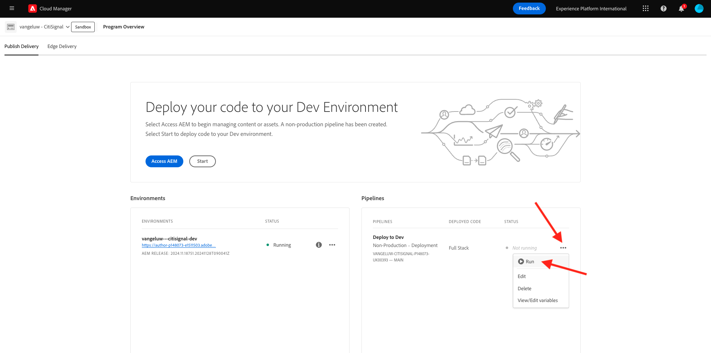

# 2.1.1建立您的Cloud Manager程式

移至[https://my.cloudmanager.adobe.com](https://my.cloudmanager.adobe.com){target="_blank"}。 您應該選取的組織是`--aepImsOrgName--`。 您將會看到類似這樣的內容。 按一下&#x200B;**新增程式**。

對於&#x200B;**程式名稱**，請使用`--aepUserLdap-- - CitiSignal`。 按一下&#x200B;**繼續**。

請確定已選取下列選項：

- 網站
- 資產
- Edge Delivery Services

按一下&#x200B;**建立**。

建立您的環境將需要一些時間，10到20分鐘。

您等待時，可以從練習[2.1.2開始建立檔案型網站](./ex2.md){target="_blank"}。

環境建立並準備好使用後，您將會收到電子郵件確認，之後您可以返回此處。

收到電子郵件確認後，請返回[https://my.cloudmanager.adobe.com](https://my.cloudmanager.adobe.com){target="_blank"}。 然後您會看到程式的狀態已變更為&#x200B;**就緒**。 按一下您的程式以開啟。

請檢視&#x200B;**管道**&#x200B;索引標籤。 按一下3個點&#x200B;**...**，然後按一下&#x200B;**執行**。

按一下&#x200B;**執行**。

接著，按一下&#x200B;**環境**&#x200B;標籤上的3個點&#x200B;**...**，然後按一下&#x200B;**檢視詳細資料**。

然後您會看到您的環境詳細資料，包括&#x200B;**作者**&#x200B;環境的URL，您將在下一個練習中用到此URL。

管道執行完成後，您可以繼續進行下一個練習。

下一步： [2.1.2建立檔案型網站](./ex2.md){target="_blank"}

[返回模組2.1](./aemcs.md){target="_blank"}

[返回所有模組](./../../../overview.md){target="_blank"}
