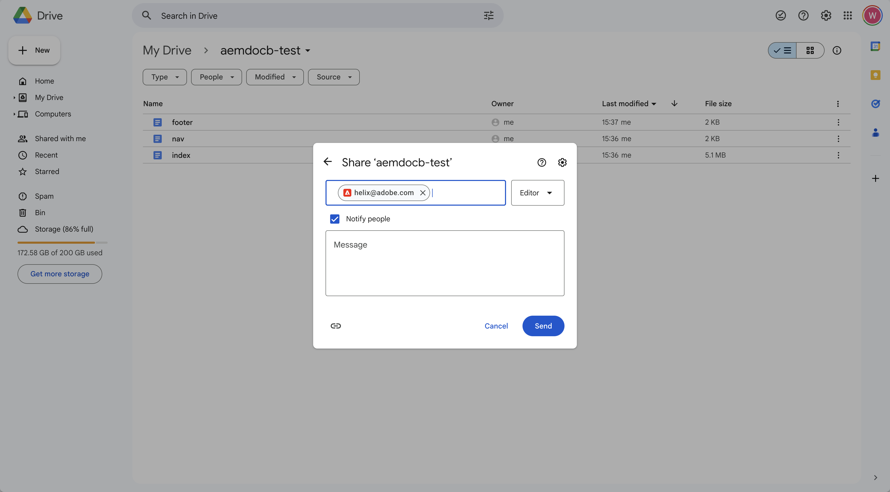
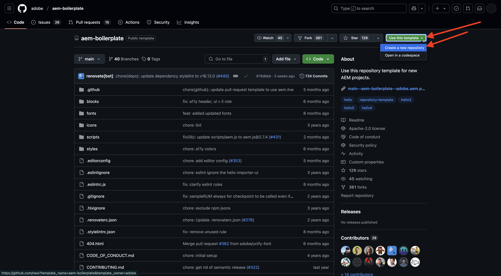
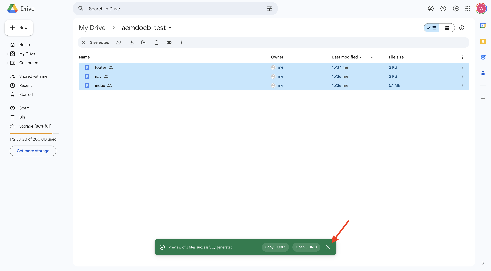

# 2.1.2建立檔案式網站

當您等待建立您的Cloud Manager程式時，您就有足夠的時間來設定您的第一個檔案型撰寫網站。 下列練習是根據[aem.live開發人員教學課程](https://www.aem.live/developer/tutorial){target="_blank"}進行。 請依照下列步驟開始。

## 2.1.2.1設定您的Google硬碟

移至[https://drive.google.com](https://drive.google.com){target="_blank"}。 按一下&#x200B;**+新增**，然後按一下&#x200B;**新增資料夾**。

{zoomable="yes"}

為資料夾命名`aemdocb-test`。 按一下&#x200B;**建立**。

{zoomable="yes"}

下載檔案[aemboilerplate.zip](./../../../assets/aem/aemboilerplate.zip){target="_blank"}並在您的電腦上解壓縮。

{zoomable="yes"}

您會在該資料夾中看到3個檔案。 將這些檔案複製到新的Google Drive資料夾。

{zoomable="yes"}

您現在需要將這些檔案轉換為原生Google檔案。 若要這麼做，請開啟每個檔案，然後前往&#x200B;**檔案** > **儲存為Google Docs**。

{zoomable="yes"}

您應該針對所有3個檔案執行此動作，之後您會在Google磁碟機資料夾中看到6個檔案。

{zoomable="yes"}

然後將此檔案放入資料夾中。

{zoomable="yes"}

為了讓檔案型編寫示範發揮作用，您現在需要與電子郵件地址&#x200B;**helix@adobe.com**&#x200B;共用您的Google磁碟機資料夾。 按一下您的資料夾名稱，按一下&#x200B;**共用**，然後再次按一下&#x200B;**共用**。

{zoomable="yes"}

輸入電子郵件地址&#x200B;**helix@adobe.com**&#x200B;並按一下&#x200B;**傳送**。

{zoomable="yes"}

接下來，複製並記下Google Drive資料夾的URL，因為您會在下一個練習中用到它。 按一下您的資料夾名稱，按一下&#x200B;**共用**，然後按一下&#x200B;**複製連結**。

{zoomable="yes"}

`https://drive.google.com/drive/folders/1PNIOFeptIfszSebawT-Y_bwB4_anQWk5?usp=drive_link`

您應該移除查詢字串引數`?usp=drive_link`，讓URL看起來像這樣：

`https://drive.google.com/drive/folders/1PNIOFeptIfszSebawT-Y_bwB4_anQWk5`

## 2.1.2.2設定您的GitHub存放庫

移至[https://github.com](https://github.com){target="_blank"}。 按一下&#x200B;**登入**。

{zoomable="yes"}

輸入您的認證。 按一下&#x200B;**登入**。

{zoomable="yes"}

登入後，您將會看到GitHub控制面板。

{zoomable="yes"}

移至[https://github.com/adobe/aem-boilerplate](https://github.com/adobe/aem-boilerplate){target="_blank"}。 您將會看到此訊息。 按一下&#x200B;**使用此範本**，然後按一下&#x200B;**建立新的存放庫**。

{zoomable="yes"}

對於&#x200B;**存放庫名稱**，請使用`aemdocb-test`。 將可見度設定為&#x200B;**私人**。 按一下&#x200B;**建立存放庫**。

{zoomable="yes"}

幾秒鐘後，您就會建立存放庫。

{zoomable="yes"}

接著，移至[https://github.com/apps/aem-code-sync](https://github.com/apps/aem-code-sync){target="_blank"}。 按一下&#x200B;**設定**。

{zoomable="yes"}

按一下您的GitHub帳戶。

{zoomable="yes"}

按一下&#x200B;**僅選取存放庫**，然後新增您剛建立的存放庫。 接著，按一下[安裝]。****

{zoomable="yes"}

然後您會取得此確認。

{zoomable="yes"}

## 2.1.2.3更新檔案fstab.yaml

在您的GitHub存放庫中，按一下以開啟檔案`fstab.yaml`。

{zoomable="yes"}

按一下&#x200B;**編輯**&#x200B;圖示。

{zoomable="yes"}

您現在需要在第2行更新欄位&#x200B;**url**&#x200B;的值。

{zoomable="yes"}

您需要使用特定AEM CS環境的URL以及GitHub存放庫的設定，來取代目前值。

這是URL目前的值： `https://drive.google.com/drive/u/0/folders/1MGzOt7ubUh3gu7zhZIPb7R7dyRzG371j`。

以您從Google磁碟機資料夾`https://drive.google.com/drive/folders/1PNIOFeptIfszSebawT-Y_bwB4_anQWk5`複製的URL取代該值。 按一下&#x200B;**認可變更……**。

{zoomable="yes"}

按一下&#x200B;**認可變更**。

{zoomable="yes"}

## 2.1.2.4安裝AEM Sidekick擴充功能

移至[https://chromewebstore.google.com/detail/aem-sidekick/ccfggkjabjahcjoljmgmklhpaccedipo](https://chromewebstore.google.com/detail/aem-sidekick/ccfggkjabjahcjoljmgmklhpaccedipo){target="_blank"}。 按一下&#x200B;**新增至Chrome**。

{zoomable="yes"}

釘選&#x200B;**AEM Sidekick**&#x200B;延伸。

{zoomable="yes"}

## 2.1.2.5預覽和Publish您的檔案式網站

返回Google Drive資料夾。 在工作列中，按一下&#x200B;**AEM Sidekick**&#x200B;延伸。 然後您會在資料夾中看到AEM Sidekick列快顯視窗。

{zoomable="yes"}

選取Google Drive資料夾中的3個檔案。 按一下&#x200B;**預覽**。

{zoomable="yes"}

再按一下&#x200B;**預覽**。

{zoomable="yes"}

按一下以關閉綠色對話方塊快顯視窗。

{zoomable="yes"}

再次選取Google Drive資料夾中的3個檔案。 現在，按一下&#x200B;**Publish**。

{zoomable="yes"}

按一下&#x200B;**Publish**。

{zoomable="yes"}

按一下以再次關閉綠色對話方塊。 現在，選取檔案&#x200B;**索引**，按一下&#x200B;**複製URL**，然後按一下&#x200B;**複製即時URL**。

{zoomable="yes"}

複製的URL看起來像這樣： `https://main--aemdocb-test--woutervangeluwe.aem.live/`。

在上述URL中：

- **main**&#x200B;參考您GitHub存放庫上的分支
- **aemdocb-test**&#x200B;參考GitHub存放庫名稱
- **woutervangeluwe**&#x200B;參考GitHub使用者帳戶名稱
- **.live**&#x200B;參考您的AEM執行個體的即時環境
- 您可以將&#x200B;**.live**&#x200B;取代為&#x200B;**.page**，以開啟AEM執行個體的預覽環境

開啟新的瀏覽器視窗並導覽至URL。

{zoomable="yes"}

## 2.1.2.6變更並發佈變更

返回您的Google磁碟機，並在Google中開啟檔案管理員&#x200B;**索引**。

{zoomable="yes"}

以任何其他選擇的文字取代文字&#x200B;**測試**。 按一下&#x200B;**預覽**。

{zoomable="yes"}

接著會開啟您網站的預覽版本。 檢閱您的變更並按一下&#x200B;**Publish**。

{zoomable="yes"}

接著，您就會看到網站的即時版本。

{zoomable="yes"}

上述練習是您開始使用並體驗檔案式編寫的好地方。 您現在可以繼續下一個練習，在那裡您將使用CitiSignal作為示範品牌來設定您自己的示範網站。

下一步： [2.1.3設定您的AEM CS環境](./ex3.md){target="_blank"}

[返回模組2.1](./aemcs.md){target="_blank"}

[返回所有模組](./../../../overview.md){target="_blank"}
