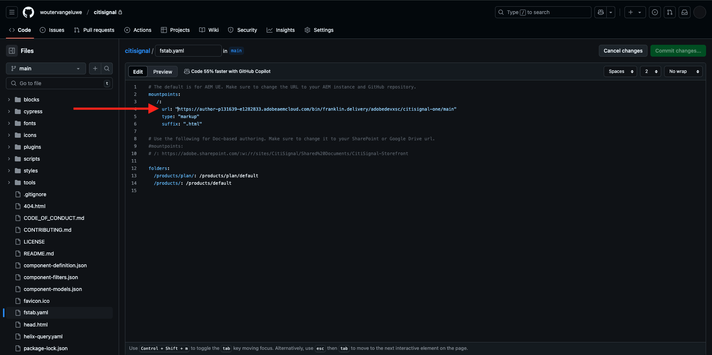
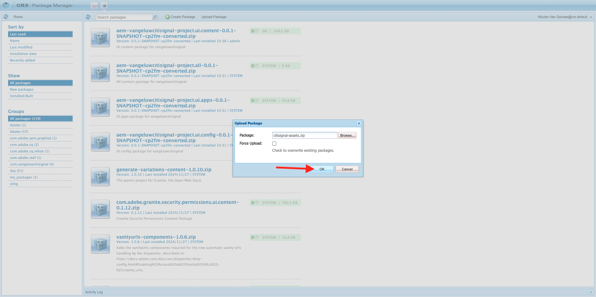
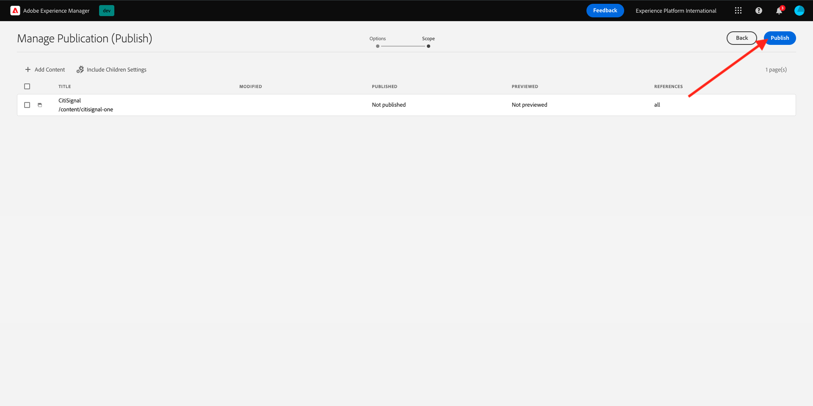

# 2.1.2設定您的AEM CS環境

## 2.1.2.1設定您的GitHub存放庫

移至[https://github.com](https://github.com)。 按一下&#x200B;**登入**。

輸入您的認證。 按一下&#x200B;**登入**。

登入後，您將會看到GitHub控制面板。

移至[https://github.com/AdobeDevXSC/citisignal-one](https://github.com/AdobeDevXSC/citisignal-one)。 您將會看到此訊息。 按一下&#x200B;**使用此範本**，然後按一下&#x200B;**建立新的存放庫**。

在&#x200B;**存放庫名稱**&#x200B;之前，使用`citisignal`。 將可見度設定為&#x200B;**私人**。 按一下&#x200B;**建立存放庫**。

幾秒鐘後，您就會建立存放庫。

接著，移至[https://github.com/apps/aem-code-sync](https://github.com/apps/aem-code-sync)。 按一下&#x200B;**設定**。

按一下您的GitHub帳戶。

按一下&#x200B;**僅選取存放庫**，然後新增您剛建立的存放庫。 接著，按一下[安裝]。****

然後您會取得此確認。

## 2.1.2.2更新檔案fstab.yaml

在您的GitHub存放庫中，按一下以開啟檔案`fstab.yaml`。

按一下&#x200B;**編輯**&#x200B;圖示。

您現在需要在第4行更新欄位&#x200B;**url**&#x200B;的值。

您需要使用特定AEM CS環境的URL以及GitHub存放庫的設定，來取代目前值。

這是URL目前的值： `https://author-p131639-e1282833.adobeaemcloud.com/bin/franklin.delivery/adobedevxsc/citisignal-one/main`。

URL有3個部分需要更新

`https://XXX/bin/franklin.delivery/YYY/ZZZ/main`

XXX應由您的AEM CS作者環境的URL取代。

您的GitHub使用帳戶應取代YYYY。

ZZZ應取代為您在上一個練習中使用的GitHub存放庫名稱。

您可以前往[https://my.cloudmanager.adobe.com](https://my.cloudmanager.adobe.com)找到AEM CS Author環境的URL。 按一下您的&#x200B;**程式**&#x200B;以開啟。

接著，按一下&#x200B;**環境**&#x200B;標籤上的3個點&#x200B;**...**，然後按一下&#x200B;**檢視詳細資料**。

然後您將會看到您的環境詳細資料，包括&#x200B;**作者**&#x200B;環境的URL。 複製URL。

XXX = `author-p148073-e1511503.adobeaemcloud.com`

若為GitHub使用者帳戶名稱，您可輕鬆在瀏覽器的URL中找到。 在此範例中，使用者帳戶名稱為`woutervangeluwe`。

YYYY = `woutervangeluwe`

如需GitHub存放庫名稱，您也可以在已在GitHub中開啟的瀏覽器視窗中找到。 在此案例中，存放庫名稱為`citisignal`。

ZZZ = `citisignal`

這3個值合併後，會產生這個需要在檔案`fstab.yaml`中設定的新URL。

`https://author-p148073-e1511503.adobeaemcloud.com/bin/franklin.delivery/woutervangeluwe/citisignal/main`

按一下&#x200B;**認可變更……**。

按一下&#x200B;**認可變更**。

檔案`fstab.yaml`現在已更新。

## 2.1.2.3上傳CitiSignal資產

移至[https://my.cloudmanager.adobe.com](https://my.cloudmanager.adobe.com)。 按一下您的&#x200B;**程式**&#x200B;以開啟。

接著，按一下作者環境的URL。

按一下&#x200B;**使用Adobe**&#x200B;登入。

然後您會看到您的作者環境。

您的URL如下所示： `https://author-p148073-e1511503.adobeaemcloud.com/ui#/aem/aem/start.html?appId=aemshell`

您現在需要存取AEM的&#x200B;**CRX封裝管理員**&#x200B;環境。 若要這麼做，請從URL移除`ui#/aem/aem/start.html?appId=aemshell`，並以`crx/packmgr`取代，這表示您的URL現在看起來應該像這樣：
`https://author-p148073-e1511503.adobeaemcloud.com/crx/packmgr`。
點選**Enter**&#x200B;以載入封裝管理員環境

接著，按一下&#x200B;**上傳封裝**。

按一下&#x200B;**瀏覽**&#x200B;以找出要上傳的封裝。

要上傳的封裝名稱為&#x200B;**citisignal-assets.zip**，可從此處下載： [https://tech-insiders.s3.us-west-2.amazonaws.com/one-adobe/citisignal-assets.zip](https://tech-insiders.s3.us-west-2.amazonaws.com/one-adobe/citisignal-assets.zip)。

選取封裝並按一下&#x200B;**開啟**。

接著，按一下&#x200B;**確定**。

然後會上傳套件。

接著，在您剛上傳的封裝上按一下&#x200B;**安裝**。

按一下&#x200B;**安裝**。

幾分鐘後，就會安裝您的套件。

您現在可以關閉此視窗。

## 2.1.2.4Publish花旗訊號資產

移至[https://my.cloudmanager.adobe.com](https://my.cloudmanager.adobe.com)。 按一下您的&#x200B;**程式**&#x200B;以開啟。

接著，按一下作者環境的URL。

按一下&#x200B;**使用Adobe**&#x200B;登入。

然後您會看到您的作者環境。 按一下&#x200B;**網站**。

按一下&#x200B;**檔案**。

按一下以選取資料夾&#x200B;**CitiSignal**，然後按一下&#x200B;**管理出版物**。

按一下&#x200B;**下一步**。

按一下&#x200B;**Publish**。

您的資產現已發佈。

## 2.1.2.5建立CitiSignal網站

移至[https://my.cloudmanager.adobe.com](https://my.cloudmanager.adobe.com)。 按一下您的&#x200B;**程式**&#x200B;以開啟。

接著，按一下作者環境的URL。

按一下&#x200B;**使用Adobe**&#x200B;登入。

然後您會看到您的作者環境。 按一下&#x200B;**網站**。

按一下&#x200B;**建立**，然後按一下&#x200B;**來自範本的網站**。

按一下&#x200B;**匯入**。

您現在需要為網站匯入預先設定的範本。 您可以在[這裡](./../../../assets/aem/citisignal-edge-delivery-services-template-0.0.4.zip)下載範本。 將檔案儲存到您的案頭。

接著，選取檔案`citisignal-edge-delivery-services-template-0.0.4.zip`並按一下&#x200B;**開啟**。

您將會看到此訊息。 按一下以選取您剛上傳的範本，然後按一下[下一步] ****。

您現在需要填寫一些詳細資料。

- 網站標題：使用&#x200B;**CitiSignal**
- 網站名稱：使用&#x200B;**citisignal-one**
- GitHub URL：複製您之前使用的GitHub存放庫的URL

您就會擁有此專案。 按一下&#x200B;**建立**。

正在建立您的網站。 這可能需要幾分鐘的時間。 按一下&#x200B;**確定**。

幾分鐘後重新整理您的熒幕，您就會看到新建立的CitiSignal網站。

## 2.1.2.6Publish花旗訊號網站

接著，按一下&#x200B;**CitiSignal**&#x200B;前面的核取方塊。 然後，按一下&#x200B;**管理出版物**。

按一下&#x200B;**下一步**。

按一下&#x200B;**包含子設定**。

按一下以選取核取方塊&#x200B;**包含子項**，然後按一下以取消選取其他核取方塊。 按一下&#x200B;**「確定」**。

按一下&#x200B;**Publish**。

然後您將被送回這裡。 瀏覽至&#x200B;**CitiSignal** > **us** > **en**。 按一下&#x200B;**索引**&#x200B;前面的核取方塊，然後按一下&#x200B;**編輯**。

您的網站將在&#x200B;**通用編輯器**&#x200B;中開啟。

您現在也可以前往`main--citisignal--woutervangeluwe.aem.live/us/en`導覽至您的網站

[返回模組2.1](./aemcs.md)

[返回所有模組](./../../../overview.md)
