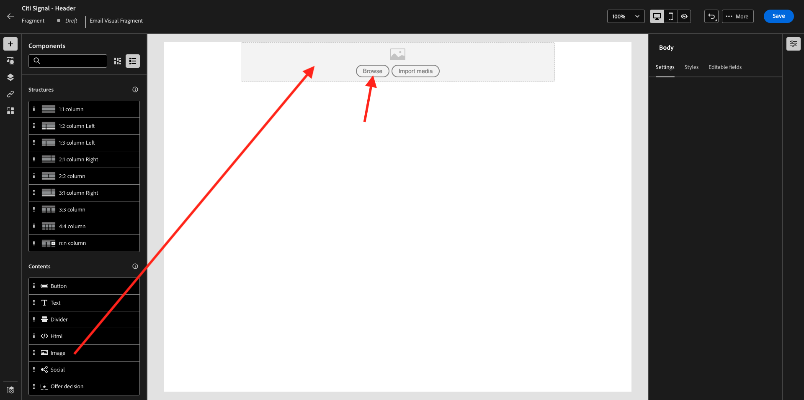
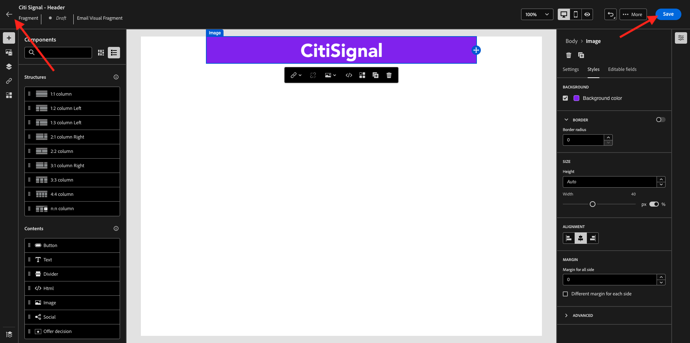
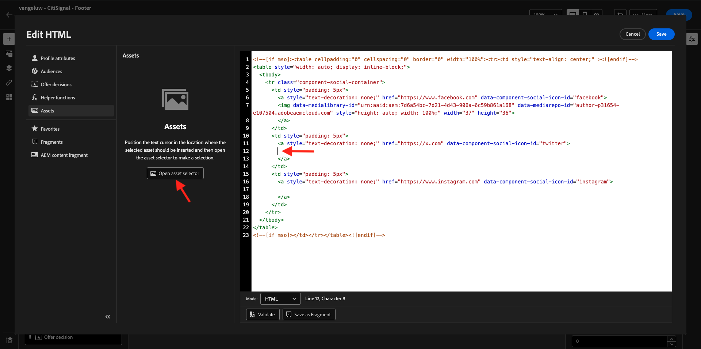

# 3.1.2建立要在訊息中使用的片段

在本練習中，您將設定2個片段，1個用於可重複使用的頁首，1個用於可重複使用的頁尾。

前往[Adobe Experience Cloud](https://experience.adobe.com)登入Adobe Journey Optimizer。 按一下&#x200B;**Journey Optimizer**。


您將被重新導向到Journey Optimizer中的&#x200B;**首頁**&#x200B;檢視。 首先，確定您使用正確的沙箱。 要使用的沙箱稱為`--aepSandboxName--`。


## 3.1.2.1建立您的標頭片段

在左側功能表中，按一下&#x200B;**片段**。 片段是Journey Optimizer中的可重複使用元件，可避免重複並方便未來應影響所有訊息的變更，例如電子郵件訊息中頁首或頁尾的變更。

按一下&#x200B;**建立片段**。


輸入名稱`--aepUserLdap-- - CitiSignal - Header`並選取&#x200B;**型別：視覺片段**。 按一下&#x200B;**建立**。


您將會看到此訊息。 在左側選單中，您會找到可用來定義電子郵件結構（列和欄）的結構元件。

將&#x200B;**1:1欄**&#x200B;從功能表拖放到畫布中。 這將是標誌影像的預留位置。


接下來，您可以使用內容元件來新增這些區塊中的內容。 將&#x200B;**Image**&#x200B;元件拖放到第一列的第一個儲存格。 按一下&#x200B;**瀏覽**。



然後您會看到快顯視窗開啟，顯示您的AEM Assets Media Library。 前往資料夾&#x200B;**citi-signal-images**，按一下以選取影像&#x200B;**CitiSignal-Logo-White.png**，然後按一下&#x200B;**選取**。

>[!NOTE]
>
>如果您在AEM Assets資料庫中看不到CitiSignal影像，您可以在[這裡](./../../../../assets/ajo/CitiSignal-images.zip)找到它們。 將它們下載到您的案頭，建立資料夾&#x200B;**citi-signal-images**，然後上傳該資料夾中的所有影像。


您將會看到此訊息。 您的影像是白色的，尚未顯示。 您現在應該定義背景顏色，讓影像正確顯示。 按一下&#x200B;**樣式**，然後按一下&#x200B;**背景顏色**&#x200B;方塊。


在快顯視窗中，將&#x200B;**十六進位**&#x200B;色彩代碼變更為&#x200B;**#8821F4**，然後按一下&#x200B;**100%**&#x200B;欄位來變更焦點。 然後您會看到新顏色套用到影像。


影像目前也有些變大。 讓我們將&#x200B;**寬度**&#x200B;切換器滑動至&#x200B;**40%**，以變更寬度。


您的標頭片段現已準備就緒。 按一下&#x200B;**儲存**，然後按一下箭頭，返回上一個畫面。



您的片段必須先發佈，才能使用。 按一下&#x200B;**發佈**。


幾分鐘後，您會看到片段的狀態已變更為&#x200B;**即時**。
接下來，您應該為電子郵件訊息的頁尾建立新的片段。 按一下&#x200B;**建立片段**。


## 3.1.2.2建立您的頁尾片段

按一下&#x200B;**建立片段**。


輸入名稱`--aepUserLdap-- - CitiSignal - Footer`並選取&#x200B;**型別：視覺片段**。 按一下&#x200B;**建立**。


您將會看到此訊息。 在左側選單中，您會找到可用來定義電子郵件結構（列和欄）的結構元件。

將&#x200B;**1:1欄**&#x200B;從功能表拖放到畫布中。 這會是頁尾內容的預留位置。


接下來，您可以使用內容元件來新增這些區塊中的內容。 將&#x200B;**HTML**&#x200B;元件拖放至第一列的第一個儲存格。 按一下元件以選取它，然後按一下&#x200B;**&lt;/>**&#x200B;圖示以編輯HTML原始程式碼。


您將會看到此訊息。


複製下列HTML程式碼片段，並將其貼到Journey Optimizer的&#x200B;**編輯HTML**&#x200B;視窗中。

```html
<!--[if mso]><table cellpadding="0" cellspacing="0" border="0" width="100%"><tr><td style="text-align: center;" ><![endif]-->
<table style="width: auto; display: inline-block;">
  <tbody>
    <tr class="component-social-container">
      <td style="padding: 5px">
        <a style="text-decoration: none;" href="https://www.facebook.com" data-component-social-icon-id="facebook">
        
        </a>
      </td>
      <td style="padding: 5px">
        <a style="text-decoration: none;" href="https://x.com" data-component-social-icon-id="twitter">
        
        </a>
      </td>
      <td style="padding: 5px">
        <a style="text-decoration: none;" href="https://www.instagram.com" data-component-social-icon-id="instagram">
         
        </a>
      </td>
    </tr>
  </tbody>
</table>
<!--[if mso]></td></tr></table><![endif]-->
```

您就會擁有此專案。 在第7、12和17行，您現在需要使用AEM Assets資料庫中的資產插入影像檔案。


請確定游標位於第7行，然後按一下左側功能表中的&#x200B;**Assets**。 按一下&#x200B;**開啟資產選擇器**&#x200B;以選取您的影像。


開啟資料夾&#x200B;**citi-signal-images**，然後按一下以選取影像&#x200B;**Icon_Facebook.png**。 按一下&#x200B;**選取**。


請確定您的游標位於第12行，然後按一下[開啟資產選取器] **以選取您的影像。**



開啟資料夾&#x200B;**citi-signal-images**，然後按一下以選取影像&#x200B;**Icon_X.png**。 按一下&#x200B;**選取**。


請確定您的游標位於第17行，然後按一下[開啟資產選取器] **以選取您的影像。**


開啟資料夾&#x200B;**citi-signal-images**，然後按一下以選取影像&#x200B;**Icon_Instagram.png**。 按一下&#x200B;**選取**。


您將會看到此訊息。 按一下&#x200B;**儲存**。


然後您會回到編輯器中。 您的圖示尚未顯示，因為背景和影像檔案都是白色的。 若要變更背景顏色，請移至&#x200B;**樣式**&#x200B;並按一下&#x200B;**背景顏色**&#x200B;核取方塊。


將&#x200B;**十六進位**&#x200B;色彩代碼變更為&#x200B;**#000000**。


將對齊方式變更為置中。


讓我們將其他部分新增到頁尾。 將&#x200B;**Image**&#x200B;元件拖放至您剛建立的HTML元件上方。 按一下&#x200B;**瀏覽**。


按一下以選取影像檔&#x200B;**`CitiSignal_Footer_Logo.png`**，然後按一下&#x200B;**選取**。


移至&#x200B;**樣式**&#x200B;並按一下&#x200B;**背景顏色**&#x200B;核取方塊，讓我們再次將其變更為黑色。 將&#x200B;**十六進位**&#x200B;色彩代碼變更為&#x200B;**#000000**。


將寬度變更為&#x200B;**20%**，並確認對齊方式已設定為置中。


接著，將&#x200B;**Text**&#x200B;元件拖放到您建立的HTML元件下。 按一下&#x200B;**瀏覽**。


取代預留位置文字，複製並貼上以下文字。

```
1234 N. South Street, Anywhere, US 12345

Unsubscribe

©2024 CitiSignal, Inc and its affiliates. All rights reserved.
```

將&#x200B;**文字對齊方式**&#x200B;設定為置中。


將&#x200B;**字型顏色**&#x200B;變更為白色，**#FFFFFF**。


將&#x200B;**背景顏色**&#x200B;變更為黑色，**#000000**。


在頁尾中選取文字&#x200B;**取消訂閱**，然後按一下功能表列中的&#x200B;**連結**&#x200B;圖示。 將&#x200B;**Type**&#x200B;設定為&#x200B;**外部選擇退出/取消訂閱**，並將URL設定為&#x200B;**https://aepdemo.net/unsubscribe.html** （取消訂閱連結不允許有空白URL）。


您就會擁有此專案。 您的頁尾現已準備就緒。 按一下&#x200B;**儲存**，然後按一下箭頭返回上一頁。


按一下&#x200B;**發佈**&#x200B;以發佈您的頁尾，以便在電子郵件中使用。


幾分鐘後，您會看到頁尾的狀態已變更為&#x200B;**即時**。


## 後續步驟

移至[3.1.3建立您的歷程與電子郵件訊息](./ex3.md){target="_blank"}

返回[Adobe Journey Optimizer：協調流程](./journey-orchestration-create-account.md){target="_blank"}

返回[所有模組](./../../../../overview.md){target="_blank"}
