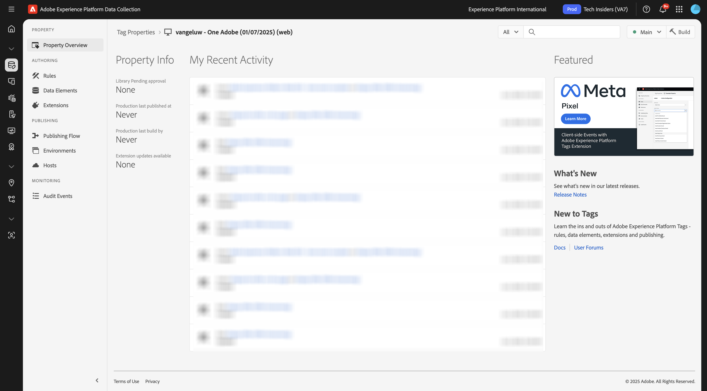
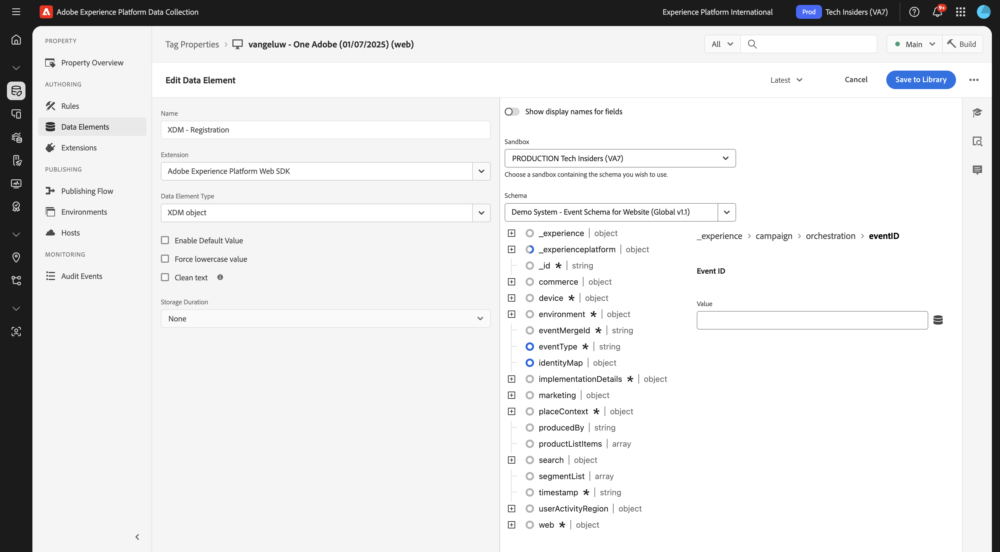

# 3.1.3更新您的資料收集屬性並測試您的歷程

## 3.1.3.1更新您的資料收集屬性

移至[Adobe Experience Platform資料彙集](https://experience.adobe.com/data-collection/home)並選取&#x200B;**標籤**。

在&#x200B;**快速入門**&#x200B;中，「示範系統下一步」為您建立了幾個標籤屬性，其中一個用於網站，另一個用於行動應用程式。 在`--aepUserLdap-- - One Adobe`搜尋&#x200B;**[!UICONTROL 方塊中搜尋]**&#x200B;以尋找它們。 按一下以開啟&#x200B;**Web**&#x200B;屬性。

您將會看到此訊息。

在左側功能表中，移至&#x200B;**規則**&#x200B;並搜尋規則&#x200B;**建立帳戶**。 按一下規則&#x200B;**建立帳戶**&#x200B;以開啟它。

之後，您將會看到此規則的詳細資料。 按一下以開啟動作&#x200B;**傳送「註冊事件」體驗事件**。

之後您會看到，觸發此動作時，會使用特定資料元素來定義XDM資料結構。 您需要更新該資料元素，而且需要定義您在&#x200B;**練習3.1.1**&#x200B;中設定之事件的[事件識別碼](./ex1.md)。

您現在需要更新資料元素&#x200B;**XDM — 註冊事件**。 若要這麼做，請移至&#x200B;**資料元素**。 搜尋&#x200B;**XDM — 註冊**，然後按一下以開啟該資料元素。

然後您會看到以下內容：

瀏覽至欄位`_experience.campaign.orchestration.eventID`。 移除目前的值，並將您的eventID貼到該處。

提醒您，您可以在Adobe Journey Optimizer中的&#x200B;**設定>事件**&#x200B;下找到事件ID，您也可以在事件裝載的範例中找到事件ID，如下所示： `"eventID": "d40815dbcd6ffd813035b4b590b181be21f5305328e16c5b75e4f32fd9e98557"`。

貼上eventID後，熒幕應如下所示。 接著，按一下&#x200B;**儲存**&#x200B;或&#x200B;**儲存至資料庫**。

最後，您需要發佈變更。 前往左側功能表中的&#x200B;**發佈流程**，然後按一下以開啟您的&#x200B;**主要**&#x200B;資料庫。

按一下[新增所有變更的資源]&#x200B;**，然後按一下[儲存並建置至開發]**&#x200B;**。**

您的程式庫將會更新，1-2分鐘後，您就可以繼續測試設定。

## 3.1.3.2測試您的歷程

移至[https://dsn.adobe.com](https://dsn.adobe.com)。 使用Adobe ID登入後，您會看到此訊息。 按一下您的網站專案上的3個點&#x200B;**...**，然後按一下&#x200B;**執行**&#x200B;以開啟它。

然後您會看到示範網站已開啟。 選取URL並將其複製到剪貼簿。

開啟新的無痕瀏覽器視窗。

貼上您在上一步中複製的示範網站URL。 接著，系統會要求您使用Adobe ID登入。

選取您的帳戶型別並完成登入程式。

接著，您會在無痕瀏覽器視窗中看到您的網站已載入。 每次練習都需要使用全新的無痕瀏覽器視窗，才能載入您的示範網站URL。

按一下畫面左上角的Adobe標誌圖示，開啟設定檔檢視器。

請檢視「設定檔檢視器」面板和「即時客戶設定檔」，將&#x200B;**Experience Cloud ID**&#x200B;設為此目前未知客戶的主要識別碼。 按一下&#x200B;**登入**。

按一下&#x200B;**建立帳戶**。

填寫您的詳細資料，然後按一下&#x200B;**註冊**，之後您將會被重新導向到上一頁。

開啟設定檔檢視器面板，然後前往即時客戶設定檔。 在「設定檔檢視器」面板上，您應該會看到所有顯示的個人資料，例如新新增的電子郵件和電話識別碼。

建立帳戶1分鐘後，您將會從Adobe Journey Optimizer收到帳戶建立電子郵件。

您也會在Journey Optimizer中的歷程控制面板上看到歷程專案及歷程的進度。

## 後續步驟

移至[摘要與優點](./summary.md){target="_blank"}

返回[Adobe Journey Optimizer：協調流程](./journey-orchestration-create-account.md){target="_blank"}

返回[所有模組](./../../../../overview.md){target="_blank"}
