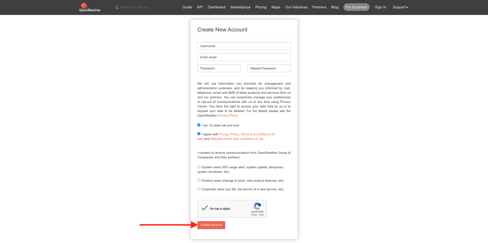
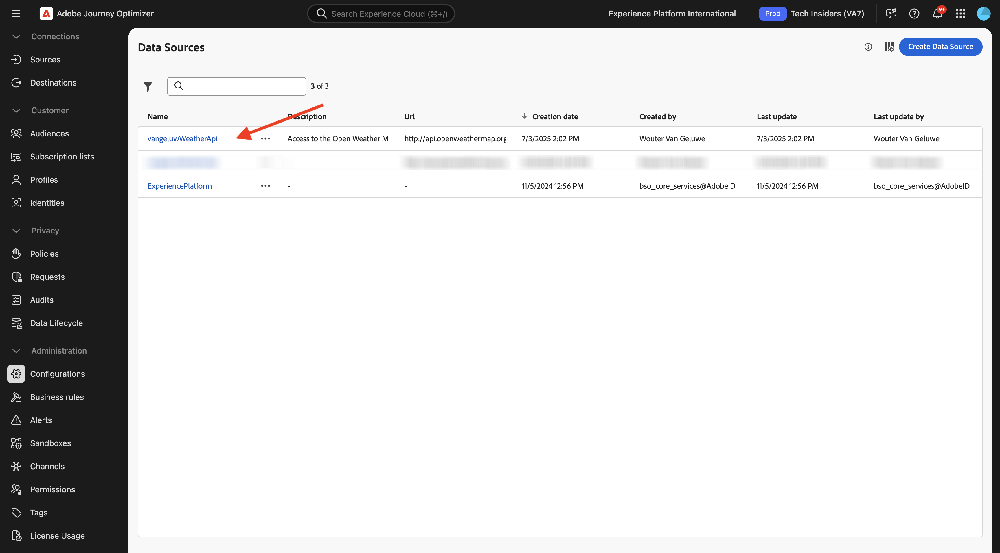

# 3.2.2定義外部資料來源

在本練習中，您將使用Adobe Journey Optimizer建立自訂外部資料來源。

前往[Adobe Experience Cloud](https://experience.adobe.com)登入Adobe Journey Optimizer。 按一下&#x200B;**Journey Optimizer**。


您將被重新導向到Journey Optimizer中的&#x200B;**首頁**&#x200B;檢視。 首先，確定您使用正確的沙箱。 要使用的沙箱稱為`--aepSandboxName--`。 然後您就會進入沙箱&#x200B;**的**&#x200B;首頁`--aepSandboxName--`檢視。


在左側功能表中，向下捲動並按一下&#x200B;**組態**。 接著，按一下&#x200B;**資料來源**&#x200B;下的&#x200B;**管理**&#x200B;按鈕。


然後您會看到&#x200B;**資料來源**&#x200B;清單。
按一下&#x200B;**建立資料Source**&#x200B;以開始新增您的資料來源。


您會看到空白的資料來源快顯視窗。


在開始設定之前，您需要擁有&#x200B;**開放氣象地圖**&#x200B;服務的帳戶。 請依照下列步驟建立您的帳戶並取得API金鑰。

移至[https://openweathermap.org/](https://openweathermap.org/)。 在首頁按一下&#x200B;**登入**。


按一下&#x200B;**建立帳戶**。


請填寫詳細資料。 按一下&#x200B;**建立帳戶**。



系統會將您重新導向至帳戶頁面。


在功能表中按一下&#x200B;**API金鑰**&#x200B;以擷取您的API金鑰，您將需要使用此金鑰設定自訂外部資料來源。


**API金鑰**&#x200B;看起來像這樣： `b2c4c36b6bb59c3458d6686b05311dc3`。

您可以在&#x200B;**這裡**&#x200B;找到&#x200B;**目前氣候**&#x200B;的[API檔案](https://openweathermap.org/current)。

針對此使用案例，您將使用依城市名稱&#x200B;**的**&#x200B;內建API要求，根據客戶所在的城市來實作開放氣象地圖連線。


返回&#x200B;**Adobe Journey Optimizer**，進入您的空白&#x200B;**外部資料Source**&#x200B;快顯視窗。


作為資料來源的名稱，請使用`--aepUserLdap--WeatherApi`。

設定描述為： `Access to the Open Weather Map`。

開放氣象地圖API的URL是： `http://api.openweathermap.org/data/2.5/weather?units=metric`。


接下來，您需要選取要使用的驗證。

請使用下列變數：

| 欄位 | 值 |
|:-----------------------:| :-----------------------|
| 類型 | **API金鑰** |
| 名稱 | **APPID** |
| 值 | **您的API金鑰** |
| 位置 | **查詢引數** |


最後，您需要定義&#x200B;**FieldGroup**，這基本上是您將傳送至Weather API的要求。 在我們的案例中，我們想使用城市名稱來要求該城市的目前天氣。


根據天氣API檔案，您必須傳送引數`q=City`。


為了符合預期的API請求，請依照以下方式設定您的FieldGroup：

>[!IMPORTANT]
>
>欄位群組名稱必須是唯一的，請使用以下命名慣例： `--aepUserLdap--WeatherByCity`


針對回應裝載，您需要貼上氣象API將傳送的回應範例。

您可以在API檔案頁面[這裡](https://openweathermap.org/current)的&#x200B;**JSON**&#x200B;主題下找到預期的API JSON回應。


或者，您可以從此處複製JSON回應：

```json
{
   "coord": {
      "lon": 7.367,
      "lat": 45.133
   },
   "weather": [
      {
         "id": 501,
         "main": "Rain",
         "description": "moderate rain",
         "icon": "10d"
      }
   ],
   "base": "stations",
   "main": {
      "temp": 284.2,
      "feels_like": 282.93,
      "temp_min": 283.06,
      "temp_max": 286.82,
      "pressure": 1021,
      "humidity": 60,
      "sea_level": 1021,
      "grnd_level": 910
   },
   "visibility": 10000,
   "wind": {
      "speed": 4.09,
      "deg": 121,
      "gust": 3.47
   },
   "rain": {
      "1h": 2.73
   },
   "clouds": {
      "all": 83
   },
   "dt": 1726660758,
   "sys": {
      "type": 1,
      "id": 6736,
      "country": "IT",
      "sunrise": 1726636384,
      "sunset": 1726680975
   },
   "timezone": 7200,
   "id": 3165523,
   "name": "Province of Turin",
   "cod": 200
}    
```

將上述JSON回應複製到剪貼簿，然後前往自訂資料來源設定畫面。

按一下&#x200B;**編輯裝載**&#x200B;圖示。


您將看到快顯視窗，此時您必須貼上上述JSON回應。


貼上您的JSON回應，之後您將看到此訊息。 按一下&#x200B;**儲存**。


您的自訂資料來源設定現已完成。 向上捲動並按一下&#x200B;**儲存**。


您的資料來源現在已成功建立，且屬於&#x200B;**資料來源**&#x200B;清單。



## 後續步驟

移至[3.2.3定義自訂動作](./ex3.md){target="_blank"}

返回[Adobe Journey Optimizer：外部資料來源和自訂動作](journey-orchestration-external-weather-api-sms.md){target="_blank"}

返回[所有模組](./../../../../overview.md){target="_blank"}
