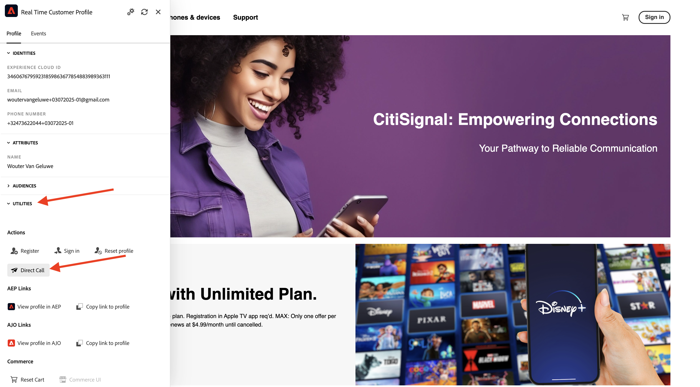

# 3.2.5觸發您的歷程

在本練習中，您將測試並觸發您在本單元中設定的歷程。

## 3.2.5.1更新您的地理圍欄事件設定

移至[Adobe Experience Platform資料彙集](https://experience.adobe.com/launch/)並選取&#x200B;**標籤**。

這是您之前看到的Adobe Experience Platform資料收集屬性頁面。

在&#x200B;**快速入門**&#x200B;中，Demo System Next為您建立了標籤屬性：一個用於網站，一個用於行動應用程式。 在`--aepUserLdap--`搜尋&#x200B;**[!UICONTROL 方塊中搜尋]**&#x200B;以尋找它們。 按一下以開啟&#x200B;**Web**&#x200B;屬性。

您將會看到此訊息。

在左側功能表中，移至&#x200B;**規則**&#x200B;並搜尋規則&#x200B;**地理圍欄事件**。 按一下規則&#x200B;**地理圍欄事件**&#x200B;以開啟它。

之後，您將會看到此規則的詳細資料。 按一下以開啟動作&#x200B;**Adobe Experience Platform Web SDK — 傳送事件**。

之後您會看到，觸發此動作時，會使用特定資料元素來定義XDM資料結構。 您需要更新該資料元素，而且需要定義您在&#x200B;**練習3.2.1**&#x200B;中設定之事件的[事件識別碼](./ex1.md)。

您現在需要更新資料元素&#x200B;**XDM — 地理圍欄事件**。 若要這麼做，請移至&#x200B;**資料元素**。 搜尋&#x200B;**XDM — 地理圍欄事件**，然後按一下以開啟該資料元素。

然後您會看到以下內容：

瀏覽至欄位`_experience.campaign.orchestration.eventID`。 移除目前的值，並將您的eventID貼到該處。

提醒您，您可以在Adobe Journey Optimizer中的&#x200B;**設定>事件**&#x200B;下找到事件ID，您也可以在事件裝載的範例中找到事件ID，如下所示： `"eventID": "209a2eecb641e20a517909e186a559ced155384a26429a557eb259e5a470bca7"`。

接下來，您應該在此資料元素中定義您的城市。 前往&#x200B;**placeContext >地理>城市**，然後輸入您選擇的城市。 接著，按一下&#x200B;**儲存**&#x200B;或&#x200B;**儲存至資料庫**。

最後，您需要發佈變更。 前往左側功能表中的&#x200B;**發佈流程**，然後按一下&#x200B;**Man**&#x200B;以開啟您的資料庫。

按一下[新增所有變更的資源]**，然後按一下[儲存並建置至開發]****。**

## 3.2.5.2觸發您的歷程

移至[https://dsn.adobe.com](https://dsn.adobe.com)。 使用Adobe ID登入後，您會看到此訊息。 按一下您的網站專案上的3個點&#x200B;**...**，然後按一下&#x200B;**執行**&#x200B;以開啟它。

然後您會看到示範網站已開啟。 選取URL並將其複製到剪貼簿。

開啟新的無痕瀏覽器視窗。

貼上您在上一步中複製的示範網站URL。 接著，系統會要求您使用Adobe ID登入。

選取您的帳戶型別並完成登入程式。

接著，您會在無痕瀏覽器視窗中看到您的網站已載入。 每次練習都需要使用全新的無痕瀏覽器視窗，才能載入您的示範網站URL。

按一下畫面左上角的Adobe標誌圖示，開啟設定檔檢視器。

開啟設定檔檢視器面板，然後前往即時客戶設定檔。 在「設定檔檢視器」面板上，您應該會看到所有顯示的個人資料，例如新新增的電子郵件和電話識別碼。

在[設定檔檢視器]面板上，按一下[**公用程式**]，然後選取[**直接呼叫**]。

>[!NOTE]
>
>如果您在「設定檔檢視器」面板上無法選擇傳送直接呼叫事件，您可以開啟瀏覽的「開發人員檢視」並移至&#x200B;**主控台**，然後貼上並傳送這個命令，以手動傳送一個事件： `_satellite.track('geofenceevent')`。

輸入`geofenceevent`並按一下&#x200B;**提交**。

幾秒後，您會看到Adobe Journey Optimizer的訊息出現在Slack頻道中。

## 後續步驟

移至[摘要與優點](./summary.md){target="_blank"}

返回[Adobe Journey Optimizer：外部資料來源和自訂動作](journey-orchestration-external-weather-api-sms.md){target="_blank"}

返回[所有模組](./../../../../overview.md){target="_blank"}
