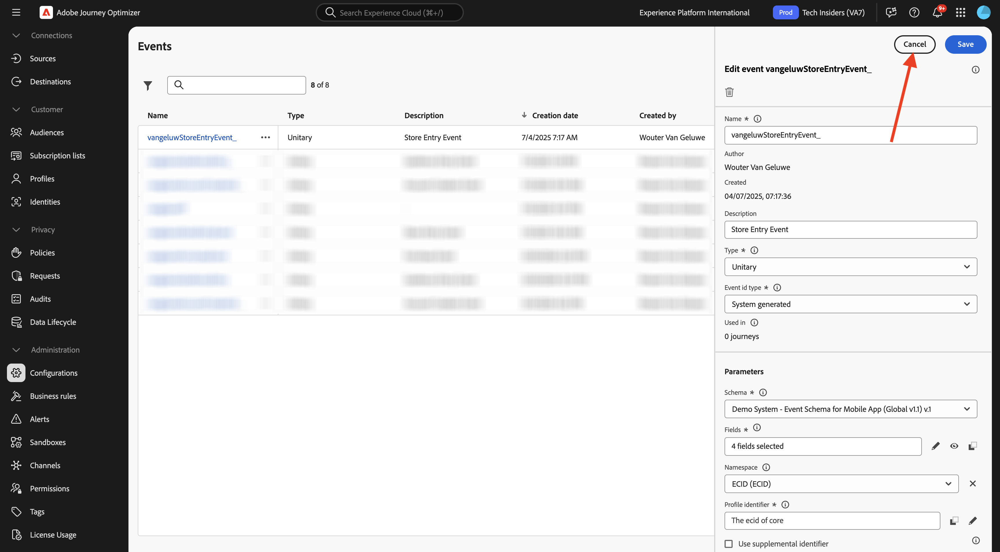
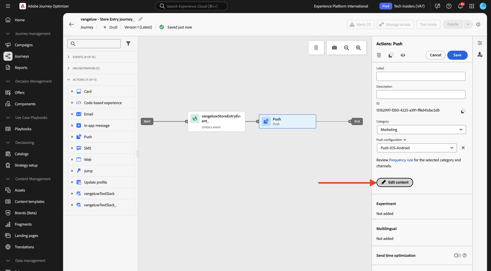
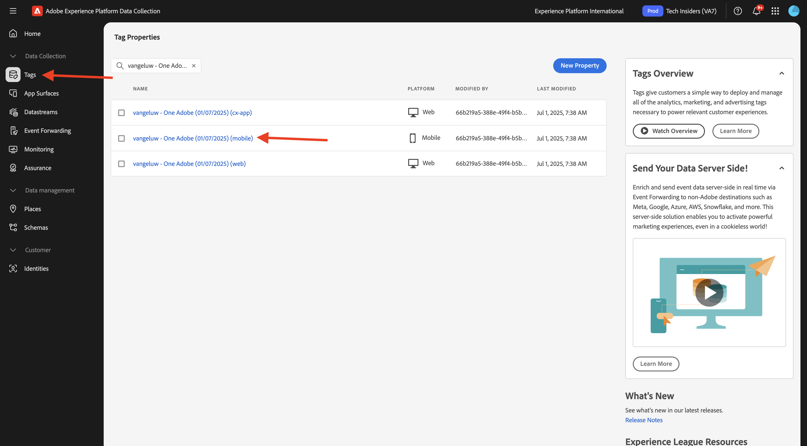

# 3.3.2設定包含推送訊息的歷程

前往[Adobe Experience Cloud](https://experience.adobe.com)登入Adobe Journey Optimizer。 按一下&#x200B;**Journey Optimizer**。

您將被重新導向到Journey Optimizer中的&#x200B;**首頁**&#x200B;檢視。 首先，確定您使用正確的沙箱。 要使用的沙箱稱為`--aepSandboxName--`。 然後您就會進入沙箱&#x200B;**的**&#x200B;首頁`--aepSandboxName--`檢視。

## 3.3.2.1建立新事件

在左側功能表中，移至&#x200B;**組態**&#x200B;並按一下&#x200B;**事件**&#x200B;底下的&#x200B;**管理**。

在&#x200B;**事件**&#x200B;畫面上，您會看到類似此的檢視。 按一下&#x200B;**建立事件**。

然後您會看到空白的事件設定。
首先，請為事件命名，如下所示： `--aepUserLdap--StoreEntryEvent`並將說明設定為`Store Entry Event`。
下一個是**事件型別**&#x200B;選項。 選取&#x200B;**單一**。
下一個是**事件ID型別**&#x200B;選擇。 選取&#x200B;**系統產生**。

接下來是「結構描述」選項。 已針對此練習準備結構描述。 請使用結構描述`Demo System - Event Schema for Mobile App (Global v1.1) v.1`。

選取結構描述後，您將會在&#x200B;**裝載**&#x200B;區段中看到一些正在選取的欄位。 確認欄位&#x200B;**名稱空間**&#x200B;設定為&#x200B;**ECID**。 您的事件現已完整設定。

按一下&#x200B;**儲存**。

您的事件現在已設定並儲存。 再次按一下您的事件以再次開啟&#x200B;**編輯事件**&#x200B;畫面。

將游標暫留在&#x200B;**裝載**&#x200B;欄位上，然後按一下&#x200B;**檢視裝載**&#x200B;圖示。

您現在將看到預期裝載的範例。

您的事件具有獨特的協調流程eventID，您可以在該承載中向下捲動直到看到`_experience.campaign.orchestration.eventID`為止。

事件ID需要傳送至Adobe Experience Platform，才能觸發您將在下一個步驟建立的歷程。 記下此eventID，因為您會在下一個步驟中需要它。
`"eventID": "aa895251f76831e6440f169f1bb9d2a4388f0696d8e2782cfab192a275817dfa"`

按一下&#x200B;**確定**。

按一下&#x200B;**取消**。

## 3.3.2.2建立歷程

在左側功能表中，前往&#x200B;**歷程**&#x200B;並按一下&#x200B;**建立歷程**。

您將會看到此訊息。 為您的歷程命名： `--aepUserLdap-- - Store Entry journey`。 按一下&#x200B;**儲存**。

首先，您需要新增活動作為歷程的起點。 搜尋您的活動`--aepUserLdap--StoreEntryEvent`，並將其拖放到畫布上。 按一下&#x200B;**儲存**。

接下來，在&#x200B;**動作**&#x200B;下搜尋&#x200B;**推播**&#x200B;動作。 將&#x200B;**推播**&#x200B;動作拖放到畫布上。

將&#x200B;**類別**&#x200B;設定為&#x200B;**行銷**，並選取可讓您傳送推播通知的推播表面。 在此情況下，要選取的電子郵件表面為&#x200B;**Push-iOS-Android**。

>[!NOTE]
>
>Journey Optimizer中的管道必須存在使用&#x200B;**應用程式介面**&#x200B;且先前已檢閱過的管道。

下一步是建立訊息。 若要這麼做，請按一下[編輯內容]。****

您將會看到此訊息。 按一下&#x200B;**標題**&#x200B;欄位的&#x200B;**個人化**&#x200B;圖示。

您將會看到此訊息。 您現在可以直接從即時客戶個人檔案中選取任何個人檔案屬性。

搜尋欄位&#x200B;**名字**，然後按一下欄位&#x200B;**名字**&#x200B;旁的&#x200B;**+**&#x200B;圖示。 接著您會看到新增的名字的個人化權杖： **{{profile.person.name.firstName}}**。

接下來，新增文字&#x200B;**，歡迎來到我們的商店！**&#x200B;在&#x200B;**{{profile.person.name.firstName}}**&#x200B;之後。

按一下&#x200B;**儲存**。

您現在擁有此專案。 按一下&#x200B;**內文**&#x200B;欄位的&#x200B;**個人化**&#x200B;圖示。

輸入此文字&#x200B;**按一下此處，您今天購買時可享有10%的折扣！**&#x200B;並按一下&#x200B;**儲存**。

您就會擁有此專案。 按一下左上角的箭頭，返回您的歷程。

按一下&#x200B;**儲存**&#x200B;以關閉您的推送動作。

按一下&#x200B;**發佈**。

再按一下&#x200B;**發佈**。

您的歷程現已發佈。

## 3.3.2.3更新您行動裝置的資料收集屬性

在&#x200B;**快速入門**&#x200B;中，Demo System Next為您建立了標籤屬性：一個用於網站，一個用於行動應用程式。 在`--aepUserLdap--`搜尋&#x200B;**方塊中搜尋**&#x200B;以尋找它們。 按一下以開啟&#x200B;**行動裝置**&#x200B;屬性。

您應該會看到此訊息。

在左側功能表中，移至&#x200B;**規則**&#x200B;並按一下以開啟規則&#x200B;**位置專案**。

您應該會看到此訊息。 按一下動作&#x200B;**行動核心 — 附加資料**。

您應該會看到此訊息。

將事件`--aepUserLdap--StoreEntryEvent`的eventID貼到&#x200B;**JSON裝載**&#x200B;視窗中。 按一下&#x200B;**保留變更**。

按一下&#x200B;**儲存**&#x200B;或&#x200B;**儲存至資料庫**。

移至&#x200B;**發佈流程**&#x200B;並按一下以開啟資料庫&#x200B;**主要**。

按一下[新增所有變更的資源]**，然後按一下[儲存並建置至開發]****。**

## 3.3.2.4測試您的歷程與推送訊息

開啟&#x200B;**DSN Mobile**&#x200B;應用程式。

移至&#x200B;**存放區定位器**&#x200B;頁面。

按一下&#x200B;**模擬POI專案**。

幾秒後，您會看到推播通知出現。

## 後續步驟

移至[3.3.3使用應用程式內訊息設定行銷活動](./ex3.md){target="_blank"}

返回[Adobe Journey Optimizer：推送和應用程式內訊息](ajopushinapp.md){target="_blank"}

返回[所有模組](./../../../../overview.md){target="_blank"}