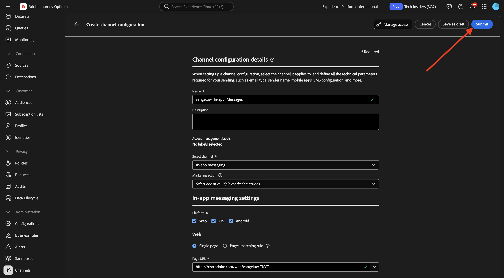
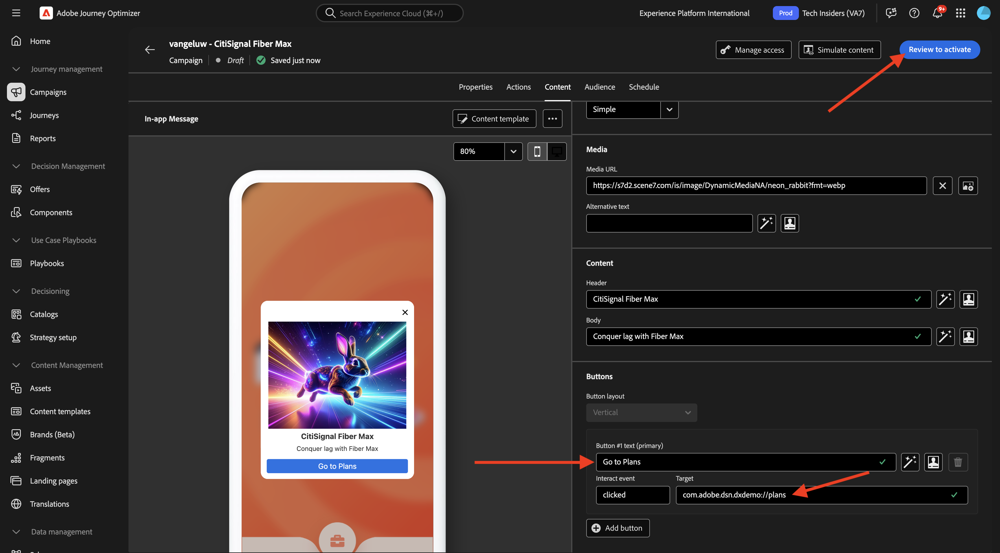
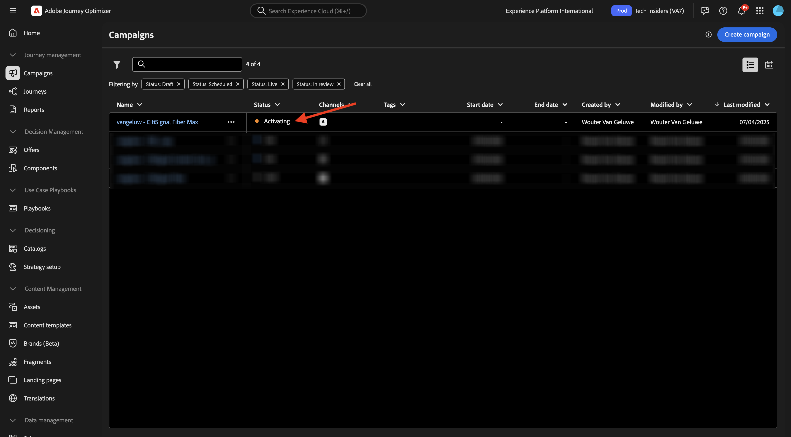
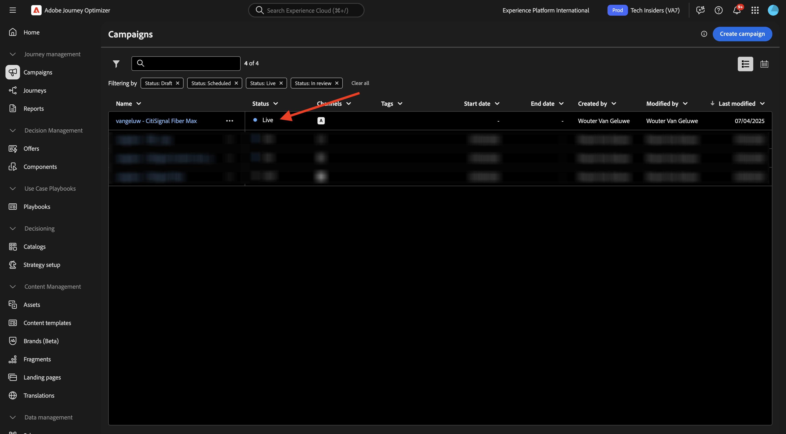

# 3.3.3使用應用程式內訊息設定行銷活動

前往[Adobe Experience Cloud](https://experience.adobe.com)登入Adobe Journey Optimizer。 按一下&#x200B;**Journey Optimizer**。

您將被重新導向到Journey Optimizer中的&#x200B;**首頁**&#x200B;檢視。 首先，確定您使用正確的沙箱。 要使用的沙箱稱為`--aepSandboxName--`。 然後您就會進入沙箱&#x200B;**的**&#x200B;首頁`--aepSandboxName--`檢視。

## 3.3.3.1應用程式內訊息通道設定

在左側功能表中，移至&#x200B;**管道**，然後選取&#x200B;**管道設定**。 按一下&#x200B;**建立通道組態**。

輸入名稱： `--aepUserLdap--_In-app_Messages`，選取頻道&#x200B;**應用程式內傳訊**，然後啟用平台&#x200B;**Web**、**iOS**&#x200B;和&#x200B;**Android**。

向下捲動，您應該就會看到這個訊息。

確定已啟用&#x200B;**單一頁面**。

針對&#x200B;**Web**，輸入先前在&#x200B;**快速入門**&#x200B;模組中所建立的網站URL，如下所示： `https://dsn.adobe.com/web/--aepUserLdap---XXXX`。 別忘了將&#x200B;**XXXX**&#x200B;變更為您網站的唯一代碼。

針對&#x200B;**iOS**&#x200B;和&#x200B;**Android**，請輸入`com.adobe.dsn.dxdemo`。

向上捲動並按一下&#x200B;**提交**。

您的頻道設定現在已可供使用。

## 3.3.3.2設定應用程式內訊息的排程行銷活動

在左側功能表中，移至&#x200B;**行銷活動**，然後按一下&#x200B;**建立行銷活動**。

選取&#x200B;**排程 — 行銷**，然後按一下&#x200B;**建立**。

輸入名稱`--aepUserLdap-- - CitiSignal Fiber Max`，然後按一下&#x200B;**動作**。

按一下[新增動作&#x200B;**]，然後選取[應用程式內訊息**]。****

選取您在上一步建立的應用程式內訊息通道設定，其名稱為： `--aepUserLdap--_In-app_Messages`。 按一下&#x200B;**編輯內容**。

您應該會看到此訊息。 按一下&#x200B;**模型**。

按一下&#x200B;**變更配置**。

按一下&#x200B;**媒體URL**&#x200B;圖示，從AEM Assets中挑選資產。

前往資料夾&#x200B;**citisignal-images**&#x200B;並選取影像檔案&#x200B;**neon-rabbit.jpg**。 按一下&#x200B;**選取**。

對於&#x200B;**標頭**&#x200B;文字，請使用： `CitiSignal Fiber Max`。
對於**內文**&#x200B;文字，請使用： `Conquer lag with Fiber Max`。

將文字&#x200B;**#1**&#x200B;按鈕設定為： `Go to Plans`。
將**目標**&#x200B;設定為`com.adobe.dsn.dxdemo://plans`。

按一下&#x200B;**檢閱以啟動**。

按一下&#x200B;**啟動**。

行銷活動的狀態現在設為&#x200B;**正在啟動**。 這可能需要幾分鐘的時間，行銷活動才會上線。

一旦狀態變更為&#x200B;**即時**，您就可以測試行銷活動。

## 3.3.3.3在行動裝置上測試您的應用程式內傳訊行銷活動

在您的行動裝置上，開啟應用程式。 之後，您應該會在啟動應用程式後看到新的應用程式內訊息。 按一下按鈕&#x200B;**前往計畫**。

接著您就會進入&#x200B;**計畫**&#x200B;頁面。

## 後續步驟

移至[摘要與優點](./summary.md){target="_blank"}

返回[Adobe Journey Optimizer：推送和應用程式內訊息](ajopushinapp.md){target="_blank"}

返回[所有模組](./../../../../overview.md){target="_blank"}
